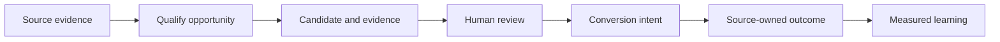

# lotus-idea

**Opportunity intelligence and governed review for Lotus wealth applications.**

`lotus-idea` turns source-owned portfolio, performance, risk, advisory, and mandate evidence into
opportunity candidates that advisers can understand, review, and progress through controlled
workflows. It owns the opportunity lifecycle and its evidence; it does not take ownership of the
business facts or downstream decisions supplied by other Lotus services.

> **Status:** Internal foundations are implemented; no externally supported product feature is promoted.
> The registry remains `foundation_only`; this is a foundation-only posture. See
> [Supported Feature Promotion](docs/operations/supported-feature-promotion.md) and the
> [supported-feature registry](supported-features/supported-features.json) for authoritative
> capability and readiness details.

## What Lotus Idea Does

The service applies deterministic, policy-versioned evaluation to authoritative evidence and
creates a candidate only when the evidence supports a reviewable opportunity. Examples in the
current internal foundation include:

- **High cash:** identifies a portfolio cash weight above a governed threshold while preserving
  the Core-owned portfolio, holding, cash-movement, and cashflow references used to qualify it.
- **Concentration:** turns Risk-owned concentration evidence into a review candidate without
  recalculating or claiming ownership of the risk result.
- **Approaching bond maturity:** carries the Core-owned contractual maturity date into the
  candidate's applicability window so stale reinvestment prompts expire rather than remain in the
  adviser queue indefinitely.

These are implemented and tested product foundations, not externally supported features or advice.
The [Lotus Idea Blueprint](docs/LOTUS_IDEA_BLUEPRINT.md) is the product-definition anchor; its target
opportunity families remain planned until each one passes the support-promotion contract.

## Architecture At A Glance


```mermaid
flowchart LR
    S[Source evidence] --> Q[Qualify opportunity]
    Q --> C[Candidate and evidence]
    C --> R[Human review]
    R --> I[Conversion intent]
    I --> O[Source-owned outcome]
    O --> L[Measured learning]
```

The journey is deliberately evidence-first:

1. **Source evidence** remains owned by Core, Performance, Risk, Advise, Manage, or Report.
2. **Qualification** applies Idea-owned deterministic policy, temporal checks, and source-authority
   rules.
3. **Candidate and evidence** preserve economic identity, provenance, score rationale, applicability,
   replay posture, and the source revision cut.
4. **Human review** is accepted only through the owned review command with caller scope and exact
   presented-candidate authority.
5. **Conversion intent** records what the adviser asked to progress; it does not assert that a
   proposal, mandate action, or report exists.
6. **Source-owned outcome** is reconciled from the downstream service that owns the resulting
   business state.
7. **Measured learning** uses review, feedback, ranking, conversion, and outcome evidence to test a
   bounded product hypothesis; it does not mutate policy automatically.

The deployable remains one service. Internal API, application, domain, port, and infrastructure
boundaries keep policy testable without creating speculative runtime services. See the
[architecture index](docs/architecture/README.md) for the detailed model.

## Product Boundary

`lotus-idea` owns:

- opportunity detection and qualification policy over source-owned evidence;
- candidate identity, lifecycle, applicability, scoring, ranking, suppression, and recurrence;
- adviser queues, presentation evidence, review decisions, feedback, and audit history;
- evidence packets, exact replay posture, conversion intent, and outcome reconciliation;
- Idea data-product declarations, readiness diagnostics, and support-promotion evidence.

It does not own:

- portfolio accounting, holdings, transactions, clients, instruments, or benchmarks;
- official performance, risk, suitability, compliance, tax, mandate, or restriction decisions;
- proposal acceptance, rebalance execution, order routing, trading, or portfolio actions;
- report rendering, archive authority, client communication, or publication approval;
- AI infrastructure, provider execution, retrieval infrastructure, or model operations.

Idea records intent and evidence. Advise, Manage, Report, Render, and Archive remain authoritative
for their resulting state. A successful transport call is not evidence of suitability, acceptance,
execution, report completion, or publication. Timeout or uncertain delivery remains uncertain until
the owning service is reconciled.

## Current Posture

| Capability | Internal foundation | Current boundary |
| --- | --- | --- |
| Detect and qualify | Deterministic source-backed policies and abstention | Source and product certification still apply |
| Identify and rank | Economic identity, deduplication, evidence-derived scores, queues | No external support promotion |
| Review and feedback | Scoped queues, presentation receipts, owned review commands, replay | Canonical consumer acceptance remains gated |
| Convert and reconcile | Exact review-bound intents and source-owned outcome history | Downstream business state is never inferred |
| Operate and recover | PostgreSQL, migrations, outbox, diagnostics, recovery controls | Deployment and production evidence remain separate |
| Explain and learn | Governed explanation and bounded effectiveness foundations | No autonomous advice or policy mutation |

Detailed mechanics belong in their authoritative documents:

- [Exact review authority](docs/architecture/exact-review-authority.md) defines presentation,
  evidence identity, review, conversion, concurrency, expiry, and replay rules.
- [Supported feature promotion](docs/operations/supported-feature-promotion.md) defines the evidence
  required before external support is claimed.
- [Implementation proof readiness](docs/operations/implementation-proof-readiness.md) records
  proof classes and unresolved certification boundaries.
- [Service operations](docs/runbooks/service-operations.md) owns runtime, migration, recovery, and
  image procedures.
- [RFC-0002 tracker #673](https://github.com/sgajbi/lotus-idea/issues/673) is the durable execution
  backlog; the README does not duplicate its changing blocker posture.

Production identity and session authority, protected deployment evidence, source-owner acceptance,
canonical Gateway/Workbench proof, client publication approval, and supported-feature promotion
remain explicit certification boundaries. The repository does not convert source-contract, local,
CI, or transport evidence into a stronger claim.

## Quick Start

The recommended local path is the durable Docker Compose runtime.

### Prerequisites

| Requirement | Purpose |
| --- | --- |
| Git | Clone and inspect the repository |
| Docker Desktop with Compose | Run the API and PostgreSQL |
| PowerShell | Execute the readiness example below |
| GNU Make and Python 3.13 | Required only for contributor validation |

Start the API and its durable PostgreSQL repository:

```powershell
docker compose up -d --build
```

Check readiness:

```powershell
Invoke-RestMethod http://127.0.0.1:8330/health/ready
```

Expected result: HTTP `200` with `status` equal to `ready`. The app-owned stack applies
checksum-verified migrations, persists PostgreSQL data in a named volume, and starts the API on
port `8330`. A `503` is a truthful degraded result; use the
[service operations runbook](docs/runbooks/service-operations.md#health-and-readiness) to diagnose
it rather than bypassing readiness.

Stop the local runtime without deleting its named volume:

```powershell
docker compose down
```

The reload-based process is an **ephemeral developer alternative**, not the recommended durable
runtime. Its environment setup, limitations, and command are maintained in
[Getting Started](wiki/Getting-Started.md#first-run).

## Validation And CI Lanes

Install contributor dependencies, then run the lane appropriate to the change:

```powershell
make install
make check
```

| Command | Evidence produced |
| --- | --- |
| `make lint` | Formatting, hygiene, docs, architecture, API, and contract gates |
| `make typecheck` | Static typing over the service |
| `make test-unit` | Fast policy and component behavior |
| `make test-integration` | API, persistence, replay, and boundary behavior |
| `make test-e2e` | Deterministic critical opportunity journey |
| `make check` | Local PR-grade validation |
| `make ci-release` | Broad release, PostgreSQL, image, scan, and SBOM evidence |

`make documentation-contract-gate` verifies the README and governed documentation surfaces. The
GitHub lanes add pull-request, exact-main releasability, security, image, and publication evidence;
local success does not promote a feature.

## Data Mesh Posture

Idea publishes proposed data-product and consumer declarations and consumes source authority with
explicit provenance. Mesh contracts and telemetry remain certification inputs, not evidence that
an external feature is supported. See [Mesh Readiness](docs/operations/mesh-readiness.md) and the
[Lotus Data Mesh Standard](https://github.com/sgajbi/lotus-platform/blob/main/docs/standards/Lotus%20Data%20Mesh%20Standard.md).

## Contributor Path

| Path | Responsibility |
| --- | --- |
| `src/app/api/` | FastAPI routes, DTO mapping, caller context, and HTTP contracts |
| `src/app/application/` | Use-case orchestration and acceptance boundaries |
| `src/app/domain/` | Framework-free opportunity, evidence, review, and lifecycle policy |
| `src/app/ports/` | Repository, source, publisher, and downstream protocols |
| `src/app/infrastructure/` | PostgreSQL, migrations, adapters, clients, and outbox delivery |
| `contracts/` | Data-product, access, SLO, downstream, and evidence contracts |
| `docs/` | Architecture, RFCs, operations, standards, and product definition |
| `wiki/` | Authored GitHub wiki source; publication is a post-merge sync step |

Before changing product behavior, read
[REPOSITORY-ENGINEERING-CONTEXT.md](REPOSITORY-ENGINEERING-CONTEXT.md), the
[Blueprint](docs/LOTUS_IDEA_BLUEPRINT.md), and the relevant entry in the
[RFC index](docs/rfcs/README.md). Follow the
[Lotus Bank-Buyable Engineering Contract](https://github.com/sgajbi/lotus-platform/blob/main/platform-standards/LOTUS_BANK_BUYABLE_ENGINEERING_CONTRACT.md)
and preserve source authority, exact review authority, deterministic evidence, and downstream
ownership in code, tests, contracts, OpenAPI, migrations, docs, and issue evidence.

For documentation, RFC, context, contract, or wiki changes, reconcile stranded durable truth first:

```powershell
git fetch origin --prune
git branch -r --no-merged origin/main
```

## Documentation Map

| Need | Authoritative destination |
| --- | --- |
| Product scope | [Lotus Idea Blueprint](docs/LOTUS_IDEA_BLUEPRINT.md) |
| Integration and API | [API certification](docs/operations/api-certification.md) · [API surface](wiki/API-Surface.md) |
| Architecture | [Architecture index](docs/architecture/README.md) · [Exact review authority](docs/architecture/exact-review-authority.md) |
| Operations | [Service operations](docs/runbooks/service-operations.md) · [Operations wiki](wiki/Operations-Runbook.md) |
| Supported features | [Promotion contract](docs/operations/supported-feature-promotion.md) · [Registry](supported-features/supported-features.json) |
| Contribution | [Engineering context](REPOSITORY-ENGINEERING-CONTEXT.md) · [RFC index](docs/rfcs/README.md) |
| Wiki navigation | [Wiki home](wiki/Home.md) |

Repo-local `wiki/` is the authored source of truth. The separate GitHub wiki repository is only the
publication target and is synchronized after source changes merge to `main`.
