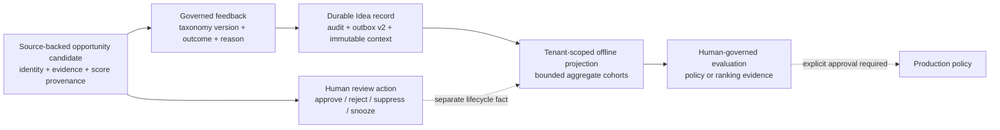

# Governed Feedback And Offline Opportunity-Quality Evaluation

## Purpose

Lotus Idea records an adviser's usefulness judgment as a governed product
signal. The signal helps product owners and investment-domain reviewers assess
whether opportunity policies surface relevant, timely, well-evidenced work. It
does not change eligibility, scores, ranking, suppression, or lifecycle state
automatically.

This boundary supports three audiences:

| Audience | What this capability answers |
| --- | --- |
| Adviser or portfolio manager | What judgment was recorded, and why? |
| Product or methodology owner | Which policy/version cohorts receive useful or not-useful judgments? |
| Engineering, risk, or audit reviewer | Was the judgment tenant-scoped, replay-safe, source-safe, reproducible, and kept outside production decision authority? |

## Operating Model

The dotted production path is deliberately not implemented as an automatic
mutation. A future policy change requires its own reviewed, versioned change
and regression evidence.

## Canonical Taxonomy

Taxonomy version: `idea-feedback-taxonomy-v1`.

| Outcome | Allowed reason | Interpretation |
| --- | --- | --- |
| `useful` | `relevant` | The surfaced opportunity was useful for the review context. |
| `not_useful` | `not_relevant` | The opportunity did not apply to the review context. |
| `not_useful` | `already_known` | The condition was known and added no useful new attention signal. |
| `not_useful` | `wrong_timing` | The opportunity may be valid but was surfaced at the wrong time. |
| `not_useful` | `insufficient_evidence` | The evidence packet did not justify the opportunity posture. |
| `not_useful` | `wrong_priority` | The opportunity's queue importance was not appropriate. |
| `not_useful` | `duplicate` | The opportunity repeated the same economic review need. |
| `not_useful` | `client_specific_constraint` | A client-specific constraint made the opportunity unsuitable for attention without transferring suitability authority to Idea. |

Review actions remain separate lifecycle facts. A `reject`, `suppress`, or
`snooze` action is not inferred from feedback, and feedback does not grant
conversion authority.

Invalid taxonomy versions or outcome/reason combinations fail closed with
`feedback_taxonomy_combination_invalid`. The canonical fields bind feedback
business-resource identity, replay/conflict behavior, persistence, audit,
source-safe outbox payload, API/OpenAPI, and candidate-detail projection.

## Offline Evaluation Contract

`build_offline_feedback_evaluation(...)` produces a deterministic,
read-only snapshot for one tenant and one timezone-aware evaluation time. It
uses immutable policy and evidence context captured when feedback was recorded,
so later candidate changes cannot rewrite historical evaluation meaning.

The projection aggregates at most 10,000 source observations into cohorts over:

- opportunity family and candidate-identity policy version,
- source-time score, score/ranking policy versions, and bounded rank context,
- evidence supportability,
- the latest preceding human review action,
- feedback taxonomy version, outcome, and reason,
- the latest subsequent source-authorized downstream target/status/source
  system available by the evaluation time.

The snapshot is reproducibly ordered and carries a SHA-256 digest. It omits raw
tenant, client, portfolio, and actor identifiers; free text; prompts or model
content; and downstream resource references. Empty tenant scope, unscoped
feedback-bearing candidates, invalid bounds, and naive evaluation timestamps
fail closed.

## Persistence And Rollback

Migration `017_governed_feedback_taxonomy`:

1. maps each legacy outcome deterministically to the governed outcome/reason,
2. captures immutable evaluation context from the persisted candidate,
3. migrates `idea.feedback.recorded.v1` to the canonical v2 payload,
4. retains lossless migration-only source columns for rollback,
5. refuses rollback after a newly governed feedback or outbox record exists.

The migration executor preserves PostgreSQL dollar-quoted procedural blocks,
so fail-closed migration assertions execute as one statement. PostgreSQL 18
integration tests prove legacy apply, rollback, reapply, and governed-record
rollback refusal against a disposable database.

## Support And Authority Boundary

This is an internal, not-certified capability. It does not provide online
learning, model training, sentiment inference, Workbench-owned taxonomy,
generic analytics, production policy approval, suitability, compliance,
mandate, execution, or client-publication authority. Supported-feature posture
remains unchanged until the complete review journey is certified.

The machine-readable contract is
`contracts/review-feedback/lotus-idea-feedback-evaluation.v1.json`; run
`make feedback-evaluation-contract-gate` to verify taxonomy, migration, outbox,
privacy, read-only authority, and non-promotion invariants.
