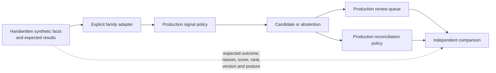

# Opportunity Quality Golden Evaluation

## Purpose

The opportunity-quality golden evaluation is a product-level regression check
for deterministic opportunity policy. It answers a narrower and more useful
question than endpoint or family-local tests alone:

> Given representative, synthetic private-banking facts, do the intended
> opportunities appear, abstain, rank, and evolve through their lifecycle as
> independently expected?

The versioned fixture is
`tests/fixtures/opportunity_quality/opportunity-quality-golden-set.v1.json`.
Its expected results are handwritten. The evaluator in
`tests/support/opportunity_quality_golden.py` invokes production domain
policies; it does not generate the answers that those policies are tested
against.

## Audience Guide

| Audience | What to inspect | Decision supported |
| --- | --- | --- |
| Product and advisory governance | portfolios, opportunity/no-opportunity outcomes, review posture, and queue order | Whether deterministic policy remains aligned with the intended review experience. |
| Risk, model validation, and compliance | authorship declaration, source authority, fail-closed cases, reason codes, and no-claim boundaries | Whether regression evidence is independent, explainable, synthetic, and authority-preserving. |
| Engineering | family facts, policy versions, source products, score expectations, lifecycle expectations, and tamper tests | Whether a policy change is intentional, reviewed, and regression-safe. |

## Evaluation Flow



Explicit family adapters are intentional. High cash, concentration,
underperformance, and allocation drift have different source authorities and
different materiality semantics. A generic signal abstraction would obscure
those differences without improving the evaluation.

## Version 1 Coverage

The first tranche covers four distinct opportunity families:

| Family | Source authority | Positive and boundary posture | Fail-closed posture |
| --- | --- | --- | --- |
| High cash | Lotus Core portfolio, holdings, cash movement, and cashflow products | Above and exactly at the cash-weight threshold | stale or unavailable required evidence |
| Concentration | Lotus Risk concentration report | Above and exactly at a concentration threshold | incomplete issuer-coverage certification |
| Underperformance | Lotus Performance returns series and benchmark context | Below and exactly at the active-return threshold | missing benchmark context |
| Allocation drift | Lotus Manage portfolio action register | Above and exactly at workflow/lineage minima | unconfirmed portfolio scope |

The same dataset also proves:

1. a quiet portfolio creates no advisor or portfolio-manager queue items;
2. advisor and portfolio-manager audiences remain separate;
3. eligibility, fixed family policy score, and queue rank are separately
   asserted;
4. an evidence correction preserves reviewed state and increments only the
   evidence version;
5. a material change creates a new material version and clears stale
   suppression;
6. a changed recurring condition after expiry reopens the stable business
   identity for human review;
7. deliberate mutations of expected outcome, reason, rank, or reopen version
   make the test fail.

## Source Authority And No-Claim Boundaries

The dataset supplies source-reported facts; it does not reproduce upstream
methodologies. Lotus Core remains authoritative for portfolio and cash facts,
Lotus Risk for concentration, Lotus Performance for returns and benchmarks,
and Lotus Manage for mandate workflow supportability. Lotus Idea owns only the
deterministic eligibility, evidence, identity, review-priority, and lifecycle
policy applied to those facts.

The evaluation is synthetic local test execution. It is not evidence of live
source connectivity, data-mesh certification, Gateway or Workbench behavior,
deployment, production suitability, or supported-feature promotion.

## Running And Changing The Evaluation

Run the focused repository-native check:

```powershell
make opportunity-quality-golden-set
```

The normal `make test-unit` lane also executes it automatically.

When changing an included policy:

1. update production policy and family-local tests first;
2. review the golden facts and expected business outcome independently;
3. change an expected result only when the intended product decision changed,
   and record that decision in the issue or PR;
4. add a regression case when the change reveals a repeatable failure mode;
5. never populate expected values by calling production code or copying a
   runtime response into the fixture.

Extending the set to the remaining implemented families is tracked through
GitHub issue `sgajbi/lotus-idea#1162`; version 1 is not a claim of exhaustive
product certification.
