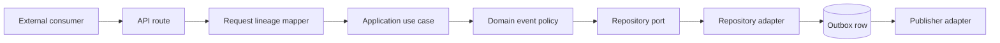

# Outbox Event Lineage

## Decision

Every `lotus-idea` outbox event carries required correlation and trace
identifiers. Causation is optional and identifies a distinct parent event or
workflow only. The three identifiers are diagnostic metadata, not business
payload fields and not substitutes for event identity or idempotency.

This decision applies to candidate persistence, lifecycle, review, feedback,
conversion intent, conversion outcome, and report evidence-pack request
events. It improves design modularity inside the existing deployable service;
it does not create a broker, consumer, or separately scalable runtime.

## Identifier Semantics

| Field | Required | Meaning | Must not be used as |
| --- | --- | --- | --- |
| `eventId` | Yes | Deterministic identity of the emitted business event. | Request trace or parent-event identity. |
| `correlationId` | Yes | Stable identifier for the wider request or workflow. | Aggregate identity, tenant identity, or authorization context. |
| `traceId` | Yes | Distributed trace for the request that created the durable event. | Causation identity or replay identity. |
| `causationId` | No | Parent event or workflow that directly caused this mutation. | Transport trace, correlation fallback, or arbitrary caller label. |
| `lineageOrigin` | Yes | How the lineage was established. | A certification or source-authority claim. |

Accepted `lineageOrigin` values are:

| Origin | Correlation and trace policy | Causation policy |
| --- | --- | --- |
| `request` | Sanitized values from request middleware. | Must be absent. |
| `parent_event` | Sanitized values from request middleware. | Required and product-safe. |
| `system_generated` | Deterministically derived from `eventId` for bounded worker/operator calls without request provenance. | Must be absent. |
| `legacy_migrated` | Preserved when safe; otherwise deterministically regenerated by migration 007. | Preserved only when product-safe; otherwise cleared. |

Identifiers are limited to 96 characters and a bounded diagnostic character
set. Values resembling credentials, bearer tokens, secrets, or governed
portfolio identifiers are rejected or sanitized before persistence.

## Layered Flow



1. `CorrelationIdMiddleware` sanitizes or generates request correlation and
   trace identifiers.
2. `app.api.event_lineage` maps request state plus optional
   `X-Causation-Id` into `EventLineageContext`.
3. Request DTOs place the typed context on application commands.
4. Application use cases pass lineage separately from idempotency payloads.
5. Repository ports and adapters write the context with the outbox event in
   the same transaction as the business mutation.
6. The publisher sends `correlationId`, `traceId`, optional `causationId`, and
   `lineageOrigin`; its transport trace header uses `traceId` only.

## Replay And Recovery

Lineage is not part of the business idempotency fingerprint. A retry may
arrive on a new trace, but an equivalent replay returns the original state and
does not rewrite the durable event's original lineage. Consumers deduplicate
by `eventId` and business-resource identity, never by trace.

Lease, retry, dead-letter, and governed re-drive transitions retain the same
outbox record. They do not invent a new business-event lineage. Delivery
attempt telemetry may have its own request trace, but that transport context
does not replace the persisted event context.

## Persistence And Migration

Migration `007_outbox_event_lineage` adds required `trace_id` and
`lineage_origin` columns, makes correlation non-null, and enforces:

1. product-safe correlation, trace, and optional causation shapes,
2. causation for `parent_event` only, with bounded legacy compatibility,
3. no causation for `request` or `system_generated`,
4. non-destructive legacy backfill with no outbox event deletion.

The in-memory and PostgreSQL adapters implement the same domain contract.
Real PostgreSQL integration tests cover migration apply/rollback, legacy
sanitization, constraint rejection, hydration after repository reload, replay
preservation, and all seven event families.

## Operator Diagnosis

When a published event cannot be linked to a request:

1. inspect the durable row's `correlation_id`, `trace_id`, `causation_id`, and
   `lineage_origin` through authorized database support procedures,
2. compare the publisher envelope and transport headers without copying raw
   broker payloads into tickets,
3. run `make outbox-event-contract-gate` and
   `make outbox-consumer-contract-gate`,
4. treat missing required lineage or trace/causation conflation as a producer
   contract defect,
5. preserve the event and use governed dead-letter recovery when delivery,
   rather than event construction, failed.

Do not expose lineage identifiers in aggregate readiness responses, metrics
labels, client responses, or proof artifacts. They are support-safe only in
authorized request logs, durable event records, and governed envelopes.

## Verification

```powershell
make outbox-event-contract-gate
make outbox-consumer-contract-gate
make migration-contract-gate
make openapi-gate
make postgres-integration-gate
```

Focused tests cover the domain contract, request mapper, API propagation,
publisher envelope, PostgreSQL persistence, replay, and migration behavior.

## Boundaries

This implementation does not certify an external broker, downstream consumer,
platform mesh publication, Gateway/Workbench behavior, or a supported event
product. Lotus Idea remains authoritative only for opportunity workflow facts;
portfolio accounting, official performance, risk, suitability, compliance,
execution, report rendering/archive authority, and AI infrastructure remain
with their owning services.
