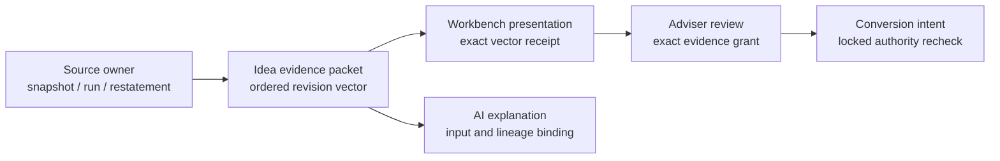

# Source Revision Authority

## Purpose

An opportunity must remain tied to the exact upstream facts that justified it.
An as-of date alone is insufficient: a source owner may restate a snapshot,
rerun a calculation, or revise a methodology without changing that date.

`lotus-idea` therefore preserves source-owner revision claims and derives one
canonical revision vector. It does not invent upstream revision authority.

## Authority Flow

Every boundary carries the same `sourceRevisionVectorDigest` and
`sourceCutPosture`. A source revision, restatement, calculation run,
methodology version, or causal-input revision changes the vector identity.

## Source-Cut Postures

| Posture | Meaning | May advance review or conversion authority? |
| --- | --- | --- |
| `coherent` | All required sources carry authoritative claims for one cut. | Yes |
| `coherent_with_declared_tolerance` | A named, versioned tolerance admits the observed source-time skew. | Yes |
| `mixed` | Source claims identify incompatible cuts, causal revisions or restatements, or failed reconciliation. | No |
| `partial` | A required revision claim or causal comparison is missing, incomplete or ambiguous. | No |
| `unknown` | No authoritative cut conclusion can be made. | No |

A causal-input claim is compared with the corresponding included source by its
owner-issued product identity before common cut IDs or time tolerance are
considered. An explicit revision or restatement mismatch is `mixed`; a missing,
ambiguous or one-sided comparison is `partial`. Neither a shared cut ID nor a
declared tolerance can make a known contradiction authoritative.

A candidate may remain visible for diagnosis when its cut is not authoritative,
but its presentation receipt records that posture. Presentation never upgrades
the source evidence.

## Ownership Boundary

- Core, Risk, Performance, Advise, Manage, and Report own their revision,
  restatement, calculation, methodology, and reconciliation claims.
- Idea preserves, normalizes, hashes, and evaluates those claims.
- A timestamp, content hash, successful HTTP response, or common as-of date is
  not a substitute for an owner-issued revision.
- Gateway and Workbench pass through Idea's contract; they do not derive source
  authority.

## Persistence And Legacy Data

Migration `026_presentation_source_revision_binding` introduces v2 presentation
receipts. Existing v1 receipts retain `unknown` cut posture and no vector claim.
They remain historical evidence but cannot match a current candidate for review
authority. Review, conversion, AI lineage, replay, and audit persistence apply
the same fail-closed rule.

## Engineering Checklist

When adding or changing a source adapter:

1. map only named fields emitted by the source owner;
2. preserve absence as unknown;
3. prove order-independent vector hashing and revision sensitivity;
4. prove causal revision and restatement contradictions cannot be hidden by cut
   identity, source order or tolerance;
5. prove non-authoritative cuts cannot advance review or conversion;
6. update API examples and runtime receipts to carry the exact vector;
7. open an owner-repository issue when a required claim is genuinely absent.

See also [Exact Review Authority](exact-review-authority.md) and
[Trusted Control Time](trusted-control-time.md).
