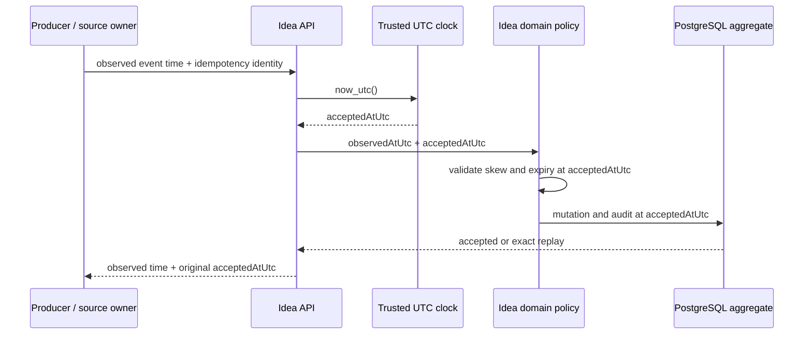

# Trusted Control Time

## Purpose

Lotus Idea preserves producer chronology without allowing a browser, caller, or
downstream service to control lifecycle safety. This contract is relevant to
engineers implementing mutations, operators investigating chronology, and risk
or control reviewers assessing expiry and replay behavior.



## Temporal Vocabulary

| Time | Authority | Permitted use |
| --- | --- | --- |
| Producer-observed time | Browser, caller, or source-owning service | User experience, source chronology, forensic evidence, source freshness, and deterministic evaluation context |
| Idea acceptance time | `TrustedClock` in the Idea runtime | Expiry, mutation admission, lifecycle ordering, candidate update time, audit chronology, and stale-action policy |
| Downstream source event time and version | Advise, Manage, or Report | Owner business chronology and monotonic owner-history reconciliation |

Producer time is retained; it is never silently clamped or rewritten. Human
action and presentation channels apply named operation-specific skew policies
and reject impossible observations. All accepted control timestamps must use an
explicit UTC offset.

## Implemented Mutation Rules

- Generic pre-review lifecycle, review, feedback, presentation receipt,
  conversion intent, and downstream outcome APIs acquire `acceptedAtUtc` from
  the runtime trusted clock.
- Generic lifecycle `changedAtUtc` is producer-observed evidence subject to a
  24-hour past / 5-minute future skew policy. Candidate update, lifecycle
  history, audit, and outbox chronology use the accepted instant; audit and
  outbox evidence retain the observed instant separately.
- Candidate applicability is checked at Idea acceptance time when an adviser
  approves a candidate and when a new conversion intent is admitted. At the
  expiry instant, the action is refused.
- Snooze instructions remain adviser-selected future business instructions,
  but their lower bound is Idea acceptance time.
- Candidate, evidence, persistence, expiry mutation, and audit timestamps for
  persisted signal evaluations use the accepted instant. The source
  `evaluatedAtUtc` and signal detection time remain preserved evaluation
  evidence.
- Downstream `recordedAtUtc` and `sourceEventVersion` remain owner facts. Idea
  records a separate receipt acceptance time.
- Historical review queues and learning projections use acceptance time for
  snapshot inclusion and control-event ordering. A producer timestamp that is
  backdated before a historical cutoff cannot rewrite the queue, feedback
  evaluation, opportunity-effectiveness, or ranking-quality result after the
  event is accepted.
- Candidate-version history continues to use its server-recorded persistence
  time. Downstream owner history continues to order first by the authoritative
  source event version, with Idea acceptance time only as the receipt-order
  tie-breaker.

The current observed-time policies are:

| Operation | Maximum past skew | Maximum future skew |
| --- | ---: | ---: |
| Workbench presentation | 15 minutes | 5 minutes |
| Adviser review decision | 24 hours | 5 minutes |
| Adviser feedback | 24 hours | 5 minutes |
| Conversion intent | 24 hours | 5 minutes |
| Downstream owner outcome | 30 days | 5 minutes |
| Generic pre-review lifecycle transition | 24 hours | 5 minutes |

Signal evaluation time is not treated as user-action chronology. It can be a
historical deterministic evaluation instant and remains available for source
freshness and replay. When the evaluation produces a durable candidate, its
control-plane creation and audit use the separately supplied trusted acceptance
instant.

## Idempotency And Replay

The accepted instant is not part of producer request identity. A retry of an
already accepted command returns the original persisted resource and original
`acceptedAtUtc`, even if the retry arrives later or after the candidate's
applicability boundary. A changed payload under the same idempotency or resource
identity remains a conflict.

```text
new action at or after expiry       -> refused before downstream work
exact retry of pre-expiry intent    -> replay original accepted intent
changed post-expiry request         -> conflict or refused; never auto-upgraded
```

## Persistence And Migration

Migration `024_trusted_review_acceptance_time.sql` adds acceptance time and
provenance to review decisions, feedback events, conversion intents,
conversion outcomes, and presentation receipts. New rows use
`server_accepted`. Historical rows are backfilled as
`legacy_observed_time_assumed`; that value is an explicit evidence limitation,
not proof that the old caller timestamp was a server timestamp.

Operators should segment legacy-assumed rows from server-accepted rows when
investigating chronology. A current environment audit must also look for:

- observed times outside the operation's policy window;
- conversion acceptance at or after evidence applicability expiry;
- non-monotonic downstream source event versions;
- action audit time that differs from the persisted acceptance time.

Lifecycle history is local control chronology. New generic, review, and
conversion entries use trusted acceptance time; their producer-observed time
remains in the owned decision or intent and audit or outbox evidence.
Historical lifecycle entries predate this correction and must not be treated
as proven server acceptance without independent deployment evidence.

No production database was available during the implementation workspace run,
so repository tests and migration contracts prove the mechanism while live
data reconciliation remains environment-owned evidence on issue `#1226`.

## Scope Boundary

Trusted time does not by itself prove downstream business completion. Exact
Workbench presentation-to-review authority is enforced by
`idea-review-authority-v1`, and review/conversion bind the candidate's
restatement-safe source revision vector and coherent-cut posture. Advise,
Manage, and Report remain authoritative for their resulting business state.

The change introduces no authentication, authorization, workflow-engine, or
new deployable-service claim and does not promote a supported feature.
