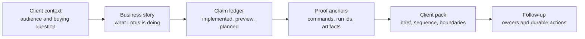

# Lotus Idea Client Demo Hub

## Purpose

Use this hub before preparing any external, executive, sales, marketing, or
operator-facing `lotus-idea` demonstration. It explains the demo process in a
client-understandable way while keeping implementation evidence, claim
discipline, and current boundaries visible.

This hub does not certify `lotus-idea` as a supported external product. It
routes demo owners to the current process, brief, template, claim ledger, and
validation proof that prevent client-facing material from getting ahead of
implemented truth.

## Client Understanding Flow



## Start Here

| Step | Artifact | Use it for |
| --- | --- | --- |
| 1 | [Client-Facing Lotus Idea Brief](client-facing-lotus-idea-brief.md) | Open the client conversation with the business problem, Lotus response, trust anchors, and current boundaries. |
| 2 | [Client Demo Operating Process](client-demo-operating-process.md) | Run intake, scope, certification, rehearsal, delivery, and follow-up without overstating current support. |
| 3 | [Demo Claims](demo-claims.md) | Classify every spoken and written claim before it reaches a client pack. |
| 4 | [Client Demo Pack Template](client-demo-pack.template.md) | Create a session-specific pack with one-page brief, story flow, claim ledger, validation proof, and follow-up register. |
| 5 | [Implementation Proof Readiness](../operations/implementation-proof-readiness.md) | Attach source-safe readiness evidence and current blocker state; do not present the diagnostic as product support by itself. |

## Client-Friendly Message

Use this framing when a client asks what Lotus is doing:

> Lotus Idea creates a governed opportunity-intelligence layer for private
> banking. It connects source-owned portfolio, risk, performance, advisory, and
> reporting evidence to advisor review and downstream realization intent while
> keeping official facts, suitability, reporting, rendering, archive, and client
> publication with the owning Lotus applications.

| Client question | Current answer |
| --- | --- |
| What is being shown? | A controlled foundation walkthrough for governed opportunity intelligence, not a supported external product claim. |
| Why is it trustworthy? | Each current-state claim must link to owning code, tests, validation commands, evidence artifacts, and clear boundaries. |
| What remains blocked? | Supported feature promotion, certified data-product status, full Workbench live proof, suitability/rebalance authority, client-ready publication, and any client-facing report output. Bounded Report/Render/Archive materialization proof is internal proof readiness evidence only. |

## Client Pack Rules

| Rule | Required posture |
| --- | --- |
| Business story first | Explain the private-banking workflow and control model before showing implementation artifacts. |
| Evidence-backed claims | Every current capability statement must name a claim state, owner, command, run ID, and artifact. |
| Boundary language | Bounded preview, planned, diagnostic, and unsupported items must be visible in the pack and rehearsal notes. |
| Safe material | Exclude real client data, secrets, raw prompts, raw payloads, stack traces, CI log dumps, sensitive identifiers, and internal issue history. |
| Screenshots after proof | Treat screenshots as client-demo material only after the relevant API, product-surface, security, and evidence checks pass. |

## Required Validation

Run the app-level documentation, truth, feature, and proof gates before marking
any pack client-ready:

```powershell
make documentation-contract-gate
make implementation-truth-gate
make supported-features-gate
make ai-lineage-store-proof-contract-gate
make implementation-proof-readiness-check
```

When the demo includes live API, Gateway, Workbench, or screenshot evidence,
also run the relevant API, integration, runtime, and browser validation for the
shown path. If proof fails, keep the material internal and fix the source issue
or reclassify the claim before rehearsal.

## Do Not Claim

Until implementation-backed evidence clears the relevant blockers, do not
claim autonomous investment advice, suitability approval, mandate compliance,
rebalance execution, rendered client-ready output, publication to clients as a
supported product, certified data-mesh product status, or external product
availability. Bounded Report/Render/Archive materialization proof may be
referenced only as internal proof readiness evidence.

## Platform References

- [Lotus Client Demo Certification Standard](../../../lotus-platform/docs/standards/Lotus%20Client%20Demo%20Certification%20Standard.md)
- [Lotus Client Demo Operating Process](../../../lotus-platform/docs/demo/client-demo-operating-process.md)
- [Lotus Bank-Buyable Engineering Contract](../../../lotus-platform/platform-standards/LOTUS_BANK_BUYABLE_ENGINEERING_CONTRACT.md)
