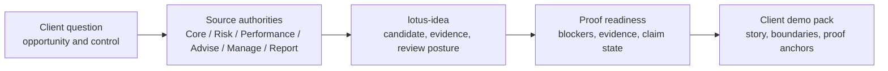

# Lotus Idea Client Demo Operating Process

## Purpose

This process explains how `lotus-idea` should be prepared for client-facing
demonstrations while the product is still in RFC-0002 foundation
implementation. It turns implementation proof into a client-understandable
story without overstating current support.

Use this page with:

- [Client-Facing Lotus Idea Brief](client-facing-lotus-idea-brief.md)
- [Demo Claims](demo-claims.md)
- [Client Demo Pack Template](client-demo-pack.template.md)
- [Implementation Proof Readiness](../operations/implementation-proof-readiness.md)
- [Lotus Client Demo Certification Standard](../../../lotus-platform/docs/standards/Lotus%20Client%20Demo%20Certification%20Standard.md)
- [Lotus Client Demo Operating Process](../../../lotus-platform/docs/demo/client-demo-operating-process.md)

## Current Client-Demo Posture

| Area | Current truth | Client-demo handling |
| --- | --- | --- |
| Product status | RFC-0002 foundation implementation. | Present as governed opportunity-intelligence foundation, not a supported external product. |
| Supported features | No supported external business feature is promoted. | Do not claim production support, client-ready publication, or autonomous advice. |
| Evidence | Internal APIs, source-safe proof artifacts, readiness diagnostics, and CI gates exist. | Use as engineering and operating-model proof, not as client production certification. |
| Workbench | Bounded read-only queue/detail proof exists, with full validation still blocked. | Show only when the relevant live validation has passed and boundary language is visible. |
| Downstream realization | Advise, Manage, Report, Render, and Archive are tracked as downstream authorities. | Explain the intended operating model; do not claim materialized downstream records until live proof exists. |

## Demo Story

`lotus-idea` sits between source-owned portfolio evidence and advisor-governed
decision workflows. The demo story should explain that Lotus is building a
controlled opportunity-intelligence layer for private banking:

1. source authorities keep the official portfolio, mandate, risk, performance,
   suitability, reporting, rendering, archive, and AI-provider facts,
2. `lotus-idea` evaluates governed evidence into internal opportunity
   candidates and review posture,
3. advisors remain accountable for review, feedback, and conversion intent,
4. downstream systems retain ownership of suitability, rebalance execution,
   report materialization, rendering, archive, and client communication,
5. data-mesh and proof-readiness diagnostics show which claims are implemented,
   bounded, planned, or blocked.



## What To Explain First

Start every external or executive-facing demo with the operating model, not the
internal architecture. The audience should understand the client problem and
the trust model before seeing proof artifacts.

| Client-facing message | Internal proof that supports it | Current boundary |
| --- | --- | --- |
| Lotus connects opportunity discovery to governed advisor review. | Candidate, review, feedback, conversion-intent, and proof-readiness APIs. | Internal foundation and bounded preview only. |
| Source systems keep official private-banking facts. | Source-authority labels, integration docs, data-mesh readiness, and downstream ownership docs. | `lotus-idea` is not the system of record for portfolio, mandate, suitability, report, render, archive, or publication facts. |
| Advisors remain accountable for decisions and client communication. | Review and conversion intent surfaces plus do-not-claim gates for autonomous advice, suitability, execution, and client communication. | No autonomous investment advice or client-ready publication is claimed. |
| Proof controls stop unsupported claims from becoming demo language. | Documentation gates, implementation-truth gate, supported-features gate, and implementation-proof readiness artifacts. | Diagnostics support readiness review; they are not product support certification by themselves. |

## Client Pack Versus Internal Evidence

Keep the client pack polished and concise. Keep raw validation output available
for reviewers but out of the client-facing narrative unless it has been
reviewed, redacted, and intentionally summarized.

| Artifact | Audience | Include | Exclude |
| --- | --- | --- | --- |
| One-page client brief | Client, executive, sales, marketing | Business problem, Lotus response, visible sequence, trust anchors, current boundary, follow-up path. | Raw logs, raw payloads, raw prompts, CI dumps, internal issue history, sensitive identifiers. |
| Demo pack | Client-facing team and reviewers | Talk track, sequence, claim ledger, evidence anchors, fallback path, acceptance checklist. | Diagnostic-only screenshots, unsupported claims, speculative roadmap phrased as current support. |
| Evidence manifest | Engineering, operations, product, security | Command, run ID, artifact paths, blocker state, owner, validation timestamp. | Real client data, secrets, personal data, raw account or portfolio identifiers. |
| Follow-up register | Sales, product, engineering, operations | Client questions, owner, durable home, client-safe response, next action. | Unreviewed defect details or confidential implementation notes. |

## Client-Friendly Explanation

Use this plain-language framing when a client asks what Lotus is doing:

> Lotus Idea turns source-owned portfolio, risk, performance, advisory, and
> reporting evidence into a governed opportunity-intelligence workflow. It helps
> private bankers and investment teams see why a client situation may need
> review, what evidence supports that review, which systems still own the
> official facts, and which implementation boundaries remain in place before a
> claim becomes client-ready.

| Client question | Lotus Idea answer | Evidence anchor |
| --- | --- | --- |
| Why does this matter? | It creates a controlled path from source evidence to advisor review, feedback, and conversion intent. | Demo claims ledger and implementation proof readiness. |
| Who owns the facts? | Source applications keep official portfolio, mandate, risk, performance, suitability, report, render, archive, and AI workflow facts. | Architecture, integrations, and data-mesh docs. |
| What is safe to claim today? | Internal foundation and bounded preview only; no supported external product feature is promoted yet. | Client-demo posture table and do-not-claim list. |
| How do we know it is real? | Claims must tie back to code, tests, gates, proof artifacts, run IDs, and owning repositories. | Validation commands and generated evidence manifest. |

Start external packs with the
[Client-Facing Lotus Idea Brief](client-facing-lotus-idea-brief.md) so the
audience sees the business problem, Lotus response, trust anchors, current
boundaries, and do-not-claim language before internal evidence links.

## Claim Classification

Every client-facing statement must have one claim state.

| Claim state | Meaning in `lotus-idea` | Allowed language |
| --- | --- | --- |
| Implementation-backed | Code, tests, proof artifact, documentation, and gate evidence exist on `main`. | "Implemented foundation" or "internal proof exists." |
| Bounded preview | A real implementation exists with explicit limits. | "Preview of the governed workflow, with these boundaries." |
| Planned | RFC, roadmap, or contract exists without runtime proof. | "Planned direction" or "target downstream integration." |
| Diagnostic | Evidence exists only to investigate readiness or a failure. | Internal only; do not show as client capability. |
| Unsupported | No governed implementation or owner exists. | Do not claim. |

## Required Demo Pack

Start from [Client Demo Pack Template](client-demo-pack.template.md) for each
external or executive-facing session. The completed pack should be stored as a
session-specific artifact, not by editing the template itself.

| Section | Required content |
| --- | --- |
| Audience and objective | Client role, buying question, sensitivity level, and time box. |
| Business narrative | Private-banking workflow in client language, not internal implementation jargon. |
| Demo sequence | Screens, APIs, reports, or proof artifacts shown in order. |
| Implementation-backed claims | Claim state, owner, evidence command, run artifact, and current boundary. |
| Do-not-claim list | Unsupported autonomy, suitability, execution, client communication, report materialization, and supported-feature claims. |
| Evidence manifest | Links to generated proof readiness, demo claims, CI run, and screenshot pack if screenshots are used. |
| Follow-up ownership | Product, engineering, operations, security, commercial, and marketing owners. |

## Validation Before Client Use

Run these commands before any external demo pack is marked client-ready:

```powershell
make documentation-contract-gate
make implementation-truth-gate
make supported-features-gate
make implementation-proof-readiness-check
```

When a demo includes live API or product-surface behavior, also run the
repo-native API, integration, and runtime checks for the shown path. Screenshots
are client-demo material only after the relevant API, calculation, panel,
security, and evidence checks pass; otherwise they are diagnostic artifacts.

## Client-Ready Acceptance

| Acceptance item | Pass condition |
| --- | --- |
| Story clarity | A non-technical client can explain what Lotus Idea is doing and why it matters. |
| Claim discipline | Every claim maps to implementation-backed, bounded preview, planned, diagnostic, or unsupported. |
| Evidence tie-out | Each implementation-backed claim names the owning repo, command, run ID, and artifact. |
| Data safety | The pack contains no real client data, secrets, raw prompts, raw source payloads, or sensitive identifiers. |
| Boundary language | The pack clearly states no supported external feature is promoted yet. |
| Follow-up ownership | Each open product, engineering, operations, security, or commercial question has an owner. |

## Do Not Claim

Until implementation proof clears the relevant blockers, do not claim:

1. autonomous investment advice,
2. suitability approval,
3. mandate or compliance certification,
4. rebalance execution,
5. report materialization,
6. rendered client report output,
7. archive record creation,
8. blocked client-ready publication,
9. certified data-mesh product status,
10. supported external product availability.

## Follow-Up Discipline

Client questions should become one of:

| Outcome | Durable home |
| --- | --- |
| Product gap | RFC follow-up or GitHub issue in the owning repository. |
| Evidence request | Updated demo pack, proof manifest, or wiki link. |
| Security or data question | Security/governance follow-up with reviewed evidence only. |
| Commercial question | Sales or product follow-up using implementation-backed language. |
| Defect or weak proof | Source fix, targeted test, and rerun of the relevant validation command. |

Repeated questions should improve the demo narrative, claim ledger, wiki,
repository context, supported-feature truth, or RFC backlog instead of living in
private notes.
