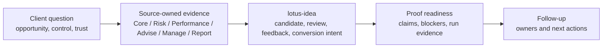

# Lotus Idea Client Demo Pack Template

Use this template for a specific `lotus-idea` client session. Keep the
completed pack audience-safe: business narrative first, implementation proof as
supporting evidence, and current boundaries visible.

Source process:

- [Lotus Idea Client Demo Operating Process](client-demo-operating-process.md)
- [Demo Claims](demo-claims.md)
- [Implementation Proof Readiness](../operations/implementation-proof-readiness.md)
- [Lotus Client Demo Certification Standard](../../../lotus-platform/docs/standards/Lotus%20Client%20Demo%20Certification%20Standard.md)

## Demo Control Summary

| Field | Value |
| --- | --- |
| Client or audience |  |
| Demo owner |  |
| Session date |  |
| Sensitivity level | External client / internal stakeholder / investor / partner / diagnostic only |
| Buying question |  |
| Time box | Executive walkthrough / product flow / technical deep dive / operator review |
| Evidence run ID |  |
| Evidence artifact location |  |
| Screenshot pack location |  |
| Current posture | Foundation walkthrough only; no supported external `lotus-idea` product feature is promoted. |

## One-Page Client Brief

| Brief section | Client-ready content |
| --- | --- |
| Client problem |  |
| Lotus response |  |
| What the client will see |  |
| Why it is trustworthy |  |
| Current boundary |  |
| Follow-up path |  |

## Story Flow



## Demonstration Sequence

| Step | Surface or artifact | Business message | Evidence anchor | Fallback |
| --- | --- | --- | --- | --- |
| 1 |  |  |  |  |
| 2 |  |  |  |  |
| 3 |  |  |  |  |
| 4 |  |  |  |  |

## Claim Ledger

Every statement shown or spoken in the demo must have a claim state.

| Claim | State | Owner | Evidence command or artifact | Boundary language |
| --- | --- | --- | --- | --- |
|  | Implementation-backed / Bounded preview / Planned / Diagnostic / Unsupported |  |  |  |

## Do-Not-Claim List

The current `lotus-idea` foundation does not authorize these claims unless a
later implementation-backed artifact explicitly clears the relevant blocker:

1. autonomous investment advice,
2. suitability approval,
3. mandate or compliance certification,
4. rebalance execution,
5. report materialization,
6. rendered client report output,
7. archive record creation,
8. client communication or publication authority,
9. certified data-mesh product status,
10. supported external product availability.

## Required Validation

Run the app-level documentation, truth, feature, and proof gates before marking
this pack client-ready:

```powershell
make documentation-contract-gate
make implementation-truth-gate
make supported-features-gate
make implementation-proof-readiness-check
```

When the pack includes live API, Gateway, Workbench, or screenshot evidence,
also run the relevant API, integration, runtime, and browser validation for
the shown path. Screenshots captured before validation are diagnostic only.

## Client-Ready Acceptance

| Acceptance item | Pass condition | Result |
| --- | --- | --- |
| Story clarity | A non-technical client can explain what Lotus Idea is doing and why it matters. | Pass / Fail |
| Claim discipline | Every claim maps to implementation-backed, bounded preview, planned, diagnostic, or unsupported. | Pass / Fail |
| Evidence tie-out | Each current-state claim names owner, command, run ID, and artifact. | Pass / Fail |
| Data safety | Pack contains no real client data, secrets, raw prompts, raw source payloads, or sensitive identifiers. | Pass / Fail |
| Runtime proof | Screenshots and live paths were captured only after relevant validation passed. | Pass / Fail |
| Boundary language | The no-supported-feature and no-client-ready-publication boundaries are visible. | Pass / Fail |
| Follow-up ownership | Product, engineering, operations, security, commercial, and marketing owners are named. | Pass / Fail |

## Follow-Up Register

| Question or issue | Owner | Durable home | Due date | Client-safe response |
| --- | --- | --- | --- | --- |
|  |  | GitHub issue / RFC follow-up / evidence update / commercial follow-up |  |  |
