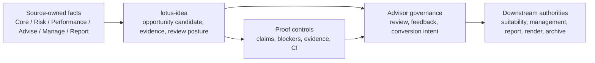

# Client-Facing Lotus Idea Brief

## Purpose

Use this brief at the front of a `lotus-idea` client demo pack when the
audience needs to understand what Lotus is doing before seeing implementation
evidence. It is written for clients, executives, sales, pre-sales, product,
marketing, operations, and engineering reviewers.

This brief does not certify `lotus-idea` as a supported external product. It
explains the current foundation and the controls that keep demo claims honest.

## What Lotus Is Doing

Lotus is building a governed private-banking operating layer where each product
owns its domain facts and publishes evidence through supportable workflows.
`lotus-idea` contributes the opportunity-intelligence layer: it turns
source-owned portfolio, risk, performance, advisory, management, reporting, and
AI-governance evidence into internal opportunity candidates that can be
reviewed, explained, challenged, and converted into downstream intent.

## Client Problem

Private-banking teams need to identify opportunities without losing control of
the facts, the evidence trail, the suitability boundary, or the final client
communication. Opportunity workflows often become fragmented across portfolio
data, risk, performance, advisory, reporting, documents, and manual follow-up.

Lotus Idea shows how that workflow can become governed:

| Client need | Lotus Idea response |
| --- | --- |
| See why an opportunity exists | Preserve source references, rationale, freshness, and evidence posture. |
| Keep accountability clear | Leave official facts, suitability, execution, reports, render, archive, and publication with owning Lotus apps. |
| Avoid unsupported automation | Keep advisors in the review and conversion path; do not present autonomous advice. |
| Understand readiness | Use proof diagnostics to show what is implemented, bounded, planned, or blocked. |

## What The Client Can See Today

The current demo is a controlled foundation walkthrough, not a production
support claim.

| Demo area | Current client-safe message | Boundary |
| --- | --- | --- |
| Opportunity intelligence foundation | Internal candidate, evidence, review, feedback, conversion, and proof foundations exist. | No supported external feature is promoted yet. |
| Source authority model | Lotus keeps domain ownership explicit across Core, Risk, Performance, Advise, Manage, Report, Render, Archive, Gateway, Workbench, and AI. | `lotus-idea` does not become the system of record for those domains. |
| Proof readiness | Readiness diagnostics and CI gates show blockers before claims become client-ready. | Diagnostics are not client capability by themselves. |
| Workbench path | Bounded read-only queue/detail proof exists through Gateway and Workbench. | Full product-surface certification and client-ready screenshots require live validation. |
| Downstream realization | Advise, Manage, Report, Render, and Archive ownership is modeled. | No downstream materialization, execution, report rendering, archive creation, or publication is claimed until live proof exists. |

## Why It Is Trustworthy

Every client-facing statement must tie back to implementation evidence.

| Trust anchor | What it proves |
| --- | --- |
| Code and tests | The behavior is implemented and covered by focused validation. |
| API and endpoint certification | The internal contract, authorization, errors, and examples are checked. |
| Proof artifacts | The current blockers and evidence references are machine-readable. |
| Documentation and wiki | The client story, do-not-claim boundaries, and operating process stay synchronized. |
| CI gates | Unsupported claims, sensitive artifacts, stale docs, and weak proof are blocked before merge. |

## How To Talk About It

Use this opening language:

> Lotus Idea is a governed opportunity-intelligence foundation for private
> banking. It helps teams turn source-owned portfolio and advisory evidence
> into reviewable opportunity candidates while preserving domain ownership,
> advisor accountability, downstream controls, and proof of what is genuinely
> implemented today.

Avoid language that implies:

1. autonomous investment advice,
2. suitability approval,
3. mandate or compliance certification,
4. trade execution or order routing,
5. report materialization,
6. rendered client report output,
7. archive record creation,
8. client communication or publication authority,
9. certified data-mesh product status,
10. supported external product availability.

## Evidence To Include In A Demo Pack

| Evidence item | Required content |
| --- | --- |
| Demo objective | Audience, buying question, time box, and sensitivity level. |
| Claim ledger | Each statement classified as implementation-backed, bounded preview, planned, diagnostic, or unsupported. |
| Validation run | Command, run ID, timestamp, owner, and artifact path. |
| Screenshot pack | Only screenshots captured after relevant API, panel, security, and proof validation passed. |
| Follow-up register | Product, engineering, operations, security, commercial, and marketing owners for open questions. |

## Related Process

- [Lotus Idea Client Demo Operating Process](client-demo-operating-process.md)
- [Lotus Idea Client Demo Pack Template](client-demo-pack.template.md)
- [Demo Claims](demo-claims.md)
- [Implementation Proof Readiness](../operations/implementation-proof-readiness.md)
- [Lotus Client Demo Certification Standard](../../../lotus-platform/docs/standards/Lotus%20Client%20Demo%20Certification%20Standard.md)
- [Lotus Client Demo Operating Process](../../../lotus-platform/docs/demo/client-demo-operating-process.md)
