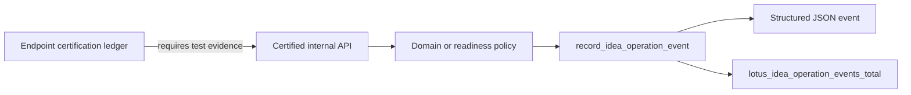

# Observability Baseline

This repository starts from the Lotus platform observability scaffold.

## Default Signals

| Signal | Purpose | Boundary |
| --- | --- | --- |
| `/health`, `/health/live`, `/health/ready` | Service liveness and readiness checks | No business readiness claim |
| `/metrics` | Prometheus scrape target outside OpenAPI | No sensitive labels |
| Correlation and trace response headers | Request tracing across services | Not used as metric labels |
| Structured JSON application events | Operator diagnostics | Product-safe fields only |
| Product-safe error responses | Client and operator failure posture | No raw entitlement or source payload leakage |
| Idea operation events | Certified internal foundation telemetry | Foundation supportability only |
| Request diagnostic events | Validation, HTTP, and unhandled error triage | Route templates, not raw URL paths |

## Sensitive-Content Rule

Logs, metrics, traces, dashboards, and evidence artifacts must not include client names, portfolio
ids, holdings, raw entitlement failures, request bodies, response bodies, trace ids, or correlation
ids as metric labels.

Application source must not bypass the central observability module. `make
source-observability-contract-gate` blocks raw `print()`, direct Python logging, and low-level
`log_event` calls outside `src/app/observability/logging.py`. Request exception handlers use the
central request diagnostic helper and log route templates instead of raw URL paths.

## Idea Operation Events

RFC-0002 Slice 15 adds the first business-operation observability foundation.
`src/app/observability/logging.py` defines bounded operation, outcome, and supportability
vocabulary plus the `lotus_idea_operation_events_total` Prometheus counter.
`make endpoint-certification-gate` requires certified business/operator endpoints to cite bounded
operation-event test evidence in `docs/operations/endpoint-certification-ledger.json`.

Current instrumented operations:

| Operation | Current Scope | Source Authority Label | Current Supportability |
| --- | --- | --- | --- |
| `signal_evaluation` | Internal high-cash signal evaluation | `lotus-core` | `foundation_only` |
| `candidate_persistence` | Internal high-cash candidate persistence and replay | `lotus-core` | `foundation_only` |
| `candidate_evidence_replay` | Internal candidate evidence hash replay posture | `lotus-idea` | `foundation_only` |
| `lifecycle_transition` | Internal candidate lifecycle transition recording | `lotus-idea` | `foundation_only` |
| `ai_explanation` | Internal AI explanation fallback/verifier evaluation | `lotus-idea` | `foundation_only` |
| `ai_explanation_readiness_read` | Internal AI explanation readiness diagnostic | `lotus-ai` | `not_certified` |
| `review_queue_read` | Internal advisor review queue read projection | `lotus-idea` | `foundation_only` |
| `review_queue_readiness_read` | Internal advisor review queue readiness diagnostic | `lotus-idea` | `not_certified` |
| `review_action` | Internal human review decision recording | `lotus-idea` | `foundation_only` |
| `feedback_record` | Internal advisor feedback recording | `lotus-idea` | `foundation_only` |
| `conversion_intent` | Internal review-gated conversion intent recording | `lotus-idea` | `foundation_only` |
| `conversion_outcome` | Internal downstream conversion outcome recording | `lotus-idea` | `foundation_only` |
| `report_evidence_pack` | Internal report evidence-pack request recording | `lotus-report` | `foundation_only` |
| `downstream_realization_submission` | Internal downstream submission posture for Advise/Manage conversion intents and Report evidence-pack requests | `lotus-idea` | `not_certified` |
| `outbox_delivery_run_once` | Internal outbox delivery run-once operator action | `lotus-idea` | `not_certified` |
| `outbox_delivery_readiness_read` | Internal outbox delivery readiness diagnostic read | `lotus-idea` | `not_certified` |
| `downstream_realization_readiness_read` | Internal downstream realization readiness diagnostic read | `lotus-idea` | `not_certified` |
| `mesh_readiness_read` | Internal data-mesh readiness diagnostic read | `lotus-idea` | `not_certified` |
| `mesh_trust_telemetry_preview_read` | Internal runtime trust telemetry preview diagnostic read | `lotus-idea` | `not_certified` |
| `mesh_trust_telemetry_snapshot_read` | Internal runtime trust telemetry snapshot diagnostic read | `lotus-idea` | `not_certified` |
| `source_ingestion_run_once` | Internal source-ingestion run-once operator action | `lotus-core` | `not_certified` |
| `source_ingestion_readiness_read` | Internal source-ingestion readiness diagnostic read | `lotus-core` | `not_certified` |
| `implementation_proof_readiness_read` | Internal aggregate RFC-0002 proof-readiness diagnostic read | `lotus-idea` | `not_certified` |

Metric labels are limited to:

| Label | Allowed meaning |
| --- | --- |
| `operation` | Governed operation vocabulary from the central helper |
| `outcome` | Bounded result posture such as `accepted`, `blocked`, or `permission_denied` |
| `supportability_status` | Foundation, blocked, or not-certified posture |
| `source_authority` | Owning Lotus service or `lotus-idea` |
| `durable_storage_backed` | Whether the active repository provider is durable |
| `supported_feature_promoted` | Whether supported-feature promotion exists |

The operation helper rejects sensitive attributes such as client, portfolio, account, holding,
transaction, request body, response body, raw entitlement failure, trace id, or correlation id
fields. Do not add identifiers or payload fragments to operation labels.

## Operator Interpretation

1. `accepted` means the internal foundation recorded a new operation in the active
   repository provider.
2. `fallback` means the AI explanation evaluator returned deterministic evidence because no
   verified AI workflow output was supplied or available.
3. `replayed` means the same idempotency key and payload returned an existing foundation record.
4. `conflict` means the idempotency key was reused with a different payload.
5. `not_found` means the referenced candidate, conversion intent, or related foundation record was
   not present.
6. `duplicate`, `suppressed`, and `not_eligible` describe deterministic signal or persistence
   outcomes that did not create a new candidate.
7. `permission_denied` means fail-closed capability policy blocked the caller.
8. `invalid_request` and `invalid_state` are product-safe failures; inspect API validation and
   lifecycle/review/conversion preconditions before retrying.
9. `blocked` means the verifier rejected unsupported AI output, evidence
   replay found stale source posture, the AI explanation readiness diagnostic
   remains blocked until `lotus-ai` runtime execution, durable AI lineage,
   model-risk dashboard, runtime trust telemetry, and Workbench proof exist,
   the mesh-readiness diagnostic remains blocked until runtime trust telemetry
   and platform mesh certification exist, the source-ingestion readiness
   diagnostic is missing run-once worker configuration inputs, the
   source-ingestion run-once operator action is blocked by missing durable
   storage, manifest, or Core configuration, or the advisor queue readiness
   diagnostic still lacks durable repository posture,
   entitlement proof, Workbench proof, data-product certification, or runtime
   trust telemetry. It also covers downstream realization readiness while
   Advise, Manage, Report, Render, Archive, Gateway/Workbench, and mesh proof
   remain absent, and downstream submission while adapters are missing or a
   downstream adapter returns a bounded rejection. It also covers the runtime
   trust telemetry preview and snapshot diagnostics while they are not yet
   platform-certified or published through Gateway/Workbench discovery, and the
   aggregate implementation-proof readiness diagnostic when any RFC-0002 proof
   family remains uncertified. It also covers outbox delivery run-once and
   readiness while broker configuration, live broker runtime proof, downstream
   consumer contracts, platform mesh event certification, and supported-feature
   evidence are absent.

These signals are operational support evidence only. `durable_storage_backed=true` confirms only
that the active repository provider is durable; it does not certify a data product, production
recovery readiness, Gateway/Workbench route, downstream Report/Render/Archive realization, or any
supported business feature.

The source-ingestion readiness diagnostic reports `accepted` only when the
configured manifest, Core base URL, and durable repository environment are
present. The run-once operator action emits `source_ingestion_run_once` with
aggregate work-item count buckets only and fails closed before mutation when
durable storage, manifest, or Core configuration is absent. Both remain
`not_certified` until live Core source proof, runtime data-mesh telemetry,
Gateway/Workbench proof, downstream proof, and supported-feature evidence
exist. A valid scheduled-worker deploy-proof artifact can clear only the
scheduled-worker blocker; it is not live source or product support proof.
