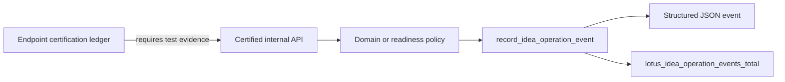

# Observability Baseline

This repository starts from the Lotus platform observability scaffold.

## Default Signals

| Signal | Purpose | Boundary |
| --- | --- | --- |
| `/health`, `/health/live`, `/health/ready` | Service liveness and readiness checks | No business readiness claim |
| `/metrics` | Prometheus scrape target outside OpenAPI | No sensitive labels |
| Correlation and trace response headers | Request tracing across services | Sanitized or generated before response, logs, or downstream propagation; not used as metric labels |
| Structured JSON application events | Operator diagnostics | Product-safe fields only |
| Product-safe error responses | Client and operator failure posture | No raw entitlement or source payload leakage |
| HTTP boundary rejections | Trusted-host, body-size, and media-type rejection posture | Product-safe `ProblemDetails`; no host, payload, token, cookie, portfolio, or client echo |
| Idea operation events | Certified internal foundation telemetry | Foundation supportability only |
| Request diagnostic events | Validation, HTTP, and unhandled error triage | Route templates, not raw URL paths |
| Operation metric contract | Machine-readable inventory of implemented operation metric vocabulary | Not dashboard, alert, mesh, or supported-feature certification |
| AI model-risk operations contract | Machine-readable dashboard-control and alert posture for AI explanation operations, backed by repo-owned dashboard/rule/runbook artifacts | Not `lotus-ai`, Workbench, data-mesh, client-ready, or supported-feature certification |
| Operator workflows operations contract | Machine-readable source contract for non-AI operator-workflow dashboard, alert-rule, fixture, and runbook artifacts | Not dashboard provisioning/query execution, live rule loading/evaluation/delivery, deployment, production behavior, live source, external broker, downstream execution, Gateway/Workbench, data mesh, or supported-feature certification |
| Outbox supportability contract | Code-aligned state, age, configuration, collection, dashboard, and sustained-alert contract | Not broker publication, consumer delivery, or supported-feature certification |

## Sensitive-Content Rule

Logs, metrics, traces, dashboards, and evidence artifacts must not include client names, portfolio
ids, holdings, raw entitlement failures, request bodies, or response bodies. Correlation and trace
ids are allowed only as product-safe log context on request diagnostics and operation events; they
must not be used as Prometheus labels, evidence artifact identifiers, or generic operation
attributes.

Inbound `X-Correlation-Id` and `X-Trace-Id` values are untrusted request input. The HTTP
correlation middleware preserves only bounded product-safe identifiers using the governed
character/length/sensitive-fragment policy; missing, blank, overlong, portfolio-like,
secret/token-like, or malformed values are replaced with generated `corr-*` or `trace-*`
identifiers before they reach request state, response headers, request diagnostics, operation
events, or downstream HTTP clients. Logging helpers reject unsafe diagnostic identifiers supplied
outside the HTTP middleware path.

Application source must not bypass the central observability module. `make
source-observability-contract-gate` blocks raw `print()`, direct Python logging, and low-level
`log_event` calls outside `src/app/observability/logging.py`. Request exception handlers use the
central request diagnostic helper and log route templates instead of raw URL paths.

## Idea Operation Events

RFC-0002 Slice 15 adds the first business-operation observability foundation.
`src/app/observability/logging.py` defines bounded operation, outcome, and supportability
vocabulary plus the `lotus_idea_operation_events_total` Prometheus counter.
`make endpoint-certification-gate` requires certified business/operator endpoints to cite bounded
operation-event test evidence in `docs/operations/endpoint-certification-ledger.json`.
`contracts/observability/lotus-idea-operation-metrics.v1.json` is the machine-readable metric
catalog for this implemented foundation. `make operation-metric-contract-gate` keeps the catalog
aligned to the code-owned operation enum, outcome enum, metric labels, source-authority labels, and
not-certified supportability boundary. It also blocks premature dashboard, alert, mesh,
Gateway/Workbench, or supported-feature claims.

Current instrumented operations:

| Operation | Current Scope | Source Authority Label | Current Supportability |
| --- | --- | --- | --- |
| `signal_evaluation` | Internal high-cash signal evaluation | `lotus-core` | `foundation_only` |
| `candidate_persistence` | Internal high-cash candidate persistence and replay | `lotus-core` | `foundation_only` |
| `candidate_evidence_replay` | Internal candidate evidence hash replay posture | `lotus-idea` | `foundation_only` |
| `lifecycle_transition` | Internal candidate lifecycle transition recording | `lotus-idea` | `foundation_only` |
| `data_lifecycle_action` | Governed hold, erasure, and purge operator workflow | `lotus-idea` | `not_certified` |
| `ai_explanation` | Internal AI explanation fallback/verifier evaluation | `lotus-idea` | `foundation_only` |
| `ai_explanation_readiness_read` | Internal AI explanation readiness diagnostic | `lotus-ai` | `not_certified` |
| `review_queue_read` | Internal audience-specific business review queue projection | `lotus-idea` | `foundation_only` |
| `review_queue_exception_read` | Internal aggregate review queue exception diagnostic | `lotus-idea` | `not_certified` |
| `review_queue_readiness_read` | Internal advisor review queue readiness diagnostic | `lotus-idea` | `not_certified` |
| `review_action` | Internal human review decision recording | `lotus-idea` | `foundation_only` |
| `feedback_record` | Internal advisor feedback recording | `lotus-idea` | `foundation_only` |
| `conversion_intent` | Internal review-gated conversion intent recording | `lotus-idea` | `foundation_only` |
| `conversion_outcome` | Internal downstream conversion outcome recording | `lotus-idea` | `foundation_only` |
| `report_evidence_pack` | Internal report evidence-pack request recording | `lotus-report` | `foundation_only` |
| `downstream_realization_submission` | Internal downstream submission posture for Advise/Manage conversion intents and Report evidence-pack requests | `lotus-idea` | `not_certified` |
| `outbox_delivery_run_once` | Internal outbox delivery run-once operator action | `lotus-idea` | `not_certified` |
| `outbox_delivery_readiness_read` | Internal outbox delivery readiness diagnostic read | `lotus-idea` | `not_certified` |
| `downstream_realization_readiness_read` | Internal downstream realization readiness diagnostic read | `lotus-idea` | `not_certified` |
| `mesh_readiness_read` | Internal data-mesh readiness diagnostic read | `lotus-idea` | `not_certified` |
| `mesh_trust_telemetry_preview_read` | Internal runtime trust telemetry preview diagnostic read | `lotus-idea` | `not_certified` |
| `mesh_trust_telemetry_snapshot_read` | Internal runtime trust telemetry snapshot diagnostic read | `lotus-idea` | `not_certified` |
| `source_ingestion_run_once` | Internal source-ingestion run-once operator action | `lotus-core` | `not_certified` |
| `source_ingestion_readiness_read` | Internal source-ingestion readiness diagnostic read | `lotus-core` | `not_certified` |
| `implementation_proof_readiness_read` | Internal aggregate RFC-0002 proof-readiness diagnostic read | `lotus-idea` | `not_certified` |

Metric labels are limited to:

| Label | Allowed meaning |
| --- | --- |
| `operation` | Governed operation vocabulary from the central helper |
| `outcome` | Bounded result posture such as `accepted`, `blocked`, or `permission_denied` |
| `supportability_status` | Foundation, blocked, or not-certified posture |
| `source_authority` | Code-owned Lotus source-system label, `lotus-idea`, or aggregate `source-owned` |
| `durable_storage_backed` | Whether the active repository provider is durable |
| `supported_feature_promoted` | Whether supported-feature promotion exists |

The governed `source_authority` vocabulary is owned by
`OPERATION_EVENT_SOURCE_AUTHORITIES` in `src/app/observability/logging.py` and
mirrored by the operation metric and operator workflow contracts:
`lotus-advise`, `lotus-ai`, `lotus-archive`, `lotus-core`,
`lotus-idea`, `lotus-manage`, `lotus-performance`, `lotus-render`,
`lotus-report`, `lotus-risk`, and aggregate `source-owned`. Runtime operation
events reject unknown labels such as client, portfolio, account, or ad hoc
local service identifiers before logs or metrics are emitted. Signal evaluation
uses the concrete source-system label when all source refs agree and
`source-owned` only when an event aggregates multiple governed source systems.

The operation helper rejects sensitive attributes such as client, portfolio, account, holding,
transaction, request body, response body, raw entitlement failure, trace id, or correlation id
fields. Use the explicit log-only `correlation_id` and `trace_id` fields when request supportability
needs to join API responses to service logs. Do not add identifiers or payload fragments to
operation labels.

The operation metric catalog is intentionally a guardrail, not a promotion record. It proves the
metric vocabulary is implemented, bounded, and synchronized with code. It does not certify a Grafana
dashboard, Prometheus alert, platform mesh product, Gateway/Workbench route, or external supported
feature.

## AI Model-Risk Operations Contract

`contracts/observability/lotus-idea-ai-model-risk-operations.v1.json` defines
the current model-risk operations contract for the AI explanation foundation.
It is validated by `make ai-model-risk-ops-contract-gate`. The concrete
dashboard, alert rules, and runbook source contracts are validated by
`make ai-model-risk-operations-proof-contract-gate`.

| Contract area | Implemented evidence | Boundary |
| --- | --- | --- |
| Dashboard controls | AI explanation readiness posture, verifier posture, and lineage durability posture over implemented operation telemetry | Source-valid artifact; provisioning and query execution remain unproved |
| Alert rules | Unsupported-claim block-rate and readiness-blocked rules over implemented operation telemetry | Source-valid artifact; rule loading, evaluation, and delivery remain unproved |
| Source-of-truth paths | AI readiness source, AI API source, operation metric contract, AI governance docs, runbook, and RFC slices | No runtime `lotus-ai` execution proof |

This contract narrows the model-risk operations gap from "candidate controls"
to source-valid dashboard and alert artifacts. It clears no aggregate blocker
and does not prove
`lotus-ai` runtime execution, Workbench product surface, data-mesh
certification, dashboard provisioning, alert evaluation/delivery, client-ready
publication, or supported-feature promotion. AI
lineage store proof remains a separate source-safe persistence artifact
consumed by aggregate implementation-proof readiness.

## Operator Workflows Operations Contract

`contracts/observability/lotus-idea-operator-workflows-operations.v1.json`
defines the current non-AI operator workflow operations contract for source
ingestion, outbox delivery, downstream realization, runtime trust telemetry,
and aggregate implementation-proof readiness. It is validated by
`make operator-workflows-ops-contract-gate`. The concrete dashboard, alert
rules, and runbook source contract is validated by
`make operator-workflows-operations-proof-contract-gate`.

| Contract area | Implemented evidence | Boundary |
| --- | --- | --- |
| Dashboard controls | Operation activity remains separate from outbox durable state, oldest due age, and configuration/collection posture | Source contract valid; provisioning and query execution remain unproven |
| Alert rules | Blocked operation posture plus sustained collection, dead-letter, lease, backlog, age, and retry-pressure conditions | Source contract valid with `promtool` fixture proof; live rule loading, evaluation, and delivery remain unproven |
| Source-of-truth paths | Operation metric contract, operator runbook, source-ingestion, outbox, downstream, runtime-trust, implementation-proof source modules, and RFC slices | No live source, external broker, downstream execution, Gateway/Workbench, or support-promotion proof |
| Source-authority policy | Dashboard and alert artifacts may group by the governed `source_authority` label; any explicit matcher must use the code-owned vocabulary above | No client, portfolio, account, request, response, raw entitlement, or ad hoc source labels |

This contract closes the source-artifact portion of the non-AI dashboard/alert
gap raised by GitHub issue `#282` without changing runtime modularity or
feature support posture. GitHub issue `#412` corrected the evidence class: the
artifact is `source_contract` proof, clears no aggregate blocker, and cannot
prove provisioning, dashboard query execution, live alert evaluation or
delivery, deployment, or production behavior.

The outbox-specific metric and threshold inventory is owned by
`contracts/observability/lotus-idea-outbox-supportability.v1.json`. Run
`make outbox-supportability-contract-gate` for contract drift and
`make outbox-supportability-rule-test` for real Prometheus rule evaluation.
Counts at `100` delivery-ready, `900` seconds oldest due age, and `50` deferred
retries remain quiet; alerts require a strict breach sustained for the period
documented in the operator runbook.

## Operator Interpretation

1. `accepted` means the internal foundation recorded a new operation in the active
   repository provider.
2. `fallback` means the AI explanation evaluator returned deterministic evidence because no
   verified AI workflow output was supplied or available.
3. `replayed` means the same idempotency key and payload returned an existing foundation record.
4. `conflict` means the idempotency key was reused with a different payload.
5. `not_found` means the referenced candidate, conversion intent, or related foundation record was
   not present.
6. `duplicate`, `suppressed`, and `not_eligible` describe deterministic signal or persistence
   outcomes that did not create a new candidate.
7. `permission_denied` means fail-closed capability policy blocked the caller.
8. `invalid_request` and `invalid_state` are product-safe failures; inspect API validation and
   lifecycle/review/conversion preconditions before retrying.
9. `blocked` means the verifier rejected unsupported AI output, evidence
   replay found stale source posture, the AI explanation readiness diagnostic
   remains blocked until `lotus-ai` runtime execution, workflow-pack runtime
   certification, runtime trust telemetry, and Workbench proof exist,
   the mesh-readiness diagnostic remains blocked until runtime trust telemetry
   and platform mesh certification exist, the source-ingestion readiness
   diagnostic is missing run-once worker configuration inputs, the
   source-ingestion run-once operator action is blocked by missing durable
   storage, manifest, or Core configuration, or the advisor queue readiness
   diagnostic still lacks durable repository posture, Workbench proof,
   data-product certification, or runtime trust telemetry. It also covers
   downstream realization readiness while
   Advise, Manage, Report, Render, Archive, Gateway/Workbench, and mesh proof
   remain absent, and downstream submission while adapters are missing or a
   downstream adapter returns a bounded rejection. It also covers the runtime
   trust telemetry preview and snapshot diagnostics while they are not yet
   platform-certified or published through Gateway/Workbench discovery, and the
   aggregate implementation-proof readiness diagnostic when any RFC-0002 proof
   family remains uncertified. It also covers outbox delivery run-once and
   readiness while external publication certification, downstream consumer
   contracts, platform-mesh event runtime publication evidence, and supported-feature evidence
   are absent.

These signals are operational support evidence only. `durable_storage_backed=true` confirms only
that the active repository provider is durable; it does not certify a data product, production
recovery readiness, Gateway/Workbench route, downstream Report/Render/Archive realization, or any
supported business feature.

When an API caller reports a failure, operators should start from the response
`X-Correlation-Id` header and search structured `lotus-idea` logs for the same
`correlation_id`. Validation, HTTP, and unhandled-error diagnostics log route
templates rather than raw paths. Business operation events may include the same
log-only `correlation_id` and `trace_id`, while the
`lotus_idea_operation_events_total` metric remains bounded to the governed
label set above.

If a caller supplies an unsafe correlation or trace header, the value in the response and logs will
be a generated replacement. Operators should use the response header value, not the caller-supplied
raw value, for support lookup.

The source-ingestion readiness diagnostic reports `accepted` only when the
configured manifest, Core query URL, Core query-control-plane URL, and durable
repository environment are present. The run-once operator action emits
`source_ingestion_run_once` with aggregate work-item count buckets only and
fails closed before mutation when durable storage, manifest, or Core
configuration is absent. Both remain
`not_certified` until live Core source proof, runtime data-mesh telemetry,
Gateway/Workbench proof, downstream proof, and supported-feature evidence
exist. A valid scheduled-worker deploy-proof artifact can clear only the
scheduled-worker blocker; it is not live source or product support proof.

The outbox delivery run-once operator action requires a validated
`Idempotency-Key` before broker checks or event mutation. Operation events may
include the source-safe `operator_run_reference` log attribute derived from the
key and the aggregate `attempted_count_bucket`; neither value is a Prometheus
label. Same-key/same-request retries emit replay posture without mutation, and
same-key/different-request reuse emits conflict posture without exposing raw
idempotency keys, event ids, broker payloads, or downstream payloads. The route
also closes its owned broker publisher after execution begins, so repeated
operator runs do not leave HTTP client resources open; this is internal
resource-lifecycle evidence, not external broker publication certification.
Publisher cleanup failures emit a source-safe `suppressed` operation event with
`publisher_cleanup_failed` and `cleanup_phase=publisher_close`; the already
computed completed, replayed, conflict, or bounded failure response remains the
operator contract.
