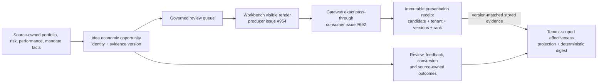

# Opportunity Effectiveness And Presentation Evidence

## Purpose

Lotus Idea measures whether governed opportunities are useful to advisers and
progress through review and downstream realization. Candidate volume alone is
not a success measure. This capability provides a versioned, privacy-safe
funnel over durable Idea facts while preserving source ownership and human
decision authority.

This document serves product governance, operations, engineering, and QA. It
does not define a client surveillance dashboard, an automated ranking update,
or a recommendation or suitability decision.

## Audience Guide

| Audience | Use this capability for | Do not infer |
| --- | --- | --- |
| Product governance | Compare bounded funnel rates, feedback reasons, recurrence, and timing under one methodology version | Candidate count equals value, or a metric authorizes a policy change |
| Advisers and product owners | Understand how visible opportunities can later contribute to aggregate evaluation | Recording a presentation approves, recommends, or converts a candidate |
| Operations | Diagnose unavailable methodology facts, receipt conflicts, and consumer-certification blockers | A healthy API proves Workbench presentation or supported-feature readiness |
| Engineering and QA | Validate tenant isolation, deterministic math, immutable receipts, PostgreSQL parity, and privacy exclusions | Queue retrieval is evidence that an item was visible |

## Governed Evidence Flow



Idea measures stored presentation evidence independently from end-to-end
consumer certification. The projection can therefore support internal product
learning without claiming that Workbench and Gateway are certified.

## Effectiveness Read Model

`GET /api/v1/operations/opportunity-effectiveness` returns schema
`lotus-idea.opportunity-effectiveness.v1` under methodology policy
`idea-opportunity-effectiveness-v2`.

The population is economic opportunities first generated in the half-open UTC
window `[windowStartUtc, windowEndUtc)`. Later review, feedback, conversion,
current source-owned outcome, and reconciliation facts are observed only at or
before `evaluatedAtUtc`. Corrected evidence and recurrent detections retain one
economic opportunity identity rather than inflating the denominator.

Each rate returns its numerator, denominator, value, and zero-denominator
behavior. Empty denominators return `null`. The response includes:

- generated, reviewed, feedback, conversion, stale/unavailable/unsupported,
  suppressed, duplicate, recurrent, and reconciled counts;
- family, score-band, latest-review, feedback-reason, current-downstream-outcome,
  and submission-posture dimensions;
- review, approval, rejection, suppression, feedback, conversion, downstream
  accepted/rejected/uncertain rates;
- detection-to-review and approval-to-conversion distributions; and
- a deterministic snapshot digest and explicit privacy boundary.

Presentation fields use two explicit postures:

| Measurement status | Counts | Meaning |
| --- | --- | --- |
| `unavailable_consumer_certification_pending` | Counts and presentation rates are `null` | No qualifying receipt exists by the evaluation cutoff; zero must not be inferred |
| `stored_consumer_certification_pending` | Counts and presentation rates are non-null | Idea has eligible stored evidence, but canonical Gateway/Workbench certification remains outstanding |

`presentedOpportunityCount` counts distinct cohort candidates with at least one
tenant-matched receipt at or before `evaluatedAtUtc`; repeated renders do not
inflate it. `topRankedAcceptedOpportunityCount` counts a presented candidate
once only when a rank-1 receipt precedes an `approve_for_conversion` decision
for the exact same material/evidence version. Idea resolves that version to its
durable evidence hash before attribution, so a pre-recurrence rank cannot be
credited to a later-version approval.

Methodology v2 adds the denominators needed to interpret those counts. The
`presentationRate` is distinct presented opportunities divided by generated
economic opportunities. `topRankedPresentedOpportunityCount` counts distinct
cohort candidates observed at global rank 1, and `topRankedAcceptanceRate`
divides exact-version rank-1 acceptances by that count. A stored presentation
population with no rank-1 observation yields a `0 / 0` rate with `null` value;
it is not reported as a rejection. Repeated receipts never inflate either
denominator.

## Presentation Receipt Contract

`POST /api/v1/idea-candidates/{candidateId}/presentation-receipts` records one
visible-render observation. `Idempotency-Key` is the stable receipt identity.
The advisor queue publishes the current Idea-owned candidate material and
evidence versions on each item. A receipt producer must copy those versions
from the exact rendered item; it must not infer them from candidate content or
reconstruct Idea-owned version state. Workbench still owns construction of the
digest over the exact ordered candidate identities that were visibly rendered.
The request contains only:

| Field | Control |
| --- | --- |
| `tenantId` | Must match caller entitlement and persisted candidate scope |
| `presentedAtUtc` | UTC and not before the referenced candidate version |
| `rankAtPresentation` | Strict positive integer; Idea-owned global queue rank copied from the rendered item |
| `visibleCandidateCount` | Strict integer; independent Workbench-owned visible-set size, bounded to 1–100 |
| `queueSnapshotDigest` | SHA-256 digest; raw queue payload is excluded |
| Queue/ranking policy versions | Governed source-safe references |
| Candidate material/evidence versions | Strict positive integers; must equal the persisted current versions |

Global queue rank and visible-set size describe different populations. A candidate ranked 25th may
be the only item visible after scrolling or filtering, so `rankAtPresentation=25` and
`visibleCandidateCount=1` is valid. Producers must neither renumber Idea rank nor inflate the
visible count to manufacture a cross-field relationship.

Migration `020_independent_presentation_rank` enforces the same rule in PostgreSQL. It validates
the positive-rank replacement constraint before removing the legacy cross-population constraint.
Rollback fails closed if stored receipts rely on an Idea global rank greater than the Workbench
visible-set size; operators must reconcile those governed records before reinstating the legacy
schema.

Exact retries return `replayed`. Reusing the key with changed evidence returns
`presentation_receipt_identity_conflict`. Candidate, tenant, version, or
chronology mismatch returns `presentation_receipt_candidate_state_conflict`.
Neither conflict response discloses an existing receipt outside candidate
scope.

Production-like profiles require the existing durable repository and trusted
caller-context provenance. This implementation adds no identity provider,
session, token, or claim-minting component.

## Privacy And Authority Boundaries

Presentation receipts deliberately exclude client content, candidate rationale,
actor identity, correlation/trace identifiers, and raw queue data. Operation
telemetry emits only governed labels plus a bounded visible-count bucket.
The bounded receipt is classified as regulated advisory evidence under the
seven-year Idea policy. Legal hold freezes expiry, erasure, and purge; erasure
preserves the source-safe immutable receipt because it contains neither actor
identity nor client content. This is evidence retention, not permission to
retain any excluded payload.

The capability does not:

- mutate opportunity, suitability, mandate, risk, or ranking policy;
- interpret timeout or uncertain downstream posture as success;
- grant conversion or execution authority;
- certify Gateway or Workbench behavior; or
- promote a supported feature.

## Operator Failure Matrix

| HTTP posture | Meaning | Operator action |
| --- | --- | --- |
| `400 invalid_request` | Receipt fields, UTC time, rank/count, digest, or key are malformed | Correct the producer contract; do not retry unchanged invalid data |
| `403 permission_denied` | Required role, capability, or tenant entitlement is absent | Correct governed caller context; do not broaden scope locally |
| `404 candidate_not_found` | Candidate is unavailable in the caller-visible repository | Reconcile the queue item with current Idea state |
| `409 presentation_receipt_identity_conflict` | Stable key was reused with changed evidence | Treat as producer idempotency defect and preserve the first receipt |
| `409 presentation_receipt_candidate_state_conflict` | Candidate tenant, version, or chronology changed | Refresh the queue and render the current candidate version |
| `503` | Durable writes or recovery posture are unavailable | Restore repository readiness; do not fall back to process memory in production-like profiles |

## Verification

Run the smallest relevant checks first:

```powershell
python -m pytest tests/unit/test_presentation_receipts.py tests/unit/test_postgres_presentation_receipts.py -q
python -m pytest tests/integration/test_presentation_receipts_api.py -q
python scripts/openapi_quality_gate.py
python scripts/endpoint_certification_gate.py
python scripts/operation_metric_contract_gate.py
python scripts/migration_contract_gate.py
python scripts/data_lifecycle_contract_gate.py
python scripts/disaster_recovery_contract_gate.py
```

`make postgres-integration-gate` includes restart-safe real-PostgreSQL receipt
and effectiveness-attribution proof. Repository snapshots preserve receipts
associated with loaded candidate state so in-memory recovery and PostgreSQL
snapshot replacement retain the same learning evidence. The disaster-recovery
integration suite also seeds the receipt and
rejects restored version-lineage, tenant, or chronology corruption. Full
release validation remains `make ci-release`.

## Certification Posture

Idea contract, persistence, measurement, API, and local PostgreSQL proof are
implemented but not certified as an end-to-end shown metric. Stored receipts
can support internal effectiveness analysis. Remaining consumer evidence is
tracked durably in:

- `sgajbi/lotus-gateway#692` — exact pass-through; and
- `sgajbi/lotus-workbench#954` — visible-render production.

The canonical methodology and closure issue is `sgajbi/lotus-idea#1156`.
