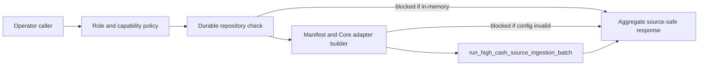

# Source Ingestion Run-Once

| Field | Current Truth |
| --- | --- |
| Status | Certified internal operator action |
| Audience | Operators, implementation reviewers, release reviewers |
| Required role | `operator` |
| Required capability | `idea.source-ingestion.run` |
| Source authority | `lotus-core` |
| Supportability | `not_certified` |
| Product claim | No live source certification or supported-feature promotion |

`POST /api/v1/source-ingestion/run-once` runs one bounded high-cash
source-ingestion pass through the configured worker manifest, active repository
provider, and Core source adapter. It is the service API counterpart to the
manifest-backed worker foundation and is intended for controlled operator proof,
not business-user execution.

## What It Proves

The endpoint proves the service can:

1. enforce operator role and `idea.source-ingestion.run` capability,
2. fail closed before mutation when durable repository configuration is absent,
3. fail closed before mutation when the manifest or Core base URL is missing or
   invalid,
4. execute the existing domain batch runner when runtime state is configured,
5. return aggregate decision counts only,
6. emit bounded `source_ingestion_run_once` operation events.

## What It Does Not Prove

The endpoint does not:

1. certify live Core source ingestion,
2. prove scheduled worker deployment,
3. certify data-mesh runtime telemetry,
4. create Gateway or Workbench product support,
5. expose portfolio identifiers, raw Core payloads, raw idempotency keys, or
   candidate identifiers,
6. promote support status or external publication authority.

## Runtime Flow



## Response Shape

| Field | Meaning |
| --- | --- |
| `runStatus` | `blocked` or `completed` |
| `durableStorageBacked` | Whether the active repository provider is durable |
| `configuredManifestAvailable` | Whether the configured manifest path exists |
| `coreBaseUrlConfigured` | Whether `LOTUS_CORE_BASE_URL` is configured |
| `totalCount` | Number of work items processed by the domain batch runner |
| `decisionCounts` | Aggregate decision counts by bounded ingestion outcome |
| `configurationBlockers` | Runtime blockers that prevented execution |
| `certificationBlockers` | Remaining proof blockers before support promotion |

## Example

```powershell
curl -X POST `
  -H "X-Caller-Roles: operator" `
  -H "X-Caller-Capabilities: idea.source-ingestion.run" `
  "http://localhost:8330/api/v1/source-ingestion/run-once"
```

Required runtime environment:

```powershell
$env:LOTUS_IDEA_DATABASE_URL = "postgresql://..."
$env:LOTUS_IDEA_SOURCE_INGESTION_MANIFEST = "docs/examples/source-ingestion/high-cash-worker-manifest.example.json"
$env:LOTUS_CORE_BASE_URL = "http://localhost:8100"
```

Core response requirement:

- The high-cash adapter consumes Core `HoldingsAsOf:v1`
  `totals.source_reported_cash_weight` when
  `totals.source_reported_cash_weight_supportability` is `SUPPORTED`.
- If Core omits the field or reports `BLOCKED_MISSING_DENOMINATOR`,
  `BLOCKED_ZERO_DENOMINATOR`, or `BLOCKED_STALE_DENOMINATOR`, the source
  evaluation remains blocked. `lotus-idea` must not reconstruct cash weight
  from cash totals, market value, or AUM.

## Evidence

Implementation-backed evidence:

1. domain batch runner: `src/app/application/source_ingestion.py`,
2. manifest planner: `src/app/application/source_ingestion_worker.py`,
3. runtime builder: `src/app/source_ingestion_state.py`,
4. API route: `src/app/api/source_ingestion_readiness.py`,
5. endpoint ledger:
   `docs/operations/endpoint-certification-ledger.json`,
6. integration tests:
   `tests/integration/test_source_ingestion_readiness_api.py`,
7. proof-readiness diagnostic:
   `GET /api/v1/implementation-proof/readiness`.

Run:

```powershell
python -m pytest tests/unit/test_source_ingestion.py tests/unit/test_source_ingestion_worker.py tests/integration/test_source_ingestion_readiness_api.py -q
make source-ingestion-worker-check
make endpoint-certification-gate
make openapi-gate
```
