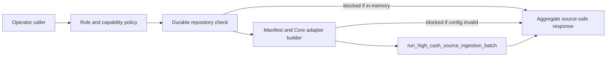

# Source Ingestion Run-Once

| Field | Current Truth |
| --- | --- |
| Status | Certified internal operator action |
| Audience | Operators, implementation reviewers, release reviewers |
| Required role | `operator` |
| Required capability | `idea.source-ingestion.run` |
| Source authority | `lotus-core` |
| Supportability | `not_certified` |
| Product claim | No live source certification or supported-feature promotion |

`POST /api/v1/source-ingestion/run-once` runs one bounded high-cash
source-ingestion pass through the configured worker manifest, active repository
provider, and Core source adapter. It is the service API counterpart to the
manifest-backed worker foundation and is intended for controlled operator proof,
not business-user execution.

## What It Proves

The endpoint proves the service can:

1. enforce operator role and `idea.source-ingestion.run` capability,
2. fail closed before mutation when durable repository configuration is absent,
3. fail closed before mutation when the manifest or Core base URL is missing or
   invalid,
4. execute the existing domain batch runner when runtime state is configured,
5. return aggregate decision counts only,
6. emit bounded `source_ingestion_run_once` operation events.

`scripts/generate_source_ingestion_live_proof.py` wraps the same worker path
and writes a source-safe proof artifact for release reviewers. When that
artifact is valid and referenced through `LOTUS_IDEA_SOURCE_INGESTION_LIVE_PROOF`,
readiness can clear only `live_core_source_proof_missing`; scheduled worker,
data-mesh, Gateway/Workbench, and supported-feature blockers remain.

`scripts/run_scheduled_source_ingestion_worker.py` wraps the run-once worker in
a bounded scheduler entrypoint for deploy topology proof. The worker is also
declared in `docker-compose.yml` as the opt-in
`lotus-idea-source-ingestion-worker` service under the `worker` profile.
`scripts/generate_scheduled_source_ingestion_worker_proof.py` writes a
source-safe deploy-proof artifact. When that artifact is valid and referenced
through `LOTUS_IDEA_SOURCE_INGESTION_SCHEDULED_WORKER_PROOF`, readiness can
clear only `scheduled_worker_deploy_proof_missing`; live Core, data-mesh,
Gateway/Workbench, downstream, and supported-feature blockers remain.
`make implementation-proof-readiness-check` also generates this deploy-proof
artifact under ignored `output/source-ingestion/` and passes it into the
aggregate RFC proof-readiness generator so CI evidence does not keep a stale
scheduled-worker deploy-proof blocker after the contract has been validated.

## What It Does Not Prove

The endpoint does not:

1. prove live Core source certification,
2. certify data-mesh runtime telemetry,
3. create Gateway or Workbench product support,
4. expose portfolio identifiers, raw Core payloads, raw idempotency keys, or
   candidate identifiers,
5. promote support status or external publication authority.

## Runtime Flow



## Response Shape

| Field | Meaning |
| --- | --- |
| `runStatus` | `blocked` or `completed` |
| `durableStorageBacked` | Whether the active repository provider is durable |
| `configuredManifestAvailable` | Whether the configured manifest path exists |
| `coreBaseUrlConfigured` | Whether `LOTUS_CORE_BASE_URL` is configured |
| `totalCount` | Number of work items processed by the domain batch runner |
| `decisionCounts` | Aggregate decision counts by bounded ingestion outcome |
| `configurationBlockers` | Runtime blockers that prevented execution |
| `certificationBlockers` | Remaining proof blockers before support promotion |

## Example

```powershell
curl -X POST `
  -H "X-Caller-Roles: operator" `
  -H "X-Caller-Capabilities: idea.source-ingestion.run" `
  "http://localhost:8330/api/v1/source-ingestion/run-once"
```

Required runtime environment:

```powershell
$env:LOTUS_IDEA_DATABASE_URL = "postgresql://..."
$env:LOTUS_IDEA_SOURCE_INGESTION_MANIFEST = "docs/examples/source-ingestion/high-cash-worker-manifest.example.json"
$env:LOTUS_CORE_BASE_URL = "http://localhost:8100"
```

Live-proof capture:

```powershell
python scripts/generate_source_ingestion_live_proof.py `
  --manifest docs/examples/source-ingestion/high-cash-worker-manifest.example.json `
  --core-base-url http://localhost:8100 `
  --generated-at-utc 2026-06-21T10:10:00Z `
  --output output/source-ingestion/live-proof.json

$env:LOTUS_IDEA_SOURCE_INGESTION_LIVE_PROOF = "output/source-ingestion/live-proof.json"
```

Scheduled-worker deploy proof:

```powershell
python scripts/run_scheduled_source_ingestion_worker.py `
  --manifest docs/examples/source-ingestion/high-cash-worker-manifest.example.json `
  --check-only `
  --interval-seconds 300 `
  --max-runs 1

python scripts/generate_scheduled_source_ingestion_worker_proof.py `
  --manifest docs/examples/source-ingestion/high-cash-worker-manifest.example.json `
  --generated-at-utc 2026-06-21T10:10:00Z `
  --output output/source-ingestion/scheduled-worker-proof.json

$env:LOTUS_IDEA_SOURCE_INGESTION_SCHEDULED_WORKER_PROOF = "output/source-ingestion/scheduled-worker-proof.json"
```

Core response requirement:

- The high-cash adapter consumes Core `HoldingsAsOf:v1`
  `totals.source_reported_cash_weight` when
  `totals.source_reported_cash_weight_supportability` is `SUPPORTED`.
- If Core omits the field or reports `BLOCKED_MISSING_DENOMINATOR`,
  `BLOCKED_ZERO_DENOMINATOR`, or `BLOCKED_STALE_DENOMINATOR`, the source
  evaluation remains blocked. `lotus-idea` must not reconstruct cash weight
  from cash totals, market value, or AUM.

## Evidence

Implementation-backed evidence:

1. domain batch runner: `src/app/application/source_ingestion.py`,
2. manifest planner: `src/app/application/source_ingestion_worker.py`,
3. scheduled-worker planner:
   `src/app/application/source_ingestion_scheduled_worker.py`,
4. live-proof builder: `src/app/application/source_ingestion_live_proof.py`,
5. runtime builder: `src/app/runtime/source_ingestion_state.py`,
6. API route: `src/app/api/source_ingestion_readiness.py`,
7. scheduled worker entrypoint:
   `scripts/run_scheduled_source_ingestion_worker.py`,
8. scheduled worker proof generator:
   `scripts/generate_scheduled_source_ingestion_worker_proof.py`,
9. endpoint ledger:
   `docs/operations/endpoint-certification-ledger.json`,
10. integration tests:
   `tests/integration/test_source_ingestion_readiness_api.py`,
11. scheduled-worker contract gate:
   `make source-ingestion-scheduled-worker-check`,
12. live-proof contract gate: `make source-ingestion-live-proof-contract-gate`,
13. proof-readiness diagnostic:
   `GET /api/v1/implementation-proof/readiness`.

Run:

```powershell
python -m pytest tests/unit/test_source_ingestion.py tests/unit/test_source_ingestion_worker.py tests/integration/test_source_ingestion_readiness_api.py -q
make source-ingestion-worker-check
make source-ingestion-scheduled-worker-check
make source-ingestion-live-proof-contract-gate
make endpoint-certification-gate
make openapi-gate
```
