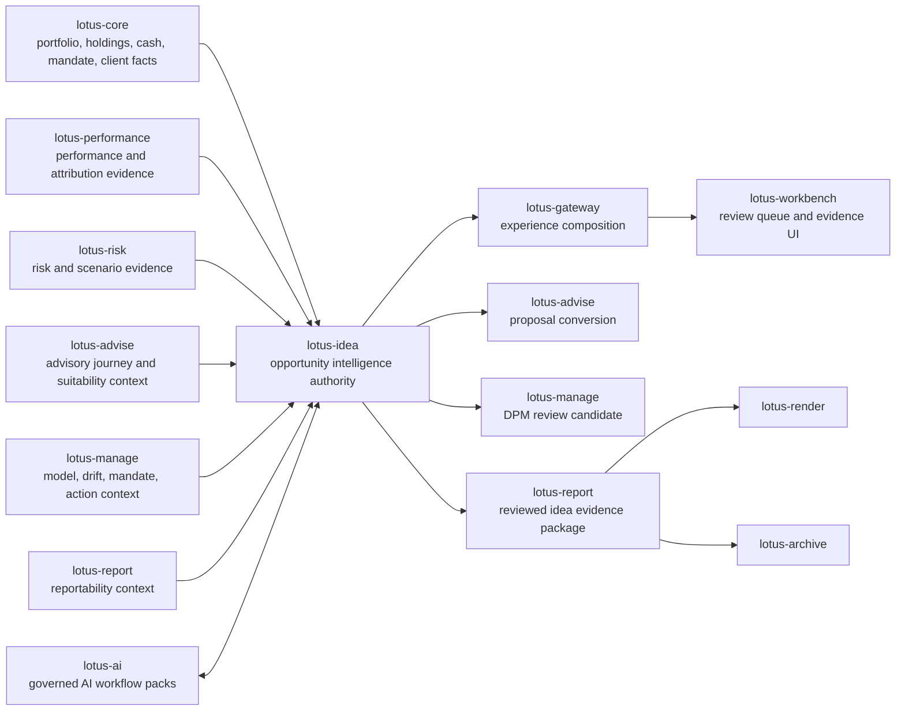

# RFC-0002: Enterprise Opportunity Intelligence Operating Layer

| Metadata | Details |
| --- | --- |
| **Status** | DRAFT - GOLD-STANDARD IMPLEMENTATION PLAN |
| **Created** | 2026-06-21 |
| **Owner** | `lotus-idea` for opportunity intelligence, idea lifecycle, evidence packs, scoring, review posture, feedback, and conversion intent truth |
| **Business Sponsor Persona** | relationship manager, private banker, investment advisor, discretionary portfolio manager, CIO desk, compliance reviewer, model-risk reviewer, operations support, audit, sales/pre-sales, client-demo lead |
| **Primary Business Outcome** | turn source-owned Lotus portfolio, performance, risk, advisory, management, report, and AI evidence into a bank-buyable opportunity intelligence operating layer that helps advisors find, explain, review, and route wealth opportunities without creating autonomous advice or execution |
| **Requires Approval From** | `lotus-idea`, `lotus-core`, `lotus-performance`, `lotus-risk`, `lotus-advise`, `lotus-manage`, `lotus-ai`, `lotus-report`, `lotus-render`, `lotus-archive`, `lotus-gateway`, `lotus-workbench`, and `lotus-platform` maintainers where source, consumer, or platform proof is required |
| **Depends On** | RFC-0001; platform RFC-0067, RFC-0072, RFC-0073, RFC-0084, RFC-0086, RFC-0087, RFC-0089, RFC-0091; current repository engineering contexts for `lotus-core`, `lotus-performance`, `lotus-risk`, `lotus-advise`, `lotus-manage`, `lotus-ai`, `lotus-report`, `lotus-render`, `lotus-archive`, `lotus-gateway`, and `lotus-workbench` |
| **Day-One Engineering Contract** | `lotus-platform/platform-standards/LOTUS_BANK_BUYABLE_ENGINEERING_CONTRACT.md` |
| **Cross-Repository Scope** | `lotus-idea` owns the opportunity product; source services own source facts; `lotus-ai` owns workflow-pack execution; `lotus-gateway` composes; `lotus-workbench` renders; `lotus-advise` and `lotus-manage` realize conversions; `lotus-report`, `lotus-render`, and `lotus-archive` materialize evidence; `lotus-platform` owns reusable governance and mesh automation |
| **Compatibility Posture** | strategic reset allowed. Backward compatibility is not required when a cleaner enterprise contract is the right design. Any breaking route, schema, data-product, or consumer change must update every affected Lotus consumer inside this RFC before capability promotion. |
| **No Second-Wave Rule** | no follow-up RFC, WTBD ledger, or second implementation wave may contain work required for RFC-0002's bank-buyable product claim. Required upstream, downstream, platform, AI, report, archive, Manage, Advise, Workbench, Gateway, docs, CI, security, and data-mesh work belongs in this RFC or the supported claim must be narrowed. Public or thought-leadership communication is not implementation proof and must only describe supported, implementation-backed outcomes. |
| **Implementation Branching Rule** | use one coherent RFC-0002 feature branch or one remote branch per slice; every branch, PR, commit, check, evidence directory, wiki publication commit, and closure state must be recorded in slice evidence |
| **Doc Location** | `docs/rfcs/RFC-0002-enterprise-opportunity-intelligence-operating-layer/RFC-0002-enterprise-opportunity-intelligence-operating-layer.md` |

---

## 0. Executive Summary

Private bankers do not need another alert list. They need a governed operating
layer that can answer:

1. Which client or portfolio needs attention now?
2. Why does the opportunity exist?
3. Which source facts, calculations, and evidence support it?
4. Is the evidence fresh, complete, and supportable?
5. What can the advisor safely say?
6. Should the idea become an advisory proposal, a portfolio-management review, a
   reportable evidence pack, or no action?
7. Can every claim be replayed, audited, and defended?

RFC-0002 defines that product: the **Enterprise Opportunity Intelligence
Operating Layer**.

This RFC is governed from day one by the Lotus bank-buyable engineering
contract. That means the implementation program must treat architecture,
security, dependency hygiene, test quality, data lineage, endpoint
certification, observability, documentation, wiki source, supported-feature
truth, and operating evidence as part of the feature, not late refactoring.

`lotus-idea` is not a generic next-best-action demo, not a chatbot, not a
calculation service, not a suitability engine, and not an order system. It is a
source-backed, deterministic-first, review-gated, AI-assisted opportunity
workflow service.

The core outcomes are:

1. **Opportunity Signal Fabric**
   source-owned signals for high cash, concentration, underperformance, drift,
   maturity, income, volatility, benchmark, risk-profile, and mandate-review
   opportunities.
2. **Idea Evidence Packet**
   a governed packet showing source refs, calculations, supportability, reason
   codes, confidence, freshness, and blocked/missing evidence.
3. **Advisor Opportunity Queue**
   prioritized review queues for advisors, portfolio managers, CIO desks, and
   compliance reviewers.
4. **Human-Governed Review And Feedback**
   review decisions, feedback, suppression, expiry, and conversion state with
   audit history.
5. **Conversion Intent**
   review-gated handoff into `lotus-advise`, `lotus-manage`, `lotus-report`,
   and Workbench workflows without moving downstream authority into
   `lotus-idea`.
6. **Grounded AI Explanation**
   AI-assisted rationale and meeting-preparation drafts through `lotus-ai` only,
   grounded in deterministic evidence and blocked from autonomous advice.
7. **Data-Product And Trust Posture**
   repo-native producer and consumer declarations, trust telemetry, SLO/access
   policies, and platform certification.

This RFC cannot close as "backend done, UI later", "AI prompt done, evidence
later", or "demo claims later". It closes only when the required source
contracts, APIs, Gateway composition, Workbench realization, downstream
conversion, report/render/archive evidence, AI controls, data products,
observability, docs, wiki, supported features, and GitHub gates are
implementation-backed and mainline.

---

## 1. Source-Informed Market Pattern

Public wealth-management and banking material shows a durable market direction:

1. advisor platforms increasingly combine portfolio analytics, risk, models,
   proposal support, advisor insights, and personalized commentary;
2. AI is being used to summarize complex evidence and improve advisor
   productivity, but premium buyers still require human verification, model-risk
   governance, and source-backed controls;
3. the defensible product is not autonomous advice. It is governed opportunity
   intelligence that helps advisors act sooner with better evidence.

External market references used for context:

1. BlackRock Aladdin Wealth public product material and 2025 AI commentary
   launch with Morgan Stanley, describing AI commentary over portfolio analytics
   and client preferences:
   `https://www.blackrock.com/aladdin/products/aladdin-wealth` and
   `https://www.blackrock.com/aladdin/discover/aladdin-wealth-launches-ai-enabled-commentary-tool-at-morgan-stanley`.
2. UBS public advisor AI material describing AI-driven insights that help
   advisors uncover opportunities:
   `https://www.ubs.com/us/en/wealth-management/financial-advisor-experience/articles/ai-for-financial-advisors.html`.
3. MSCI Wealth Management public material for portfolio analytics, risk
   management, stress testing, and investment decision support:
   `https://www.msci.com/data-and-analytics/wealth-management/msci-wealth-manager`.
4. 2026 OCC/Federal Reserve/FDIC revised model-risk guidance, relevant for
   models supporting significant banking business lines:
   `https://www.occ.gov/news-issuances/bulletins/2026/bulletin-2026-13.html`.
5. DBS public AI/ML wealth material describing hyper-personalized nudges and
   connecting research/investment ideas into actionable app flows:
   `https://www.dbs.com/artificial-intelligence-machine-learning/index.html`.
6. Morgan Stanley public AI Debrief material describing advisor-reviewed meeting
   summaries, action items, email drafts, and CRM notes:
   `https://www.morganstanley.com/press-releases/ai-at-morgan-stanley-debrief-launch`.
7. Charles Schwab public Portfolio Insights disclosure describing an AI feature
   that summarizes portfolio day-change drivers, related market news, and
   expert commentary:
   `https://www.schwab.com/legal/portfolio-insights-disclosure`.
8. NIST AI Risk Management Framework material for trustworthy AI risk
   management:
   `https://www.nist.gov/itl/ai-risk-management-framework`.
9. MAS FEAT principles for fairness, ethics, accountability, and transparency in
   financial-sector AI/data analytics:
   `https://www.mas.gov.sg/~/media/MAS/News%20and%20Publications/Monographs%20and%20Information%20Papers/FEAT%20Principles%20Final.pdf`.

These references shape product expectations only. Lotus implementation truth is
the code, contracts, tests, RFCs, platform standards, data-product evidence, and
live validation.

### 1.1 Gold-Standard Internal Patterns Reviewed

RFC-0002 adopts depth from current Lotus RFCs:

1. `lotus-advise/docs/rfcs/RFC-0024-advisor-proposal-memo-and-evidence-pack.md`
   for evidence product, source refs, downstream realization, supported-feature
   discipline, and closure depth.
2. `lotus-advise/docs/rfcs/RFC-0027-governed-advisory-ai-copilot.md` for
   governed AI action boundaries, review posture, unsupported-evidence handling,
   workflow-pack lineage, and no-free-form-prompt behavior.
3. `lotus-risk/docs/rfcs/RFC-0009-enterprise-risk-intelligence-operating-layer.md`
   for product-operating-layer scope, bank-buyable risk/compliance posture,
   market context, and cross-app realization.
4. `lotus-platform/rfcs/RFC-0086-repo-native-domain-product-onboarding-and-federated-rollout.md`
   for repo-native data-product ownership and platform aggregation.

Those patterns are not copied blindly. They set the execution bar for
`lotus-idea`: source-backed evidence, deterministic behavior, AI as assistance,
human review, cross-repo realization, data-mesh posture, live proof, hardening,
and truthful product claims.

---

## 2. Critical Review Of Current Lotus Ecosystem Posture

| Area | Current state | Gap for bank-buyable opportunity intelligence | RFC-0002 direction |
| --- | --- | --- | --- |
| Portfolio facts | `lotus-core` owns source facts, DPM source products, reference data, positions, holdings, cash, mandates, and product/client facts. | Opportunity logic needs source facts without duplicating accounting or master data. | Consume source facts through contracts and carry source provenance on every idea. |
| Performance analytics | `lotus-performance` owns returns, benchmark, attribution, and performance analytics. | Underperformance and attribution opportunities need official performance evidence. | Treat performance signals as source-owned inputs, not recomputed idea logic. |
| Risk analytics | `lotus-risk` owns risk metrics, concentration, scenarios, risk events, and risk evidence. | Risk attention events overlap with opportunity queues. | Risk owns risk calculations and risk signals; `lotus-idea` owns cross-domain opportunity lifecycle and review queue. |
| Advisory workflow | `lotus-advise` owns proposal, suitability, advisory narrative, policy, approval, and client-advice posture. | Opportunity detection before proposal creation does not belong inside proposal workflow. | `lotus-idea` creates reviewed advisory conversion intents; `lotus-advise` owns proposal and suitability realization. |
| Portfolio management | `lotus-manage` owns model portfolios, rebalance, DPM actions, mandates, and action-register proof. | Manage-relevant opportunities need handoff without becoming orders. | `lotus-idea` creates review-gated manage conversion intents; `lotus-manage` owns action lifecycle. |
| AI | `lotus-ai` owns workflow packs, provider abstraction, prompt governance, RAG, evaluation, and supportability. | AI opportunity wording must not become uncontrolled advice. | `lotus-idea` invokes only governed `lotus-ai` workflow packs over bounded evidence. |
| Reporting | `lotus-report`, `lotus-render`, and `lotus-archive` own report package, deterministic rendering, and document lifecycle. | Opportunity evidence must become reportable without moving document ownership. | Publish reviewed evidence packages to report/render/archive contracts. |
| Gateway and UI | `lotus-gateway` composes and `lotus-workbench` renders product surfaces. | Product value needs front-office realization, not hidden backend endpoints. | Gateway and Workbench are same-RFC realization gates before UI/demo claims. |
| Platform governance | `lotus-platform` owns CI lanes, RFC discipline, data-mesh validators, context, and standards. | A new service can drift if scaffold/RFCs are too shallow. | Use platform scaffold, repo-native contracts, mandatory slices, and validation from day one. |

Decision:

1. `lotus-idea` is the owning service for opportunity intelligence and idea
   lifecycle.
2. Source services keep calculation and source-data authority.
3. AI remains an assistive capability, not a decision authority.
4. Gateway and Workbench must consume source-owned idea APIs and must not
   reconstruct idea truth locally.
5. No product/demo claim is promoted until implementation, tests, evidence, and
   supported-feature truth exist.

---

## 3. Business Outcomes

RFC-0002 must deliver these outcomes:

1. **Advisor productivity**
   advisors receive prioritized ideas with source-backed rationale instead of
   manually scanning dashboards.
2. **Client relevance**
   ideas are tied to portfolio, mandate, risk profile, lifecycle event, market
   context, or advisory journey, not generic product pushes.
3. **Governed review**
   every idea has review state, reason codes, supportability, expiry,
   suppression, and feedback.
4. **Cross-domain intelligence**
   performance, risk, core, advice, manage, report, and AI evidence combine
   without duplicating source authority.
5. **Conversion clarity**
   approved ideas can become advisory proposals, DPM review candidates,
   reportable evidence, or no-action outcomes through explicit contracts.
6. **Compliance and model-risk confidence**
   AI, scoring, and ranking are explainable, versioned, tested, bounded, and
   human-governed.
7. **Sales/pre-sales credibility**
   Lotus can demo opportunity intelligence with implementation-backed evidence,
   not aspirational screens.
8. **Operational supportability**
   operators can diagnose stale sources, missing evidence, duplicate ideas,
   conversion failures, AI degradation, and entitlement denials safely.

---

## 4. Non-Goals

RFC-0002 does not:

1. create autonomous investment advice,
2. approve suitability, compliance, mandate, policy, or best-interest outcomes,
3. calculate official risk, performance, attribution, tax, fee, cost, or product
   eligibility values,
4. own client/product master data, holdings, transactions, or account balances,
5. create orders, route trades, contact clients, or operate as CRM,
6. replace `lotus-advise`, `lotus-manage`, `lotus-report`, `lotus-render`,
   `lotus-archive`, `lotus-ai`, `lotus-gateway`, or `lotus-workbench`,
7. expose raw prompts, raw provider responses, unrestricted holdings payloads,
   client names, restricted telemetry paths, or entitlement details in public
   docs, logs, metrics, or screenshots,
8. claim client-ready publication before downstream review and document
   controls are implemented,
9. use a free-form generic chatbot endpoint.

---

## 5. Architecture Direction

### 5.1 Ownership Model

`lotus-idea` owns:

1. idea candidate aggregate,
2. lifecycle and review state,
3. idea evidence packet contract,
4. signal eligibility policy and opportunity taxonomy,
5. deterministic scoring, ranking, suppression, and deduplication,
6. feedback and learning-ready review outcomes,
7. conversion intent and conversion outcome tracking,
8. idea data-product declarations and trust telemetry,
9. idea API contracts and OpenAPI truth.

`lotus-core` owns:

1. portfolio, account, client, household, mandate, product, instrument, holdings,
   cash, and benchmark identity facts,
2. source timestamps, lineage, and data-quality posture for those facts.

`lotus-performance` owns:

1. performance, attribution, benchmark-relative analytics, return periods,
   performance health, and performance source provenance.

`lotus-risk` owns:

1. risk measures, concentration, volatility, drawdown, stress/scenario outputs,
   risk events, methodology refs, and risk evidence.

`lotus-advise` owns:

1. proposals, suitability, best-interest posture, policy evaluation, advisory
   journey state, approvals, consent, and client-advice evidence.

`lotus-manage` owns:

1. model portfolio, drift, rebalance, mandate implementation, action candidates,
   DPM action register, and portfolio-management proof packs.

`lotus-ai` owns:

1. workflow packs, provider execution, prompt/version governance, RAG, model
   evaluation, verifier controls, AI telemetry, and supportability posture.

`lotus-gateway` owns:

1. BFF routing, caller-context propagation, entitlement composition, and
   product-surface contracts without idea generation or ranking.

`lotus-workbench` owns:

1. advisor and PM review surfaces, queue UX, evidence drawers, review actions,
   conversion affordances, and browser proof through Gateway.

`lotus-report`, `lotus-render`, and `lotus-archive` own:

1. report package ingestion, deterministic rendering, archive, retrieval,
   retention, legal hold, and access audit for reviewed idea evidence.

`lotus-platform` owns:

1. scaffold standards, CI lanes, API vocabulary, domain-product schemas,
   certification automation, context, wiki publication, and cross-repo
   governance.

### 5.2 Product Flow

Rules:

1. Workbench must consume Gateway/BFF routes only.
2. Gateway must call `lotus-idea` for idea truth and must not generate ideas.
3. `lotus-idea` must call source-owned APIs/data products and must not read
   other service databases.
4. AI output cannot mutate source evidence, score, lifecycle, suitability,
   compliance, mandate, or execution state.
5. Conversion creates intent and outcome tracking; downstream services own
   realization.

---

## 6. Domain Vocabulary

| Concept | Preferred term | Avoid |
| --- | --- | --- |
| Source signal that may create an idea | opportunity signal | alert, nudge, raw trigger |
| Governed work item | idea candidate | recommendation |
| Evidence bundle | idea evidence packet | explanation blob |
| Advisor queue item | opportunity queue item | notification |
| Deterministic reason | reason code | AI reason |
| Missing source support | unsupported evidence | hallucination in API contracts |
| Human control state | review posture | approval flag |
| Downstream handoff request | conversion intent | action instruction |
| Downstream completion state | conversion outcome | execution result |
| AI drafted wording | AI explanation draft | AI advice |
| Source-owned evidence pointer | source ref | citation alone |
| Evidence and model trace | lineage ref | provider log |

Reason codes must use stable upper snake case and domain-specific names.

---

## 7. Domain Model Direction

### 7.1 Core Aggregates And Value Objects

Initial model candidates:

1. `IdeaCandidate`
2. `OpportunitySignal`
3. `IdeaEvidencePacket`
4. `IdeaSourceRef`
5. `IdeaLineageRef`
6. `IdeaScore`
7. `IdeaRank`
8. `IdeaReviewDecision`
9. `IdeaFeedbackEvent`
10. `IdeaSuppressionDecision`
11. `IdeaConversionIntent`
12. `IdeaConversionOutcome`
13. `IdeaUnsupportedEvidence`
14. `IdeaPolicyVersion`
15. `IdeaExplanationDraft`
16. `IdeaAuditEvent`

Every candidate must carry:

1. stable candidate id,
2. portfolio/client/advisor references where authorized,
3. opportunity family,
4. source refs,
5. as-of date and source freshness,
6. evidence hash,
7. lifecycle state,
8. review posture,
9. score and policy version when scored,
10. expiry and suppression posture,
11. conversion posture,
12. audit lineage.

### 7.2 Lifecycle State

Initial lifecycle candidates:

1. `DETECTED`
2. `GENERATED`
3. `ENRICHED`
4. `SCORED`
5. `GOVERNANCE_CHECKED`
6. `READY_FOR_REVIEW`
7. `REVIEWED_BY_ADVISOR`
8. `APPROVED`
9. `CONVERSION_REQUESTED`
10. `CONVERTED`
11. `ACCEPTED`
12. `REJECTED`
13. `SUPPRESSED`
14. `EXPIRED`
15. `CLOSED`

The implementation may reduce the first supported state set, but it must
explicitly map every transition to audit events and unsupported transition
errors.

### 7.3 Review Actions

Initial review actions:

1. `APPROVE_FOR_ADVISOR_USE`
2. `APPROVE_FOR_ADVISORY_CONVERSION`
3. `APPROVE_FOR_MANAGE_REVIEW`
4. `REQUEST_MORE_EVIDENCE`
5. `REJECT`
6. `SUPPRESS`
7. `SNOOZE`
8. `EXPIRE`
9. `MARK_DUPLICATE`
10. `ESCALATE_TO_COMPLIANCE`

No review action can approve suitability, compliance, mandate, product
eligibility, client-ready publication, order execution, or client contact.

---

## 8. Initial Opportunity Families

| Opportunity family | Source authority | Initial business meaning | First support posture |
| --- | --- | --- | --- |
| High cash or idle liquidity | `lotus-core`; optional `lotus-manage` and `lotus-advise` context | Cash balance appears materially above mandate, model, or client objective context. | Planned |
| Concentration review | `lotus-risk`; `lotus-core` issuer/holding refs | Portfolio has concentration, issuer, sector, country, or product exposure requiring review. | Planned |
| Benchmark underperformance | `lotus-performance`; benchmark identity from `lotus-core` | Portfolio or sleeve underperforms relevant benchmark or target over a governed period. | Planned |
| Allocation drift | `lotus-manage`; source holdings from `lotus-core` | Allocation deviates from model, mandate, or target band. | Planned |
| Bond maturity or reinvestment | `lotus-core`; optional `lotus-manage` context | Fixed-income maturity creates reinvestment or liquidity review need. | Planned |
| Low income yield | `lotus-performance`; holdings from `lotus-core` | Income output appears below target, objective, or comparable mandate context. | Planned |
| High volatility or drawdown | `lotus-risk`; returns from `lotus-performance` | Risk profile or realized risk calls for review. | Planned |
| Missing benchmark | `lotus-core`; `lotus-performance` dependency | Portfolio lacks benchmark identity required for meaningful analytics. | Planned |
| Missing or stale risk profile | `lotus-advise`; client facts from `lotus-core` | Advice or review is blocked because risk profile is missing, stale, or incompatible. | Planned |
| Mandate or restriction review | `lotus-core`; `lotus-manage`; `lotus-advise` | Mandate, restriction, or suitability context blocks or changes actionability. | Planned |

Every family must have:

1. source owner,
2. eligibility policy,
3. source refs,
4. reason codes,
5. freshness policy,
6. score inputs,
7. unsupported-evidence behavior,
8. review and conversion path,
9. tests and endpoint certification.

---

## 9. Data Products And Mesh Posture

`lotus-idea` must be a first-class Lotus data product producer, not an API-only
workflow service with decorative metadata. Every promoted producer product must
have an implemented owner contract, source authority, schema validation, runtime
trust telemetry, freshness and completeness posture, access policy, SLO,
consumer contract, lineage, certification evidence, support runbook, and
supported-feature entry before it can be called active.

Data mesh promotion is blocked unless the product is discoverable through the
platform catalog, consumable through certified APIs, observable in runtime
telemetry, and proven by at least one real consumer or an explicit no-consumer
decision. If a producer or consumer contract changes, all affected downstream
Lotus services must be updated inside RFC-0002 before the capability is
promoted. Backward compatibility is not a constraint when a cleaner enterprise
contract is the right design; complete consumer alignment is the constraint.

### 9.1 Consumer Products

`lotus-idea` consumes:

1. `CorePortfolioFactSnapshot` or current equivalent from `lotus-core`,
2. `CoreHoldingAndCashSnapshot` or current equivalent from `lotus-core`,
3. `PerformanceHealthSignal` or current equivalent from `lotus-performance`,
4. `RiskAttentionSignal` or current equivalent from `lotus-risk`,
5. `AdvisoryJourneyContext` or current equivalent from `lotus-advise`,
6. `ManageActionContext` or current equivalent from `lotus-manage`,
7. `ReportabilityContext` or current equivalent from `lotus-report`,
8. `AIWorkflowResult` or current equivalent from `lotus-ai`.

Exact product names must be reconciled in Slice 0 and Slice 4 with existing
repo-native declarations.

### 9.2 Producer Products

Candidate producer products:

| Product | Purpose | Initial support posture |
| --- | --- | --- |
| `OpportunitySignalCandidate:v1` | source-authority clean signal candidate before portfolio/advisor review workflow creation | Proposed |
| `IdeaCandidate:v1` | governed candidate idea with lifecycle, source refs, score policy, suppression posture, and review state | Proposed |
| `IdeaEvidencePacket:v1` | source-backed evidence, reason codes, freshness, score, review posture, and lineage | Proposed |
| `AdvisorOpportunityQueue:v1` | prioritized review queue projection | Proposed |
| `IdeaReviewDecision:v1` | human review approval, rejection, snooze, suppression, expiry, and no-action lifecycle evidence | Proposed |
| `IdeaFeedbackEvent:v1` | advisor/PM/compliance feedback, signal-quality annotation, and learning-control evidence | Proposed |
| `IdeaConversionIntent:v1` | reviewed downstream handoff request | Proposed |
| `IdeaConversionOutcome:v1` | downstream acceptance, rejection, completion, or failure status | Proposed |
| `IdeaTrustTelemetry:v1` | supportability, freshness, quality, and certification posture | Proposed |

No producer product may be promoted until schema, validation, trust telemetry,
SLO/access/evidence policy, catalog/certification, and supportability docs are
implementation-backed.

---

## 10. API And Contract Direction

Potential route families:

1. `/idea/candidates`
2. `/idea/signals`
3. `/idea/evidence-packets`
4. `/idea/review-queues`
5. `/idea/review-decisions`
6. `/idea/feedback`
7. `/idea/scoring-policies`
8. `/idea/explanations`
9. `/idea/conversion-intents`
10. `/idea/conversion-outcomes`
11. `/idea/supportability`

API requirements:

1. canonical route names and DTO vocabulary,
2. no alias routes unless explicitly justified and time-boxed,
3. idempotency keys for create, replay, review, and conversion operations,
4. stable error model with problem details,
5. correlation id propagation,
6. source refs and lineage refs in responses,
7. degraded and unsupported-evidence examples,
8. entitlement failure examples,
9. complete OpenAPI descriptions and examples,
10. endpoint certification before supported-feature promotion.

---

## 11. AI And Model-Risk Direction

AI is allowed only as assistive, review-gated behavior.

Allowed AI actions:

1. draft advisor-facing rationale from an evidence packet,
2. summarize source evidence,
3. identify missing evidence,
4. improve plain-language reason-code wording,
5. draft meeting-preparation notes for internal advisor review,
6. run unsupported-claim or source-grounding checks through approved workflow
   packs.

Disallowed AI actions:

1. final investment recommendation,
2. final suitability or compliance decision,
3. product eligibility approval,
4. mandate approval,
5. trade or order instruction,
6. client communication without human review,
7. ungrounded product push,
8. direct provider call from `lotus-idea`,
9. free-form generic prompt endpoint.

Model-risk controls:

1. deterministic fallback when AI is unavailable,
2. prompt/input redaction,
3. no raw prompt or raw provider response in public projections,
4. workflow-pack version and evaluation refs,
5. verifier results where applicable,
6. unsupported-claim blocking,
7. review posture,
8. approved and prohibited use documentation,
9. retention and replay posture.

---

## 12. Observability And Operations

Operational diagnostics must cover:

1. source dependency readiness,
2. signal ingestion readiness,
3. candidate generation readiness,
4. scoring/ranking readiness,
5. AI workflow readiness,
6. review queue readiness,
7. downstream conversion readiness,
8. report/render/archive handoff readiness,
9. data-product/trust telemetry posture,
10. degraded dependency summaries.

Minimum metrics:

1. signals evaluated,
2. candidates generated,
3. candidates rejected,
4. queue size by opportunity family and status,
5. score distribution,
6. review time,
7. approval/rejection/suppression rates,
8. conversion attempts and outcomes,
9. stale evidence count,
10. unsupported-evidence count,
11. AI calls, verifier failures, and deterministic fallback count,
12. endpoint latency and error rates.

Metric labels must not include client, portfolio, security, prompt, raw
correlation id, trace id, request body, or response body values.

Runbooks must cover:

1. upstream source unavailable,
2. stale evidence,
3. duplicate idea burst,
4. scoring policy disabled,
5. review queue backlog,
6. entitlement denial,
7. idempotency conflict,
8. AI unavailable,
9. unsupported AI output,
10. conversion rejected by downstream service,
11. report/archive handoff failure,
12. replay hash mismatch.

---

## 13. Security, Privacy, And Compliance Controls

Required controls:

1. fail-closed caller context and entitlement checks through Gateway and direct
   service access,
2. advisor/PM/compliance/operator role separation,
3. portfolio/client/book access enforcement,
4. sensitive source evidence redaction by projection,
5. no secrets, client-sensitive payloads, prompts, provider responses, or
   entitlement details in logs/metrics/docs/screenshots,
6. audit event for every lifecycle, review, suppression, AI explanation, and
   conversion action,
7. dependency and container vulnerability review,
8. injection and malformed payload tests,
9. cross-tenant/book denial tests,
10. retention and deletion posture for idea evidence and AI artifacts,
11. formal treatment for accepted vulnerabilities.

---

## 14. Test Strategy

Required test layers:

1. pure domain lifecycle and transition tests,
2. opportunity family eligibility tests,
3. source-authority mapping tests,
4. contract schema tests,
5. idempotency and replay tests,
6. scoring/ranking stability tests,
7. suppression and deduplication tests,
8. review and feedback tests,
9. conversion intent and downstream failure tests,
10. AI grounding, redaction, unsupported-claim, and fallback tests,
11. API/OpenAPI certification tests,
12. data-product and trust telemetry tests,
13. Gateway contract tests,
14. Workbench component/browser/accessibility tests,
15. report/render/archive materialization tests,
16. observability and no-sensitive-label tests,
17. canonical and portfolio-archetype live validation.

High-value scenarios:

1. high cash above mandate threshold becomes advisory review idea;
2. concentration breach becomes PM and advisor queue item;
3. benchmark underperformance with stale benchmark blocks positive claim;
4. allocation drift creates manage conversion intent after review;
5. bond maturity creates reinvestment opportunity with source refs;
6. missing risk profile blocks advisory conversion;
7. duplicate signal replays without duplicate candidate;
8. AI unavailable returns deterministic explanation fallback;
9. AI draft attempts unsupported advice and is rejected;
10. reviewed idea is rendered into a report evidence pack.

Snapshot-only text tests are insufficient unless paired with structured evidence
assertions.

---

## 15. Implementation Slice Plan

| Slice | Name | Status | Evidence expectation |
| --- | --- | --- | --- |
| 0 | Critical review, source map, and product gap allocation | Completed - implementation baseline recorded | source map, overlap decisions, open questions, branch/state baseline |
| 1 | Platform automation and scaffolding review | Implemented - platform scaffold wiki baseline verified | scaffold gap ledger, platform scaffold evidence, explicit no-change decisions |
| 2 | Cleanup, structure, and current surface normalization | Partially implemented - runtime composition providers normalized and architecture-boundary enforcement retained | dead-code/doc-sprawl cleanup, module boundaries, vocabulary baseline, runtime composition boundary proof |
| 3 | Opportunity domain model, vocabulary, and lifecycle | Implemented - pure domain foundation only | pure domain model, lifecycle tests, unsupported transition behavior |
| 4 | Source authority, signal contracts, and data mesh baseline | Partially implemented - repo-native mesh contract gate enforced | consumer/producer contracts, source authority tests, blocked telemetry posture, optional platform catalog/source-manifest reconciliation |
| 5 | Deterministic signal evaluation and candidate generation | Partially implemented - high-cash domain policy plus Core source-port, manifest-backed run-once ingestion worker foundation, scheduled-worker deploy-contract proof, and aggregate-only operator run-once API | first signal families, candidate generation, golden scenario tests, Core source-port orchestration, bounded run-once ingestion worker semantics, manifest-backed worker check-only contract, scheduled-worker entrypoint/Compose proof, and protected service-boundary run-once execution |
| 6 | Persistence, replay, idempotency, and audit | Partially implemented - internal persistence plus certified evidence replay API, schema, rollback, migration execution, PostgreSQL adapter, opt-in API repository wiring, first PostgreSQL runtime workflow proof, source-safe durable repository proof artifact, source-ingestion replay/conflict recovery proof, manifest-backed run-once ingestion worker CLI/check, scheduled-worker deploy-contract proof, aggregate-only source-ingestion run-once operator action, source-safe outbox publisher adapter foundation, repo-owned outbox event and downstream consumer contracts, certified outbox delivery readiness diagnostic and run-once operator action, bounded outbox broker proof artifact, bounded downstream consumer runtime proof artifact, bounded outbox platform mesh event publication proof artifact, and migration rollback/reapply recovery proof | internal records, hashes, replay posture, audit events, idempotent high-cash persist, candidate evidence replay, and lifecycle transition orchestration, schema/rollback contract, migration dry-run and execution CLI, tested PostgreSQL repository adapter, opt-in API provider selection through `LOTUS_IDEA_DATABASE_URL`, real PostgreSQL persistence/replay proof for the high-cash persist API plus the first review/feedback/conversion/report workflow path, source-safe durable repository proof artifact for aggregate readiness evidence, internal source-ingestion replay/conflict recovery proof, manifest-backed run-once source-ingestion worker CLI/check, scheduled-worker entrypoint/Compose proof artifact, durable-repository-only source-ingestion run-once API, internal outbox retry/dead-letter delivery state, HTTP publisher adapter foundation, repo-owned outbox event contract validated by `make outbox-event-contract-gate`, repo-owned downstream consumer contract validated by `make outbox-consumer-contract-gate`, certified aggregate outbox delivery readiness diagnostic, certified aggregate-only outbox delivery run-once operator action, source-safe outbox broker proof artifact, bounded downstream consumer runtime proof artifact, bounded outbox platform mesh event publication proof artifact, and real PostgreSQL schema rollback/reapply recovery proof; production storage certification, live source certification, certified long-running scheduled runtime, certified external broker publication, downstream delivery, and supported promotion remain planned |
| 7 | Scoring, ranking, suppression, and queue policy | Partially implemented - deterministic scoring plus certified advisor queue API foundation only | deterministic score inputs/policy, reason codes, stable queue projection, snapshot orchestration, snooze/suppression/dedupe tests, advisor queue API proof; durable queue state remains planned |
| 8 | Review queues, feedback, and human governance | Partially implemented - internal advisor review/feedback governance plus certified API foundations only | advisor review actions, feedback model, entitlement tests, idempotent repository persistence, audit proof, review/feedback API proof, first PostgreSQL-backed review/feedback workflow proof; PM/compliance/operator surfaces, Gateway/Workbench, mesh certification, and supported promotion remain planned |
| 9 | Governed AI explanation and model-risk controls | Partially implemented - internal AI governance, certified API foundation, source-safe lineage persistence, and not-certified readiness diagnostic | redacted AI request envelopes, fallback/verifier API, source-safe lineage record, safe audit, no-authority proof; `lotus-ai` runtime execution and certified model-risk operations remain planned |
| 10 | Certified APIs, OpenAPI, and Gateway contract | Partially implemented - certified internal API foundations plus bounded read-only Gateway publication for advisor queue and candidate detail | high-cash evaluate/evaluate-and-persist, lifecycle transition, candidate detail, candidate evidence replay, AI explanation, advisor queue, review-action, feedback, conversion intent/outcome, report evidence-pack, downstream-realization readiness, data-mesh readiness, source-ingestion readiness/run-once, and outbox delivery readiness/run-once endpoints; first read-only Gateway publication exists for queue/detail |
| 11 | Workbench product realization | Partially implemented - bounded Workbench read-only advisor queue/detail rendering exists; full live proof and support remain pending | review queue UI foundation, source-safe detail panel, browser/live-validation hardening, and remaining mutation/accessibility/entitlement-denied proof |
| 12 | Advise and Manage conversion realization | Partially implemented - internal conversion governance, certified API foundation, source-safe downstream submission API, application orchestration and adapter foundations, downstream readiness blocker diagnostic, governed contract-plan gate, and bounded Advise/Manage route-foundation proof consumption | review-gated conversion intents/outcomes, source-authority mapping, certified internal conversion API proof, first PostgreSQL-backed report conversion intent/outcome proof, no downstream authority proof, source-safe Advise/Manage submission route, orchestration and handoff envelopes, manifest-backed downstream readiness blocker reporting, `make downstream-realization-contract-gate`, and `make downstream-route-contract-proof-gate`; suitability/rebalance authority, downstream execution, and supported product proof remain planned |
| 13 | Report, Render, Archive, and evidence-pack materialization | Partially implemented - internal report evidence-pack request foundation, source-safe downstream submission API, application orchestration and adapter foundation, downstream readiness blocker diagnostic, and governed contract-plan gate | certified internal request API, source summaries, retention refs, idempotency/audit proof, first PostgreSQL-backed internal request proof, source-safe Report evidence-pack request submission route, orchestration and handoff envelope, manifest-backed Report/Render/Archive blocker reporting, and `make downstream-realization-contract-gate`; downstream materialization remains planned |
| 14 | Data-product promotion, trust telemetry, and platform hardening | Partially implemented - internal not-certified mesh readiness, runtime telemetry preview, API-certified runtime snapshot diagnostic, generated source-safe runtime snapshot evidence, and runtime telemetry proof contract | repo-native declarations, readiness diagnostic, runtime telemetry preview, runtime snapshot endpoint, generated runtime snapshot, runtime telemetry proof contract, blocked static trust telemetry, SLO/access/evidence policies; product promotion remains planned |
| 15 | Observability, security, entitlements, and operations | Partially implemented - bounded operation events plus readiness diagnostics, scheduled-worker proof posture, and source/outbox delivery run-once operator eventing | operation-event metric/log vocabulary, no-sensitive-label proof, endpoint instrumentation including candidate evidence replay, source-ingestion run-once, scheduled-worker proof validity, downstream submission, downstream-realization readiness, source-ingestion readiness, outbox-delivery readiness/run-once, advisor-queue readiness, AI explanation readiness, data-mesh readiness, and aggregate implementation-proof readiness diagnostics; broader runbooks, certified long-running scheduling proof, and production telemetry remain planned |
| 16 | Demo readiness, archetype scenarios, and commercial proof | Partially implemented - proof-readiness diagnostic available; demo claims remain blocked | demo claim ledger and aggregate proof-readiness diagnostic now identify blockers; canonical scenarios, RFP-safe wording, and demo guide remain planned until live evidence exists |
| 17 | Implementation proof and live validation | Partially implemented - aggregate proof-readiness diagnostic and repo-native artifact generation include bounded live-source ingestion proof, scheduled-worker deploy-proof consumption, durable repository proof consumption, runtime trust telemetry proof consumption, Workbench read-path proof consumption, Gateway/Workbench operational proof consumption, Gateway/Workbench discovery proof consumption, bounded outbox broker proof consumption, default Advise proposal route proof consumption, default Manage action route proof consumption, default Report intake route proof consumption, default platform mesh onboarding proof consumption, AI lineage store proof consumption, and AI workflow-pack registration/runtime execution proof consumption; full live journey proof remains pending | machine-readable proof blocker index exists through certified operator API and `make implementation-proof-readiness-check`, including source-safe bounded live-source, scheduled-worker deploy-proof artifact generation/consumption, durable repository proof artifact generation/consumption, runtime telemetry proof artifact generation/consumption, Workbench read-path proof artifact generation/consumption, Gateway/Workbench operational proof artifact generation/consumption, Gateway/Workbench discovery proof artifact generation/consumption, outbox broker proof artifact generation/consumption, Advise proposal route proof artifact generation/consumption, Manage action route proof artifact generation/consumption, Report intake route proof artifact generation/consumption, platform mesh onboarding proof artifact generation/consumption, AI lineage store proof artifact generation/consumption, and AI workflow-pack registration/runtime execution proof artifact generation/consumption; live canonical end-to-end evidence and critical result review remain planned |
| 18 | Documentation, wiki, support, and agent context | Partially implemented - API certification, implementation-proof, live-source, scheduled-worker, durable repository proof, runtime trust telemetry proof, Workbench read-path proof, downstream route proof, outbox broker proof, AI lineage store proof, AI workflow-pack proof, and outbox delivery documentation synchronized | README/wiki/context/runbook updates, API certification guide, implementation-proof-readiness guide, downstream-realization guide, persistence guide, source-ingestion runbook, scheduled-worker proof boundaries, durable repository proof boundary, runtime telemetry proof boundary, Workbench read-path proof boundary, Advise/Manage/Report route proof boundaries, outbox broker proof boundary, AI lineage store proof boundary, AI workflow-pack registration/runtime execution proof boundary, outbox delivery boundaries, client-demo process, and wiki source updates; wiki check-only remains required before merge |
| 19 | Second-last hardening and review | Partially implemented - quality scorecard truth gate enforced | code/API/security/data-mesh/docs review and fixes remain before closure |
| 20 | Final closure and branch hygiene | Planned | mainline truth, CI proof, wiki publish, branch cleanup, no stranded truth |
| 21 | Post-completion communication and LinkedIn draft | Planned | implementation-backed post-completion communication draft or explicit no-post decision |

Every completed slice must receive a review pass before the next slice begins.

---

## 16. Supported-Features Ledger

Supported-feature material is product truth. It must not describe RFC-0002 target
state as current support until promotion evidence is linked.

| Capability | Product owner | Initial RFC state | Required product surfaces | Promotion evidence |
| --- | --- | --- | --- | --- |
| Idea candidate lifecycle | `lotus-idea` | Gated foundation | API, persistence, audit, endpoint certification | lifecycle model, tests, OpenAPI, replay, supported-feature update |
| Opportunity signal ingestion | `lotus-idea` plus source owners | Proposed | source contracts, ingestion jobs/APIs, data products | source refs, freshness, idempotency, contract tests, mesh certification |
| Idea evidence packet | `lotus-idea` | Proposed | API, data-product declaration, trust telemetry | deterministic packet, redaction, lineage, replay, data-product posture |
| Advisor opportunity queue | `lotus-idea`, `lotus-gateway`, `lotus-workbench` | Gated foundation | queue API, bounded read-only Gateway route, Workbench panel | browser proof, Workbench entitlement proof, unsupported/degraded states |
| Scoring and ranking | `lotus-idea` | Gated foundation | scoring policy, rank API/projection | golden examples, score versioning, stability, supportability |
| AI explanation draft | `lotus-idea`, `lotus-ai` | Gated | workflow pack, explanation API, review state | redaction, fallback, verifier, no-autonomous-advice proof |
| Review and feedback | `lotus-idea` | Gated foundation | review API, audit, feedback data product | role tests, audit events, feedback validation, queue update proof |
| Advisory conversion | `lotus-idea`, `lotus-advise` | Proposed | conversion intent, Advise acceptance path | review gate, contract tests, no suitability ownership leakage |
| Manage conversion | `lotus-idea`, `lotus-manage` | Proposed | conversion intent, Manage review/action candidate | no-order/no-client-contact proof, idempotency, outcome tracking |
| Reportable idea evidence | `lotus-idea`, `lotus-report`, `lotus-render`, `lotus-archive` | Proposed | report package, render template, archive metadata | deterministic render, archive access audit, reviewed evidence gate |
| Demo-ready opportunity journey | all participating repos | Gated | Gateway, Workbench, APIs, evidence, docs/wiki | canonical proof, live validation, claim ledger, supported-feature truth |

---

## 17. Documentation Requirements

Create or update:

1. source map and product-gap allocation,
2. opportunity domain model guide,
3. signal family methodology guide,
4. source authority and mesh contracts,
5. scoring and ranking methodology,
6. AI explanation and model-risk guide,
7. review queue and feedback guide,
8. conversion integration guide,
9. report/render/archive evidence-pack guide,
10. operations runbook,
11. endpoint certification ledger,
12. supported features,
13. README and repo context,
14. wiki source,
15. commercial/demo material only after implementation proof,
16. platform context or skills when reusable Lotus guidance changes.

Documentation quality bar:

1. final docs must describe actual implemented behavior, constraints, endpoints,
   payload fields, proof artifacts, and unsupported states, not generic RFC
   intent;
2. every endpoint page must cover request, response, examples, errors,
   degraded behavior, entitlement, idempotency, supportability, and consumers,
   with examples verified against implemented API behavior;
3. wiki pages must summarize and route to source docs rather than duplicating
   long technical content;
4. commercial/demo language must trace to supported features and live evidence;
5. no final docs may rely on aspirational RFC text as proof;
6. supported-features entries must be implementation-backed product material
   with explicit unsupported and gated scope.

---

## 18. Slice 0 Decisions

Slice 0 resolves the implementation-start questions in
`RFC-0002-slice-00-critical-review-source-map-and-product-gap-allocation.md`.
The decisions are:

1. exact repo-native product names and contract paths are recorded in the Slice
   0 source-authority map and governed by the platform domain-product catalog;
2. first opportunity family is high cash / idle liquidity;
3. implementation starts with pure domain models, then synchronous database
   persistence in Slice 6; Slice 6 now has source-safe outbox records,
   internal retry/dead-letter delivery state, and an HTTP publisher adapter
   foundation, while certified event publication still requires live broker
   runtime and downstream consumer proof;
4. first supported review audience is advisor only;
5. initial rank policy is deterministic and policy-versioned, based on source
   supportability, materiality, freshness, review urgency,
   duplication/suppression posture, and evidence completeness;
6. automatic expiry applies to stale, superseded, unsupported, duplicate, and
   time-window-sensitive evidence; advisor rejection, no-action, suppression,
   and abandoned conversion require manual closure or explicit workflow action;
7. first downstream conversion path is report-only evidence after advisor
   review; Advise and Manage conversion remain planned until later acceptance
   contracts are implemented;
8. canonical demo portfolio is `PB_SG_GLOBAL_BAL_001`;
9. first AI posture is missing-evidence checking and unsupported-claim
   verification before rationale drafting;
10. no platform scaffold gap blocks Slice 3, but later slices must update
    `lotus-platform` automation when implementation exposes reusable gaps.

No open question may remain at final closure.

---

## 19. No-WTBD Execution Rule

RFC-0002 is the execution source for the opportunity intelligence operating
layer. New WTBD records must not be created for core RFC-0002 scope.

If implementation discovers required upstream, downstream, platform, UI, AI,
report, archive, security, documentation, data-product, or operational work, it
must be added to this RFC as:

1. a slice,
2. a source-map row,
3. an owner-repository PR,
4. an acceptance criterion,
5. an explicit blocked state, or
6. a removed unsupported claim.

Closure cannot rely on an unimplemented WTBD, side ledger, follow-up RFC, second
wave, or unmerged branch.

---

## 20. Completion Criteria

RFC-0002 is implemented only when:

1. `OpportunitySignalCandidate:v1`, `IdeaCandidate:v1`, and
   `IdeaEvidencePacket:v1` are implemented, tested, certified, and governed or
   explicitly narrowed;
2. first-wave opportunity families are source-backed and source-authority clean;
3. candidate lifecycle, persistence, replay, idempotency, scoring, ranking,
   review, feedback, suppression, and audit are implemented;
4. AI explanation is deterministic-fallback capable, guardrailed, reviewed,
   observable, and source-grounded;
5. Gateway and Workbench expose supported idea value through canonical routes;
6. Advise and Manage conversion paths preserve downstream authority;
7. report/render/archive materialization works for reviewed idea evidence where
   claimed;
8. data-product declarations, trust telemetry, SLO/access/evidence policies,
   and platform catalog/certification are aligned;
9. OpenAPI, vocabulary, no-alias, observability, security, privacy, dependency,
   Docker, production guardrail, and CI gates pass;
10. canonical and portfolio-archetype live evidence exists and is critically
    reviewed;
11. README, wiki, supported-features, docs, repo context, and platform context
    are truthful;
12. Feature Lane, PR Merge Gate, Main Releasability Gate, and required
    cross-repo proof are green;
13. wiki is published after merge if source changed;
14. local and remote branch hygiene is clean;
15. no required follow-up RFC, WTBD dependency, side ledger, or unmerged branch
    contains unique durable truth needed for the supported product claim;
16. skills, guidance, documentation, and agent context have been consciously
    reviewed and either updated or recorded as no-change;
17. post-completion communication has either been drafted from supported,
    implementation-backed outcomes through the Lotus thought-leadership process
    or explicitly deferred/skipped with rationale.

---

## 21. Risks And Mitigations

| Risk | Mitigation |
| --- | --- |
| `lotus-idea` becomes a generic alert service | Require source refs, lifecycle, evidence packets, scoring policy, review state, and conversion outcome before support. |
| Opportunity logic duplicates source calculations | Source-authority map, contract tests, and no-recompute review in every signal family. |
| Risk overlap creates two competing queues | `lotus-risk` owns risk analytics/events; `lotus-idea` owns cross-domain opportunity lifecycle and review orchestration. |
| Advise or Manage ownership leaks into `lotus-idea` | Conversion intent only; downstream services own proposal/suitability/action realization. |
| AI creates advice or product push | Evidence-packet-only workflow packs, forbidden-action tests, fallback, review posture, and no free-form prompt endpoint. |
| UI reconstructs idea facts | Gateway/Workbench consume canonical idea APIs; browser and contract tests prove no local inference. |
| Data-product claims are decorative | Producer/consumer declarations, trust telemetry, SLO/access/evidence policies, and platform certification block promotion. |
| Documentation overclaims demo readiness | Supported-feature registry, demo claim ledger, wiki check, and proof review gate every claim. |
| Scope becomes too broad | Slice plan, source-map decisions, no-second-wave rule, and narrowing unsupported claims when needed. |
| Durable truth remains stranded | Stranded-truth reconciliation before implementation, before closure, and before moving to next RFC. |

---

## 22. Delivery Governance And CI

Implementation must:

1. create or continue the active RFC-0002 feature branch,
2. keep commits small, meaningful, and truthful,
3. run repository-native local checks before pushing,
4. use GitHub Feature Lane, PR Merge Gate, and Main Releasability Gate,
5. monitor failing checks and fix forward,
6. run affected cross-repo gates where source or consumer contracts change,
7. record repository, branch, PR number, commit SHA, check name, status, and
   remediation note for failures,
8. run stranded-truth reconciliation before implementation start, final closure,
   and moving to the next RFC,
9. merge required owner-repo changes to `main`,
10. delete completed feature branches,
11. publish wiki after merge when wiki source changed.
