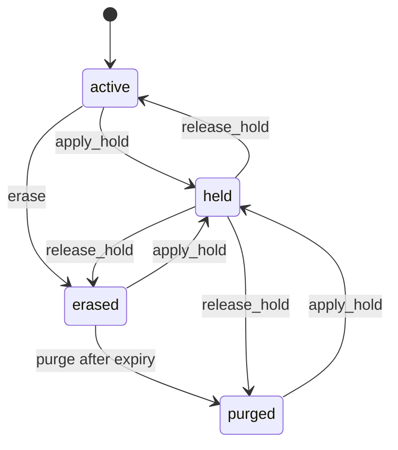

# Data Lifecycle Operations

## Purpose And Current Status

This runbook governs Lotus Idea's local retention, legal-hold, erasure, and
purge controls for Idea-owned records. The workflow is implemented against
PostgreSQL and remains **not certified** pending bank policy approval and
cross-service proof from Report, Archive, and AI owners.

Lotus Idea enforces approved decisions; it does not decide legal obligations,
privacy rights, Archive retention, Report policy, or AI-provider deletion.
There is no automatic physical deletion. Operators must preview every action
and retain the external authority decision.

## Ownership Boundary

| Decision or record | Authority | Lotus Idea responsibility |
| --- | --- | --- |
| Local candidate and evidence state | `lotus-idea` | Enforce hold, redaction, tombstone, purge, replay, and audit controls. |
| Retention duration approval | Bank records and privacy governance | Consume a versioned approved policy; never infer duration from a request. |
| Legal hold | Bank legal and records governance | Validate the authority reference and prevent erasure or purge while held. |
| Subject erasure | Bank privacy governance | Validate the authority reference, tenant scope, and dual authorization. |
| Report and Archive records | `lotus-report`, `lotus-archive` | Preserve local references; do not claim rendering or archive authority. |
| AI provider retention | `lotus-ai` and the approved provider owner | Redact local lineage; require external deletion confirmation for certification. |

Idea-local AI lineage retains only governed identifiers, output-integrity
digest/version, bounded posture, and audit metadata under the seven-year
regulated-advisory policy. It does not retain raw prompts or unrestricted
provider output. Migration `010` marks pre-integrity rows as unverifiable;
legal hold preserves that honest posture rather than upgrading it to proof.

The machine-readable inventory is
[`contracts/operations/lotus-idea-data-lifecycle.v1.json`](../../contracts/operations/lotus-idea-data-lifecycle.v1.json).
It defines retention policies, field-classification profiles, residency,
redaction behavior, and certification blockers for every migrated table.

## State Model



`held_from_state` preserves the effective state. A hold always overrides
expiry, erasure, and purge. Erasure redacts payloads and pseudonymizes actors;
it does not delete regulated tombstones. Purge removes only policy-approved,
expired payload rows and retains control and operation audit.

## Authorization Contract

Use `POST /api/v1/data-lifecycle/candidates/{candidateId}/actions` with:

| Input | Requirement |
| --- | --- |
| Caller role | `privacy_officer` or `records_manager` |
| Capability | `idea.data-lifecycle.manage` |
| Tenant | Request `tenantId` must exactly match trusted caller entitlements. |
| Idempotency | A stable `Idempotency-Key`; changed content returns conflict. |
| Audit lineage | Middleware-issued or sanitized correlation and trace identifiers persist with the operation. |
| Authority | Legal/records authority for hold actions; privacy authority for erase/purge. Production-like profiles require the matching signed `authorityDecision`. |
| Dual authorization | Distinct approver for release, erase, and purge. |
| Preview | Set `dryRun=true` before an applied action. |

Production-like profiles also require trusted ingress provenance. Do not place
client names, portfolio identifiers, free-form case narratives, or raw legal
documents in request references, logs, metrics, or evidence artifacts.

### Signed Decision Verification

For `demo`, `staging`, and `production`, configure:

| Setting | Purpose |
| --- | --- |
| `LOTUS_IDEA_LIFECYCLE_AUTHORITY_BASE_URL` | Bank-controlled lifecycle-authority key source. |
| `LOTUS_IDEA_LIFECYCLE_AUTHORITY_TIMEOUT_SECONDS` | Bounded key-discovery timeout; greater than zero and at most 10 seconds. |

The request's `authorityDecision` must be an approved, unexpired
`lotus.lifecycle-authority-decision.v1` envelope for audience `lotus-idea`.
Its tenant, candidate, action, authority domain/reference, and change reference
must exactly match the requested operation. Keys are read only from
`/.well-known/lotus-lifecycle-authority-keys`; redirects, unknown/revoked keys,
rotation mismatch, invalid Ed25519 signatures, and stale claims fail closed.

Dry-run verification does not reserve the external decision. An applied
operation persists the decision ID, replay nonce, key identity, rotation epoch,
and verification time. Exact same-key retries replay. Reuse with a different
idempotency key returns `lifecycle_authority_replay_conflict` and must be
investigated as a duplicate or replay attempt.

## Controlled Procedure

1. Confirm the external decision is approved and its reference follows the
   governed authority namespace.
2. Verify lifecycle posture through the runtime trust telemetry preview.
3. Submit the intended action with `dryRun=true` and a unique idempotency key.
4. Resolve every blocker. Do not bypass active delivery, hold, tenant,
   retention, authority, or dual-authorization failures.
5. Submit the same governed decision with `dryRun=false` and a new action key.
6. Retry the identical request after interruption; matching requests replay.
   Never reuse a key for changed content.
7. Verify aggregate telemetry, operation audit hash, correlation/trace,
   control version, and affected row counts. Do not export redacted payloads
   as evidence.

Example request body:

```json
{
  "tenantId": "tenant-private-bank-sg",
  "action": "erase",
  "authorityRef": "bank-privacy-governance:decision-001",
  "reason": "approved_lifecycle_request",
  "changeReference": "privacy-case-001",
  "requestedAtUtc": "2026-07-11T09:00:00Z",
  "dryRun": true,
  "approverSubject": "privacy-approver-001"
}
```

## Failure And First Response

| Signal | Meaning | Required response |
| --- | --- | --- |
| `permission_denied` | Role, capability, trusted provenance, or tenant entitlement failed. | Correct identity propagation; do not retry with broader self-asserted scope. |
| `data_lifecycle_candidate_not_found` | No candidate exists in the authorized tenant scope. | Confirm the source-safe reference and tenant; do not probe other tenants. |
| `data_lifecycle_idempotency_conflict` | The key is bound to different content. | Stop and reconcile the original operation before issuing a new key. |
| `data_lifecycle_action_blocked` | Hold, delivery, expiry, authority, approval, policy, or state prerequisite failed. | Read the operation audit and resolve the governing prerequisite. |
| `data_lifecycle_repository_unavailable` | Governed durable operations are unavailable. | Restore PostgreSQL readiness; no process-local fallback is permitted. |
| `data_lifecycle_controls_missing` | Trust telemetry found durable candidates without controls. | Block certification and backfill only from explicit tenant/policy authority. |

Active outbox or downstream claims block erase and purge. Concurrent erasure
and claim creation share a database lock: either erasure wins and the claim is
rejected, or the claim wins and erasure records an active-delivery blocker.

## Scheduled Expiry Review

The scheduled workflow is a review and evidence control, not an automatic
deletion mechanism.

| Property | Enforced posture |
| --- | --- |
| Selection | Expired, non-purged lifecycle controls ordered by expiry and candidate identity. |
| Batch limit | Maximum 100 controls; a sentinel row reports truncation. |
| Decision | Ready for authorized purge, or blocked by hold, lifecycle state, or active delivery work. |
| Mutation | None. The workflow cannot erase, purge, release a hold, or approve a decision. |
| Evidence | Aggregate counts only; candidate, tenant, authority, and approver identifiers are forbidden. |
| Runtime proof | Empty disposable PostgreSQL 18 database with synthetic fixture states. |
| Certification | `not_certified`; no supported-feature promotion. |

Run the same bounded flow locally only against an explicitly disposable empty
database:

```powershell
make migrate
make scheduled-data-lifecycle-seed
make scheduled-data-lifecycle-review
make scheduled-data-lifecycle-review-proof-gate
```

The weekly/manual GitHub workflow attests and retains the source-safe artifact
for 90 days. A ready decision is only a queue for external privacy review. It
must never be converted into a production purge command without a verified
bank authority decision, distinct approver, tenant entitlement, and the
existing transactional lifecycle controls.

## Monitoring And Evidence

Runtime preview and snapshot expose only bounded aggregates:

- `dataLifecycleStateCounts`
- `retentionExpiredCount`
- `lifecycleControlMissingCount`
- `certificationStatus=not_certified`
- `supportedFeaturePromoted=false`

Erased and purged tombstones do not count as active candidate, review,
feedback, conversion, outcome, or report data-product records.

Run the governed validation lanes:

```powershell
make data-lifecycle-contract-gate
make migration-contract-gate
make migration-execution-gate
make endpoint-certification-gate
make openapi-gate
make postgres-integration-gate
make no-sensitive-content-guard
```

The PostgreSQL gate proves restart replay/conflict, hold precedence, dual
authorization, atomic redaction, expiry-gated purge, pseudonymized audit, and
delivery-claim serialization.

## Certification Blockers

Local implementation does not establish legal or regulatory compliance. The
following remain external or production-evidence blockers:

1. Jurisdiction-specific approval of each duration and start event.
2. Live bank lifecycle-authority producer, key-discovery, and mainline
   signature proof.
3. Report and Archive policy-reference conformance evidence.
4. AI-provider retention and deletion confirmation.
5. Mainline scheduled expiry-review evidence and production authorized purge
   evidence with signed privacy authority.

The retention posture follows Singapore's purpose-based retention limitation:
personal data should not be retained when no longer needed for legal or
business purposes; it does not assume a universal statutory duration. See the
[PDPC data-protection obligations](https://www.pdpc.gov.sg/overview-of-pdpa/the-legislation/personal-data-protection-act/data-protection-obligations)
and [PDPC advisory guidelines on key concepts](https://www.pdpc.gov.sg/guidelines-and-consultation/2020/03/advisory-guidelines-on-key-concepts-in-the-personal-data-protection-act).
