# Incident Response Operating Model

## Purpose

This runbook defines the `lotus-idea` incident-response operating model for
opportunity intelligence, idea lifecycle, evidence, review, feedback,
conversion intent, downstream handoff posture, outbox delivery, runtime trust,
and implementation-proof readiness.

It complements service-specific recovery runbooks. It does not replace the
PostgreSQL disaster-recovery runbook, the managed database provider process,
platform incident command, security/privacy review, customer communications,
or downstream service ownership.

Current posture: implemented internal foundation, `not_certified` for
production incident drill evidence, and no supported-feature promotion.

## Source Contract

The governed source contract is:

```powershell
make incident-response-contract-gate
```

The gate validates
`contracts/operations/lotus-idea-incident-response.v1.json` and fails closed
when this runbook, wiki source, source-safe evidence policy, severity model,
escalation roles, post-incident tracking, or non-proof boundaries drift.

## Severity Model

| Severity | Typical Lotus Idea impact | Initial response | Update cadence | Promotion posture |
| --- | --- | ---: | ---: | --- |
| Sev1 | Client/advisor-impacting outage, data-safety risk, unauthorized exposure risk, or unsafe opportunity workflow behavior. | 15 minutes | 30 minutes | Freeze promotion and require incident commander. |
| Sev2 | Material degradation of opportunity workflows, evidence generation, downstream handoff, or operator recovery with bounded mitigation. | 30 minutes | 60 minutes | Freeze promotion until recovery verification passes. |
| Sev3 | Internal operator, proof, telemetry, or non-critical workflow issue with no current client/advisor impact. | 120 minutes | 240 minutes | Keep promotion blocked only when affected evidence is required. |
| Sev4 | Low-risk defect, stale operational guidance, or improvement item not needing active incident coordination. | 1 business day | 1 business day | Track as normal GitHub work. |

When severity is uncertain, start at the higher severity until impact is
bounded by evidence. Do not downgrade from Sev1 or Sev2 until the incident
commander or service owner records the reason in the durable GitHub issue.

## Incident Flow

```mermaid
flowchart LR
    Detect[Detect]
    Ack[Acknowledge]
    Triage[Triage]
    Impact[Assess impact]
    Contain[Contain]
    Communicate[Communicate]
    Recover[Recover]
    Verify[Verify]
    Document[Document]
    Review[Problem review]
    Improve[Improve controls]

    Detect --> Ack --> Triage --> Impact --> Contain --> Communicate
    Communicate --> Recover --> Verify --> Document --> Review --> Improve
```



Use this flow for all active incidents:

1. Detect through alerts, failed gates, readiness degradation, support reports,
   runtime proof regressions, or repository issue evidence.
2. Acknowledge the incident in GitHub with severity, owner, current impact,
   next update time, and evidence-safe reference.
3. Triage health, readiness, release identity, recent deploys, SLO panels,
   operator workflow alerts, PostgreSQL posture, outbox state, downstream
   reconciliation workload, and implementation-proof blockers.
4. Assess customer/advisor impact without speculating on root cause.
5. Contain by freezing promotion, draining writes, disabling nonessential
   source ingestion/outbox runs, blocking supported-feature promotion, or
   following the PostgreSQL disaster-recovery posture when appropriate.
6. Communicate current severity, impact, mitigation, next update time, and
   recovery status through approved channels.
7. Recover by rollback or fix-forward only after idempotency, replay,
   reconciliation, and safety checks are understood.
8. Verify health, readiness, SLO posture, source-safe proof gates, affected
   workflows, and required docs/wiki/context updates.
9. Document evidence in GitHub with source-safe artifacts only.
10. Run problem review and turn corrective actions into owned GitHub issues.

## Escalation And Roles

| Role | Owner group | Required when |
| --- | --- | --- |
| Incident commander | `lotus-production-incident-commander` | Every Sev1 and any Sev2 crossing production, data-safety, identity, or customer-impact boundaries. |
| Lotus Idea service owner | `lotus-idea-service-owner` | Every Idea incident or supportability defect. |
| Platform runtime on-call | `lotus-platform-runtime-on-call` | Ingress, deployment, runner, release image, environment, shared observability, or platform automation is implicated. |
| Database on-call | `lotus-platform-database-on-call` | PostgreSQL durability, backup, restore, PITR, corruption, cutover, or data-loss risk is implicated. |
| Security/privacy reviewer | `security-privacy-review` | Secrets, tenant isolation, entitlements, personal data, audit records, AI lineage, legal hold, erasure, or privacy lifecycle may be affected. |
| Downstream owner | Source or downstream domain owner | Core, Performance, Risk, Advise, Manage, Report, Render, Archive, Gateway, Workbench, or AI ownership is implicated. |

Escalation does not transfer source authority. For example, `lotus-idea` may
own local downstream submission posture and reconciliation references, but it
does not own Advise suitability, Manage execution, Report rendering, Archive
retention/legal authority, Core portfolio data, or AI provider runtime
certification.

## Source-Safe Evidence

Allowed incident references:

- GitHub issue or PR number;
- commit SHA and GitHub run id;
- contract id and digest;
- artifact SHA-256;
- operation name, route template, and status class;
- bounded blocker code;
- opaque support reference.

Do not paste or attach:

- tenant, client, account, holding, or portfolio identifiers;
- raw source or downstream payloads;
- request or response bodies;
- authorization headers, cookies, tokens, secrets, DSNs, hostnames, or raw
  driver exception text;
- raw database query text;
- raw AI prompts, completions, embeddings, provider payloads, or unredacted
  lineage content.

Preserve enough evidence to reproduce and fix the incident, but keep
diagnostics source-safe. If secrets, credentials, authorization headers, DSNs,
or cookies may have been exposed, record a credential-rotation decision and
escalate to security/privacy review.

## Communication Policy

Incident updates must include:

1. current severity;
2. impacted capability or operator workflow;
3. who is impacted and who is not impacted, when known;
4. mitigation status;
5. next update time;
6. known safe workaround, if any;
7. recovery confirmation criteria.

Do not speculate about root cause before evidence proves it. Lotus Idea
engineering may draft source-safe impact facts, but external client/customer
communication requires the governed customer-communications owner and must not
imply suitability, execution, reporting, archive, legal, privacy, production,
or supported-feature authority.

## Containment, Recovery, And Rollback

Choose the least risky containment that preserves durable state and source
authority:

| Incident shape | First containment | Recovery path |
| --- | --- | --- |
| Readiness degraded | Keep traffic blocked; inspect `/health/ready` blockers. | Restore durable repository, release identity, or recovery posture before admitting writes. |
| PostgreSQL restore/cutover | Set recovery posture to `draining` or `restoring`. | Follow `docs/runbooks/postgres-disaster-recovery.md`; do not use migration rollback as DR. |
| Error-budget burn | Freeze promotion and inspect SLO, dependency, and PostgreSQL panels. | Fix forward or roll back only after idempotency/replay and recovery checks pass. |
| Outbox/dead-letter pressure | Preserve queue state and use governed inspection/recovery APIs. | Re-drive only through fenced recovery workflows; do not edit due times or payloads manually. |
| Downstream ambiguous submission | Preserve reconciliation-required posture and opaque support reference. | Resolve through authorized reconciliation after source-owned receipt review; never auto-retry uncertain calls. |
| Source or downstream outage | Keep source-owned facts authoritative and classify source failures separately. | Escalate to source owner; do not fabricate source receipts or downstream outcomes. |
| Security/privacy concern | Stop unsafe diagnostics and preserve source-safe evidence. | Escalate to security/privacy review and record credential-rotation/privacy decisions. |

## Post-Incident Problem Management

Every Sev1, Sev2, and repeated Sev3 incident must end with a GitHub-tracked
problem review. The review must record:

1. why did it happen?
2. why was it not prevented?
3. why was it not detected earlier?
4. did the runbook work?
5. what evidence was missing?
6. what permanent fix is needed?
7. what gate, test, alert, dashboard, runbook, wiki, context, skill, or
   automation should change?

Each corrective action needs an owner, due date, acceptance criteria, and
evaluation condition. Repeated mistakes should become deterministic checks,
skill/context updates, scaffolding, or repo-native gates instead of remaining
only in incident notes.

## Non-Proof Boundaries

This operating model is not production on-call staffing certification, not
protected-environment incident drill evidence, not customer-communication
approval, not legal/privacy/suitability/execution/report/archive authority, not
authentication or authorization implementation, not deployment or production
certification, not data-mesh certification, not Gateway or Workbench proof, and
not supported-feature promotion.
