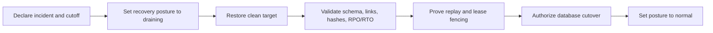

# PostgreSQL Disaster Recovery

## Purpose

This runbook governs recovery of PostgreSQL state owned by `lotus-idea`. It
covers backup/PITR responsibilities, restore validation, traffic cutover,
resume safety, evidence, and escalation. It does not replace the managed
database provider's backup service or treat migration rollback as disaster
recovery.

Current certification posture is `not_certified`. The repository proves a real
logical backup/restore and provides the same validator for provider-restored
physical/PITR databases. Production certification still requires approved
provider topology, encrypted backup evidence, a successful PITR exercise, and
operator authorization.

## Recovery Objectives

| Control | Engineering minimum | Measurement |
| --- | --- | --- |
| RPO | 15 minutes | incident cutoff minus recovered point |
| RTO | 60 minutes | authorized restore start through validated service readiness |
| Base backup | Every 24 hours or better | provider backup inventory |
| WAL archive | Continuous | provider archive health and latest recoverable point |
| Restore verification | Weekly | scheduled repository restore drill |
| Full DR exercise | Quarterly | approved failover/cutover exercise |
| Operational retention | 35 days | provider inventory; legal hold and erasure policy may override expiry |

These are repository engineering defaults, not a representation that a bank's
business impact analysis or regulatory approval has been completed.

## Ownership

| Responsibility | Owner |
| --- | --- |
| Idea data contract, schema, invariants, and resume proof | `lotus-idea-service-owner` |
| Backup, WAL archive, encryption, restore infrastructure, and database credentials | `lotus-platform-database-operations` |
| Active incident coordination and production cutover | `lotus-production-incident-commander` |
| Database response | `lotus-platform-database-on-call` |
| Retention, legal hold, and erasure approval | governed separately under issue `#344` |

## Protected State

The machine-readable inventory in
`contracts/operations/lotus-idea-postgres-disaster-recovery.v1.json` must match
all `idea_*` tables declared by migrations. The gate currently covers 15
tables spanning candidate/evidence state, idempotency, lifecycle/audit,
review/feedback, conversion, report evidence-pack requests, outbox/recovery,
downstream submissions, AI lineage, and legacy quarantine records.

## Backup Strategy

Production recovery requires a physical base backup plus continuous WAL
archiving so the operator can select a point in time. A `pg_dump` custom-format
backup is useful for portable restore verification, but it is logical and must
never be cited as PITR proof. PostgreSQL documents base backup and WAL archive
recovery separately from logical SQL dumps.

Required provider controls:

1. encrypt backup and WAL data at rest and in transit;
2. use least-privilege restore roles, audited break-glass access, and governed
   credential rotation;
3. restore in the same approved jurisdiction unless cross-region approval is
   recorded;
4. keep credentials, DSNs, hostnames, source payloads, and client identifiers
   out of commands, logs, tickets, and evidence;
5. alert when the recoverable point breaches RPO, backup inventory is stale,
   restore validation fails, or scheduled evidence is missing.

## Recovery Flow



### 1. Declare and contain

1. Record incident, operator, correlation, backup identifier, incident cutoff,
   intended recovery point, jurisdiction, and change reference.
2. Set `LOTUS_IDEA_RECOVERY_POSTURE=draining`. `/health/ready` returns `503`
   and all durable-write routes fail with `service_draining`.
3. Stop workers and publishers after in-flight work reaches a bounded state.
   Do not retry an uncertain downstream call automatically.

### 2. Restore

1. Select a clean target database distinct from the failed source.
2. Set `LOTUS_IDEA_RECOVERY_POSTURE=restoring`; readiness and writes remain
   blocked with `service_restoring`.
3. Restore the approved base backup and replay WAL to the authorized recovery
   point. Record provider backup identity and timestamps without including a
   storage URL or credentials.
4. Apply only the deployment's governed schema compatibility procedure. The
   migration rollback command is not a database restore mechanism.

### 3. Validate

For a provider-restored target, expose only its DSN through the dedicated
environment variable and run:

```powershell
$env:LOTUS_IDEA_DR_TARGET_DATABASE_URL = '<restored-database-dsn>'
python scripts/validate_postgres_disaster_recovery_restore.py `
  --backup-identifier '<opaque-backup-id>' `
  --backup-source '<source-safe-provider-name>' `
  --operator-id '<operator-id>' `
  --correlation-id '<incident-id>' `
  --backup-format physical-base-plus-wal `
  --backup-artifact-sha256 '<sha256>' `
  --pitr-proof `
  --backup-created-at-utc '<utc>' `
  --incident-cutoff-utc '<utc>' `
  --recovery-point-utc '<utc>' `
  --restore-started-at-utc '<utc>' `
  --restore-completed-at-utc '<utc>'
```

The validator is read-only and uses one repeatable-read snapshot. It proves
table inventory, primary keys, constraint/index validity, source-safe table
hashes and row counts, referential integrity, quarantine source links,
idempotency/outbox uniqueness, outbox status/lease/failure/publication state,
downstream resource and lease fencing, and AI candidate lineage.

### 4. Prove resume safety

Run only on the disposable restored target before traffic cutover:

```powershell
make postgres-disaster-recovery-resume
make disaster-recovery-proof-gate
```

The resume proof replays a candidate write and an outbox recovery request,
rechecks uncertain downstream claims, attempts a stale-lease finalization, and
compares every table hash before and after. Passing evidence requires replay,
reconciliation-required, lease-conflict, and no mutation or duplicate work.

### 5. Cut over or abort

Cut over only when restore and resume evidence pass, RPO/RTO are within target,
the incident commander and database operator authorize the change, and the
target is in the approved jurisdiction.

1. update the runtime database secret by governed deployment mechanism;
2. restart with `LOTUS_IDEA_RECOVERY_POSTURE=normal`;
3. require `/health/live=200` and `/health/ready=200` before admitting traffic;
4. resume workers gradually and monitor outbox, reconciliation, errors, and
   database saturation;
5. retain the old primary read-only until the rollback window closes.

If any validation fails, set posture to `degraded`, keep writes blocked, attach
only source-safe evidence to the incident, and restore a new clean target. Do
not repair the failed target in place or weaken the proof gate.

## Repository Drill

The weekly GitHub workflow performs a real logical backup and clean restore of
representative synthetic state:

```powershell
make postgres-disaster-recovery-seed
make postgres-disaster-recovery-drill
make postgres-disaster-recovery-resume
make disaster-recovery-proof-gate
```

`.github/workflows/postgres-disaster-recovery-drill.yml` retains source-safe
JSON for 90 days and generates GitHub provenance attestation. A passing logical
drill proves restore mechanics and application invariants; because its evidence
sets `pitrProof=false`, it cannot clear the production PITR blocker.

## Evidence Review

Evidence must include backup/artifact identity, migration bundle hash,
PostgreSQL version, sanitized database identity hash, ordered timestamps,
measured RPO/RTO, exact table counts/hashes, invariant outcome, operator and
correlation identity, replay/fencing decisions, and no-mutation proof. Evidence
must keep `supportedFeaturePromoted=false`.

## References

- [PostgreSQL continuous archiving and point-in-time recovery](https://www.postgresql.org/docs/17/continuous-archiving.html)
- [NIST SP 800-34 Rev. 1 contingency planning guide](https://csrc.nist.gov/pubs/sp/800/34/r1/upd1/final)
- [NIST recovery time objective definition](https://csrc.nist.gov/glossary/term/recovery_time_objective)
