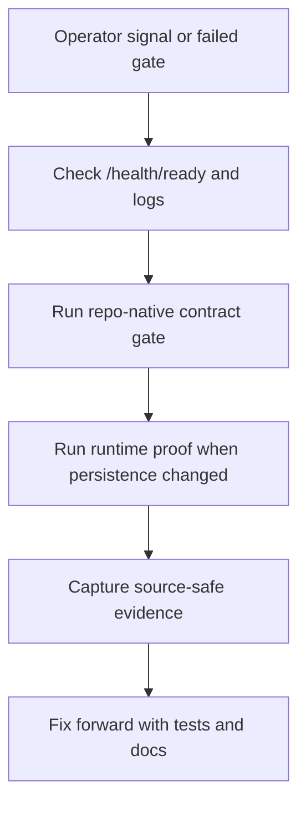

# Service Operations Runbook

## Standard Commands

| Command | Operator use |
| --- | --- |
| `make lint` | Fast local governance and contract gates. |
| `make typecheck` | Static typing proof for service code. |
| `make ci` | Broad local aggregate suite without Docker/PostgreSQL release proof. |
| `make ci-release` | Full local release-lane proof when Docker and disposable PostgreSQL are available. |
| `make postgres-integration-gate` | Real PostgreSQL persistence/replay proof. |
| `make source-ingestion-worker-check` | Manifest and source-safe check-only output contract proof. |
| `make source-ingestion-scheduled-worker-check` | Scheduled worker deploy-contract proof. |
| `make source-ingestion-live-proof-contract-gate` | Source-safe live-proof artifact contract proof. |
| `make risk-concentration-live-proof-contract-gate` | Source-safe Lotus Risk concentration live-proof artifact contract for opportunity-archetype readiness without data-mesh, Workbench, client-publication, or supported-feature promotion. |
| `make high-volatility-live-proof-contract-gate` | Source-safe Lotus Risk high-volatility live-proof artifact contract for opportunity-archetype readiness without data-mesh, Workbench, client-publication, or supported-feature promotion. |
| `make risk-drawdown-live-proof-contract-gate` | Source-safe Lotus Risk drawdown live-proof artifact contract for opportunity-archetype readiness without data-mesh, Workbench, client-publication, or supported-feature promotion. |
| `make manage-mandate-live-proof-contract-gate` | Source-safe Lotus Manage mandate live-proof artifact contract for opportunity-archetype readiness without mandate performance/risk, Core portfolio-state, data-mesh, Workbench, client-publication, supported-feature, rebalance, action, or order-execution promotion. |
| `make mandate-restriction-live-proof-contract-gate` | Source-safe Lotus Advise mandate/restriction live-proof artifact contract for opportunity-archetype readiness without restriction clearance, mandate state change, suitability, policy, client-publication, data-mesh, Workbench, rebalance, order, or supported-feature promotion. |
| `make mandate-restriction-source-product-proof-contract-gate` | Source-safe typed Lotus Advise mandate/restriction source-product proof contract for opportunity-archetype readiness without live Advise source proof, restriction clearance, mandate state change, suitability, policy, proposal, client-publication, data-mesh, Workbench, rebalance, order, or supported-feature promotion. |
| `make core-portfolio-state-live-proof-contract-gate` | Source-safe Lotus Core portfolio-state live-proof artifact contract for opportunity-archetype readiness without Manage action-register proof, mandate performance/risk, data-mesh, Workbench, client-publication, supported-feature, rebalance, action, or order-execution promotion. |
| `make missing-suitability-live-proof-contract-gate` | Source-safe Lotus Advise missing-suitability live-proof artifact contract for opportunity-archetype readiness without suitability, policy, proposal, client-publication, data-mesh, Workbench, or supported-feature promotion. |
| `make missing-risk-profile-source-product-proof-contract-gate` | Source-safe typed Lotus Advise missing risk-profile source-product proof artifact contract for opportunity-archetype readiness without live Advise source proof, risk profiling, suitability, policy, proposal, client-publication, data-mesh, Workbench, or supported-feature promotion. |
| `make missing-risk-profile-live-proof-contract-gate` | Source-safe Lotus Advise missing risk-profile live-proof artifact contract for opportunity-archetype readiness without risk profiling, suitability, policy, proposal, client-publication, typed source-product, data-mesh, Workbench, or supported-feature promotion. |
| `make missing-benchmark-performance-readiness-proof-contract-gate` | Source-safe Lotus Performance benchmark-readiness proof artifact contract for missing-benchmark review without benchmark assignment, performance or benchmark return calculation, methodology certification, client-publication, data-mesh, Workbench, or supported-feature promotion. |
| `make runtime-trust-telemetry-proof-contract-gate` | Source-safe runtime trust telemetry proof contract for aggregate readiness. |
| `make downstream-route-contract-proof-gate` | Source-safe Advise proposal and Manage action route-proof contract for aggregate readiness without granting suitability, rebalance/execution, or supported-feature authority. |
| `make ai-lineage-store-proof-contract-gate` | Source-safe AI lineage store proof contract without, by itself, certifying `lotus-ai` runtime, Workbench, or supported-feature promotion. |
| `make ai-model-risk-operations-proof-contract-gate` | Source-safe AI model-risk operations proof contract for repo-owned dashboard, alert-rule, and runbook artifacts without certifying `lotus-ai`, Workbench, client-ready publication, or supported-feature promotion. |
| `make operator-workflows-operations-proof-contract-gate` | Source-safe non-AI operator workflow operations proof contract for repo-owned dashboard, alert-rule, and runbook artifacts without certifying live source ingestion, external broker publication, downstream execution, Gateway/Workbench, data mesh, or supported-feature promotion. |
| `make implementation-proof-readiness-check` | Scheduled-worker deploy, durable repository, runtime telemetry, Workbench read-path, Gateway/Workbench operational, default Advise proposal route, default Manage action route, default Report intake route, default platform mesh onboarding, AI lineage store, AI model-risk operations, AI workflow-pack, optional Risk concentration, high-volatility, drawdown, Performance underperformance, missing-benchmark Performance readiness, Core benchmark assignment, Core portfolio-state, missing-benchmark Core, Manage mandate, Advise mandate/restriction live proof, typed Advise mandate/restriction source-product proof, Advise missing-suitability, typed Advise missing risk-profile source-product proof, Advise missing risk-profile live proof, and RFC-0002 aggregate proof-readiness evidence. |
| `make runtime-trust-telemetry-preview-check` | Source-safe runtime trust telemetry preview evidence. |
| `make runtime-trust-telemetry-snapshot-check` | Source-safe runtime trust telemetry snapshot evidence under ignored `output/`. |
| `make container-runtime-smoke` | Start the built `lotus-idea:<git-sha>` image, probe `/health`, `/health/live`, and reachable default-profile `/health/ready`, print container logs on failure, and remove the smoke container. |
| `make release-sbom` | Generate `sbom.cdx.json` from `requirements/runtime-resolved.lock.txt` with the pinned CI-tooling CycloneDX package used by main releasability. |
| `make runtime-dependency-closure-gate` | Confirm the resolved runtime lock covers the installed runtime dependency closure and mirrors `requirements/requirements.txt` for GitHub Dependency Graph support before SBOM or audit evidence is cited. |
| `make dependency-refresh` | Install from Python root pins without a stale runtime-lock constraint, then regenerate `requirements/runtime-resolved.lock.txt` and `requirements/requirements.txt` for a coherent dependency update PR. |
| `make container-image-scan` | Scan the built `lotus-idea:<git-sha>` image with the pinned Trivy container and write JSON evidence under `output/security/`. |
| `make caller-context-contract-gate` | Validate that caller authorization headers are bound through the shared trusted caller-context provenance guard before production-like use. |
| `docker compose up --build` | Local container entrypoint using `.env.example` safe defaults and optional ignored `.env` overrides. |

## Local Docker Compose

`docker compose up --build` works from a clean checkout because
`docker-compose.yml` loads committed safe defaults from `.env.example` and then
overlays ignored `.env` values when that file exists. Create `.env` only when a
local run needs overrides such as `LOTUS_IDEA_DATABASE_URL`, Core source URLs,
or local logging changes:

```powershell
Copy-Item .env.example .env
docker compose up --build
```

The scheduled source-ingestion worker remains opt-in:

```powershell
docker compose --profile worker up --build
```

This path proves local container startup and operator ergonomics only. It does
not certify production recovery, live source ingestion, Workbench support,
data-mesh readiness, client publication, or supported-feature status.

The built runtime image installs only runtime dependencies constrained by
`requirements/runtime-resolved.lock.txt`, runs as the
non-root `lotus` user, keeps only the service plus source-ingestion worker
entrypoint scripts from `scripts/`, and records service version, Git commit,
Git branch, build timestamp, repository URL, CI run ID, and image digest
metadata as OCI labels and runtime metadata. Main Releasability is the only
registry-publish path: it lower-cases the GHCR image repository, tags the
service image with the Git commit SHA, runs container smoke and Trivy scan
before publication, pushes the image, resolves the registry digest, signs that
digest with keyless Cosign, generates provenance and SBOM attestations, and
records the digest reference in `release-evidence.json`.

The Main Releasability SBOM is explicitly scoped to runtime Python
dependencies from `requirements/runtime-resolved.lock.txt` and is tied in
`release-evidence.json` to the published service image reference, registry
digest, and local image id. Container OS package posture remains covered by the
Trivy image scan, not by the runtime dependency SBOM. Development tooling, bulk
CI helper scripts, and secret-like build inputs must not be copied into or
passed through the runtime image.

`make container-runtime-smoke` is the packaged runtime startup proof used by PR
Merge Gate and Main Releasability after `make docker-build`. It starts the
built image on a governed local host port, requires `/health` and
`/health/live` to return `200`, requires `/health/ready` to return reachable
JSON with either `200` or the default-profile fail-closed `503`, prints
container logs on failure, and removes the smoke container in all cases. This
proves packaged entrypoint and health-surface behavior only; it does not
certify production deployment, upstream source connectivity, Workbench,
data-mesh readiness, client publication, or supported-feature status.

## Health and Readiness

- Liveness: /health/live
- Readiness: /health/ready
- General health: /health
- Metadata: /metadata
- Version and image provenance metadata: /version

Database restore and cutover use the dedicated
[PostgreSQL disaster recovery runbook](postgres-disaster-recovery.md). Set
`LOTUS_IDEA_RECOVERY_POSTURE` to `draining`, `restoring`, `degraded`, or
`normal` as directed there. Every non-normal or invalid posture returns
non-ready and blocks durable writes before mutation.

`LOTUS_IDEA_RUNTIME_PROFILE` defaults to `local`. `local` and `test` allow
process-local repository writes for development and automated tests. `demo`,
`staging`, and `production` require `LOTUS_IDEA_DATABASE_URL`; without it,
`/health/ready` returns degraded runtime posture and write-capable routes fail
closed with `durable_repository_not_configured` before mutating in-memory state.
When `LOTUS_IDEA_DATABASE_URL` is configured but the PostgreSQL repository
cannot initialize, `/health/ready` returns degraded posture with
`durable_repository_unavailable`, and write-capable routes fail closed with the
same product-safe 503 code before mutation. Readiness and API responses must not
echo DSNs, hostnames, credentials, or raw driver exception text.

`local` and `test` also allow test clients and local tools to simulate caller
identity, roles, capabilities, and entitlement scope through `X-Caller-*`
headers. In `demo`, `staging`, and `production`, those privileged headers are
rejected with product-safe `403` behavior unless the request also includes
`X-Lotus-Trusted-Caller-Context` matching
`LOTUS_IDEA_TRUSTED_CALLER_CONTEXT_TOKEN`. Configure that token only in the
trusted ingress or gateway hop that has already authenticated and authorized
the caller. This marker is not a replacement for an identity provider, signed
assertions, mutual TLS service identity, Workbench entitlement proof, or
client-ready authorization certification.

## HTTP Boundary Controls

`lotus-idea` applies inbound HTTP boundary controls before route handling:

| Control | Configuration | Operator interpretation |
| --- | --- | --- |
| Trusted hosts | `LOTUS_IDEA_TRUSTED_HOSTS`, comma-separated, default `*` | Non-matching `Host` headers fail closed with `400 invalid_host` and do not echo the rejected host. |
| Browser origins | `LOTUS_IDEA_CORS_ALLOWED_ORIGINS`, comma-separated, default empty | CORS is denied by default. Set explicit Workbench/Gateway origins only when a governed browser path exists. |
| Request body size | `LOTUS_IDEA_MAX_REQUEST_BODY_BYTES`, default `1048576` | Larger JSON write requests fail closed with `413 request_too_large` before route handlers process payloads, based on the actual ASGI body stream as well as `Content-Length`. |
| JSON write requests | Always on for `POST`, `PUT`, and `PATCH` with a body | Non-JSON write bodies fail with `415 unsupported_media_type`. |
| Security headers | Always on | Responses include HSTS, no-sniff, frame-deny, no-referrer, locked-down permissions, and default-deny CSP headers. |

Boundary rejections return product-safe `ProblemDetails`. They must not include
raw request bodies, authorization headers, cookies, rejected host values,
portfolio ids, client ids, or source payloads. Use the `X-Correlation-Id`
response header for log lookup when diagnosing caller failures.
Inbound correlation and trace headers are sanitized before response, log, or
downstream propagation; if a caller sends a blank, overlong, portfolio-like,
token-like, or malformed diagnostic header, use the generated response header
value for support lookup.

Caller-context dependency failures preserve the stable API vocabulary: blank
entitlement-scope headers return `400 invalid_request`, while missing or
invalid trusted caller-context provenance returns `403 permission_denied`.
Runtime bodies use `application/problem+json` and include the sanitized
`X-Correlation-Id` response header. Operation diagnostics use only the route
template, status, and bounded `caller_context_invalid_request` or
`caller_context_permission_denied` category; they never include raw token,
header, tenant, book, portfolio, or client-scope values. Generated OpenAPI also
publishes both caller-boundary examples for every protected operation.
Unrelated framework `HTTPException` failures retain the generic
`request_rejected` fallback. Run `make caller-context-contract-gate` after any
caller dependency, global exception handler, protected-route registration, or
OpenAPI customization change.

These controls improve service boundary posture only. They do not certify
Gateway/Workbench browser support, external API support, client publication,
production recovery, data-mesh certification, or supported-feature promotion.

## Incident First Checks



1. Check container logs for request failures and stack traces.
2. Verify /health/ready and metrics endpoint.
   If readiness reports `draining`, `restoring`, or a recovery-posture
   blocker, follow the dedicated PostgreSQL disaster recovery runbook. Do not
   bypass the write guard or set posture to `normal` before restore and resume
   proof pass.
   If readiness is degraded with `durable_repository_not_configured`, either
   configure `LOTUS_IDEA_DATABASE_URL` for the production-like profile or switch
   the runtime profile explicitly to `local`/`test` for non-production work.
   If readiness is degraded with `durable_repository_unavailable`, verify the
   configured PostgreSQL DSN, credentials, network path, and database
   availability from the deployment environment; do not paste DSNs, passwords,
   hostnames, or raw driver messages into tickets or proof artifacts.
3. Run broad local parity check (`make ci`) before hotfix PR. Run
   `make ci-release` instead when the fix could affect Docker, PostgreSQL
   runtime behavior, image scan, container smoke, SBOM, or release-lane proof.
4. For persistence or repository-provider changes, run
   `make postgres-integration-gate` with `LOTUS_IDEA_POSTGRES_INTEGRATION_URL`
   pointed at a disposable PostgreSQL database. The gate proves the current
   API workflow persistence path, row-delta repository mutation posture, and
   schema rollback/reapply recovery posture.
5. For source-ingestion worker contract changes, run
   `make source-ingestion-worker-check`. This validates the versioned worker
   manifest and the source-safe check-only output contract without calling Core
   or writing repository state.
   Check-only and run-mode summaries must stay source-safe: manifest item
   indexes, decision counts, candidate ids when candidates are created, and
   idempotency-key presence are allowed, but raw source payloads, portfolio ids,
   and raw idempotency keys are not.
6. For runtime source-ingestion configuration checks, call
   `GET /api/v1/source-ingestion/readiness` with the `operator` role and
   `idea.source-ingestion.readiness.read` capability. This reports manifest,
   Core query URL, Core query-control-plane URL, durable repository
   configuration, live-proof artifact
   validity, scheduled-worker proof validity, and remaining certification
   blockers without calling Core or exposing source payloads.
7. For bounded source-ingestion operator execution, call
   `POST /api/v1/source-ingestion/run-once` with the `operator` role and
   `idea.source-ingestion.run` capability. This requires durable repository,
   manifest, and Core configuration, blocks before mutation when runtime
   inputs are missing or invalid, and returns aggregate decision counts only.
8. For live Core source-ingestion proof capture, run
   `scripts/generate_source_ingestion_live_proof.py --manifest <path> --core-query-base-url <query-url> --core-query-control-plane-base-url <control-plane-url> --generated-at-utc <timestamp> --output output/source-ingestion/live-proof.json`.
   Use `--core-base-url` only for legacy single-base Core stacks.
   Then set `LOTUS_IDEA_SOURCE_INGESTION_LIVE_PROOF` to that output path.
   A family-valid and aggregate-current artifact clears only the live-Core
   blocker; it is not scheduled worker, data-mesh, Gateway/Workbench,
   downstream, or supported-feature proof.
9. For scheduled-worker deploy proof capture, run
   `scripts/generate_scheduled_source_ingestion_worker_proof.py --manifest <path> --generated-at-utc <timestamp> --output output/source-ingestion/scheduled-worker-proof.json`.
   Then set `LOTUS_IDEA_SOURCE_INGESTION_SCHEDULED_WORKER_PROOF` to that
   output path. A valid artifact clears only the scheduled-worker blocker; it
   is not live Core, data-mesh, Gateway/Workbench, downstream, or
   supported-feature proof.
10. For aggregate RFC-0002 proof posture checks, call
   `GET /api/v1/implementation-proof/readiness?evaluatedAtUtc=<timestamp>`
   with the `operator` role and
   `idea.implementation-proof.readiness.read` capability. This reports
   source-safe blockers across source ingestion, advisor queue, AI
   explanation, data mesh, runtime trust telemetry preview/snapshot evidence,
   outbox delivery,
   Workbench, downstream realization, and supported-feature promotion. It is
   not live proof, certified live broker runtime, downstream delivery,
   Workbench proof, data-product certification, or supported-feature
   promotion.
11. For downstream realization blocker checks, call
   `GET /api/v1/downstream-realization/readiness` with the `operator` role and
   `idea.downstream-realization.readiness.read` capability. This reports
   source-safe workflow counts, planned Advise/Manage/Report handoff contract
   posture, and blockers for Advise, Manage, Report, Render, and Archive
   without calling downstream services, proving downstream route existence, or
   creating downstream records.
12. For bounded outbox delivery execution, call
    `POST /api/v1/outbox-delivery/run-once` with the `operator` role,
    `idea.outbox-delivery.run` capability, and `Idempotency-Key`. The endpoint
    binds the operator run identity to safe request parameters and caller
    subject before claiming events. Same-key/same-request retries return
    `runStatus=replayed` without mutation; same-key/different-request reuse
    returns product-safe `409 idempotency_conflict`. Failed broker publication
    attempts record first/last failure timing and a deterministic capped retry
    schedule; failed rows below the retry limit are claimed again only after
    their durable next-attempt timestamp is due, while expired leases stay
    immediately recoverable. Responses include only aggregate counts and a
    source-safe `operatorRunReference`, never raw idempotency keys, event ids,
    broker payloads, source payloads, or downstream payloads.

Outbound HTTP retry defaults remain disabled with one attempt. Operators can
opt in with `LOTUS_IDEA_SOURCE_INGESTION_RETRY_MAX_ATTEMPTS`,
`LOTUS_IDEA_DOWNSTREAM_REALIZATION_RETRY_MAX_ATTEMPTS`, or
`LOTUS_IDEA_OUTBOX_BROKER_RETRY_MAX_ATTEMPTS`, plus the matching
`*_RETRY_INITIAL_BACKOFF_SECONDS` and `*_RETRY_MAX_BACKOFF_SECONDS` settings.
The shared client retries only transport timeouts/failures and `429`, `502`,
`503`, or `504` responses. Realization and outbox `POST` retries require an
idempotency key; source-ingestion Core query/control-plane `POST` calls are
the only runtime path marked as read-only retryable without one.

13. For runtime trust telemetry preview checks, call
   `GET /api/v1/data-mesh/trust-telemetry/runtime-preview?generatedAtUtc=<timestamp>`
   with the `operator` role and
   `idea.mesh.trust-telemetry.preview.read` capability. This reports aggregate
   active-repository counts plus product coverage for every declared producer
   product. It is not data-product certification.
14. For CI or async evidence without running the service, run
    `make implementation-proof-readiness-check` or
    `scripts/generate_implementation_proof_readiness.py --evaluated-at-utc <timestamp>`.
    The Make target generates and consumes the scheduled-worker deploy-proof
    artifact before producing the aggregate snapshot. The generated JSON is an
    operator proof-readiness artifact, not live scheduler certification or a
    supported product claim.
15. For source-safe runtime trust telemetry preview evidence without running
    the service, run `make runtime-trust-telemetry-preview-check` or
    `scripts/generate_runtime_trust_telemetry_preview.py --generated-at-utc <timestamp>`.
16. For contract-shaped runtime trust telemetry snapshot evidence without
    running the service, run `make runtime-trust-telemetry-snapshot-check` or
    `scripts/generate_runtime_trust_telemetry_snapshot.py --generated-at-utc <timestamp>`.
    The generated file is ignored under `output/trust-telemetry/runtime/` and
    includes product coverage posture. It remains blocked until product coverage
    is complete and platform mesh certification is complete.
    When PostgreSQL is the active repository provider, the HTTP preview and
    snapshot diagnostics use a bounded runtime trust telemetry projection over
    candidate and workflow tables rather than hydrating unrelated repository
    state families.

## Current Operation Event Diagnostics

RFC-0002 Slice 15 adds bounded operation-event logs and the
`lotus_idea_operation_events_total` metric for these internal foundations:

1. high-cash signal evaluation,
2. high-cash candidate persistence,
3. candidate evidence replay,
4. candidate lifecycle transition recording,
5. advisor review queue reads,
6. human review decision recording,
7. advisor feedback recording,
8. conversion intent recording,
9. conversion outcome recording,
10. report evidence-pack request recording,
11. data-mesh readiness diagnostic reads,
12. runtime trust telemetry preview diagnostic reads,
13. source-ingestion readiness diagnostic reads,
14. downstream-realization readiness diagnostic reads,
15. implementation-proof readiness diagnostic reads.

The non-AI operator workflow dashboard and alert pack lives in
`contracts/observability/lotus-idea-operator-workflows-operations.v1.json`,
`monitoring/grafana/dashboards/lotus-idea-operator-workflows-operations.json`,
`monitoring/prometheus/rules/lotus-idea-operator-workflows-operations.rules.yml`,
and `docs/runbooks/operator-workflows-operations.md`.
`make operator-workflows-ops-contract-gate` and
`make operator-workflows-operations-proof-contract-gate` certify only
source-safe dashboard/alert visibility over implemented operation telemetry.
Live source ingestion, external broker publication, downstream execution
outcomes, data-mesh certification, Gateway/Workbench proof, and
supported-feature promotion remain separate blockers.

Use the operation `outcome` before inspecting payload-level evidence:

1. `accepted`: new foundation record created in the active repository provider.
2. `replayed`: duplicate submission with the same idempotency key and payload.
3. `conflict`: idempotency key reused with a different payload.
4. `not_found`: candidate, conversion intent, or related foundation record is absent.
5. `duplicate`, `suppressed`, and `not_eligible`: deterministic signal or persistence outcomes
   that did not create a new candidate.
6. `permission_denied`: caller capability failed closed.
7. `invalid_request`: request shape, timestamp, or idempotency key is invalid.
8. `invalid_state`: lifecycle, review, target authority, or report intent precondition failed.
9. `blocked`: candidate evidence replay found stale source posture, or
   data-mesh, runtime trust telemetry preview/snapshot evidence,
   source-ingestion, AI explanation, review queue, outbox delivery, downstream realization, or
   aggregate implementation-proof readiness remains blocked by explicit
   configuration or certification blockers.

For conversion-intent recording, the application command idempotency key and
the repository replay key must be identical. A mismatch is an invalid internal
caller construction and must be fixed at the caller boundary rather than
diagnosed as a replay, conflict, or downstream realization issue.

Operation metrics are diagnostic support evidence only. `durable_storage_backed=true` confirms only
that the active repository provider is durable; it does not prove production recovery readiness,
certified long-running scheduled source-worker readiness, live source-adapter readiness,
data-product certification, downstream
Report/Render/Archive realization, Gateway/Workbench proof, or supported-feature promotion.
