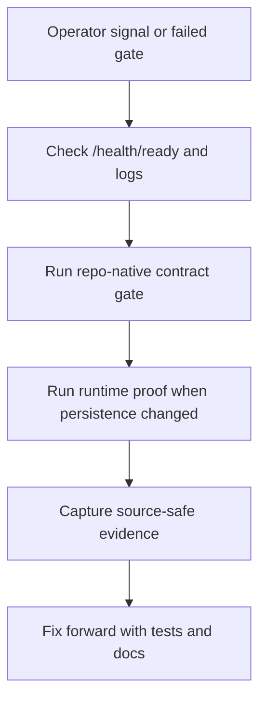

# Service Operations Runbook

## Standard Commands

| Command | Operator use |
| --- | --- |
| `make lint` | Fast local governance and contract gates. |
| `make typecheck` | Static typing proof for service code. |
| `make ci` | Broader CI-equivalent local suite. |
| `make postgres-integration-gate` | Real PostgreSQL persistence/replay proof. |
| `make source-ingestion-worker-check` | Manifest and source-safe check-only output contract proof. |
| `make implementation-proof-readiness-check` | RFC-0002 aggregate proof-readiness evidence. |
| `make runtime-trust-telemetry-preview-check` | Source-safe runtime trust telemetry preview evidence. |
| `docker compose up --build` | Local container entrypoint. |

## Health and Readiness

- Liveness: /health/live
- Readiness: /health/ready
- General health: /health
- Metadata: /metadata

## Incident First Checks

1. Check container logs for request failures and stack traces.
2. Verify /health/ready and metrics endpoint.
3. Run local parity check (`make ci`) before hotfix PR.
4. For persistence or repository-provider changes, run
   `make postgres-integration-gate` with `LOTUS_IDEA_POSTGRES_INTEGRATION_URL`
   pointed at a disposable PostgreSQL database. The gate proves the current
   API workflow persistence path and schema rollback/reapply recovery posture.
5. For source-ingestion worker contract changes, run
   `make source-ingestion-worker-check`. This validates the versioned worker
   manifest and the source-safe check-only output contract without calling Core
   or writing repository state.
   Check-only and run-mode summaries must stay source-safe: manifest item
   indexes, decision counts, candidate ids when candidates are created, and
   idempotency-key presence are allowed, but raw source payloads, portfolio ids,
   and raw idempotency keys are not.
6. For runtime source-ingestion configuration checks, call
   `GET /api/v1/source-ingestion/readiness` with the `operator` role and
   `idea.source-ingestion.readiness.read` capability. This reports manifest,
   Core base URL, durable repository configuration, and remaining certification
   blockers without calling Core or exposing source payloads.
7. For aggregate RFC-0002 proof posture checks, call
   `GET /api/v1/implementation-proof/readiness?evaluatedAtUtc=<timestamp>`
   with the `operator` role and
   `idea.implementation-proof.readiness.read` capability. This reports
   source-safe blockers across source ingestion, advisor queue, AI
   explanation, data mesh, runtime trust telemetry preview, outbox delivery,
   Workbench, downstream realization, and supported-feature promotion. It is
   not live proof, certified live broker runtime, downstream delivery,
   Workbench proof, data-product certification, or supported-feature
   promotion.
8. For downstream realization blocker checks, call
   `GET /api/v1/downstream-realization/readiness` with the `operator` role and
   `idea.downstream-realization.readiness.read` capability. This reports
   source-safe workflow counts, planned Advise/Manage/Report handoff contract
   posture, and blockers for Advise, Manage, Report, Render, and Archive
   without calling downstream services, proving downstream route existence, or
   creating downstream records.
9. For runtime trust telemetry preview checks, call
   `GET /api/v1/data-mesh/trust-telemetry/runtime-preview?generatedAtUtc=<timestamp>`
   with the `operator` role and
   `idea.mesh.trust-telemetry.preview.read` capability. This reports aggregate
   active-repository counts only and is not data-product certification.
10. For CI or async evidence without running the service, run
   `make implementation-proof-readiness-check` or
   `scripts/generate_implementation_proof_readiness.py --evaluated-at-utc <timestamp>`.
   The generated JSON is an operator proof-readiness artifact, not a supported
   product claim.
11. For source-safe runtime trust telemetry preview evidence without running
    the service, run `make runtime-trust-telemetry-preview-check` or
    `scripts/generate_runtime_trust_telemetry_preview.py --generated-at-utc <timestamp>`.

## Current Operation Event Diagnostics

RFC-0002 Slice 15 adds bounded operation-event logs and the
`lotus_idea_operation_events_total` metric for these internal foundations:

1. high-cash signal evaluation,
2. high-cash candidate persistence,
3. candidate evidence replay,
4. candidate lifecycle transition recording,
5. advisor review queue reads,
6. human review decision recording,
7. advisor feedback recording,
8. conversion intent recording,
9. conversion outcome recording,
10. report evidence-pack request recording,
11. data-mesh readiness diagnostic reads,
12. runtime trust telemetry preview diagnostic reads,
13. source-ingestion readiness diagnostic reads,
14. downstream-realization readiness diagnostic reads,
15. implementation-proof readiness diagnostic reads.

Use the operation `outcome` before inspecting payload-level evidence:

1. `accepted`: new foundation record created in the active repository provider.
2. `replayed`: duplicate submission with the same idempotency key and payload.
3. `conflict`: idempotency key reused with a different payload.
4. `not_found`: candidate, conversion intent, or related foundation record is absent.
5. `duplicate`, `suppressed`, and `not_eligible`: deterministic signal or persistence outcomes
   that did not create a new candidate.
6. `permission_denied`: caller capability failed closed.
7. `invalid_request`: request shape, timestamp, or idempotency key is invalid.
8. `invalid_state`: lifecycle, review, target authority, or report intent precondition failed.
9. `blocked`: candidate evidence replay found stale source posture, or
   data-mesh, runtime trust telemetry preview, source-ingestion, AI
   explanation, review queue, outbox delivery, downstream realization, or
   aggregate implementation-proof readiness remains blocked by explicit
   configuration or certification blockers.

Operation metrics are diagnostic support evidence only. `durable_storage_backed=true` confirms only
that the active repository provider is durable; it does not prove production recovery readiness,
scheduled daemon/deploy source-worker readiness, live source-adapter readiness, data-product
certification, downstream Report/Render/Archive realization, Gateway/Workbench proof, or
supported-feature promotion.
