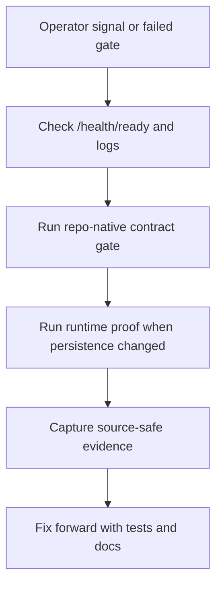

# Service Operations Runbook

## Standard Commands

| Command | Operator use |
| --- | --- |
| `make lint` | Fast local governance and contract gates. |
| `make typecheck` | Static typing proof for service code. |
| `make ci` | Broader CI-equivalent local suite. |
| `make postgres-integration-gate` | Real PostgreSQL persistence/replay proof. |
| `make source-ingestion-worker-check` | Manifest and source-safe check-only output contract proof. |
| `make source-ingestion-scheduled-worker-check` | Scheduled worker deploy-contract proof. |
| `make source-ingestion-live-proof-contract-gate` | Source-safe live-proof artifact contract proof. |
| `make risk-concentration-live-proof-contract-gate` | Source-safe Lotus Risk concentration live-proof artifact contract for opportunity-archetype readiness without data-mesh, Workbench, client-publication, or supported-feature promotion. |
| `make high-volatility-live-proof-contract-gate` | Source-safe Lotus Risk high-volatility live-proof artifact contract for opportunity-archetype readiness without data-mesh, Workbench, client-publication, or supported-feature promotion. |
| `make risk-drawdown-live-proof-contract-gate` | Source-safe Lotus Risk drawdown live-proof artifact contract for opportunity-archetype readiness without data-mesh, Workbench, client-publication, or supported-feature promotion. |
| `make manage-mandate-live-proof-contract-gate` | Source-safe Lotus Manage mandate live-proof artifact contract for opportunity-archetype readiness without mandate performance/risk, Core portfolio-state, data-mesh, Workbench, client-publication, supported-feature, rebalance, action, or order-execution promotion. |
| `make mandate-restriction-live-proof-contract-gate` | Source-safe Lotus Advise mandate/restriction live-proof artifact contract for opportunity-archetype readiness without restriction clearance, mandate state change, suitability, policy, client-publication, data-mesh, Workbench, rebalance, order, or supported-feature promotion. |
| `make core-portfolio-state-live-proof-contract-gate` | Source-safe Lotus Core portfolio-state live-proof artifact contract for opportunity-archetype readiness without Manage action-register proof, mandate performance/risk, data-mesh, Workbench, client-publication, supported-feature, rebalance, action, or order-execution promotion. |
| `make missing-suitability-live-proof-contract-gate` | Source-safe Lotus Advise missing-suitability live-proof artifact contract for opportunity-archetype readiness without suitability, policy, proposal, client-publication, data-mesh, Workbench, or supported-feature promotion. |
| `make missing-risk-profile-live-proof-contract-gate` | Source-safe Lotus Advise missing risk-profile live-proof artifact contract for opportunity-archetype readiness without risk profiling, suitability, policy, proposal, client-publication, typed source-product, data-mesh, Workbench, or supported-feature promotion. |
| `make missing-benchmark-performance-readiness-proof-contract-gate` | Source-safe Lotus Performance benchmark-readiness proof artifact contract for missing-benchmark review without benchmark assignment, performance or benchmark return calculation, methodology certification, client-publication, data-mesh, Workbench, or supported-feature promotion. |
| `make runtime-trust-telemetry-proof-contract-gate` | Source-safe runtime trust telemetry proof contract for aggregate readiness. |
| `make downstream-route-contract-proof-gate` | Source-safe Advise proposal and Manage action route-proof contract for aggregate readiness without granting suitability, rebalance/execution, or supported-feature authority. |
| `make ai-lineage-store-proof-contract-gate` | Source-safe AI lineage store proof contract without, by itself, certifying `lotus-ai` runtime, Workbench, or supported-feature promotion. |
| `make ai-model-risk-operations-proof-contract-gate` | Source-safe AI model-risk operations proof contract for repo-owned dashboard, alert-rule, and runbook artifacts without certifying `lotus-ai`, Workbench, client-ready publication, or supported-feature promotion. |
| `make implementation-proof-readiness-check` | Scheduled-worker deploy, durable repository, runtime telemetry, Workbench read-path, Gateway/Workbench operational, default Advise proposal route, default Manage action route, default Report intake route, default platform mesh onboarding, AI lineage store, AI model-risk operations, AI workflow-pack, optional Risk concentration, high-volatility, drawdown, Performance underperformance, missing-benchmark Performance readiness, Core benchmark assignment, Core portfolio-state, missing-benchmark Core, Manage mandate, Advise mandate/restriction, Advise missing-suitability, and Advise missing risk-profile live proof, and RFC-0002 aggregate proof-readiness evidence. |
| `make runtime-trust-telemetry-preview-check` | Source-safe runtime trust telemetry preview evidence. |
| `make runtime-trust-telemetry-snapshot-check` | Source-safe runtime trust telemetry snapshot evidence under ignored `output/`. |
| `docker compose up --build` | Local container entrypoint. |

## Health and Readiness

- Liveness: /health/live
- Readiness: /health/ready
- General health: /health
- Metadata: /metadata

## Incident First Checks

1. Check container logs for request failures and stack traces.
2. Verify /health/ready and metrics endpoint.
3. Run local parity check (`make ci`) before hotfix PR.
4. For persistence or repository-provider changes, run
   `make postgres-integration-gate` with `LOTUS_IDEA_POSTGRES_INTEGRATION_URL`
   pointed at a disposable PostgreSQL database. The gate proves the current
   API workflow persistence path and schema rollback/reapply recovery posture.
5. For source-ingestion worker contract changes, run
   `make source-ingestion-worker-check`. This validates the versioned worker
   manifest and the source-safe check-only output contract without calling Core
   or writing repository state.
   Check-only and run-mode summaries must stay source-safe: manifest item
   indexes, decision counts, candidate ids when candidates are created, and
   idempotency-key presence are allowed, but raw source payloads, portfolio ids,
   and raw idempotency keys are not.
6. For runtime source-ingestion configuration checks, call
   `GET /api/v1/source-ingestion/readiness` with the `operator` role and
   `idea.source-ingestion.readiness.read` capability. This reports manifest,
   Core query URL, Core query-control-plane URL, durable repository
   configuration, live-proof artifact
   validity, scheduled-worker proof validity, and remaining certification
   blockers without calling Core or exposing source payloads.
7. For bounded source-ingestion operator execution, call
   `POST /api/v1/source-ingestion/run-once` with the `operator` role and
   `idea.source-ingestion.run` capability. This requires durable repository,
   manifest, and Core configuration, blocks before mutation when runtime
   inputs are missing or invalid, and returns aggregate decision counts only.
8. For live Core source-ingestion proof capture, run
   `scripts/generate_source_ingestion_live_proof.py --manifest <path> --core-query-base-url <query-url> --core-query-control-plane-base-url <control-plane-url> --generated-at-utc <timestamp> --output output/source-ingestion/live-proof.json`.
   Use `--core-base-url` only for legacy single-base Core stacks.
   Then set `LOTUS_IDEA_SOURCE_INGESTION_LIVE_PROOF` to that output path.
   A valid artifact clears only the live-Core blocker; it is not scheduled
   worker, data-mesh, Gateway/Workbench, downstream, or supported-feature
   proof.
9. For scheduled-worker deploy proof capture, run
   `scripts/generate_scheduled_source_ingestion_worker_proof.py --manifest <path> --generated-at-utc <timestamp> --output output/source-ingestion/scheduled-worker-proof.json`.
   Then set `LOTUS_IDEA_SOURCE_INGESTION_SCHEDULED_WORKER_PROOF` to that
   output path. A valid artifact clears only the scheduled-worker blocker; it
   is not live Core, data-mesh, Gateway/Workbench, downstream, or
   supported-feature proof.
10. For aggregate RFC-0002 proof posture checks, call
   `GET /api/v1/implementation-proof/readiness?evaluatedAtUtc=<timestamp>`
   with the `operator` role and
   `idea.implementation-proof.readiness.read` capability. This reports
   source-safe blockers across source ingestion, advisor queue, AI
   explanation, data mesh, runtime trust telemetry preview/snapshot evidence,
   outbox delivery,
   Workbench, downstream realization, and supported-feature promotion. It is
   not live proof, certified live broker runtime, downstream delivery,
   Workbench proof, data-product certification, or supported-feature
   promotion.
11. For downstream realization blocker checks, call
   `GET /api/v1/downstream-realization/readiness` with the `operator` role and
   `idea.downstream-realization.readiness.read` capability. This reports
   source-safe workflow counts, planned Advise/Manage/Report handoff contract
   posture, and blockers for Advise, Manage, Report, Render, and Archive
   without calling downstream services, proving downstream route existence, or
   creating downstream records.
12. For runtime trust telemetry preview checks, call
   `GET /api/v1/data-mesh/trust-telemetry/runtime-preview?generatedAtUtc=<timestamp>`
   with the `operator` role and
   `idea.mesh.trust-telemetry.preview.read` capability. This reports aggregate
   active-repository counts only and is not data-product certification.
13. For CI or async evidence without running the service, run
    `make implementation-proof-readiness-check` or
    `scripts/generate_implementation_proof_readiness.py --evaluated-at-utc <timestamp>`.
    The Make target generates and consumes the scheduled-worker deploy-proof
    artifact before producing the aggregate snapshot. The generated JSON is an
    operator proof-readiness artifact, not live scheduler certification or a
    supported product claim.
14. For source-safe runtime trust telemetry preview evidence without running
    the service, run `make runtime-trust-telemetry-preview-check` or
    `scripts/generate_runtime_trust_telemetry_preview.py --generated-at-utc <timestamp>`.
15. For contract-shaped runtime trust telemetry snapshot evidence without
    running the service, run `make runtime-trust-telemetry-snapshot-check` or
    `scripts/generate_runtime_trust_telemetry_snapshot.py --generated-at-utc <timestamp>`.
    The generated file is ignored under `output/trust-telemetry/runtime/` and
    remains blocked until platform mesh certification is complete.

## Current Operation Event Diagnostics

RFC-0002 Slice 15 adds bounded operation-event logs and the
`lotus_idea_operation_events_total` metric for these internal foundations:

1. high-cash signal evaluation,
2. high-cash candidate persistence,
3. candidate evidence replay,
4. candidate lifecycle transition recording,
5. advisor review queue reads,
6. human review decision recording,
7. advisor feedback recording,
8. conversion intent recording,
9. conversion outcome recording,
10. report evidence-pack request recording,
11. data-mesh readiness diagnostic reads,
12. runtime trust telemetry preview diagnostic reads,
13. source-ingestion readiness diagnostic reads,
14. downstream-realization readiness diagnostic reads,
15. implementation-proof readiness diagnostic reads.

Use the operation `outcome` before inspecting payload-level evidence:

1. `accepted`: new foundation record created in the active repository provider.
2. `replayed`: duplicate submission with the same idempotency key and payload.
3. `conflict`: idempotency key reused with a different payload.
4. `not_found`: candidate, conversion intent, or related foundation record is absent.
5. `duplicate`, `suppressed`, and `not_eligible`: deterministic signal or persistence outcomes
   that did not create a new candidate.
6. `permission_denied`: caller capability failed closed.
7. `invalid_request`: request shape, timestamp, or idempotency key is invalid.
8. `invalid_state`: lifecycle, review, target authority, or report intent precondition failed.
9. `blocked`: candidate evidence replay found stale source posture, or
   data-mesh, runtime trust telemetry preview/snapshot evidence,
   source-ingestion, AI explanation, review queue, outbox delivery, downstream realization, or
   aggregate implementation-proof readiness remains blocked by explicit
   configuration or certification blockers.

Operation metrics are diagnostic support evidence only. `durable_storage_backed=true` confirms only
that the active repository provider is durable; it does not prove production recovery readiness,
certified long-running scheduled source-worker readiness, live source-adapter readiness, data-product
certification, downstream Report/Render/Archive realization, Gateway/Workbench proof, or
supported-feature promotion.
