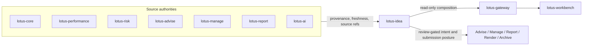
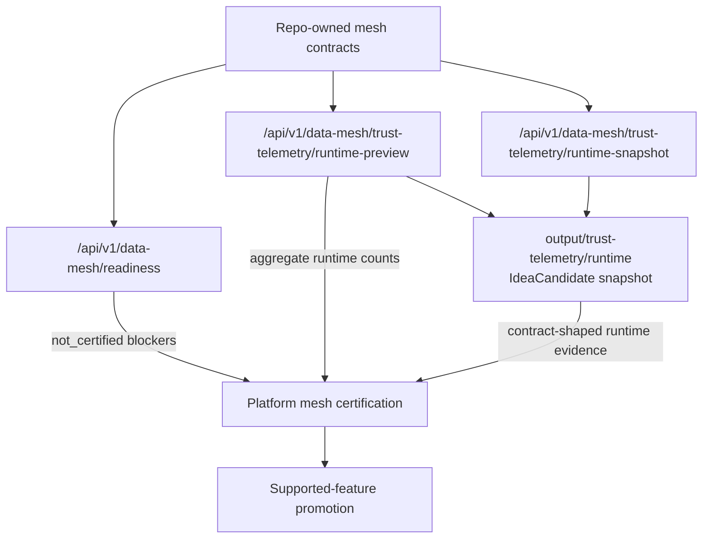

# Architecture

This page explains the current `lotus-idea` service shape, ownership boundary,
and proof-backed module structure.

Current summary: `lotus-idea` remains one deployable domain service with stronger internal bounded
modules. Do not infer separate runtime boundaries, Gateway/Workbench product support,
data-product certification, or supported-feature promotion from these foundations alone.

## How To Read This Page

| Need | Section | Evidence |
| --- | --- | --- |
| Product/service boundary | [Source Authority](#source-authority) | `REPOSITORY-ENGINEERING-CONTEXT.md`, ADRs |
| Data-mesh posture | [Data Mesh Baseline](#data-mesh-baseline) | `contracts/domain-data-products/`, mesh proof gates |
| API and runtime foundations | [Certified API Foundation](#certified-api-foundation) | endpoint ledger, OpenAPI gates |
| Persistence and review foundations | [Persistence Orchestration Foundation](#persistence-orchestration-foundation), [Review Workflow Persistence Foundation](#review-workflow-persistence-foundation) | repository tests, migration gates |
| Modularity decisions | [Architecture Decisions](#architecture-decisions) | `quality/refactor_decisions.md`, ADRs |

## Architecture Principles

| Principle | Current application |
| --- | --- |
| Source authority stays upstream | `lotus-idea` carries source refs, freshness, and evidence; it does not recompute official portfolio, performance, risk, suitability, or report outcomes. |
| Design modularity before runtime modularity | Internal API/domain/application/ports/infrastructure seams are strengthened inside the existing service before any process split is proposed. |
| Proof is scoped | A proof artifact clears only the named blocker it covers; it does not promote unrelated Gateway, Workbench, data-mesh, downstream, or support claims. |
| Support posture is explicit | [Supported Features](Supported-Features) remains the support truth; current foundations are not externally supported features. |

`lotus-idea` is a separate domain service because opportunity intelligence spans
portfolio facts, performance, risk, advisory, management, reporting, AI, gateway,
and Workbench concerns.

## Source Authority

`lotus-idea` consumes official evidence and carries provenance. It does not
recompute official calculations.



| Domain | Source owner |
| --- | --- |
| Portfolio, holdings, cash, mandate, client, product facts | `lotus-core` |
| Performance and attribution | `lotus-performance` |
| Risk, concentration, volatility, stress, scenarios | `lotus-risk` |
| Proposals, suitability, advisory journey | `lotus-advise` |
| Model portfolios, rebalance, DPM actions | `lotus-manage` |
| AI workflows and model/provider execution | `lotus-ai` |
| Report packages | `lotus-report` |
| Rendering | `lotus-render` |
| Archive, retention, legal hold | `lotus-archive` |
| Product composition | `lotus-gateway` |
| User experience | `lotus-workbench` |

## Data Mesh Baseline

Repo-owned proposed mesh declarations live under `contracts/`:



1. `contracts/domain-data-products/lotus-idea-products.v1.json`
2. `contracts/domain-data-products/lotus-idea-consumers.v1.json`
3. `contracts/domain-data-products/mesh-readiness.v1.json`
4. `contracts/trust-telemetry/idea-candidate.telemetry.v1.json`
5. `contracts/mesh-slo/`
6. `contracts/mesh-access/`
7. `contracts/mesh-evidence/`

Certification is not claimed. Products stay `proposed` and the current static
telemetry is blocked until runtime implementation and platform mesh validation
exist.

The internal `GET /api/v1/data-mesh/readiness` endpoint reads the repo-owned
mesh contracts and returns operator-facing `not_certified` posture with
blockers. It is an API-certified diagnostic, not data-product certification,
Gateway discovery, Workbench discovery, or supported-feature promotion.
The blocker list is aligned to platform mesh certification families so missing
source-manifest, catalog, SLO, access, evidence, Gateway/Workbench discovery,
and supported-feature proof stay visible before any product is promoted.

`make mesh-policy-proof-contract-gate` and
`scripts/generate_mesh_policy_proof.py` validate the repo-owned SLO, access,
and evidence-pack policy proof for `IdeaCandidate:v1`. A valid artifact clears
only SLO/access/evidence policy blockers in aggregate implementation readiness;
it is not platform mesh certification, product activation, Gateway/Workbench
discovery, or supported-feature promotion.

The internal
`GET /api/v1/data-mesh/trust-telemetry/runtime-preview` endpoint reads the
active repository provider and returns aggregate runtime telemetry preview
counts for the proposed `IdeaCandidate:v1` product. It omits candidate
identifiers, source routes, evidence hashes, portfolio identifiers, and client
identifiers. It is pre-certification runtime evidence only; platform mesh
certification and product promotion remain planned.

The internal
`GET /api/v1/data-mesh/trust-telemetry/runtime-snapshot` endpoint returns the
corresponding contract-shaped runtime snapshot for operators with
`idea.mesh.trust-telemetry.snapshot.read`. It uses aggregate active-repository
state only and does not expose candidate identifiers, source routes, evidence
hashes, portfolio identifiers, or client identifiers.

When PostgreSQL is active, runtime trust telemetry preview and snapshot reads
use a repository-side aggregate projection over candidate and workflow tables
instead of hydrating audit, outbox, downstream-submission, lifecycle-history,
idempotency, or AI-lineage state. Process-local providers can still use the
snapshot fallback.

Candidate-detail response DTOs live in `app.api.candidate_detail_models` behind
the existing `app.api.candidate_detail` route surface. This is design
modularity only: the route still performs caller authorization,
entitlement-scope filtering, product-safe error handling, and bounded
operation-event emission in the same API process. The response model remains
source-safe and does not expose raw source routes or source content hashes.

`make runtime-trust-telemetry-snapshot-check` writes the same contract-shaped
runtime snapshot to
`output/trust-telemetry/runtime/idea-candidate.telemetry.v1.json`. The snapshot
is source-safe generated evidence and remains blocked until platform
source-manifest inclusion, mesh certification, Gateway/Workbench discovery, and
supported-feature promotion are implemented.

The first consumer contract expansion is source-authority only. It prepares the
high-cash / idle-liquidity path around Core-owned cash and holdings products,
and records later first-wave Performance, Risk, Advise, Manage, Report, and AI
dependencies without certifying runtime behavior.

Operation telemetry uses the same governed source-authority vocabulary as the
domain source-system model: `lotus-core`, `lotus-performance`, `lotus-risk`,
`lotus-advise`, `lotus-manage`, `lotus-report`, `lotus-render`,
`lotus-archive`, `lotus-ai`, plus local `lotus-idea` and aggregate
`source-owned`. Runtime `OperationEvent` validation, operation metric
contracts, operator workflow contracts, and dashboard/alert proof gates all
consume this code-owned vocabulary so observability cannot drift into partial
allowlists or source-sensitive labels.

## Source-Port Foundation

RFC-0002 Slice 05 now includes the first Core source-port foundation.
`src/app/ports/core_sources.py` defines the high-cash evidence port,
`src/app/application/high_cash_signal.py` orchestrates evaluation through that
port, and `src/app/infrastructure/lotus_core_sources.py` provides a
conservative HTTP adapter over Core source-data product routes. The adapter
preserves Core source refs, consumes `totals.source_reported_cash_weight` only
when Core reports supported cash-weight posture, and does not infer cash weight
from cash totals or portfolio market values. Live Core proof is captured
through the governed source-ingestion proof path; it clears only the matching
source blocker and does not imply mesh, Gateway/Workbench, or supported-feature
certification.

Slice 05 also includes direct source-product ref adapters for mandate health.
`lotus-idea` can preserve
`lotus-performance:MandatePerformanceHealthContext:v1` and
`lotus-risk:MandateRiskHealthContext:v1` refs when source-owned period-return
or return-observation facts are supplied. The adapters validate the upstream
source product identity and preserve request-fingerprint lineage; they do not
calculate active return, tracking error, performance health, risk health,
mandate approval, rebalance action, or execution posture. Governed
source-backed routes now cover the supported Core, Risk, Performance, Manage,
and Advise signal families, and clean-tree canonical Risk/Performance proof
exists for the governed portfolio. Full source-worker operational proof,
Gateway/Workbench support, data-product certification, and supported-feature
promotion remain blocked.

## Certified API Foundation

### Signal Request Boundary

Caller-supplied signal routes use one ordered boundary:

```text
External consumer
  -> route/controller
  -> request DTO mapper
  -> application use case
  -> domain policy and candidate model
  -> port
  -> infrastructure adapter
  -> source API or persistence boundary
```

`app.api.signal_api_support.evaluate_caller_supplied_signal` centralizes the
shared entitlement, source-contract, operation-event, and response-projection
steps before the route-specific application evaluator runs.

`app.api.signal_api_support.evaluate_source_signal` centralizes the equivalent
source-backed sequence: entitlement and scope checks, runtime construction,
fail-closed dependency response, DTO-to-command callback, application
evaluation, operation event, response projection, and runtime cleanup. Each
route still supplies its concrete runtime factory, command mapper, application
use case, and source port; the shared helper prevents lifecycle-order drift.
The `signal-api-contract-gate` blocks source-backed routes that bypass this
boundary. This is design modularity inside one process, not a new runtime
service or process boundary.

The versioned `idea-source-temporal-v1` policy in
`app.domain.source_temporal` reconciles consumer `asOfDate` and
`evaluatedAtUtc` with every included source reference. Exact business-date
mismatches, future-generated evidence, and stale optional cross-domain refs
return bounded blocked posture before candidate creation or persistence. The
same policy governs caller-supplied, adapter-returned, and source-ingestion
evidence. Source corrections preserve changed content hashes in lineage and
produce new candidate identity; no effective-date window is inferred.

### Canonical Source-Proof Runner

`scripts/run_canonical_opportunity_source_proofs.py` is an operator automation
boundary over the existing source-proof generators. It invokes Risk
concentration, Performance underperformance, and Performance
benchmark-readiness proof use cases, validates each returned artifact, and
writes one aggregate result. It records source revision, dirty-tree status,
correlation, and trace IDs while suppressing child process output.

The runner is not a new runtime service and does not move source authority into
`lotus-idea`. A blocked or stale upstream result makes the aggregate
`certificationReady=false`; a valid child proof clears only its named source
blocker. Use [Canonical Opportunity Source Proofs](Canonical-Opportunity-Source-Proofs)
for the preconditions, command, and current non-proof boundaries.

`POST /api/v1/idea-signals/high-cash/evaluate` and
`POST /api/v1/idea-signals/high-cash/evaluate-and-persist` are the first
certified internal API foundations. They evaluate caller-supplied, source-owned
Core evidence and source-reported cash weight, then return deterministic
high-cash signal posture. The persist variant requires `Idempotency-Key` and
`idea.candidate.persist`, writes through the active idea repository provider,
and reports `durableStorageBacked` from that provider. Default local runtime is
process-local and reports `false`; `demo`, `staging`, and `production` require
`LOTUS_IDEA_DATABASE_URL`, degrade `/health/ready`, and return
`durable_repository_not_configured` before mutating in-memory state when durable
storage is absent. When configured PostgreSQL cannot initialize, readiness and
write-capable routes fail closed with `durable_repository_unavailable` instead
of falling back to process-local mutation or leaking raw driver details.
Runtime configured with a reachable `LOTUS_IDEA_DATABASE_URL` uses the
PostgreSQL adapter and reports `true` for repository-backed routes. These
endpoints do not retrieve live source data, certify a data product, expose a
Gateway route, or promote a supported business feature.

`POST /api/v1/idea-signals/underperformance/evaluate`,
`POST /api/v1/idea-signals/high-volatility/evaluate`,
`POST /api/v1/idea-signals/drawdown-review/evaluate`,
`POST /api/v1/idea-signals/allocation-drift/evaluate`,
`POST /api/v1/idea-signals/missing-suitability/evaluate`,
`POST /api/v1/idea-signals/missing-risk-profile/evaluate`, and
`POST /api/v1/idea-signals/mandate-restriction/evaluate` extend the same
internal certified API pattern to caller-supplied source-owned evidence. They
are design-module/API foundations inside the `lotus-idea` domain service, not
separate runtime microservices. They do not calculate returns, volatility, or drawdown,
assign benchmarks, calculate allocation drift, certify benchmark or Risk
methodology, approve suitability, policy, proposal, sign-off, restriction
clearance, mandate state, rebalance actions, orders, client
publication, data-mesh certification, Gateway/Workbench behavior, or
supported-feature promotion.

API modules share the active repository provider through
`src/app/runtime/repository_state.py`. Signal, review, feedback, queue, and
lifecycle routes must use that provider so API modules do not create duplicate
candidate stores. The provider defaults to an in-memory repository and selects
`PostgresIdeaRepository` when `LOTUS_IDEA_DATABASE_URL` is configured. Runtime
profile and durable-write posture belong in `src/app/runtime/settings.py` so
API modules consume typed posture helpers instead of reading environment values
directly. Runtime composition for repositories, source-ingestion adapters,
outbox publishers, and downstream realization clients belongs in
`src/app/runtime/`, outside the API layer and app root.

Application use cases depend on repository workflow protocols from
`src/app/ports/idea_repository.py`. Candidate snapshots, candidate persistence,
lifecycle mutation, evidence replay, review and feedback mutation, conversion
mutation, report evidence-pack requests, and AI explanation reads must use
those central ports instead of declaring local repository protocols. This keeps
durable storage behind one governed contract surface while default
process-local and configured PostgreSQL-backed runtime postures remain
truthful.

Domain persistence data contracts are separated from repository behavior:
`src/app/domain/persistence_models.py` owns immutable persistence decisions,
records, results, lifecycle history, and snapshots, while
`src/app/domain/persistence.py` keeps the existing public import surface and
`InMemoryIdeaRepository` behavior. This is design modularity inside the same
runtime deployable, not a persistence service split.

Domain signal evaluation data contracts are separated from evaluator behavior:
`src/app/domain/signal_evaluation_models.py` owns immutable signal inputs,
policies, outcomes, and result contracts, while
`src/app/domain/signal_evaluation.py` keeps deterministic evaluator algorithms
and the existing public import surface. This is design modularity inside the
same runtime deployable, not a signal-evaluation service split. Signal policies
continue to consume source-owned posture and deterministic thresholds;
lotus-idea does not own portfolio accounting, official performance, risk,
benchmark assignment, suitability, compliance, rebalance execution, report
rendering, archive authority, or AI infrastructure.

`migrations/001_idea_repository_foundation.sql` and its rollback file define the
first governed schema contract for future durable candidate, idempotency,
lifecycle, audit, outbox, review, feedback, conversion, and report
evidence-pack state. The migration contract and execution dry-run are
CI-blocking, and real execution uses `make migrate` / `make migrate-rollback`
with `LOTUS_IDEA_DATABASE_URL`.
Runtime API repository wiring uses this adapter when `LOTUS_IDEA_DATABASE_URL`
is configured after migrations are applied. `make postgres-integration-gate`
now proves high-cash API persistence/replay and the first internal review,
feedback, conversion, report evidence-pack, and advisor queue workflow path
against a real PostgreSQL 18 service, including schema apply, provider reload,
idempotency replay from database state, internal source-ingestion
replay/conflict recovery, backing table validation, and schema rollback/reapply
recovery. The application layer also has a manifest-backed run-once
source-ingestion worker CLI with manifest and source-safe check-only output
validation through `make source-ingestion-worker-check`, a bounded scheduled
worker entrypoint and opt-in Docker Compose worker profile validated by
`make source-ingestion-scheduled-worker-check`, plus a source-safe live Core
proof artifact contract validated by
`make source-ingestion-live-proof-contract-gate`. Production storage readiness
still requires deploy migration evidence, mesh certification, platform mesh
event publication proof, downstream delivery evidence, and live
event-publication evidence beyond the internal outbox retry/dead-letter,
publisher-adapter, bounded broker proof, and bounded downstream consumer
runtime proof foundations.
`GET /api/v1/source-ingestion/readiness` now exposes the internal operator
readiness posture for that run-once worker configuration and certification
blockers without calling Core, certifying live source ingestion, or promoting a
supported feature. A valid scheduled-worker proof artifact can clear only the
scheduled-worker blocker; it does not clear live Core, data-mesh,
Gateway/Workbench, downstream, or supported-feature blockers.
`POST /api/v1/source-ingestion/run-once` exposes the same bounded
source-ingestion batch foundation through the service boundary for operators.
It requires durable repository posture plus configured manifest and Core
source settings, caps `maxItems` and `workItems` at 100, blocks before mutation
when those inputs are absent, invalid, or above the run-once ceiling, closes
owned Core HTTP runtime clients after accepted or source-unavailable execution,
and returns aggregate decision counts only.
The route imports source-ingestion readiness and run-once DTOs from
`src/app/api/source_ingestion_readiness_models.py`, while runtime composition,
caller authorization, cleanup, operation events, and route metadata remain in
`src/app/api/source_ingestion_readiness.py`. This is design modularity inside
the existing service, not a new source-ingestion service, worker boundary, data
product, Gateway/Workbench product surface, or supported-feature promotion.
`GET /api/v1/outbox-delivery/readiness` now exposes the internal operator
readiness posture for outbox delivery foundation state. It reports aggregate
status counts, due delivery-ready backlog, durable repository posture, broker
configuration posture, publisher-adapter presence, and certification blockers.
PostgreSQL-backed readiness computes status, expired-lease, and due
ready-count posture through repository-side `idea_outbox_event` projections
instead of a whole idea repository snapshot. Failed rows below the retry limit
are not delivery-ready until their durable `next_attempt_at_utc` is due;
expired leases remain immediately recoverable.

The same projection now returns the oldest actionable time. An internal
Prometheus collector invokes the application use case at scrape time and emits
fixed-label state, age, configuration, and collection gauges. Dashboard and
alert adapters consume those gauges separately from operation-event request
volume. This is design modularity inside the existing API runtime; workload,
failure-isolation, ownership, and operability evidence do not justify a
separately deployed metrics or outbox service.
`POST /api/v1/outbox-delivery/run-once` exposes the bounded internal operator
action for one delivery pass through the active repository and configured
publisher adapter. It requires `Idempotency-Key`, binds the operator run
identity to safe request parameters and caller subject, fails closed when
broker configuration is absent or invalid, and both endpoints avoid event ids,
aggregate ids, raw idempotency keys, source payloads, broker payloads,
downstream delivery contracts, or a supported-feature claim. Same-key /
same-request retries replay without mutation, same-key / different-request
reuse returns product-safe conflict, and responses expose only a source-safe
`operatorRunReference`.
The repo-owned downstream consumer contract at
`contracts/outbox-events/lotus-idea-outbox-consumers.v1.json` declares Gateway,
Advise, Manage, and Report as downstream consumers with source-authority
boundaries and keeps them not runtime certified. It changes the outbox blocker
taxonomy from missing consumer contracts to missing consumer runtime proof.
Outbox event lineage is governed separately from business payload and
idempotency. Every mutation event persists required correlation and trace,
optional parent-event causation, and an explicit lineage origin through API,
application, repository, PostgreSQL, and publisher layers. Migration `007`
preserves legacy events while sanitizing unsafe identifiers. Replays keep the
original durable lineage. See the repository architecture decision
[`docs/architecture/outbox-event-lineage.md`](https://github.com/sgajbi/lotus-idea/blob/main/docs/architecture/outbox-event-lineage.md).

`POST /api/v1/idea-candidates/{candidateId}/review-actions` and
`POST /api/v1/idea-candidates/{candidateId}/feedback` are certified internal
review workflow API foundations. They require mutating capabilities, caller
role, upstream-authorized tenant/book/portfolio/client scope, and
`Idempotency-Key`. They record review decisions or feedback through the active
repository provider and return product-safe conflict, not-found, and permission
posture without granting downstream suitability, compliance, mandate, execution,
or client-communication authority.
The shared route orchestration for these mutations lives in
`app.api.review_workflow_operations`, which centralizes caller parsing,
mutating capability checks, trusted entitlement-scope validation, idempotency
validation, durable-write blocking, operation-event mapping, and product-safe
persistence problem mapping. This is an internal design-modularity boundary
inside the existing lotus-idea API process; it is not a separate runtime
service, queue, or independently scalable deployment.

`POST /api/v1/idea-candidates/{candidateId}/conversion-intents` and
`POST /api/v1/conversion-intents/{conversionIntentId}/outcomes` use the same
internal design-modularity pattern through
`app.api.conversion_governance_operations`. That helper centralizes conversion
caller parsing, mutating capability checks, idempotency validation,
durable-write blocking, operation-event mapping, and product-safe persistence
problem mapping while preserving the route-owned OpenAPI contract and DTOs.
It is not a runtime service split. Conversion remains a review-gated local
intent/outcome posture and does not grant downstream execution, suitability,
compliance, rebalance, render/archive, or client-communication authority.

`POST /api/v1/idea-candidates/{candidateId}/lifecycle-transitions` is the
certified internal lifecycle transition API foundation. It requires
`idea.candidate.lifecycle.transition` plus `Idempotency-Key`, applies the
canonical domain lifecycle graph, records lifecycle history and audit evidence,
and returns replay/conflict/not-found/invalid-transition posture. Request input
uses a caller-settable lifecycle vocabulary that excludes `accepted` and
`executed`; those downstream-authority posture values remain readable only in
stored/response vocabulary and must come from conversion outcome or downstream
submission source-authority contracts. The lifecycle route does not grant
downstream proposal, manage-review, report, execution, or client-communication
authority.

`GET /api/v1/review-queues/advisor` is the certified internal advisor queue API
foundation. It projects persisted candidate snapshots through the deterministic
Slice 07 queue policy, applies optional tenant/book/portfolio/client scope
filters, applies platform caller-context entitlement scope when provided, and
returns ranked items plus exclusions through bounded `limit`/`offset` paging
with default 25 and max 100. Durable PostgreSQL providers use a repository-side
candidate projection with expression-index-backed tenant/book/portfolio/client
scope predicates instead of whole-store snapshot hydration. `evaluatedAtUtc`
is the inclusive candidate-created-at boundary, while source as-of and evidence
generation dates retain their source-authority meaning. Page metadata carries
opaque identity bound to evaluation time, scope, ranking policy, and visible
candidate state; continuation offsets require it and changed state fails with
a stable snapshot conflict. PostgreSQL verifies the fingerprint before and
after each page query. This remains a
bounded foundation API rather than a production queue-store claim.
`lotus-gateway` publishes this as a
bounded read-only route at `GET /api/v1/ideas/review-queues/advisor`, forwards
the caller entitlement-scope headers, and does not generate or rank ideas.
Advisor queue and readiness response DTOs live in
`src/app/api/review_queue_models.py`; `src/app/api/review_queues.py` retains
authorization, entitlement narrowing, repository access, operation events, and
route metadata. This is an internal design boundary, not a separate queue
service or Workbench product boundary.

`GET /api/v1/review-queues/advisor/readiness` is the certified internal
operator diagnostic for queue supportability. Durable PostgreSQL providers use
a repository-side aggregate projection over `idea_candidate_record` for
candidate counts, exclusion counts, scope mismatch counts, score posture, and
repository-side readiness posture instead of whole-store snapshot hydration.
Snooze-aware and process-local evaluations retain the domain snapshot fallback.
The endpoint does not expose
candidate identifiers or access-scope identifiers, and it is not a Gateway
route, Workbench proof, data-product certification, PM/compliance queue
surface, client-ready publication, or supported-feature promotion.

`GET /api/v1/idea-candidates/{candidateId}` is the certified internal
source-safe candidate detail API foundation. It reads persisted candidate
snapshots and returns redacted source evidence, lifecycle history, review,
feedback, conversion, report-evidence, and audit summary posture without source
route disclosure, raw evidence export, downstream authority, Workbench proof,
data-product certification, or supported-feature promotion. `lotus-gateway`
publishes this as a bounded read-only route at
`GET /api/v1/ideas/candidates/{candidate_id}` while preserving `lotus-idea`
source authority and forwarding caller entitlement-scope headers for
`lotus-idea` fail-closed access checks. Durable PostgreSQL providers now serve
ordinary candidate-detail reads through a repository-side projection over the
requested candidate and related detail rows instead of hydrating whole
repository snapshots; this is an internal module boundary, not a separate
runtime service.
Review-action, feedback, conversion-intent request, and AI explanation
evaluation workflows reuse the same bounded candidate lookup before domain
evaluation when the repository exposes the projection. Older/process-local
providers can still fall back to `snapshot()`, and workflow writes remain on
the existing repository mutation path for idempotency, audit, lifecycle,
conversion, and AI-lineage persistence.

`POST /api/v1/idea-candidates/{candidateId}/evidence-replay` is the certified
internal candidate evidence replay API foundation. It compares caller-supplied
current source refs with persisted evidence hashes and returns matched,
stale-source, hash-mismatch, expired, or missing-candidate posture without
calling Core, exposing raw source routes, granting downstream authority,
certifying data products, proving Gateway/Workbench behavior, or promoting a
supported feature.

`POST /api/v1/idea-candidates/{candidateId}/ai-explanations/evaluate` is the
certified internal AI explanation evaluator foundation. It evaluates
deterministic fallback or supplied workflow output against persisted candidate
evidence, redacts source refs, blocks unsupported claims and forbidden actions,
requires `Idempotency-Key`, records source-safe lineage through the active
repository mutation path, and emits bounded `ai_explanation` operation events.
Same-key/same-request calls replay without duplicate lineage writes,
same-key/different-request calls return product-safe
`409 idempotency_conflict`, and distinct-key AI request-id replay/conflict
remains governed by the lineage store. It does not call providers, execute
`lotus-ai` runtime workflows, grant downstream authority, expose a
Gateway/Workbench surface, authorize client-ready publication, or promote a
supported feature. Source-safe lineage persistence is proven separately by the
AI lineage store proof artifact.

AI explanation request and response DTOs live in
`src/app/api/ai_governance_models.py`, while
`src/app/api/ai_governance.py` keeps authorization, idempotency,
durable-write checks, operation-event emission, route metadata, and response
handling. This is an internal design-modularity boundary inside the same
runtime deployable, not an AI governance service split or an AI execution
runtime. The route still does not call providers, own prompts/provider
payloads, execute `lotus-ai` runtime workflows, grant downstream authority, or
promote a supported feature.

Outbox delivery readiness, status-count, and run-once response DTOs live in
`src/app/api/outbox/delivery_models.py`, while
`src/app/api/outbox/delivery.py` keeps operator caller checks,
idempotency validation, durable-write blocking, publisher cleanup,
operation-event emission, route metadata, and response handling. This is an
internal design-modularity boundary inside the same runtime deployable, not a
broker-publication service split or separately scalable outbox delivery
runtime. The route remains an internal operator foundation and still does not
certify live broker publication, downstream consumer runtime, platform mesh
event publication, Gateway/Workbench support, data-product certification, or
supported-feature promotion.

### Outbox Capability Ownership

Outbox code is grouped by capability inside the existing runtime layers:

| Layer | Ownership |
| --- | --- |
| `app.api.outbox` | Protected delivery, readiness, recovery routes, and DTOs. |
| `app.application.outbox` | Delivery/recovery orchestration and bounded proof evaluation. |
| `app.domain.outbox` | Event lineage, delivery/recovery transitions, and in-memory write behavior. |
| `app.ports.outbox` | Broker publisher protocol. |
| `app.infrastructure.outbox` | PostgreSQL persistence and source-safe HTTP publisher adapter. |
| `app.runtime.outbox` | Process-local publisher composition. |
| `app.observability.outbox` | Aggregate supportability metrics. |
| `scripts/outbox` | Proof generators and contract gates. |

Focused unit and integration proofs mirror the capability under
`tests/*/outbox/`. The package adds no deployable or database: API and optional
worker roles still use one Idea-owned PostgreSQL boundary, and external broker,
consumer-runtime, and platform-mesh certification remain explicit blockers.
Shared implementation-proof consumers remain outside the package because
their primary ownership is proof aggregation, not outbox state.

Runtime trust telemetry preview, product posture, snapshot, freshness, lineage,
blocking, and evidence response DTOs live in
`src/app/api/runtime_trust_telemetry_models.py`, while
`src/app/api/runtime_trust_telemetry.py` keeps operator caller checks, timezone
query validation, aggregate preview/snapshot construction, operation-event
emission, route metadata, and response handling. This is an internal
design-modularity boundary inside the same runtime deployable, not a telemetry
service split, platform mesh certification process, or separately scalable
mesh-publication runtime. The route remains source-safe internal readiness
evidence and still does not certify data products, platform mesh,
Gateway/Workbench support, client publication, or supported-feature promotion.

High-cash and mandate-restriction idea-signal request/response DTOs live in
`src/app/api/idea_signal_models.py`, while `src/app/api/idea_signals.py` keeps
caller checks, source-ref authority validation, candidate persistence
orchestration, operation-event emission, route metadata, and response handling.
This is an internal design-modularity boundary inside the same runtime
deployable, not a separate idea-signal service, source-ingestion runtime, or
independently scalable signal evaluation path. The endpoints continue to
consume caller-supplied source-owned evidence and do not calculate official
portfolio, suitability, risk, performance, execution, or report facts.

Core-backed signal routes also require exactly one trusted tenant in the
caller context before constructing a source runtime. The resolved tenant flows
through the application command and `Core*EvidenceRequest` port into each
tenant-aware Core snapshot payload. It is also retained in candidate access
scope, deterministic candidate identity, and generated ingestion idempotency
identity. The adapter does not fall back to `default`, and it does not invent
tenant parameters for Core routes that do not publish them. Portfolio-only
scope checks treat the internal `unknown` sentinel as unconstrained for
non-Core paths; Core-backed candidates may not use it as their tenant. The
source API and trusted-tenant context gates protect this boundary. Operation
events publish only bounded scope-provenance posture, never raw tenant IDs.

Conversion-intent and conversion-outcome request/response DTOs live in
`src/app/api/conversion_governance_models.py`, while
`src/app/api/conversion_governance.py` keeps caller checks, idempotency,
conversion workflow persistence, operation-event emission, route metadata, and
response handling. This is an internal design-modularity boundary inside the
same runtime deployable, not a separate conversion service, downstream
execution boundary, report materialization boundary, or independently scalable
conversion runtime. The routes record governed intent/outcome posture and do
not grant Advise, Manage, Report, suitability, execution, render, archive, or
client-communication authority.

Review-action and feedback request/response DTOs live in
`src/app/api/review_workflow_models.py`, while
`src/app/api/review_workflow.py` keeps caller checks, entitlement-scope
validation, idempotency, review workflow persistence, operation-event emission,
route metadata, and response handling. This is an internal design-modularity
boundary inside the same runtime deployable, not a separate review service,
compliance approval runtime, or independently scalable human-review runtime.
The routes record idea review/feedback posture and do not approve suitability,
compliance, mandates, execution, reporting, or client communication.

`GET /api/v1/ai-explanations/readiness` is the certified internal AI
explanation readiness diagnostic. It returns guardrail availability,
`not_certified` model-risk supportability, and certification blockers for
operators without invoking `lotus-ai`, exposing prompts/provider payloads,
disclosing candidate or source-route identifiers, certifying durable AI
lineage by itself, exposing a Gateway/Workbench surface, or promoting a
supported feature.

`GET /api/v1/implementation-proof/readiness` is the certified internal
aggregate RFC-0002 proof-readiness diagnostic. It reports source-safe
capability blockers across source ingestion, advisor queue, AI explanation,
data mesh, runtime trust telemetry preview/snapshot evidence, outbox delivery,
non-AI operator workflow operations, Workbench realization, downstream realization, and supported-feature
promotion. It is not live implementation proof, certified live broker runtime, downstream
delivery, data-product certification, certified runtime trust telemetry,
Gateway/Workbench proof, client-ready publication, or supported-feature
promotion.

`GET /api/v1/downstream-realization/readiness` is the certified internal
operator diagnostic for downstream realization supportability. It reports
current conversion intent/outcome counts, report evidence-pack request counts,
source-of-truth paths, planned Advise/Manage/Report downstream contract
readiness, and blocker groups for `lotus-advise`, `lotus-manage`,
`lotus-report`, `lotus-render`, and `lotus-archive`. Planned contract records
name the owning repository and adapter posture from
`contracts/downstream-realization/lotus-idea-downstream-contracts.v1.json`, and
`make downstream-realization-contract-gate` keeps them planned and
not-certified. Source-safe route-foundation proof artifacts can move the
Advise, Manage, or Report target route from planned posture to the proved
route only when merged sibling evidence is present. These artifacts are route
evidence only; they are not suitability, mandate/rebalance, execution,
materialization, or supported-feature proof.
When PostgreSQL is active, the readiness counts come from a repository-side
projection over `idea_conversion_intent`, `idea_conversion_outcome`, and
`idea_report_evidence_pack_request` rather than whole-store snapshot
hydration. The endpoint does not call downstream services, create
proposals, create manage actions, materialize reports, render output, archive
records, authorize client-ready publication, or promote a supported feature.

`POST /api/v1/conversion-intents/{conversionIntentId}/downstream-submissions`
and
`POST /api/v1/report-evidence-packs/{reportEvidencePackId}/downstream-submissions`
are certified internal submission foundations. They require
`idea.downstream-realization.submit` and `Idempotency-Key`, use configured
source-safe Advise, Manage, and Report adapters after a local idempotency
ledger precheck, propagate correlation/trace context, and return submission
posture only. Same-key/same-fingerprint requests replay stored posture without
another adapter call, changed-fingerprint reuse returns
`409 idempotency_conflict`, and missing adapter configuration is persisted as a
replayable `503 downstream_realization_not_configured` posture. Durable
PostgreSQL providers use bounded conversion-intent and report evidence-pack
lookup queries before adapter calls instead of hydrating whole repository
snapshots. They do not
record authoritative downstream outcomes, prove downstream route existence,
grant suitability/execution/publication authority, or promote a supported
feature.

## Persistence Orchestration Foundation

The internal application layer can now evaluate high-cash evidence and persist
created candidates through the Slice 06 idempotency/audit repository contract.
Repeated requests with the same idempotency payload replay, changed payloads
conflict, and blocked, suppressed, or not-eligible evaluations do not mutate
state. The evaluate-and-persist API exposes this as an internal certified
foundation and reports repository-backed storage posture from the active
provider; it is not a supported product workflow.

The internal application layer can now also replay persisted candidate evidence
posture against caller-supplied current source refs. This is an operator
diagnostic over repository state, not live source ingestion or downstream
workflow authority.

The internal application layer can now also record idempotent lifecycle
transitions for persisted candidates. This closes the foundation gap between
generated high-cash candidates and review-ready candidates without weakening the
domain transition graph or review approval rules.

The repository now has a versioned schema and rollback contract for the durable
repository, a PostgreSQL migration execution CLI, and a tested
`PostgresIdeaRepository` adapter behind the central repository ports. API write
state is process-local only for `local`/`test` profiles and PostgreSQL-backed
when `LOTUS_IDEA_DATABASE_URL` is configured; production-like profiles fail
closed before in-memory mutation when durable storage is absent. Normal
PostgreSQL repository mutations apply row-delta inserts and candidate-row
updates rather than table-wide snapshot replacement, preserving unrelated rows
when independent mutations are applied from the same starting state. Candidate
updates use an optimistic `updated_at_utc` compare-and-set guard to reject
stale same-candidate snapshots before detail rows or outbox events commit.
Idempotency inserts retain PostgreSQL conflict detection as a final race guard.
The focused `app.infrastructure.persistence` package now composes every
ordinary mutation from exact identity, sorted candidate, and idempotency locks;
it loads only command or identity-linked aggregates before the existing domain
decision and atomic delta. Outbox run requests are idempotency-row-only,
evidence replay is candidate-only, and report precheck is exact-key plus linked
candidate. Full snapshots remain explicit administrative/test/DR behavior.
A disposable PostgreSQL 18 lane passes all 17 required tests. No database,
schema, process, API, migration, source-authority, or supported-feature boundary
was added.

This bounded mutation increment is merged on main through PR `#365` at
`69326064`. Main Releasability `29239140276` and CodeQL `29239134509` passed
for that exact commit, and wiki publication `8386705` is synchronized. Issues
`#363` and `#364` are closed; external Slice 06 certification blockers remain
explicitly separate from this internal database-access hardening.

The real PostgreSQL runtime proof now covers high-cash evaluate-and-persist
replay plus the first internal advisor queue, review, feedback, conversion,
report evidence-pack workflow path, and internal source-ingestion
replay/conflict recovery. Unit tests also prove the
bounded run-once source-ingestion batch worker foundation and the
manifest-backed worker CLI check-only contract. Integration tests now prove the
operator run-once route's durable-storage guard, runtime-configuration guard,
configured execution path, permission policy, source-safe response, and
bounded `source_ingestion_run_once` operation event.
Accepted internal mutations now also append source-safe outbox records through
the same repository snapshot contract. The repository port and PostgreSQL
adapter support delivery-ready reads, lease claims, owner-aware published
status, failed retry status, and dead-letter status, while
`src/app/application/outbox/delivery.py` orchestrates a run-once
publisher-port pass that claims a bounded batch before broker publication and
returns aggregate source-safe counts.
`src/app/ports/outbox/publisher.py` owns the publisher port, and
`src/app/infrastructure/outbox/publisher.py` provides the source-safe HTTP
publisher adapter foundation with bounded envelopes, trace headers, and
product-safe failure reasons.
`src/app/domain/outbox/events.py`, the PostgreSQL foundation schema,
`003_outbox_event_contract_constraints.sql`, and
`make outbox-event-contract-gate` now enforce the same v1 event-family,
candidate aggregate-type, schema-version, and source-safe payload contract at
construction, replay, database-upgrade, and governance time.
`src/app/application/outbox/readiness.py` and
`GET /api/v1/outbox-delivery/readiness` add aggregate operator visibility over
that foundation, including leased and expired-lease posture, without mutating
records or publishing events.
`POST /api/v1/outbox-delivery/run-once` adds the protected internal operator
surface for a single bounded delivery pass and returns aggregate counts only.
This is not certified external publication, a Gateway event, platform mesh
event publication, downstream delivery, or a supported feature.
`src/app/application/downstream_realization.py` adds source-safe submission
orchestration for existing Advise/Manage conversion intents and Report
evidence-pack requests while leaving authoritative downstream outcome truth in
the owning services. `src/app/ports/downstream_realization.py` and
`src/app/infrastructure/downstream_realization.py` also provide source-safe
HTTP adapter foundations for Advise, Manage, and Report handoff envelopes. They
preserve downstream source authority and bounded evidence posture, but they are
not live downstream contract proof, route-existence proof, or materialization
proof.

Downstream realization now uses a durable claim-before-call state machine.
Design modules separate domain transitions, in-memory persistence, PostgreSQL
persistence, orchestration, transport adapters, operator reconciliation, and
API DTOs behind stable ports; they remain in the same runtime because no
independent scaling or failure-isolation case has been demonstrated. A newly
accepted claim is the only posture allowed to reach a downstream adapter.
Timeout, 5xx, malformed response, transport ambiguity, lease loss, or local
finalization failure becomes `reconciliation_required` or retains the durable
`in_flight` claim. Same-key retries never make another external call.

Migration `008_downstream_submission_state_machine` persists an opaque support
reference, attempt count, lease identity and expiry, update time, and append-only
audit history. PostgreSQL uses exact locked lookup and lease-fenced updates.
Operator reconciliation is role-and-capability protected, binds
`Idempotency-Key` to `changeReference`, and can record accepted, rejected, or
quarantined local posture only after source-owned receipt verification. It does
not create an authoritative conversion outcome or grant downstream authority.
This opt-in wiring and proof are not data-product certification, live-source
support, Gateway/Workbench support, downstream realization, or
supported-feature promotion.

## Review Queue Projection Foundation

The internal application layer can project persisted candidate snapshots into
deterministic advisor review queues by delegating to the Slice 07 scoring and
queue policy. The projection preserves score-versioned ordering, suppression,
expiry, snooze, unsupported-evidence, and duplicate exclusions without adding a
second queue implementation. It is not yet a public API, Workbench surface,
database-backed queue product, or certified data product.

## Review Workflow Persistence Foundation

### Candidate State Invariant

Lifecycle and review posture are governed together by
`idea-candidate-state-v1`. The policy defines an exhaustive compatibility
matrix, rejects contradictory construction and PostgreSQL rehydration, and
normalizes `expired` and `closed` candidates to `no_action`. Every review action
uses an explicit lifecycle matrix; terminal candidates cannot be suppressed,
snoozed, or escalated back into an actionable queue state.

PostgreSQL queue and readiness projections derive eligibility from the same
domain policy. Migration `005_candidate_state_policy` copies contradictory
legacy rows into `idea_candidate_state_quarantine`, blocks new contradictions,
and reports historical rows as `invalid_state` until controlled reconciliation.
The implementation remains an internal bounded module because no scaling,
failure-isolation, ownership, or operability evidence justifies a separate
runtime service.

The internal application layer can apply governed advisor review actions and
feedback after bounded candidate lookup, then persist accepted decisions,
feedback events, safe audit evidence, lifecycle history, and idempotency
replay/conflict posture through the Slice 06 repository contract.

### Review And Feedback Resource Identity

`reviewId` and `feedbackId` are durable business-resource identities, not
aliases for `Idempotency-Key`. Identity binds candidate, evidence, actor,
action/outcome, reasons, event time, and resource-specific lineage. Equivalent
content under another transport key replays before lifecycle mutation; changed
content returns `review_identity_conflict` without exposing prior content.

PostgreSQL claims review or feedback primary-key identity before candidate,
audit, and outbox writes. A collision rolls back and retries once from fresh
state, converging to replay or typed conflict without duplicate side effects or
raw database errors. This remains an internal bounded module; a runtime service
split has no workload, failure-isolation, ownership, or operability evidence.
Gateway/Workbench functionality and supported review-product promotion remain
planned.

### Conversion Outcome Identity And Current Posture

`conversionOutcomeId` is a source-event resource identity; `Idempotency-Key`
is only the HTTP retry identity. Each intent stream has contiguous
`sourceEventVersion` ordering and explicit legal transitions. A terminal source
fact can change only through an append-only next-version event that links the
superseded current outcome and states a correction reason.

Candidate detail preserves full `conversionOutcomes` history and separately
returns `currentConversionOutcomes` only for policy-valid streams. PostgreSQL
atomically protects outcome ID and intent/version. Migration 006 preserves
contradictory legacy rows, copies them to a quarantine ledger, and excludes
those streams from readiness instead of inventing a current posture.

This is an internal policy/application/port/adapter module set in the existing
service. Advise, Manage, and Report retain outcome authority; no suitability,
execution, rebalance, report, archive, client-publication, or supported-feature
authority moves into `lotus-idea`. See the deep architecture decision in
`docs/architecture/conversion-outcome-identity-and-lifecycle.md`.

## Architecture Decisions

ADRs live in `docs/architecture/adr/`:

1. `ADR-0001-lotus-idea-service-boundary.md`
2. `ADR-0002-scaffold-and-repository-foundation.md`
3. `ADR-0003-source-authority-and-data-mesh-boundaries.md`
4. `ADR-0004-ai-assisted-human-governed-decision-support.md`

Codebase review and modularity evidence lives in
`docs/architecture/CODEBASE-REVIEW-PLAYBOOK.md` and
`docs/architecture/CODEBASE-REVIEW-LEDGER.md`.
