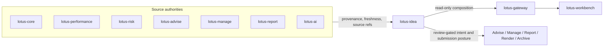
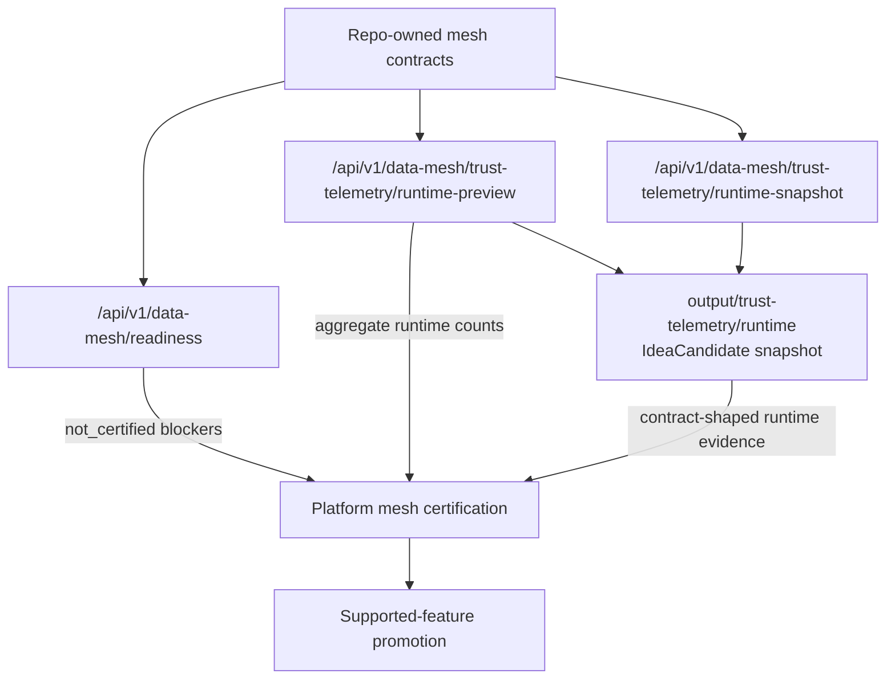

# Architecture

`lotus-idea` is a separate domain service because opportunity intelligence spans
portfolio facts, performance, risk, advisory, management, reporting, AI, gateway,
and Workbench concerns.

## Source Authority

`lotus-idea` consumes official evidence and carries provenance. It does not
recompute official calculations.

| Domain | Source owner |
| --- | --- |
| Portfolio, holdings, cash, mandate, client, product facts | `lotus-core` |
| Performance and attribution | `lotus-performance` |
| Risk, concentration, volatility, stress, scenarios | `lotus-risk` |
| Proposals, suitability, advisory journey | `lotus-advise` |
| Model portfolios, rebalance, DPM actions | `lotus-manage` |
| AI workflows and model/provider execution | `lotus-ai` |
| Report packages | `lotus-report` |
| Rendering | `lotus-render` |
| Archive, retention, legal hold | `lotus-archive` |
| Product composition | `lotus-gateway` |
| User experience | `lotus-workbench` |

## Data Mesh Baseline

Repo-owned proposed mesh declarations live under `contracts/`:

1. `contracts/domain-data-products/lotus-idea-products.v1.json`
2. `contracts/domain-data-products/lotus-idea-consumers.v1.json`
3. `contracts/domain-data-products/mesh-readiness.v1.json`
4. `contracts/trust-telemetry/idea-candidate.telemetry.v1.json`
5. `contracts/mesh-slo/`
6. `contracts/mesh-access/`
7. `contracts/mesh-evidence/`

Certification is not claimed. Products stay `proposed` and the current static
telemetry is blocked until runtime implementation and platform mesh validation
exist.

The internal `GET /api/v1/data-mesh/readiness` endpoint reads the repo-owned
mesh contracts and returns operator-facing `not_certified` posture with
blockers. It is an API-certified diagnostic, not data-product certification,
Gateway discovery, Workbench discovery, or supported-feature promotion.
The blocker list is aligned to platform mesh certification families so missing
source-manifest, catalog, SLO, access, evidence, Gateway/Workbench discovery,
and supported-feature proof stay visible before any product is promoted.

`make mesh-policy-proof-contract-gate` and
`scripts/generate_mesh_policy_proof.py` validate the repo-owned SLO, access,
and evidence-pack policy proof for `IdeaCandidate:v1`. A valid artifact clears
only SLO/access/evidence policy blockers in aggregate implementation readiness;
it is not platform mesh certification, product activation, Gateway/Workbench
discovery, or supported-feature promotion.

The internal
`GET /api/v1/data-mesh/trust-telemetry/runtime-preview` endpoint reads the
active repository provider and returns aggregate runtime telemetry preview
counts for the proposed `IdeaCandidate:v1` product. It omits candidate
identifiers, source routes, evidence hashes, portfolio identifiers, and client
identifiers. It is pre-certification runtime evidence only; platform mesh
certification and product promotion remain planned.

The internal
`GET /api/v1/data-mesh/trust-telemetry/runtime-snapshot` endpoint returns the
corresponding contract-shaped runtime snapshot for operators with
`idea.mesh.trust-telemetry.snapshot.read`. It uses aggregate active-repository
state only and does not expose candidate identifiers, source routes, evidence
hashes, portfolio identifiers, or client identifiers.

When PostgreSQL is active, runtime trust telemetry preview and snapshot reads
use a repository-side aggregate projection over candidate and workflow tables
instead of hydrating audit, outbox, downstream-submission, lifecycle-history,
idempotency, or AI-lineage state. Process-local providers can still use the
snapshot fallback.

`make runtime-trust-telemetry-snapshot-check` writes the same contract-shaped
runtime snapshot to
`output/trust-telemetry/runtime/idea-candidate.telemetry.v1.json`. The snapshot
is source-safe generated evidence and remains blocked until platform
source-manifest inclusion, mesh certification, Gateway/Workbench discovery, and
supported-feature promotion are implemented.

The first consumer contract expansion is source-authority only. It prepares the
high-cash / idle-liquidity path around Core-owned cash and holdings products,
and records later first-wave Performance, Risk, Advise, Manage, Report, and AI
dependencies without certifying runtime behavior.

## Source-Port Foundation

RFC-0002 Slice 05 now includes the first Core source-port foundation.
`src/app/ports/core_sources.py` defines the high-cash evidence port,
`src/app/application/high_cash_signal.py` orchestrates evaluation through that
port, and `src/app/infrastructure/lotus_core_sources.py` provides a
conservative HTTP adapter over Core source-data product routes. The adapter
preserves Core source refs, consumes `totals.source_reported_cash_weight` only
when Core reports supported cash-weight posture, and does not infer cash weight
from cash totals or portfolio market values. Positive high-cash generation from
live Core remains blocked until a valid live-proof artifact is captured and
referenced through readiness.

## Certified API Foundation

`POST /api/v1/idea-signals/high-cash/evaluate` and
`POST /api/v1/idea-signals/high-cash/evaluate-and-persist` are the first
certified internal API foundations. They evaluate caller-supplied, source-owned
Core evidence and source-reported cash weight, then return deterministic
high-cash signal posture. The persist variant requires `Idempotency-Key` and
`idea.candidate.persist`, writes through the active idea repository provider,
and reports `durableStorageBacked` from that provider. Default local runtime is
process-local and reports `false`; `demo`, `staging`, and `production` require
`LOTUS_IDEA_DATABASE_URL`, degrade `/health/ready`, and return
`durable_repository_not_configured` before mutating in-memory state when durable
storage is absent. When configured PostgreSQL cannot initialize, readiness and
write-capable routes fail closed with `durable_repository_unavailable` instead
of falling back to process-local mutation or leaking raw driver details.
Runtime configured with a reachable `LOTUS_IDEA_DATABASE_URL` uses the
PostgreSQL adapter and reports `true` for repository-backed routes. These
endpoints do not retrieve live source data, certify a data product, expose a
Gateway route, or promote a supported business feature.

`POST /api/v1/idea-signals/underperformance/evaluate`,
`POST /api/v1/idea-signals/high-volatility/evaluate`,
`POST /api/v1/idea-signals/drawdown-review/evaluate`,
`POST /api/v1/idea-signals/allocation-drift/evaluate`,
`POST /api/v1/idea-signals/missing-suitability/evaluate`,
`POST /api/v1/idea-signals/missing-risk-profile/evaluate`, and
`POST /api/v1/idea-signals/mandate-restriction/evaluate` extend the same
internal certified API pattern to caller-supplied source-owned evidence. They
are design-module/API foundations inside the `lotus-idea` domain service, not
separate runtime microservices. They do not calculate returns, volatility, or drawdown,
assign benchmarks, calculate allocation drift, certify benchmark or Risk
methodology, approve suitability, policy, proposal, sign-off, restriction
clearance, mandate state, rebalance actions, orders, client
publication, data-mesh certification, Gateway/Workbench behavior, or
supported-feature promotion.

API modules share the active repository provider through
`src/app/runtime/repository_state.py`. Signal, review, feedback, queue, and
lifecycle routes must use that provider so API modules do not create duplicate
candidate stores. The provider defaults to an in-memory repository and selects
`PostgresIdeaRepository` when `LOTUS_IDEA_DATABASE_URL` is configured. Runtime
profile and durable-write posture belong in `src/app/runtime/settings.py` so
API modules consume typed posture helpers instead of reading environment values
directly. Runtime composition for repositories, source-ingestion adapters,
outbox publishers, and downstream realization clients belongs in
`src/app/runtime/`, outside the API layer and app root.

Application use cases depend on repository workflow protocols from
`src/app/ports/idea_repository.py`. Candidate snapshots, candidate persistence,
lifecycle mutation, evidence replay, review and feedback mutation, conversion
mutation, report evidence-pack requests, and AI explanation reads must use
those central ports instead of declaring local repository protocols. This keeps
durable storage behind one governed contract surface while default
process-local and configured PostgreSQL-backed runtime postures remain
truthful.

`migrations/001_idea_repository_foundation.sql` and its rollback file define the
first governed schema contract for future durable candidate, idempotency,
lifecycle, audit, outbox, review, feedback, conversion, and report
evidence-pack state. The migration contract and execution dry-run are
CI-blocking, and real execution uses `make migrate` / `make migrate-rollback`
with `LOTUS_IDEA_DATABASE_URL`.
Runtime API repository wiring uses this adapter when `LOTUS_IDEA_DATABASE_URL`
is configured after migrations are applied. `make postgres-integration-gate`
now proves high-cash API persistence/replay and the first internal review,
feedback, conversion, report evidence-pack, and advisor queue workflow path
against a real PostgreSQL 18 service, including schema apply, provider reload,
idempotency replay from database state, internal source-ingestion
replay/conflict recovery, backing table validation, and schema rollback/reapply
recovery. The application layer also has a manifest-backed run-once
source-ingestion worker CLI with manifest and source-safe check-only output
validation through `make source-ingestion-worker-check`, a bounded scheduled
worker entrypoint and opt-in Docker Compose worker profile validated by
`make source-ingestion-scheduled-worker-check`, plus a source-safe live Core
proof artifact contract validated by
`make source-ingestion-live-proof-contract-gate`. Production storage readiness
still requires deploy migration evidence, mesh certification, platform mesh
event publication proof, downstream delivery evidence, and live
event-publication evidence beyond the internal outbox retry/dead-letter,
publisher-adapter, bounded broker proof, and bounded downstream consumer
runtime proof foundations.
`GET /api/v1/source-ingestion/readiness` now exposes the internal operator
readiness posture for that run-once worker configuration and certification
blockers without calling Core, certifying live source ingestion, or promoting a
supported feature. A valid scheduled-worker proof artifact can clear only the
scheduled-worker blocker; it does not clear live Core, data-mesh,
Gateway/Workbench, downstream, or supported-feature blockers.
`POST /api/v1/source-ingestion/run-once` exposes the same bounded
source-ingestion batch foundation through the service boundary for operators.
It requires durable repository posture plus configured manifest and Core
source settings, blocks before mutation when those inputs are absent or
invalid, closes owned Core HTTP runtime clients after accepted or
source-unavailable execution, and returns aggregate decision counts only.
`GET /api/v1/outbox-delivery/readiness` now exposes the internal operator
readiness posture for outbox delivery foundation state. It reports aggregate
status counts, due delivery-ready backlog, durable repository posture, broker
configuration posture, publisher-adapter presence, and certification blockers.
PostgreSQL-backed readiness computes status, expired-lease, and due
ready-count posture through repository-side `idea_outbox_event` projections
instead of a whole idea repository snapshot. Failed rows below the retry limit
are not delivery-ready until their durable `next_attempt_at_utc` is due;
expired leases remain immediately recoverable.
`POST /api/v1/outbox-delivery/run-once` exposes the bounded internal operator
action for one delivery pass through the active repository and configured
publisher adapter. It requires `Idempotency-Key`, binds the operator run
identity to safe request parameters and caller subject, fails closed when
broker configuration is absent or invalid, and both endpoints avoid event ids,
aggregate ids, raw idempotency keys, source payloads, broker payloads,
downstream delivery contracts, or a supported-feature claim. Same-key /
same-request retries replay without mutation, same-key / different-request
reuse returns product-safe conflict, and responses expose only a source-safe
`operatorRunReference`.
The repo-owned downstream consumer contract at
`contracts/outbox-events/lotus-idea-outbox-consumers.v1.json` declares Gateway,
Advise, Manage, and Report as downstream consumers with source-authority
boundaries and keeps them not runtime certified. It changes the outbox blocker
taxonomy from missing consumer contracts to missing consumer runtime proof.

`POST /api/v1/idea-candidates/{candidateId}/review-actions` and
`POST /api/v1/idea-candidates/{candidateId}/feedback` are certified internal
review workflow API foundations. They require mutating capabilities, caller
role, upstream-authorized tenant/book/portfolio/client scope, and
`Idempotency-Key`. They record review decisions or feedback through the active
repository provider and return product-safe conflict, not-found, and permission
posture without granting downstream suitability, compliance, mandate, execution,
or client-communication authority.

`POST /api/v1/idea-candidates/{candidateId}/lifecycle-transitions` is the
certified internal lifecycle transition API foundation. It requires
`idea.candidate.lifecycle.transition` plus `Idempotency-Key`, applies the
canonical domain lifecycle graph, records lifecycle history and audit evidence,
and returns replay/conflict/not-found/invalid-transition posture. Request input
uses a caller-settable lifecycle vocabulary that excludes `accepted` and
`executed`; those downstream-authority posture values remain readable only in
stored/response vocabulary and must come from conversion outcome or downstream
submission source-authority contracts. The lifecycle route does not grant
downstream proposal, manage-review, report, execution, or client-communication
authority.

`GET /api/v1/review-queues/advisor` is the certified internal advisor queue API
foundation. It projects persisted candidate snapshots through the deterministic
Slice 07 queue policy, applies optional tenant/book/portfolio/client scope
filters, applies platform caller-context entitlement scope when provided, and
returns ranked items plus exclusions through bounded `limit`/`offset` paging
with default 25 and max 100. Durable PostgreSQL providers use a repository-side
candidate projection with expression-index-backed tenant/book/portfolio/client
scope predicates instead of whole-store snapshot hydration. This remains a
bounded foundation API rather than a production queue-store claim.
`lotus-gateway` publishes this as a
bounded read-only route at `GET /api/v1/ideas/review-queues/advisor`, forwards
the caller entitlement-scope headers, and does not generate or rank ideas.

`GET /api/v1/review-queues/advisor/readiness` is the certified internal
operator diagnostic for queue supportability. It reuses the same Slice 07
queue projection path but returns only aggregate candidate counts, exclusion
counts, durable-storage posture, repository-side pagination posture, and
certification blockers. It does not expose
candidate identifiers or access-scope identifiers, and it is not a Gateway
route, Workbench proof, data-product certification, PM/compliance queue
surface, client-ready publication, or supported-feature promotion.

`GET /api/v1/idea-candidates/{candidateId}` is the certified internal
source-safe candidate detail API foundation. It reads persisted candidate
snapshots and returns redacted source evidence, lifecycle history, review,
feedback, conversion, report-evidence, and audit summary posture without source
route disclosure, raw evidence export, downstream authority, Workbench proof,
data-product certification, or supported-feature promotion. `lotus-gateway`
publishes this as a bounded read-only route at
`GET /api/v1/ideas/candidates/{candidate_id}` while preserving `lotus-idea`
source authority and forwarding caller entitlement-scope headers for
`lotus-idea` fail-closed access checks. Durable PostgreSQL providers now serve
ordinary candidate-detail reads through a repository-side projection over the
requested candidate and related detail rows instead of hydrating whole
repository snapshots; this is an internal module boundary, not a separate
runtime service.
Review-action, feedback, conversion-intent request, and AI explanation
evaluation workflows reuse the same bounded candidate lookup before domain
evaluation when the repository exposes the projection. Older/process-local
providers can still fall back to `snapshot()`, and workflow writes remain on
the existing repository mutation path for idempotency, audit, lifecycle,
conversion, and AI-lineage persistence.

`POST /api/v1/idea-candidates/{candidateId}/evidence-replay` is the certified
internal candidate evidence replay API foundation. It compares caller-supplied
current source refs with persisted evidence hashes and returns matched,
stale-source, hash-mismatch, expired, or missing-candidate posture without
calling Core, exposing raw source routes, granting downstream authority,
certifying data products, proving Gateway/Workbench behavior, or promoting a
supported feature.

`POST /api/v1/idea-candidates/{candidateId}/ai-explanations/evaluate` is the
certified internal AI explanation evaluator foundation. It evaluates
deterministic fallback or supplied workflow output against persisted candidate
evidence, redacts source refs, blocks unsupported claims and forbidden actions,
requires `Idempotency-Key`, records source-safe lineage through the active
repository mutation path, and emits bounded `ai_explanation` operation events.
Same-key/same-request calls replay without duplicate lineage writes,
same-key/different-request calls return product-safe
`409 idempotency_conflict`, and distinct-key AI request-id replay/conflict
remains governed by the lineage store. It does not call providers, execute
`lotus-ai` runtime workflows, grant downstream authority, expose a
Gateway/Workbench surface, authorize client-ready publication, or promote a
supported feature. Source-safe lineage persistence is proven separately by the
AI lineage store proof artifact.

`GET /api/v1/ai-explanations/readiness` is the certified internal AI
explanation readiness diagnostic. It returns guardrail availability,
`not_certified` model-risk supportability, and certification blockers for
operators without invoking `lotus-ai`, exposing prompts/provider payloads,
disclosing candidate or source-route identifiers, certifying durable AI
lineage by itself, exposing a Gateway/Workbench surface, or promoting a
supported feature.

`GET /api/v1/implementation-proof/readiness` is the certified internal
aggregate RFC-0002 proof-readiness diagnostic. It reports source-safe
capability blockers across source ingestion, advisor queue, AI explanation,
data mesh, runtime trust telemetry preview/snapshot evidence, outbox delivery,
non-AI operator workflow operations, Workbench realization, downstream realization, and supported-feature
promotion. It is not live implementation proof, certified live broker runtime, downstream
delivery, data-product certification, certified runtime trust telemetry,
Gateway/Workbench proof, client-ready publication, or supported-feature
promotion.

`GET /api/v1/downstream-realization/readiness` is the certified internal
operator diagnostic for downstream realization supportability. It reports
current conversion intent/outcome counts, report evidence-pack request counts,
source-of-truth paths, planned Advise/Manage/Report downstream contract
readiness, and blocker groups for `lotus-advise`, `lotus-manage`,
`lotus-report`, `lotus-render`, and `lotus-archive`. Planned contract records
name the owning repository and adapter posture from
`contracts/downstream-realization/lotus-idea-downstream-contracts.v1.json`, and
`make downstream-realization-contract-gate` keeps them planned and
not-certified. Source-safe route-foundation proof artifacts can move the
Advise, Manage, or Report target route from planned posture to the proved
route only when merged sibling evidence is present. These artifacts are route
evidence only; they are not suitability, mandate/rebalance, execution,
materialization, or supported-feature proof.
When PostgreSQL is active, the readiness counts come from a repository-side
projection over `idea_conversion_intent`, `idea_conversion_outcome`, and
`idea_report_evidence_pack_request` rather than whole-store snapshot
hydration. The endpoint does not call downstream services, create
proposals, create manage actions, materialize reports, render output, archive
records, authorize client-ready publication, or promote a supported feature.

`POST /api/v1/conversion-intents/{conversionIntentId}/downstream-submissions`
and
`POST /api/v1/report-evidence-packs/{reportEvidencePackId}/downstream-submissions`
are certified internal submission foundations. They require
`idea.downstream-realization.submit` and `Idempotency-Key`, use configured
source-safe Advise, Manage, and Report adapters after a local idempotency
ledger precheck, propagate correlation/trace context, and return submission
posture only. Same-key/same-fingerprint requests replay stored posture without
another adapter call, changed-fingerprint reuse returns
`409 idempotency_conflict`, and missing adapter configuration is persisted as a
replayable `503 downstream_realization_not_configured` posture. Durable
PostgreSQL providers use bounded conversion-intent and report evidence-pack
lookup queries before adapter calls instead of hydrating whole repository
snapshots. They do not
record authoritative downstream outcomes, prove downstream route existence,
grant suitability/execution/publication authority, or promote a supported
feature.

## Persistence Orchestration Foundation

The internal application layer can now evaluate high-cash evidence and persist
created candidates through the Slice 06 idempotency/audit repository contract.
Repeated requests with the same idempotency payload replay, changed payloads
conflict, and blocked, suppressed, or not-eligible evaluations do not mutate
state. The evaluate-and-persist API exposes this as an internal certified
foundation and reports repository-backed storage posture from the active
provider; it is not a supported product workflow.

The internal application layer can now also replay persisted candidate evidence
posture against caller-supplied current source refs. This is an operator
diagnostic over repository state, not live source ingestion or downstream
workflow authority.

The internal application layer can now also record idempotent lifecycle
transitions for persisted candidates. This closes the foundation gap between
generated high-cash candidates and review-ready candidates without weakening the
domain transition graph or review approval rules.

The repository now has a versioned schema and rollback contract for the durable
repository, a PostgreSQL migration execution CLI, and a tested
`PostgresIdeaRepository` adapter behind the central repository ports. API write
state is process-local only for `local`/`test` profiles and PostgreSQL-backed
when `LOTUS_IDEA_DATABASE_URL` is configured; production-like profiles fail
closed before in-memory mutation when durable storage is absent. Normal
PostgreSQL repository mutations apply row-delta inserts and candidate-row
updates rather than table-wide snapshot replacement, preserving unrelated rows
when independent mutations are applied from the same starting state. Candidate
updates use an optimistic `updated_at_utc` compare-and-set guard to reject
stale same-candidate snapshots before detail rows or outbox events commit.
Idempotency inserts use PostgreSQL conflict detection and retry once from a
fresh database snapshot so concurrent same-key races return governed replay or
conflict posture instead of raw primary-key failures. The real
PostgreSQL runtime proof now covers high-cash evaluate-and-persist replay plus the first internal advisor
queue, review, feedback, conversion, report evidence-pack workflow path, and
internal source-ingestion replay/conflict recovery. Unit tests also prove the
bounded run-once source-ingestion batch worker foundation and the
manifest-backed worker CLI check-only contract. Integration tests now prove the
operator run-once route's durable-storage guard, runtime-configuration guard,
configured execution path, permission policy, source-safe response, and
bounded `source_ingestion_run_once` operation event.
Accepted internal mutations now also append source-safe outbox records through
the same repository snapshot contract. The repository port and PostgreSQL
adapter support delivery-ready reads, lease claims, owner-aware published
status, failed retry status, and dead-letter status, while
`src/app/application/outbox_delivery.py` orchestrates a run-once
publisher-port pass that claims a bounded batch before broker publication and
returns aggregate source-safe counts.
`src/app/ports/outbox_publisher.py` owns the publisher port, and
`src/app/infrastructure/outbox_publisher.py` provides the source-safe HTTP
publisher adapter foundation with bounded envelopes, trace headers, and
product-safe failure reasons.
`src/app/domain/events.py`, the PostgreSQL foundation schema,
`003_outbox_event_contract_constraints.sql`, and
`make outbox-event-contract-gate` now enforce the same v1 event-family,
candidate aggregate-type, schema-version, and source-safe payload contract at
construction, replay, database-upgrade, and governance time.
`src/app/application/outbox_delivery_readiness.py` and
`GET /api/v1/outbox-delivery/readiness` add aggregate operator visibility over
that foundation, including leased and expired-lease posture, without mutating
records or publishing events.
`POST /api/v1/outbox-delivery/run-once` adds the protected internal operator
surface for a single bounded delivery pass and returns aggregate counts only.
This is not certified external publication, a Gateway event, platform mesh
event publication, downstream delivery, or a supported feature.
`src/app/application/downstream_realization.py` adds source-safe submission
orchestration for existing Advise/Manage conversion intents and Report
evidence-pack requests while leaving authoritative downstream outcome truth in
the owning services. `src/app/ports/downstream_realization.py` and
`src/app/infrastructure/downstream_realization.py` also provide source-safe
HTTP adapter foundations for Advise, Manage, and Report handoff envelopes. They
preserve downstream source authority and bounded evidence posture, but they are
not live downstream contract proof, route-existence proof, or materialization
proof.
This opt-in wiring and proof are not data-product certification, live-source
support, Gateway/Workbench support, downstream realization, or
supported-feature promotion.

## Review Queue Projection Foundation

The internal application layer can project persisted candidate snapshots into
deterministic advisor review queues by delegating to the Slice 07 scoring and
queue policy. The projection preserves score-versioned ordering, suppression,
expiry, snooze, unsupported-evidence, and duplicate exclusions without adding a
second queue implementation. It is not yet a public API, Workbench surface,
database-backed queue product, or certified data product.

## Review Workflow Persistence Foundation

The internal application layer can apply governed advisor review actions and
feedback after bounded candidate lookup, then persist accepted decisions,
feedback events, safe audit evidence, lifecycle history, and idempotency
replay/conflict posture through the Slice 06 repository contract. This is still an internal
foundation; PostgreSQL-backed review workflow proof exists only inside the
opt-in runtime proof, while Gateway/Workbench functionality and supported
review-product promotion remain planned.

## Architecture Decisions

ADRs live in `docs/architecture/adr/`:

1. `ADR-0001-lotus-idea-service-boundary.md`
2. `ADR-0002-scaffold-and-repository-foundation.md`
3. `ADR-0003-source-authority-and-data-mesh-boundaries.md`
4. `ADR-0004-ai-assisted-human-governed-decision-support.md`
