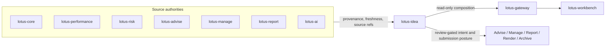
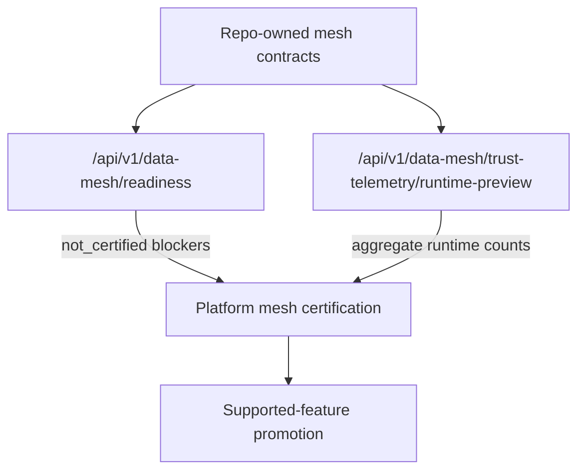

# Architecture

`lotus-idea` is a separate domain service because opportunity intelligence spans
portfolio facts, performance, risk, advisory, management, reporting, AI, gateway,
and Workbench concerns.

## Source Authority

`lotus-idea` consumes official evidence and carries provenance. It does not
recompute official calculations.

| Domain | Source owner |
| --- | --- |
| Portfolio, holdings, cash, mandate, client, product facts | `lotus-core` |
| Performance and attribution | `lotus-performance` |
| Risk, concentration, volatility, stress, scenarios | `lotus-risk` |
| Proposals, suitability, advisory journey | `lotus-advise` |
| Model portfolios, rebalance, DPM actions | `lotus-manage` |
| AI workflows and model/provider execution | `lotus-ai` |
| Report packages | `lotus-report` |
| Rendering | `lotus-render` |
| Archive, retention, legal hold | `lotus-archive` |
| Product composition | `lotus-gateway` |
| User experience | `lotus-workbench` |

## Data Mesh Baseline

Repo-owned proposed mesh declarations live under `contracts/`:

1. `contracts/domain-data-products/lotus-idea-products.v1.json`
2. `contracts/domain-data-products/lotus-idea-consumers.v1.json`
3. `contracts/domain-data-products/mesh-readiness.v1.json`
4. `contracts/trust-telemetry/idea-candidate.telemetry.v1.json`
5. `contracts/mesh-slo/`
6. `contracts/mesh-access/`
7. `contracts/mesh-evidence/`

Certification is not claimed. Products stay `proposed` and the current static
telemetry is blocked until runtime implementation and platform mesh validation
exist.

The internal `GET /api/v1/data-mesh/readiness` endpoint reads the repo-owned
mesh contracts and returns operator-facing `not_certified` posture with
blockers. It is an API-certified diagnostic, not data-product certification,
Gateway discovery, Workbench discovery, or supported-feature promotion.

The internal
`GET /api/v1/data-mesh/trust-telemetry/runtime-preview` endpoint reads the
active repository snapshot and returns aggregate runtime telemetry preview
counts for the proposed `IdeaCandidate:v1` product. It omits candidate
identifiers, source routes, evidence hashes, portfolio identifiers, and client
identifiers. It is pre-certification runtime evidence only; platform mesh
certification and product promotion remain planned.

The first consumer contract expansion is source-authority only. It prepares the
high-cash / idle-liquidity path around Core-owned cash and holdings products,
and records later first-wave Performance, Risk, Advise, Manage, Report, and AI
dependencies without certifying runtime behavior.

## Source-Port Foundation

RFC-0002 Slice 05 now includes the first Core source-port foundation.
`src/app/ports/core_sources.py` defines the high-cash evidence port,
`src/app/application/high_cash_signal.py` orchestrates evaluation through that
port, and `src/app/infrastructure/lotus_core_sources.py` provides a
conservative HTTP adapter over Core source-data product routes. The adapter
preserves Core source refs and does not infer cash weight from cash totals or
portfolio market values. Positive high-cash generation from live Core remains
blocked until Core reports an explicit source-owned cash-weight field and live
integration proof exists.

## Certified API Foundation

`POST /api/v1/idea-signals/high-cash/evaluate` and
`POST /api/v1/idea-signals/high-cash/evaluate-and-persist` are the first
certified internal API foundations. They evaluate caller-supplied, source-owned
Core evidence and source-reported cash weight, then return deterministic
high-cash signal posture. The persist variant requires `Idempotency-Key` and
`idea.candidate.persist`, writes through the active idea repository provider,
and reports `durableStorageBacked` from that provider. Default local runtime is
process-local and reports `false`; runtime configured with
`LOTUS_IDEA_DATABASE_URL` uses the PostgreSQL adapter and reports `true` for
repository-backed routes. These endpoints do not retrieve live source data,
certify a data product, expose a Gateway route, or promote a supported business
feature.

API modules share the active repository provider through
`src/app/repository_state.py`. Signal, review, feedback, queue, and lifecycle
routes must use that provider so API modules do not create duplicate candidate
stores. The provider defaults to an in-memory repository and selects
`PostgresIdeaRepository` when `LOTUS_IDEA_DATABASE_URL` is configured. The
`src/app/api/repository_state.py` module is only a compatibility shim so
concrete infrastructure wiring stays out of the API layer.

Application use cases depend on repository workflow protocols from
`src/app/ports/idea_repository.py`. Candidate snapshots, candidate persistence,
lifecycle mutation, evidence replay, review and feedback mutation, conversion
mutation, report evidence-pack requests, and AI explanation reads must use
those central ports instead of declaring local repository protocols. This keeps
durable storage behind one governed contract surface while default
process-local and configured PostgreSQL-backed runtime postures remain
truthful.

`migrations/001_idea_repository_foundation.sql` and its rollback file define the
first governed schema contract for future durable candidate, idempotency,
lifecycle, audit, outbox, review, feedback, conversion, and report
evidence-pack state. The migration contract and execution dry-run are
CI-blocking, and real execution uses `make migrate` / `make migrate-rollback`
with `LOTUS_IDEA_DATABASE_URL`.
Runtime API repository wiring uses this adapter when `LOTUS_IDEA_DATABASE_URL`
is configured after migrations are applied. `make postgres-integration-gate`
now proves high-cash API persistence/replay and the first internal review,
feedback, conversion, report evidence-pack, and advisor queue workflow path
against a real PostgreSQL 18 service, including schema apply, provider reload,
idempotency replay from database state, internal source-ingestion
replay/conflict recovery, backing table validation, and schema rollback/reapply
recovery. The application layer also has a manifest-backed run-once
source-ingestion worker CLI with manifest and source-safe check-only output
validation through `make source-ingestion-worker-check`. Production storage
readiness still requires deploy migration evidence, scheduled daemon/deploy
worker evidence, live Core source-worker evidence, live broker runtime proof,
downstream consumer proof, and live event-publication evidence beyond the
internal outbox retry/dead-letter and publisher-adapter foundation.
`GET /api/v1/source-ingestion/readiness` now exposes the internal operator
readiness posture for that run-once worker configuration and certification
blockers without calling Core, certifying live source ingestion, or promoting a
supported feature.
`GET /api/v1/outbox-delivery/readiness` now exposes the internal operator
readiness posture for outbox delivery foundation state. It reports aggregate
status counts, delivery-ready backlog, durable repository posture, broker
configuration posture, publisher-adapter presence, and certification blockers
without exposing event ids, aggregate ids, raw idempotency keys, broker
payloads, downstream delivery contracts, or a supported-feature claim.

`POST /api/v1/idea-candidates/{candidateId}/review-actions` and
`POST /api/v1/idea-candidates/{candidateId}/feedback` are certified internal
review workflow API foundations. They require mutating capabilities, caller
role, upstream-authorized tenant/book/portfolio/client scope, and
`Idempotency-Key`. They record review decisions or feedback through the active
repository provider and return product-safe conflict, not-found, and permission
posture without granting downstream suitability, compliance, mandate, execution,
or client-communication authority.

`POST /api/v1/idea-candidates/{candidateId}/lifecycle-transitions` is the
certified internal lifecycle transition API foundation. It requires
`idea.candidate.lifecycle.transition` plus `Idempotency-Key`, applies the
canonical domain lifecycle graph, records lifecycle history and audit evidence,
and returns replay/conflict/not-found/invalid-transition posture without
granting downstream proposal, manage-review, report, execution, or
client-communication authority.

`GET /api/v1/review-queues/advisor` is the certified internal advisor queue API
foundation. It projects persisted candidate snapshots through the deterministic
Slice 07 queue policy, applies optional tenant/book/portfolio/client scope
filters, and returns ranked items plus exclusions without a durable queue
store, Workbench surface, or supported-feature promotion. `lotus-gateway`
publishes this as a bounded read-only route at
`GET /api/v1/ideas/review-queues/advisor` without generating or ranking ideas.

`GET /api/v1/review-queues/advisor/readiness` is the certified internal
operator diagnostic for queue supportability. It reuses the same Slice 07
queue projection path but returns only aggregate candidate counts, exclusion
counts, durable-storage posture, and certification blockers. It does not expose
candidate identifiers or access-scope identifiers, and it is not a Gateway
route, Workbench proof, data-product certification, PM/compliance queue
surface, client-ready publication, or supported-feature promotion.

`GET /api/v1/idea-candidates/{candidateId}` is the certified internal
source-safe candidate detail API foundation. It reads persisted candidate
snapshots and returns redacted source evidence, lifecycle history, review,
feedback, conversion, report-evidence, and audit summary posture without source
route disclosure, raw evidence export, downstream authority, Workbench proof,
data-product certification, or supported-feature promotion. `lotus-gateway`
publishes this as a bounded read-only route at
`GET /api/v1/ideas/candidates/{candidate_id}` while preserving `lotus-idea`
source authority.

`POST /api/v1/idea-candidates/{candidateId}/evidence-replay` is the certified
internal candidate evidence replay API foundation. It compares caller-supplied
current source refs with persisted evidence hashes and returns matched,
stale-source, hash-mismatch, expired, or missing-candidate posture without
calling Core, exposing raw source routes, granting downstream authority,
certifying data products, proving Gateway/Workbench behavior, or promoting a
supported feature.

`POST /api/v1/idea-candidates/{candidateId}/ai-explanations/evaluate` is the
certified internal AI explanation evaluator foundation. It evaluates
deterministic fallback or supplied workflow output against persisted candidate
evidence, redacts source refs, blocks unsupported claims and forbidden actions,
and emits bounded `ai_explanation` operation events. It does not call providers,
execute `lotus-ai` runtime workflows, persist durable AI lineage, grant
downstream authority, expose a Gateway/Workbench surface, or promote a
supported feature.

`GET /api/v1/ai-explanations/readiness` is the certified internal AI
explanation readiness diagnostic. It returns guardrail availability,
`not_certified` model-risk supportability, and certification blockers for
operators without invoking `lotus-ai`, exposing prompts/provider payloads,
disclosing candidate or source-route identifiers, certifying durable AI
lineage, exposing a Gateway/Workbench surface, or promoting a supported
feature.

`GET /api/v1/implementation-proof/readiness` is the certified internal
aggregate RFC-0002 proof-readiness diagnostic. It reports source-safe
capability blockers across source ingestion, advisor queue, AI explanation,
data mesh, runtime trust telemetry preview, outbox delivery, Workbench
realization, downstream realization, and supported-feature promotion. It is
not live implementation proof, certified live broker runtime, downstream
delivery, data-product certification, certified runtime trust telemetry,
Gateway/Workbench proof, client-ready publication, or supported-feature
promotion.

`GET /api/v1/downstream-realization/readiness` is the certified internal
operator diagnostic for downstream realization supportability. It reports
current conversion intent/outcome counts, report evidence-pack request counts,
source-of-truth paths, planned Advise/Manage/Report downstream contract
readiness, and blocker groups for `lotus-advise`, `lotus-manage`,
`lotus-report`, `lotus-render`, and `lotus-archive`. Planned contract records
name the owning repository and adapter posture from
`contracts/downstream-realization/lotus-idea-downstream-contracts.v1.json`, and
`make downstream-realization-contract-gate` keeps them planned and
not-certified. They are not downstream route-existence proof. The endpoint
does not call downstream services, create
proposals, create manage actions, materialize reports, render output, archive
records, authorize client-ready publication, or promote a supported feature.

`POST /api/v1/conversion-intents/{conversionIntentId}/downstream-submissions`
and
`POST /api/v1/report-evidence-packs/{reportEvidencePackId}/downstream-submissions`
are certified internal submission foundations. They require
`idea.downstream-realization.submit` and `Idempotency-Key`, use configured
source-safe Advise, Manage, and Report adapters, propagate correlation/trace
context, and return submission posture only. Missing adapter configuration
fails closed with `503 downstream_realization_not_configured`. They do not
record authoritative downstream outcomes, prove downstream route existence,
grant suitability/execution/publication authority, or promote a supported
feature.

## Persistence Orchestration Foundation

The internal application layer can now evaluate high-cash evidence and persist
created candidates through the Slice 06 idempotency/audit repository contract.
Repeated requests with the same idempotency payload replay, changed payloads
conflict, and blocked, suppressed, or not-eligible evaluations do not mutate
state. The evaluate-and-persist API exposes this as an internal certified
foundation and reports repository-backed storage posture from the active
provider; it is not a supported product workflow.

The internal application layer can now also replay persisted candidate evidence
posture against caller-supplied current source refs. This is an operator
diagnostic over repository state, not live source ingestion or downstream
workflow authority.

The internal application layer can now also record idempotent lifecycle
transitions for persisted candidates. This closes the foundation gap between
generated high-cash candidates and review-ready candidates without weakening the
domain transition graph or review approval rules.

The repository now has a versioned schema and rollback contract for the durable
repository, a PostgreSQL migration execution CLI, and a tested
`PostgresIdeaRepository` adapter behind the central repository ports. API state
is process-local by default and PostgreSQL-backed only when
`LOTUS_IDEA_DATABASE_URL` is configured. The real PostgreSQL runtime proof now
covers high-cash evaluate-and-persist replay plus the first internal advisor
queue, review, feedback, conversion, report evidence-pack workflow path, and
internal source-ingestion replay/conflict recovery. Unit tests also prove the
bounded run-once source-ingestion batch worker foundation and the
manifest-backed worker CLI check-only contract.
Accepted internal mutations now also append source-safe outbox records through
the same repository snapshot contract. The repository port and PostgreSQL
adapter support delivery-ready reads, published status, failed retry status,
and dead-letter status, while `src/app/application/outbox_delivery.py`
orchestrates a run-once publisher-port pass with aggregate source-safe counts.
`src/app/ports/outbox_publisher.py` owns the publisher port, and
`src/app/infrastructure/outbox_publisher.py` provides the source-safe HTTP
publisher adapter foundation with bounded envelopes, trace headers, and
product-safe failure reasons.
`src/app/application/outbox_delivery_readiness.py` and
`GET /api/v1/outbox-delivery/readiness` add aggregate operator visibility over
that foundation without mutating records or publishing events.
This is not certified live broker runtime, a Gateway event, platform mesh
event, downstream delivery contract, or supported feature.
`src/app/application/downstream_realization.py` adds source-safe submission
orchestration for existing Advise/Manage conversion intents and Report
evidence-pack requests while leaving authoritative downstream outcome truth in
the owning services. `src/app/ports/downstream_realization.py` and
`src/app/infrastructure/downstream_realization.py` also provide source-safe
HTTP adapter foundations for Advise, Manage, and Report handoff envelopes. They
preserve downstream source authority and bounded evidence posture, but they are
not live downstream contract proof, route-existence proof, or materialization
proof.
This opt-in wiring and proof are not data-product certification, live-source
support, Gateway/Workbench support, downstream realization, or
supported-feature promotion.

## Review Queue Projection Foundation

The internal application layer can project persisted candidate snapshots into
deterministic advisor review queues by delegating to the Slice 07 scoring and
queue policy. The projection preserves score-versioned ordering, suppression,
expiry, snooze, unsupported-evidence, and duplicate exclusions without adding a
second queue implementation. It is not yet a public API, Workbench surface,
database-backed queue product, or certified data product.

## Review Workflow Persistence Foundation

The internal application layer can apply governed advisor review actions and
feedback to repository snapshots, then persist accepted decisions, feedback
events, safe audit evidence, lifecycle history, and idempotency replay/conflict
posture through the Slice 06 repository contract. This is still an internal
foundation; PostgreSQL-backed review workflow proof exists only inside the
opt-in runtime proof, while Gateway/Workbench functionality and supported
review-product promotion remain planned.

## Architecture Decisions

ADRs live in `docs/architecture/adr/`:

1. `ADR-0001-lotus-idea-service-boundary.md`
2. `ADR-0002-scaffold-and-repository-foundation.md`
3. `ADR-0003-source-authority-and-data-mesh-boundaries.md`
4. `ADR-0004-ai-assisted-human-governed-decision-support.md`
