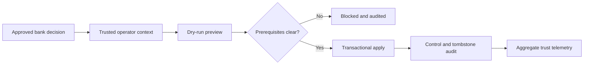

# Data Lifecycle Operations

## Current Scope

Lotus Idea implements tenant-scoped legal hold, hold release, erasure, purge,
idempotent replay, immutable operation audit, and bounded lifecycle telemetry
for Idea-owned PostgreSQL records. The capability is internal and **not
certified**; it does not authorize legal/privacy decisions or replace Report,
Archive, or AI-provider retention controls.

Idea can verify and persist a source-safe signed Lotus AI provider-retention
receipt alongside attested explanation lineage. It binds the receipt to the
candidate tenant and verified run/provider/model identity. This is consumer
conformance only: provider failure is not deletion proof, and the receipt does
not authorize legal hold, erasure, purge, Report policy, or Archive posture.

The Idea, Report, Archive, and AI contract foundations are merged and
mainline-proven. Production-authorized policy sources, provider-native evidence,
managed keys/stores, bank approvals, and production purge execution remain
certification blockers.

Scheduled review run `29180046362` passed on Idea main SHA `f496c442` with
PostgreSQL 18 and an attested source-safe artifact. The artifact remains
review-only and `not_certified`; it does not authorize purge.

| Reader | Start here |
| --- | --- |
| Privacy or records operator | Review the action matrix and follow the deep runbook. |
| Support | Use the first-response table and aggregate telemetry. |
| Engineering | Review the contract, API, migration, and PostgreSQL evidence. |
| Product or audit | Use the boundary and certification-blocker sections. |

## Governed Flow

## Action Matrix

| Action | Authority | Additional control | Result |
| --- | --- | --- | --- |
| Apply hold | Bank legal and records governance | Exact tenant scope | Expiry, erase, and purge freeze. |
| Release hold | Same authority as the hold | Distinct approver | Effective pre-hold state resumes. |
| Erase | Bank privacy governance | Distinct approver; no active delivery | Payloads redact, actors pseudonymize, tombstones remain. |
| Purge | Bank privacy governance | Prior erasure, expiry, distinct approver | Eligible payload rows delete; regulated audit remains. |

Production-like requests also require an approved, unexpired Ed25519
`authorityDecision` bound to the exact tenant, candidate, action, authority
domain/reference, and change reference. Applied decisions are single-use by
decision ID and replay nonce; previews verify without consuming them. Unknown,
revoked, stale, substituted, or reused authority returns a source-safe failure
before another mutation.

## First Response

| Condition | Operator action |
| --- | --- |
| Permission or tenant denial | Correct trusted identity propagation; never broaden self-asserted headers. |
| Legal hold active | Stop erasure/purge and reconcile with the legal authority. |
| Active delivery work | Complete or reconcile outbox/downstream work before retrying. |
| Retention not expired | Do not override; await approved expiry or policy change. |
| Idempotency conflict | Reconcile the original operation; issue a new key only for a new decision. |
| Missing lifecycle control | Treat runtime posture as blocked and escalate for governed backfill. |

## Scheduled Review

The weekly/manual scheduled workflow reviews a maximum of 100 expired controls
against PostgreSQL 18 and emits aggregate-only evidence. It distinguishes
records ready for an externally authorized purge from records blocked by legal
hold, invalid state, or active delivery work.

It performs no lifecycle mutation and carries no production privacy authority.
The evidence gate forbids candidate, tenant, authority, and approver identity,
requires `not_certified` and non-promotional posture, and retains attested CI
evidence for 90 days. Production purge still requires a signed bank decision,
distinct approval, exact tenant entitlement, and cross-service conformance.

## Evidence And Navigation

| Evidence | Location |
| --- | --- |
| Deep operator procedure | [Data Lifecycle Operations runbook](https://github.com/sgajbi/lotus-idea/blob/main/docs/runbooks/data-lifecycle-operations.md) |
| Versioned inventory and authority contract | [Lifecycle contract](https://github.com/sgajbi/lotus-idea/blob/main/contracts/operations/lotus-idea-data-lifecycle.v1.json) |
| API posture | [API Surface](API-Surface) |
| Persistence and recovery | [PostgreSQL Disaster Recovery](PostgreSQL-Disaster-Recovery) |
| Security boundary | [Security and Governance](Security-and-Governance) |
| RFC implementation truth | [RFC Index](RFC-Index) |

Implementation evidence includes real PostgreSQL restart, replay/conflict,
atomic redaction, purge, and concurrent delivery-claim serialization tests.
Telemetry publishes aggregate state, expired-retention, and missing-control
counts without candidate, tenant, client, or portfolio identifiers.

AI explanation lineage stores output-integrity digests and versions, not raw
prompts or unrestricted provider output. These records use the seven-year
regulated-advisory policy and inherit legal-hold, erasure, and purge controls.
Migration `010` marks pre-integrity rows as unverifiable; operators must not
represent those rows as content-level audit proof.

## Remaining Blockers

- Bank approval for jurisdiction-specific durations and start events.
- Live bank lifecycle-authority producer, key-discovery, and mainline
  signature proof.
- Report, Archive, and AI-provider conformance evidence.
- Mainline scheduled expiry-review evidence and production authorized purge
  evidence with signed privacy authority.
- Mainline CI and supported-feature promotion evidence.
