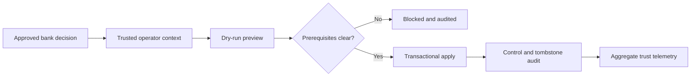

# Data Lifecycle Operations

## Current Scope

Lotus Idea implements tenant-scoped legal hold, hold release, erasure, purge,
idempotent replay, immutable operation audit, and bounded lifecycle telemetry
for Idea-owned PostgreSQL records. The capability is internal and **not
certified**; it does not authorize legal/privacy decisions or replace Report,
Archive, or AI-provider retention controls.

| Reader | Start here |
| --- | --- |
| Privacy or records operator | Review the action matrix and follow the deep runbook. |
| Support | Use the first-response table and aggregate telemetry. |
| Engineering | Review the contract, API, migration, and PostgreSQL evidence. |
| Product or audit | Use the boundary and certification-blocker sections. |

## Governed Flow

## Action Matrix

| Action | Authority | Additional control | Result |
| --- | --- | --- | --- |
| Apply hold | Bank legal and records governance | Exact tenant scope | Expiry, erase, and purge freeze. |
| Release hold | Same authority as the hold | Distinct approver | Effective pre-hold state resumes. |
| Erase | Bank privacy governance | Distinct approver; no active delivery | Payloads redact, actors pseudonymize, tombstones remain. |
| Purge | Bank privacy governance | Prior erasure, expiry, distinct approver | Eligible payload rows delete; regulated audit remains. |

## First Response

| Condition | Operator action |
| --- | --- |
| Permission or tenant denial | Correct trusted identity propagation; never broaden self-asserted headers. |
| Legal hold active | Stop erasure/purge and reconcile with the legal authority. |
| Active delivery work | Complete or reconcile outbox/downstream work before retrying. |
| Retention not expired | Do not override; await approved expiry or policy change. |
| Idempotency conflict | Reconcile the original operation; issue a new key only for a new decision. |
| Missing lifecycle control | Treat runtime posture as blocked and escalate for governed backfill. |

## Evidence And Navigation

| Evidence | Location |
| --- | --- |
| Deep operator procedure | [Data Lifecycle Operations runbook](https://github.com/sgajbi/lotus-idea/blob/main/docs/runbooks/data-lifecycle-operations.md) |
| Versioned inventory and authority contract | [Lifecycle contract](https://github.com/sgajbi/lotus-idea/blob/main/contracts/operations/lotus-idea-data-lifecycle.v1.json) |
| API posture | [API Surface](API-Surface) |
| Persistence and recovery | [PostgreSQL Disaster Recovery](PostgreSQL-Disaster-Recovery) |
| Security boundary | [Security and Governance](Security-and-Governance) |
| RFC implementation truth | [RFC Index](RFC-Index) |

Implementation evidence includes real PostgreSQL restart, replay/conflict,
atomic redaction, purge, and concurrent delivery-claim serialization tests.
Telemetry publishes aggregate state, expired-retention, and missing-control
counts without candidate, tenant, client, or portfolio identifiers.

## Remaining Blockers

- Bank approval for jurisdiction-specific durations and start events.
- Signed legal/privacy decision integration.
- Report, Archive, and AI-provider conformance evidence.
- Scheduled expiry/purge evidence with privacy review.
- Mainline CI and supported-feature promotion evidence.
