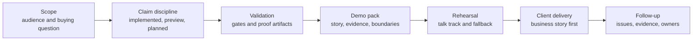

# Demo Readiness

This page is for safe demo planning. It separates implementation-backed
foundation walkthroughs from unsupported client or product claims.

Current summary: no client-demo-ready supported business behavior is promoted.
Use this page only for controlled foundation walkthroughs with explicit
boundary language.

## Demo Decision Matrix

| Audience question | Safe answer |
| --- | --- |
| What can be shown today? | Source-authority framing, candidate lifecycle, review posture, proof-readiness blockers, and governance controls. |
| What is not proved? | Production support, client-ready publication, suitability approval, rebalance/execution, report rendering/archive authority, AI provider operation, mesh certification, or supported-feature promotion. |
| Where is claim evidence? | `docs/demo/demo-claims.md`, `docs/demo/client-demo-operating-process.md`, [Supported Features](Supported-Features), and [Validation and CI](Validation-and-CI). |

## Current posture

`lotus-idea` is not client-demo-ready for supported external business behavior.
It is suitable for a controlled foundation walkthrough only when the audience is
told that current proof is internal, bounded, and not a supported product
promotion.

| Demo area | Current truth | Client-facing handling |
| --- | --- | --- |
| Opportunity intelligence | Internal candidate, review, feedback, conversion, and proof foundations exist. | Explain the governed operating model and current boundaries. |
| Opportunity archetypes | Governed, non-promoted archetype foundations exist for high cash, concentration, underperformance, allocation drift / mandate review, bond maturity, high volatility, drawdown, missing suitability, missing risk profile, mandate/restriction, missing benchmark, and low-income / liquidity shortfall. Closed v2 Manage mandate evidence can clear only portfolio-scoped action-register plus current Performance/Risk mandate-health source-ref blockers after exact source scope, time, identity, policy, and outcome reconcile. Missing producer metadata fails closed; Core portfolio-state, data-mesh, Workbench, client-publication, supported-feature, suitability, rebalance, action, order-execution, and product-recommendation blockers remain. | Use as taxonomy, source-authority framing, and internal foundation proof only; do not present it as full Workbench journey proof, client-demo proof, or a supported feature. |
| Supported features | No external supported feature is promoted. | Do not claim production availability or client-ready publication. |
| Workbench | Bounded read-only proof exists, but full product-surface certification is blocked. | Show only after validation and with explicit bounded-preview language. |
| Downstream realization | Digest-bound Advise, Manage, and Report route source contracts can be consumed as non-clearing provenance; bounded Report/Render/Archive materialization source contracts can be consumed when sibling `lotus-report` evidence is present. | Describe domain boundaries; do not claim route serving or acceptance, suitability, rebalance/execution, client publication, or supported-feature promotion. |
| Data mesh | Proposed products and readiness diagnostics exist. | Present as day-one governance foundation, not certified data-product status. |

Concentration-risk review is an internal bounded foundation only.
`POST /api/v1/idea-signals/concentration-risk/evaluate` consumes
caller-supplied Lotus Risk `ConcentrationRiskReport:v1` evidence to create
advisor-review posture or blocked/not-eligible/suppressed outcomes. It does not
calculate concentration, approve risk methodology, recommend trades, create
rebalance actions, certify data mesh, prove Workbench behavior, authorize
client publication, or promote support.

Underperformance review is an internal bounded foundation only.
`POST /api/v1/idea-signals/underperformance/evaluate` consumes caller-supplied
Lotus Performance `ReturnsSeriesBundle:v1` active-return and benchmark-context
evidence to create advisor-review posture or blocked/not-eligible/suppressed
outcomes. It does not calculate portfolio returns, calculate benchmark returns,
assign benchmarks, certify methodology, recommend trades, create rebalance
actions, prove Workbench behavior, authorize client publication, certify data
mesh, or promote support.

Allocation-drift / mandate-review is an internal bounded foundation only.
`POST /api/v1/idea-signals/allocation-drift/evaluate` consumes
caller-supplied Lotus Manage `PortfolioActionRegister:v1` action-register
posture and mandate-health source refs to create portfolio-manager review
posture or blocked/not-eligible/suppressed outcomes. The opportunity archetype
contract gate pins the API module, endpoint, and integration test as evidence,
so demo-readiness proof cannot rely on policy-only allocation-drift evidence.
It does not fetch Manage sources, calculate allocation drift, approve mandate
compliance, recommend or create rebalance actions, create orders, prove
Workbench behavior, authorize client publication, certify data mesh, or
promote support.

High-volatility review is an internal bounded foundation only.
`POST /api/v1/idea-signals/high-volatility/evaluate` consumes caller-supplied
Lotus Risk `RiskMetricsReport:v1` volatility evidence to create
advisor-review posture or blocked/not-eligible/suppressed outcomes. It does not
fetch Risk sources, calculate volatility, approve Risk methodology, recommend
trades, create rebalance actions, prove Workbench behavior, authorize client
publication, certify data mesh, or promote support. The opportunity archetype
contract gate pins the high-volatility API module, endpoint, and integration
test as evidence, so demo-readiness proof cannot rely on policy-only
high-volatility evidence.

Drawdown review is an internal bounded foundation only.
`POST /api/v1/idea-signals/drawdown-review/evaluate` consumes caller-supplied
Lotus Risk `DrawdownAnalyticsReport:v1` maximum-drawdown evidence to create
advisor-review posture or blocked/not-eligible/suppressed outcomes. It does not
fetch Risk sources, calculate drawdown, approve Risk methodology, recommend
trades, create rebalance actions, prove Workbench behavior, authorize client
publication, certify data mesh, or promote support. The opportunity archetype
contract gate pins the drawdown API module, endpoint, and integration test as
evidence, so demo-readiness proof cannot rely on policy-only drawdown evidence.

For every implemented caller-supplied signal foundation, the opportunity
archetype contract gate now pins the API module, endpoint, and integration
test as evidence. This covers concentration, underperformance, allocation
drift, bond maturity, high volatility, drawdown, missing suitability, missing
risk profile, mandate/restriction, low-income, and missing-benchmark review.
The gate improves proof discipline only; it does not certify data mesh, prove
Workbench behavior, authorize client publication, or promote support.

Missing-benchmark review is an internal bounded foundation only. It can create
advisor-review evidence-gap candidates from Core-owned benchmark-assignment
posture, including the bounded
`POST /api/v1/idea-signals/missing-benchmark/evaluate` API over caller-supplied
Core evidence, and can consume bounded Performance benchmark-readiness proof,
but it does not assign benchmarks, calculate performance or benchmark returns,
certify methodology, prove Workbench behavior, authorize client publication, or
promote a supported feature.

Missing risk-profile review is an internal bounded foundation only. It can
create advisor-review evidence-gap candidates from explicit Advise-owned
risk-profile diagnostic posture, including the bounded
`POST /api/v1/idea-signals/missing-risk-profile/evaluate` API over
caller-supplied Advise evidence, but it does not approve risk profiling,
suitability, policy, proposal, client publication, or external communication.
Its closed v2 runtime evidence binds one source-preserving application result
and one Advise fetch to exact request, workflow, and deterministic candidate or
truthful no-opportunity receipts. It can clear only the Advise risk-profile
live-source blocker; typed source-product, data-mesh, Workbench,
client-publication, deployment, production, and supported-feature blockers
remain.

Mandate/restriction review is an internal bounded foundation only. It can
create compliance-review candidates from explicit source-owned restriction
posture supplied through the bounded API or the named source-backed application
use case, but it does not approve suitability, change mandate state, clear
restrictions, create orders, authorize client publication, or promote a
supported feature.
A valid typed Advise source-product proof clears only the typed restriction
source-product blocker. Closed v2 runtime evidence clears only the live
restriction source blocker when hashed request scope reconciles with
producer-owned scope/time, workflow posture, source/policy hashes, and a
deterministic candidate or no-opportunity result. Advise issue `#459` tracks
missing producer metadata, so live qualification remains fail closed. Neither
artifact is Workbench, data-mesh, client-publication, deployment, production,
supported-feature, restriction-clearance, mandate-change, rebalance, or order
authority.

## Client Demo Flow



## Where To Start

Use the demo assets in this order:

1. Start with the [demo hub](../docs/demo/README.md) to understand the
   client-facing process, proof anchors, and current do-not-claim boundary.
2. Use the client-facing brief so the audience understands the
   private-banking problem, Lotus response, trust anchors, and current boundary.
3. Build a session-specific pack from the template instead of editing the
   template itself.
4. Use the demo claims ledger to classify every spoken or written claim.
5. Run the validation commands and attach the evidence run ID before any
   screenshot or live path is treated as client material.
6. Rehearse the talk track, fallback path, and do-not-claim list before the
   session.

Client-facing material should explain the workflow and control model first.
Internal proof artifacts should support the story; they should not replace a
clear explanation of what Lotus is doing for the client.

## Client-Friendly Explanation

Use this framing for external audiences:

> Lotus Idea creates a governed opportunity-intelligence layer for private
> banking. It connects source-owned evidence to advisor review and downstream
> realization intent while keeping official facts, suitability, reporting,
> rendering, archive, and client publication with the owning Lotus apps.

| Client question | Current answer |
| --- | --- |
| What is Lotus doing here? | Showing how opportunity intelligence can be governed from source evidence through review posture and proof readiness. |
| Why should a client trust the story? | Every current claim must link to an owner, command, run ID, artifact, and validation gate. |
| What is not being claimed? | Production support, client-ready publication, suitability approval, rebalance/execution authority, autonomous advice, certified data-product status, or supported-feature promotion. |

## Claim States

| Claim state | Meaning | Demo rule |
| --- | --- | --- |
| Implementation-backed | Code, tests, docs, proof artifact, and gate evidence exist on `main`. | Can be shown as current internal foundation. |
| Bounded preview | Real implementation exists with explicit limits. | Can be shown only with the boundary stated. |
| Planned | RFC, contract, or roadmap exists without runtime proof. | Mention as roadmap only. |
| Diagnostic | Evidence exists for troubleshooting or readiness analysis. | Keep out of client material. |
| Unsupported | No governed implementation or owner exists. | Do not claim or imply. |

## Required Pack

Every external Lotus Idea demo pack should include:

1. audience, objective, sensitivity level, and buying question,
2. private-banking business story in client language,
3. ordered demo sequence and fallback path,
4. implementation-backed claims with owner, command, run ID, and artifact,
5. explicit bounded-preview and planned items,
6. do-not-claim list,
7. reviewed evidence manifest and screenshot pack location when screenshots are used,
8. product, engineering, operations, security, commercial, and marketing follow-up owners.

The app-level process lives in
[docs/demo/README.md](../docs/demo/README.md) and
[docs/demo/client-demo-operating-process.md](../docs/demo/client-demo-operating-process.md).
Use the client-facing opening brief at
[docs/demo/client-facing-lotus-idea-brief.md](../docs/demo/client-facing-lotus-idea-brief.md)
when the audience needs a polished explanation of what Lotus is doing before
the evidence pack.
Start each client-specific pack from
[docs/demo/client-demo-pack.template.md](../docs/demo/client-demo-pack.template.md).
The current claim ledger lives in [docs/demo/demo-claims.md](../docs/demo/demo-claims.md).

## Validation

Run the documentation, truth, feature, and proof gates before marking a pack as
client-ready:

```powershell
make documentation-contract-gate
make implementation-truth-gate
make supported-features-gate
make ai-lineage-store-proof-contract-gate
make ai-workflow-pack-registration-proof-contract-gate
make ai-workflow-pack-runtime-execution-proof-contract-gate
make implementation-proof-readiness-check
```

`GET /api/v1/implementation-proof/readiness` is an internal operator diagnostic.
It shows which proof families remain blocked; it is not client-demo evidence by
itself.

The `opportunity-archetype-scenarios` readiness family is sourced from the
governed archetype contract. It prefixes scenario blockers with
`opportunity_archetype_` to keep taxonomy/replay gaps distinct from source
ingestion, Workbench, data-mesh, downstream, and supported-feature proof gaps.

The AI lineage store proof gate validates source-safe persistence evidence for
AI explanation lineage before aggregate proof readiness consumes it. It does
not make the AI workflow client-ready, call `lotus-ai`, certify a model-risk
dashboard or alert, prove Workbench behavior, or promote a supported feature.

The AI workflow-pack registration proof gate validates that sibling `lotus-ai`
has a governed `idea_explanation.pack@v1` registration, binding, queue policy,
supportability surface, and test evidence. This is `source_contract` evidence:
it adds provenance, clears no blocker, and retains
`workflow_pack_runtime_contract_not_certified`. It does not execute
`lotus-ai`, invoke a provider, certify model-risk operations, prove Workbench
behavior, or make an AI explanation claim client-ready.

The AI workflow-pack runtime execution proof gate validates an actual
review-gated `lotus-ai` invocation, exact workflow/run/task identity,
evidence-hash binding, guardrails, deterministic stub-provider routing,
and restricted `lotus-idea` caller policy. It still does not certify live AI
provider rollout, model-risk operations, Workbench behavior, client-ready
publication, or supported-feature promotion.

## Do Not Claim

Until proof-readiness blockers are cleared by implementation-backed evidence,
do not claim autonomous advice, suitability approval, mandate compliance,
rebalance execution, rendered client-ready output, client-ready publication,
certified data-mesh product status, or supported external product availability.
Bounded Report/Render/Archive proof may be described only as internal proof
readiness evidence, not as client publication or product support.

## Acceptance Checklist

| Acceptance item | Required posture |
| --- | --- |
| Story clarity | A non-technical client can understand the workflow, value, controls, and current boundary. |
| Claim discipline | Every statement maps to implementation-backed, bounded preview, planned, diagnostic, or unsupported. |
| Evidence tie-out | Each current-state claim links to owner, command, run ID, and artifact. |
| Data safety | No real client data, secrets, raw prompts, raw payloads, or sensitive identifiers are present. |
| Runtime proof | Screenshots or live paths were captured only after relevant validation passed. |
| Follow-up ownership | Product, engineering, operations, security, commercial, and marketing owners are named. |

Screenshots or client-demo material must not be promoted before validation
passes. Pre-validation captures are diagnostic only.
