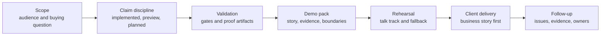

# Demo Readiness

## Current posture

`lotus-idea` is not client-demo-ready for supported external business behavior.
It is suitable for a controlled foundation walkthrough only when the audience is
told that current proof is internal, bounded, and not a supported product
promotion.

| Demo area | Current truth | Client-facing handling |
| --- | --- | --- |
| Opportunity intelligence | Internal candidate, review, feedback, conversion, and proof foundations exist. | Explain the governed operating model and current boundaries. |
| Opportunity archetypes | A governed archetype/scenario contract identifies high cash / idle liquidity as the first partially implemented journey, records concentration risk review, underperformance review, allocation drift / mandate review, bond maturity / reinvestment, high-volatility / drawdown review, missing suitability context, missing risk-profile review, mandate/restriction review, missing-benchmark review, and low-income / liquidity shortfall as non-promoted bounded foundations, keeps remaining unimplemented archetypes planned, and is visible as blocked scenario readiness in aggregate proof readiness. Valid source-safe proof artifacts can clear only the high-cash live Core blocker, concentration live Risk blocker, high-volatility live Risk volatility blocker, Risk drawdown source blocker, underperformance live Performance blocker, missing-benchmark Performance readiness blocker, Core benchmark assignment source-ref blocker, Core portfolio-state source-ref blocker, bond-maturity live Core source blocker, missing-benchmark live Core source blocker, low-income Core cashflow source blocker, Manage mandate portfolio-scoped source blocker, typed mandate/restriction Advise source-product blocker, mandate/restriction live Advise restriction source blocker, missing-suitability live Advise source blocker, typed missing risk-profile Advise source-product blocker, and missing risk-profile live Advise source blocker where proof contracts exist. Underperformance currently consumes source-reported active return and benchmark context from `lotus-performance:ReturnsSeriesBundle:v1`; valid Core benchmark assignment proof clears only the benchmark-assignment source-ref blocker while data-mesh, Workbench, client-publication, and supported-feature blockers remain. Missing-benchmark review consumes Core-owned benchmark-assignment posture and bounded Performance benchmark-readiness posture; valid missing-benchmark Core proof clears only the live Core source blocker and valid Performance readiness proof clears only the Performance source-ref blocker while benchmark-assignment authority, methodology, return-calculation, data-mesh, Workbench, client-publication, and supported-feature blockers remain. Allocation drift currently consumes `lotus-manage:PortfolioActionRegister:v1` action-register supportability posture and can consume Core `PortfolioStateSnapshot:v1` source-ref proof; valid Manage mandate and Core portfolio-state live proofs clear only their own source blockers while mandate performance-health, mandate risk-health, data-mesh, Workbench, client-publication, supported-feature, rebalance, action, and order-execution blockers remain. Bond maturity / reinvestment currently consumes Core-owned `HoldingsAsOf:v1` maturity-date evidence through a deterministic policy, source adapter, source-safe live proof, and `POST /api/v1/idea-signals/bond-maturity/evaluate` as a bounded internal API foundation over caller-supplied Core maturity evidence; a valid artifact clears only the live Core maturity-source blocker while data-mesh, Workbench, client-publication, product-recommendation, reinvestment-advice, suitability, risk, order-execution, and supported-feature blockers remain, and the API does not recommend products, calculate reinvestment advice, approve suitability, create orders, publish communication, or promote support. High-volatility / drawdown review currently consumes Risk-owned `RiskMetricsReport:v1` volatility and `DrawdownAnalyticsReport:v1` maximum drawdown; data-mesh, Workbench, client-publication, and supported-feature blockers remain. Missing suitability context currently consumes Advise-owned `AdvisoryPolicyEvaluationRecord:v1` workflow posture to create only a compliance-review candidate for open suitability, disclosure, consent, approval, or sign-off context; `POST /api/v1/idea-signals/missing-suitability/evaluate` exposes the same caller-supplied evidence evaluation as a bounded internal API foundation. A valid live Advise proof clears only the live-source blocker while data-mesh, Workbench, client-publication, and supported-feature blockers remain, and the API does not approve suitability, policy, proposals, sign-off, client publication, or communication. Missing risk-profile review currently consumes only explicit Advise-owned risk-profile diagnostic posture; a valid typed Advise source-product proof clears only the typed risk-profile source-product blocker, and a valid live Advise proof clears only the risk-profile live-source blocker while Workbench, data-mesh, client-publication, and supported-feature blockers remain. Mandate/restriction review currently consumes only explicit Advise-owned restriction diagnostic posture; a valid typed Advise source-product proof clears only the typed restriction source-product blocker, and a valid live Advise proof clears only the live restriction source blocker while Workbench, data-mesh, client-publication, suitability approval, restriction clearance, mandate change authority, rebalance/order authority, and supported-feature blockers remain. Low-income / liquidity shortfall currently consumes Core-owned `PortfolioCashflowProjection:v1` and `PortfolioCashMovementSummary:v1` only to create an advisor-review candidate when projected cumulative cashflow crosses a deterministic threshold; `POST /api/v1/idea-signals/low-income/evaluate` exposes the same caller-supplied evidence evaluation as a bounded internal API foundation. Valid Core cashflow proof clears only the live Core cashflow source blocker while Workbench, data-mesh, client-publication, supported-feature, suitability, planning, funding-advice, and treasury-instruction blockers remain, and the API does not infer client income needs, approve planning suitability, provide funding advice, issue treasury instructions, publish client communication, or promote support. | Use as taxonomy, source-authority framing, and internal foundation proof only; do not present it as full Workbench journey proof, client-demo proof, or a supported feature. |
| Supported features | No external supported feature is promoted. | Do not claim production availability or client-ready publication. |
| Workbench | Bounded read-only proof exists, but full product-surface certification is blocked. | Show only after validation and with explicit bounded-preview language. |
| Downstream realization | Advise, Manage, and Report route-foundation proof can be consumed; bounded Report/Render/Archive materialization proof can be consumed when sibling `lotus-report` evidence is present. | Describe domain boundaries; do not claim suitability, rebalance/execution, client publication, or supported-feature promotion. |
| Data mesh | Proposed products and readiness diagnostics exist. | Present as day-one governance foundation, not certified data-product status. |

Concentration-risk review is an internal bounded foundation only.
`POST /api/v1/idea-signals/concentration-risk/evaluate` consumes
caller-supplied Lotus Risk `ConcentrationRiskReport:v1` evidence to create
advisor-review posture or blocked/not-eligible/suppressed outcomes. It does not
calculate concentration, approve risk methodology, recommend trades, create
rebalance actions, certify data mesh, prove Workbench behavior, authorize
client publication, or promote support.

Missing-benchmark review is an internal bounded foundation only. It can create
advisor-review evidence-gap candidates from Core-owned benchmark-assignment
posture, including the bounded
`POST /api/v1/idea-signals/missing-benchmark/evaluate` API over caller-supplied
Core evidence, and can consume bounded Performance benchmark-readiness proof,
but it does not assign benchmarks, calculate performance or benchmark returns,
certify methodology, prove Workbench behavior, authorize client publication, or
promote a supported feature.

Missing risk-profile review is an internal bounded foundation only. It can
create advisor-review evidence-gap candidates from explicit Advise-owned
risk-profile diagnostic posture, including the bounded
`POST /api/v1/idea-signals/missing-risk-profile/evaluate` API over
caller-supplied Advise evidence, but it does not approve risk profiling,
suitability, policy, proposal, client publication, or external communication.
Its source-safe live proof can clear only the Advise risk-profile live-source
blocker; typed source-product, data-mesh, Workbench, client-publication, and
supported-feature blockers remain.

Mandate/restriction review is an internal bounded foundation only. It can
create compliance-review candidates from explicit source-owned restriction
posture supplied through the bounded API, but it does not fetch live upstream
evidence, approve suitability, change mandate state, clear restrictions, create
orders, authorize client publication, or promote a supported feature.
A valid typed Advise source-product proof clears only the typed restriction
source-product blocker, and a valid live Advise proof clears only the live
restriction source blocker; neither proof is Workbench, data-mesh,
client-publication, supported-feature, restriction-clearance, mandate-change,
rebalance, or order authority.

## Client Demo Flow



## Where To Start

Use the demo assets in this order:

1. Start with the [demo hub](../docs/demo/README.md) to understand the
   client-facing process, proof anchors, and current do-not-claim boundary.
2. Use the client-facing brief so the audience understands the
   private-banking problem, Lotus response, trust anchors, and current boundary.
3. Build a session-specific pack from the template instead of editing the
   template itself.
4. Use the demo claims ledger to classify every spoken or written claim.
5. Run the validation commands and attach the evidence run ID before any
   screenshot or live path is treated as client material.
6. Rehearse the talk track, fallback path, and do-not-claim list before the
   session.

Client-facing material should explain the workflow and control model first.
Internal proof artifacts should support the story; they should not replace a
clear explanation of what Lotus is doing for the client.

## Client-Friendly Explanation

Use this framing for external audiences:

> Lotus Idea creates a governed opportunity-intelligence layer for private
> banking. It connects source-owned evidence to advisor review and downstream
> realization intent while keeping official facts, suitability, reporting,
> rendering, archive, and client publication with the owning Lotus apps.

| Client question | Current answer |
| --- | --- |
| What is Lotus doing here? | Showing how opportunity intelligence can be governed from source evidence through review posture and proof readiness. |
| Why should a client trust the story? | Every current claim must link to an owner, command, run ID, artifact, and validation gate. |
| What is not being claimed? | Production support, client-ready publication, suitability approval, rebalance/execution authority, autonomous advice, certified data-product status, or supported-feature promotion. |

## Claim States

| Claim state | Meaning | Demo rule |
| --- | --- | --- |
| Implementation-backed | Code, tests, docs, proof artifact, and gate evidence exist on `main`. | Can be shown as current internal foundation. |
| Bounded preview | Real implementation exists with explicit limits. | Can be shown only with the boundary stated. |
| Planned | RFC, contract, or roadmap exists without runtime proof. | Mention as roadmap only. |
| Diagnostic | Evidence exists for troubleshooting or readiness analysis. | Keep out of client material. |
| Unsupported | No governed implementation or owner exists. | Do not claim or imply. |

## Required Pack

Every external Lotus Idea demo pack should include:

1. audience, objective, sensitivity level, and buying question,
2. private-banking business story in client language,
3. ordered demo sequence and fallback path,
4. implementation-backed claims with owner, command, run ID, and artifact,
5. explicit bounded-preview and planned items,
6. do-not-claim list,
7. reviewed evidence manifest and screenshot pack location when screenshots are used,
8. product, engineering, operations, security, commercial, and marketing follow-up owners.

The app-level process lives in
[docs/demo/README.md](../docs/demo/README.md) and
[docs/demo/client-demo-operating-process.md](../docs/demo/client-demo-operating-process.md).
Use the client-facing opening brief at
[docs/demo/client-facing-lotus-idea-brief.md](../docs/demo/client-facing-lotus-idea-brief.md)
when the audience needs a polished explanation of what Lotus is doing before
the evidence pack.
Start each client-specific pack from
[docs/demo/client-demo-pack.template.md](../docs/demo/client-demo-pack.template.md).
The current claim ledger lives in [docs/demo/demo-claims.md](../docs/demo/demo-claims.md).

## Validation

Run the documentation, truth, feature, and proof gates before marking a pack as
client-ready:

```powershell
make documentation-contract-gate
make implementation-truth-gate
make supported-features-gate
make ai-lineage-store-proof-contract-gate
make ai-workflow-pack-registration-proof-contract-gate
make ai-workflow-pack-runtime-execution-proof-contract-gate
make implementation-proof-readiness-check
```

`GET /api/v1/implementation-proof/readiness` is an internal operator diagnostic.
It shows which proof families remain blocked; it is not client-demo evidence by
itself.

The `opportunity-archetype-scenarios` readiness family is sourced from the
governed archetype contract. It prefixes scenario blockers with
`opportunity_archetype_` to keep taxonomy/replay gaps distinct from source
ingestion, Workbench, data-mesh, downstream, and supported-feature proof gaps.

The AI lineage store proof gate validates source-safe persistence evidence for
AI explanation lineage before aggregate proof readiness consumes it. It does
not make the AI workflow client-ready, call `lotus-ai`, certify a model-risk
dashboard or alert, prove Workbench behavior, or promote a supported feature.

The AI workflow-pack registration proof gate validates that sibling `lotus-ai`
has a governed `idea_explanation.pack@v1` registration, binding, queue policy,
supportability surface, and test evidence. It still does not execute
`lotus-ai`, invoke a provider, certify model-risk operations, prove Workbench
behavior, or make an AI explanation claim client-ready.

The AI workflow-pack runtime execution proof gate validates deterministic
review-gated sibling `lotus-ai` execution, guardrails, stub-provider routing,
and restricted `lotus-idea` caller policy. It still does not certify live AI
provider rollout, model-risk operations, Workbench behavior, client-ready
publication, or supported-feature promotion.

## Do Not Claim

Until proof-readiness blockers are cleared by implementation-backed evidence,
do not claim autonomous advice, suitability approval, mandate compliance,
rebalance execution, rendered client-ready output, client-ready publication,
certified data-mesh product status, or supported external product availability.
Bounded Report/Render/Archive proof may be described only as internal proof
readiness evidence, not as client publication or product support.

## Acceptance Checklist

| Acceptance item | Required posture |
| --- | --- |
| Story clarity | A non-technical client can understand the workflow, value, controls, and current boundary. |
| Claim discipline | Every statement maps to implementation-backed, bounded preview, planned, diagnostic, or unsupported. |
| Evidence tie-out | Each current-state claim links to owner, command, run ID, and artifact. |
| Data safety | No real client data, secrets, raw prompts, raw payloads, or sensitive identifiers are present. |
| Runtime proof | Screenshots or live paths were captured only after relevant validation passed. |
| Follow-up ownership | Product, engineering, operations, security, commercial, and marketing owners are named. |

Screenshots or client-demo material must not be promoted before validation
passes. Pre-validation captures are diagnostic only.
