# Feedback And Opportunity-Quality Evaluation

Lotus Idea captures whether an adviser found an opportunity useful and why.
The purpose is to improve the quality of future opportunity-policy and ranking
decisions through controlled offline analysis—not to let feedback change live
decisions automatically.

## Adviser View

Feedback uses one versioned taxonomy:

| Judgment | Allowed reason |
| --- | --- |
| Useful | Relevant |
| Not useful | Not relevant, already known, wrong timing, insufficient evidence, wrong priority, duplicate, or client-specific constraint |

Review actions such as approve, reject, suppress, and snooze remain separate.
Recording feedback never approves conversion, suitability, mandate changes, or
execution.

## Control Flow

```mermaid
flowchart LR
    Evidence["Authoritative source evidence"] --> Candidate["Deterministic candidate"]
    Candidate --> Human["Adviser / PM review"]
    Human --> Feedback["Versioned outcome + reason"]
    Feedback --> Durable["Durable audit and outbox evidence"]
    Durable --> Offline["Tenant-scoped aggregate evaluation"]
    Offline --> Approval["Human policy review"]
    Approval -. "separate governed change" .-> Policy["Production policy"]
```

There is no automatic path from feedback to production policy.

## Privacy And Reproducibility

The offline snapshot is bounded to 10,000 observations, scoped to one tenant,
ordered deterministically, and digest-protected. Cohorts retain opportunity
family, source-time score, policy versions, bounded rank context, evidence supportability, prior
review action, feedback reason, and source-safe downstream posture.

The projection excludes raw tenant, client, portfolio, actor, and downstream
resource identifiers; free text; prompts; and model content. Missing tenant
scope or unscoped historical feedback fails closed.

## Engineering Evidence

- Canonical contract:
  `contracts/review-feedback/lotus-idea-feedback-evaluation.v1.json`
- Domain taxonomy: `src/app/domain/feedback_taxonomy.py`
- Offline projection: `src/app/application/feedback_evaluation.py`
- Migration: `migrations/017_governed_feedback_taxonomy.sql`
- Guard: `make feedback-evaluation-contract-gate`

This remains an internal, not-certified foundation. Workbench journey proof,
data-product certification, client publication, and supported-feature
promotion remain separate gates.

For the broader economic-opportunity funnel, presentation-receipt contract,
timing methodology, and consumer-certification boundary, continue to
[Opportunity Effectiveness](Opportunity-Effectiveness). Feedback remains one
input to that read-only evaluation; it does not become online learning or
production policy authority.
