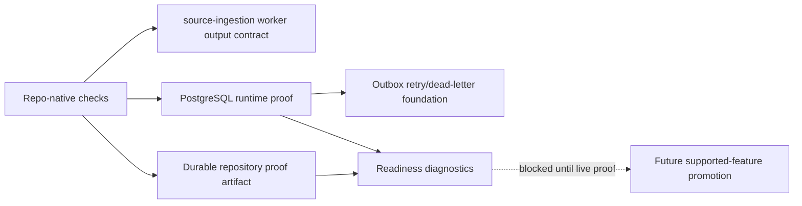

# Operations Runbook

This page is the first operator map for `lotus-idea`. It keeps the detailed
runtime and proof posture below, but the first screen is organized for
triage: identify the symptom, run the right diagnostic, then follow the linked
deep runbook.

Current summary: internal foundations and diagnostics exist. No externally
supported business feature, live broker runtime, downstream execution proof,
client publication, full Workbench proof, or data-product certification is
promoted.

## First Response Matrix

| Symptom | Check first | Escalate to |
| --- | --- | --- |
| Service is unavailable | `/health/live`, container logs, runtime profile | [Getting Started](Getting-Started), `docs/runbooks/service-operations.md` |
| Readiness is degraded | `/health/ready`, `/api/v1/implementation-proof/readiness` | [Troubleshooting](Troubleshooting), `docs/operations/implementation-proof-readiness.md` |
| Database recovery or cutover is active | `/health/ready`, `LOTUS_IDEA_RECOVERY_POSTURE` | [PostgreSQL Disaster Recovery](PostgreSQL-Disaster-Recovery) |
| Durable writes fail | `LOTUS_IDEA_DATABASE_URL`, repository readiness, migration history | `docs/operations/persistence.md` |
| Deployment migration is requested | Exact mainline image digest, approved change, protected environment | `make deployment-migration-contract-gate`, `docs/operations/persistence.md` |
| Source ingestion is blocked | `/api/v1/source-ingestion/readiness` | `docs/operations/source-ingestion-run-once.md` |
| Outbox delivery is blocked | `/api/v1/outbox-delivery/readiness` | [Operator Map](#operator-map) |
| Downstream realization is blocked | `/api/v1/downstream-realization/readiness` | `docs/operations/downstream-realization-readiness.md` |
| AI explanation is blocked | `/api/v1/ai-explanations/readiness` | `docs/operations/ai-governance.md` |
| Mesh posture is blocked | `/api/v1/data-mesh/readiness` | `docs/operations/mesh-readiness.md` |
| Error budget is burning or latency is elevated | Service SLO dashboard, dependency and PostgreSQL panels | [Service SLO and Capacity](Service-SLO-And-Capacity) |

## Operator Evidence Map

| Evidence | Use |
| --- | --- |
| `make ci-release` | Broad local release evidence when Docker and PostgreSQL prerequisites exist. |
| `make implementation-proof-readiness-check` | Aggregate blocker and proof posture. |
| `make runtime-trust-telemetry-snapshot-check` | Runtime trust telemetry snapshot. |
| `make postgres-integration-gate` | PostgreSQL-backed runtime proof when configured. |
| `make test-client-lifecycle-gate` | Verify integration HTTP clients use deterministic lifespan and shutdown management. |
| `make deployment-migration-contract-gate` | Exact-image migration workflow, history, evidence, Docker closure, and anti-bypass contract. |
| `make disaster-recovery-proof-gate` | Restore integrity, RPO/RTO, replay, fencing, and no-mutation evidence. |
| `make container-runtime-smoke` | Container startup and health smoke proof. |
| `make supported-features-gate` | Confirms no unproved support claim is promoted. |
| `make supported-feature-promotion-contract-gate` | Confirms gate, readiness API, and generated artifact use one promotion evaluator. |
| `make service-slo-capacity-contract-gate` | Validates service objectives, capacity budgets, safe labels, dashboard, and rule inventory. |
| `make service-slo-rule-test` | Evaluates healthy and breached error-budget scenarios with `promtool`. |

## Detailed Foundation Posture

Current posture: scaffold operations plus internal domain, persistence/replay,
lifecycle, review, AI-governance, certified internal high-cash, lifecycle,
AI explanation, advisor queue, review-action, feedback, and candidate evidence
replay API foundations, and conversion governance plus certified internal
conversion intent/outcome and report evidence-pack API foundations. The service
remains internal foundation only:
repository-backed API persistence is process-local only for explicit
`local`/`test` runtime profiles and PostgreSQL-backed when
`LOTUS_IDEA_DATABASE_URL` is configured. Accepted
internal mutations also create source-safe outbox records with internal
retry/dead-letter delivery state semantics and a source-safe HTTP
broker-publisher adapter foundation, and source-safe downstream adapter
foundations plus certified internal downstream submission APIs. There is still
no certified live broker runtime, downstream execution proof,
production-certified recovery posture, Workbench proof, or supported business
API. Bounded
read-only Gateway publication exists for advisor queue and candidate detail
only. A versioned
migration/rollback schema contract exists for the durable repository and is
enforced by `make migration-contract-gate`.
`make migration-execution-gate` dry-runs apply and rollback execution plans.
`make migrate` / `make migrate-rollback` execute checksum-tracked local plans
against PostgreSQL when `LOTUS_IDEA_DATABASE_URL` is configured. Local history
is pending-only, transactionally advisory-locked, and fails closed on drift;
these remain local/disposable tools, not production deployment authority.

Production-like changes use the protected deployment-migration workflow with
an exact signed and attested mainline image digest. It validates release labels,
injects the database URL only at runtime, serializes execution through a
PostgreSQL advisory transaction lock, applies only pending versions, records
durable release-bound history and append-only events, validates evidence with
the same image, and attests the artifact. Legacy schemas require explicit
fingerprinted adoption; rollback is bounded and distinct from restore. A
successful protected environment run, approved change, and rollout-health
evidence remain required for certification.

Execution uses GitHub's ephemeral `ubuntu-latest` runner. The target database
must be reachable through an approved encrypted path; broad public PostgreSQL
exposure is not an acceptable substitute for governed connectivity.

`make postgres-integration-gate` proves
the high-cash API persistence/replay path and the first internal review,
feedback, conversion, report evidence-pack, and advisor queue workflow path
against a real PostgreSQL 18 service when
`LOTUS_IDEA_POSTGRES_INTEGRATION_URL` is configured, including schema
rollback/reapply recovery.
PostgreSQL-backed repository mutations use optimistic candidate-row
compare-and-set protection and idempotency conflict retry from a fresh database
snapshot, so stale same-candidate writes fail safely and duplicate keys return
governed replay or conflict posture instead of leaking raw database collisions.
Runtime profile is explicit: `LOTUS_IDEA_RUNTIME_PROFILE` defaults to `local`,
`local` and `test` allow process-local writes, and `demo`, `staging`, and
`production` require `LOTUS_IDEA_DATABASE_URL`. Missing durable storage in a
production-like profile degrades `/health/ready` and makes write-capable routes
return `durable_repository_not_configured` before any in-memory mutation.
Configured but unavailable PostgreSQL also degrades `/health/ready` and makes
write-capable routes return `durable_repository_unavailable` before mutation;
operator responses must stay product-safe and must not echo DSNs, hostnames,
credentials, or raw driver exception text.
Internal high-cash source-ingestion orchestration now exists as an application
foundation over the Core source port and repository port. It generates a
source-ingestion idempotency key when one is not supplied and classifies
accepted, replayed, conflict, blocked, suppressed, and not-eligible outcomes,
and it now includes a bounded run-once batch worker foundation with per-item
idempotency, batch decision counts, and maximum item validation.
`scripts/run_source_ingestion_worker.py` provides the versioned run-once worker
CLI, and `make source-ingestion-worker-check` validates the manifest contract
and source-safe check-only output contract without calling Core or writing
state. Check-only and run-mode summaries are
source-safe: check-only reports manifest shape and item indexes, while run mode
reports decision counts, candidate ids when candidates are created, and
idempotency-key presence. Neither summary prints raw source payloads, portfolio
ids, or raw idempotency keys. The PostgreSQL runtime proof covers replay after
repository reload plus same-key
changed-source conflict recovery. This is not a deployed scheduler daemon, live
Core source-worker certification, production storage certification,
data-product certification, Gateway route, Workbench proof, or supported
business feature.
Blocked run-mode summaries and live-proof artifacts also include aggregate
`blockReasonCounts`. These bounded counts help diagnose Core unavailable,
entitlement denied, omitted cash-weight evidence, and Core-reported blocked
cash-weight supportability without recomputing source-owned values or exposing
Core payloads.
`scripts/run_scheduled_source_ingestion_worker.py` adds a bounded scheduled
worker entrypoint over the same run-once worker path, and `docker-compose.yml`
declares the opt-in `lotus-idea-source-ingestion-worker` service. The app-owned
Compose contract starts PostgreSQL 18 with a named volume at
`/var/lib/postgresql`, runs migrations once, and then starts the API.
`docker compose up -d --build` is standalone; canonical Workbench automation
orchestrates the same contract rather than supplying Idea persistence.
`docker compose --profile worker up -d --build` adds the worker against the same
database. Compose proves durable local restart behavior only; it does not
certify production recovery, live ingestion, Workbench support, data mesh,
client publication, or supported-feature status.
`make source-ingestion-scheduled-worker-check` validates the
deploy contract and source-safe proof shape without calling Core. A valid proof
artifact referenced through
`LOTUS_IDEA_SOURCE_INGESTION_SCHEDULED_WORKER_PROOF` clears only the
scheduled-worker blocker; it is not live Core, data-mesh, Gateway/Workbench,
downstream, or supported-feature proof.
The scheduled worker's image closure is separately verified: the Dockerfile
packages the canonical manifest, entrypoint scripts, and imported proof I/O
helper, while `.dockerignore` re-includes only the governed manifest path.
After changing worker packaging, rebuild the worker image and run its actual
bounded check-only command:

```powershell
docker compose build lotus-idea-source-ingestion-worker
docker run --rm lotus-idea-lotus-idea-source-ingestion-worker python scripts/run_scheduled_source_ingestion_worker.py --check-only --manifest /app/docs/examples/source-ingestion/canonical-high-cash-worker.manifest.json
```

Repository tests and the local Python CLI alone do not prove that the worker
asset closure exists inside the image.
The internal `GET /api/v1/data-mesh/readiness` diagnostic is available for
operators to inspect the repo-authored `not_certified` data-mesh posture and
blockers; it does not certify or promote a data product.
The internal `GET /api/v1/data-mesh/trust-telemetry/runtime-preview`
diagnostic is available for operators with
`idea.mesh.trust-telemetry.preview.read` to inspect aggregate runtime telemetry
preview counts from the active repository provider. It remains
`not_certified` until mesh certification, Gateway/Workbench discovery, and
supported-feature evidence exist. Platform source-manifest and generated
catalog onboarding can be proven separately by
`scripts/data_mesh/generate_platform_catalog_source_contract.py`; that proof clears only
platform inclusion blockers in aggregate readiness and does not certify the
mesh.
`make runtime-trust-telemetry-snapshot-check` generates the corresponding
source-safe runtime snapshot under
`output/trust-telemetry/runtime/idea-candidate.telemetry.v1.json`. The snapshot
is contract-shaped runtime evidence only; it does not promote producer products
or replace platform mesh certification.
The internal `GET /api/v1/data-mesh/trust-telemetry/runtime-snapshot`
diagnostic returns the same contract-shaped snapshot for operators with
`idea.mesh.trust-telemetry.snapshot.read`. It remains source-safe and
`not_certified`; it is not platform source-manifest inclusion, mesh
certification, Gateway/Workbench discovery, client-ready publication, or
supported-feature promotion.
The internal `GET /api/v1/source-ingestion/readiness` diagnostic is available
for operators with `idea.source-ingestion.readiness.read` to inspect high-cash
run-once worker manifest, Core query URL, Core query-control-plane URL, durable
repository configuration, and remaining certification blockers without calling
Core or exposing source payloads. It remains `not_certified` until live Core
source proof, runtime data-mesh telemetry, Gateway/Workbench proof, downstream
proof, and supported-feature evidence exist.
`scripts/generate_source_ingestion_live_proof.py` captures a source-safe live
Core proof artifact for release reviewers. Prefer explicit
`--core-query-base-url` and `--core-query-control-plane-base-url` values for
canonical split Core runtimes; `--core-base-url` remains a compatibility
fallback for older single-base stacks. Point
`LOTUS_IDEA_SOURCE_INGESTION_LIVE_PROOF` at a family-valid and
aggregate-current artifact to clear only the live-Core blocker in aggregate
readiness.
Blocked proof artifacts can still be useful operator evidence because
`blockReasonCounts` identifies the bounded source blocker class without
exposing portfolio, candidate, or source payload data.
When rerunning live proof against an existing durable PostgreSQL repository,
preserve idempotency history. If the same generated default idempotency key was
accepted before an upstream Core source fingerprint changed, a later run can
correctly return `conflict`. Capture the next release-proof run with an ignored
manifest under `output/source-ingestion/` and a source-safe explicit
`idempotencyKey`; do not reset durable state to force an accepted outcome.
`scripts/generate_scheduled_source_ingestion_worker_proof.py` captures a
source-safe scheduled worker deploy-contract artifact. Point
`LOTUS_IDEA_SOURCE_INGESTION_SCHEDULED_WORKER_PROOF` at a valid artifact to
clear only the scheduled-worker deploy-proof blocker. Certified long-running
scheduled runtime, mesh certification, Gateway/Workbench proof, and
supported-feature promotion remain blocked.
Aggregate implementation-proof readiness records the validated live and
scheduled source-ingestion proof artifact refs in the `source-ingestion`
capability evidence, so reviewers can trace blocker clearance without exposing
Core payloads, portfolio identity, or worker source records.
It also records the AI model-risk operations contract and
`make ai-model-risk-ops-contract-gate` in the `ai-explanation` capability
evidence, so reviewers can see dashboard-control and alert-candidate posture
without treating the readiness endpoint itself as product support proof.
`make ai-model-risk-operations-proof-contract-gate` validates the repo-owned
dashboard, alert-rule, and runbook source against implemented operation
telemetry. The source-contract artifact clears no aggregate blocker: dashboard
provisioning/query execution, alert-rule loading/evaluation/delivery,
`lotus-ai`, Workbench, client-ready, and supported-feature proof remain open.
It also records the non-AI operator workflow operations contract,
`make operator-workflows-ops-contract-gate`, and
`make operator-workflows-operations-proof-contract-gate` in the
`operator-workflows-operations` capability evidence. A current source-contract
proof adds provenance but clears no aggregate blocker. Dashboard provisioning
and query execution, alert-rule loading/evaluation/delivery, source-ingestion
certification, external broker runtime, downstream execution authority,
Gateway/Workbench, data-mesh, and supported-feature blockers stay controlled by
their owning proof artifacts.
It also records the generated AI lineage store proof when
`make ai-lineage-store-proof-contract-gate` passes, clearing only
`certified_ai_lineage_store_missing` while preserving `lotus-ai` runtime,
Workbench, blocked client publication, and supported-feature blockers.
The repo-native `make implementation-proof-readiness-check` target can consume
live proof through `LOTUS_IDEA_SOURCE_INGESTION_LIVE_PROOF`,
`LOTUS_CORE_QUERY_BASE_URL`, `LOTUS_CORE_QUERY_CONTROL_PLANE_BASE_URL`,
optional missing-suitability live Advise proof through
`LOTUS_IDEA_MISSING_SUITABILITY_LIVE_PROOF`,
optional typed mandate/restriction source-product proof through
`LOTUS_IDEA_MANDATE_RESTRICTION_SOURCE_PRODUCT_PROOF`,
optional typed missing risk-profile source-product proof through
`LOTUS_IDEA_MISSING_RISK_PROFILE_SOURCE_PRODUCT_PROOF`,
optional missing risk-profile live Advise proof through
`LOTUS_IDEA_MISSING_RISK_PROFILE_LIVE_PROOF`,
optional Manage mandate live proof through
`LOTUS_IDEA_MANAGE_MANDATE_LIVE_PROOF`,
optional Core benchmark assignment live proof through
`LOTUS_IDEA_CORE_BENCHMARK_ASSIGNMENT_LIVE_PROOF`,
optional Core portfolio-state live proof through
`LOTUS_IDEA_CORE_PORTFOLIO_STATE_LIVE_PROOF`,
optional Core bond-maturity live proof through
`LOTUS_IDEA_BOND_MATURITY_LIVE_PROOF`,
optional missing-benchmark live Core proof through
`LOTUS_IDEA_MISSING_BENCHMARK_LIVE_PROOF`,
optional missing-benchmark Performance readiness proof through
`LOTUS_IDEA_MISSING_BENCHMARK_PERFORMANCE_READINESS_PROOF`,
optional low-income Core cashflow live proof through
`LOTUS_IDEA_LOW_INCOME_CORE_CASHFLOW_LIVE_PROOF`,
default Advise proposal route proof through `LOTUS_ADVISE_ROOT` and
`LOTUS_IDEA_ADVISE_PROPOSAL_ROUTE_PROOF_OUTPUT`, default Manage action route
proof through `LOTUS_MANAGE_ROOT` and
`LOTUS_IDEA_MANAGE_ACTION_ROUTE_PROOF_OUTPUT`, default Report intake route and
materialization source contracts through `LOTUS_REPORT_ROOT`,
`LOTUS_IDEA_REPORT_INTAKE_ROUTE_SOURCE_CONTRACT_PROOF_OUTPUT`, and
`LOTUS_IDEA_REPORT_MATERIALIZATION_SOURCE_CONTRACT_PROOF_OUTPUT`, default
platform catalog source contract through `LOTUS_PLATFORM_ROOT` and
`LOTUS_IDEA_PLATFORM_CATALOG_SOURCE_CONTRACT_PROOF_OUTPUT`, default AI lineage
store proof through `LOTUS_IDEA_AI_LINEAGE_STORE_PROOF_OUTPUT`, default mesh policy
proof through `LOTUS_IDEA_MESH_POLICY_PROOF_OUTPUT`, and optional
`IMPLEMENTATION_PROOF_OUTPUT`, preserving the canonical local command while
allowing live release-proof evidence when the stack is available. Missing
sibling Advise, Manage, Report, or platform evidence writes an invalid
non-proof artifact and keeps the corresponding blocker.
The internal `POST /api/v1/source-ingestion/run-once` action is available for
operators with `idea.source-ingestion.run` to run one bounded source-ingestion
pass through the configured manifest, active repository provider, and Core
source adapter. It requires durable repository configuration, fails closed
before mutation when manifest or Core configuration is absent or invalid, and
returns aggregate decision counts only. It does not expose portfolio ids, raw
source payloads, raw idempotency keys, or candidate ids.
The internal `GET /api/v1/outbox-delivery/readiness` diagnostic is available
for operators with `idea.outbox-delivery.readiness.read` to inspect aggregate
outbox backlog, leased and expired-lease posture, retry/dead-letter posture,
durable repository posture, broker configuration posture, publisher-adapter
presence, and remaining certification blockers. The internal
`POST /api/v1/outbox-delivery/run-once` action is
available for operators with `idea.outbox-delivery.run` to run one bounded
delivery pass through the active repository and configured publisher adapter.
It requires `Idempotency-Key`, binds the operator run identity to safe request
parameters and caller subject, claims a bounded batch with lease owner, attempt
id, and expiry before broker publication, completes or fails only when the same
attempt still owns the lease, and fails closed leaving records untouched when
broker configuration is missing or invalid. Same-key/same-request retries
return replay posture without mutation, and same-key/different-request reuse
returns product-safe conflict. The run-once route closes its route-owned broker
publisher after execution begins so repeated operator runs do not leak HTTP
client resources; publisher cleanup failures emit source-safe `suppressed`
operation events and do not mask completed, replayed, conflict, or bounded
blocked responses. Neither endpoint exposes event identifiers, aggregate
identifiers, raw idempotency keys, broker payloads, source payloads, or
downstream claims. Both remain `not_certified` until platform mesh event
publication proof, Gateway/Workbench proof, downstream delivery evidence, and
supported-feature evidence exist.
The declared downstream consumer contract lives at
`contracts/outbox-events/lotus-idea-outbox-consumers.v1.json` and is enforced
by `make outbox-consumer-contract-gate`; it names Gateway, Advise, Manage, and
Report as not-runtime-certified consumers and does not clear runtime proof
blockers.
Aggregate implementation-proof readiness can consume a bounded outbox broker
source-contract artifact generated by
`scripts/outbox/broker/generate_source_contract_proof.py` and guarded by
`make outbox-broker-source-contract-proof-gate`. The artifact adds provenance
but clears no blocker. Publisher source and static API tests do not prove an
external broker is configured or that runtime publication occurred. Platform
mesh publication, Gateway/Workbench, downstream delivery, and supported-feature
blockers also remain. Aggregate implementation-proof readiness can consume a bounded
downstream consumer source-contract proof generated by
`scripts/outbox/generate_consumer_contract_proof.py` and guarded by
`make outbox-consumer-contract-proof-contract-gate`. The v2 artifact records
declared coverage and authority boundaries as `source_contract` evidence; it
clears no blocker, and `downstream_consumer_runtime_proof_missing` remains until
observed consumer execution evidence exists.
Aggregate implementation-proof readiness can also consume a bounded outbox
platform-mesh event source-contract proof generated by
`scripts/outbox/platform_mesh/generate_source_contract_proof.py` and guarded
by `make outbox-platform-mesh-event-source-contract-proof-gate`; that
artifact records source-safe event contracts and sibling platform
source-manifest/catalog onboarding only. It adds provenance but clears no
blocker, so `platform_mesh_event_publication_proof_missing` remains until
runtime publication is observed. It does not certify external broker
publication, downstream delivery, deployment, Gateway/Workbench behavior,
client-ready publication, or supported-feature promotion.
Aggregate implementation-proof readiness can also consume a bounded
`lotus-advise` proposal route proof generated by
`scripts/generate_advise_proposal_route_proof.py` and a bounded
`lotus-manage` action route proof generated by
`scripts/generate_manage_action_route_proof.py`, both guarded by
`make downstream-route-contract-proof-gate`. Those artifacts clear only
`advise_live_contract_proof_missing` and `manage_live_contract_proof_missing`
when merged sibling contracts prove the source-safe route foundation. They do
not grant suitability, policy approval, mandate/rebalance authority, execution,
order creation, client communication, or supported-feature promotion. The
Advise proof records `sourceAuthority: lotus-idea` for candidate evidence and
`downstreamAuthority: lotus-advise` for proposal/suitability authority.
Aggregate implementation-proof readiness can also consume a bounded
`lotus-report` intake route source contract generated by
`scripts/report/generate_intake_route_source_contract.py` and guarded by
`make report-intake-route-source-contract-proof-gate`. That artifact records
the declared `POST /reports/idea-evidence-packs` route as source provenance but
clears no blocker. `lotus_report_live_intake_route_proof_missing` remains until
the Report runtime supplies governed serving and acceptance evidence. It does not create a
report job, render output, archive record, client-ready publication, or
supported feature.
Aggregate implementation-proof readiness can also consume a bounded
`lotus-report` materialization source contract generated by
`scripts/report/generate_materialization_source_contract.py` and guarded by
`make report-materialization-source-contract-proof-gate`. That artifact clears
no blocker. It records declared owner, route, product compatibility, and
source-safe boundaries while preserving materialization-execution, rendered
output, archive record, retention/legal-hold, client-publication,
certification, and supported-feature blockers.
The internal `GET /api/v1/review-queues/advisor/readiness` diagnostic is
available for operators with `idea.review.queue.readiness.read` to inspect
aggregate advisor queue posture, exclusion counts, durable-storage posture, and
remaining certification blockers without exposing candidate identifiers or
access-scope identifiers. It also reports whether repository-side queue
pagination has been certified. Durable PostgreSQL queue reads use
expression-index-backed tenant/book/portfolio/client scope predicates for the
bounded repository-side candidate projection, and durable readiness diagnostics
use an aggregate candidate-record projection when snoozes are absent instead of
hydrating unrelated repository state. It remains `not_certified` until
Workbench proof, data-product certification, runtime trust telemetry, and
supported-feature promotion exist. The first bounded Gateway
advisor queue route now forwards platform caller-context scope headers, and the
internal queue API enforces those entitlements fail-closed while limiting
advisor queue responses with default page size 25 and max page size 100.
`GET /api/v1/review-queues/operator/exceptions` requires operator role plus
`idea.review.queue.exceptions.read`. It reports aggregate invalid-state,
unsupported-evidence, unscored, unrankable-policy, and non-reviewable counts by
advisor, portfolio-manager, and compliance audience. It does not expose
candidate identities, rank business work, or grant review/compliance authority.
The internal `GET /api/v1/ai-explanations/readiness` diagnostic is available
for operators with `idea.ai-explanation.readiness.read` to inspect AI
explanation guardrail availability, model-risk supportability posture, and
remaining certification blockers without invoking `lotus-ai`, exposing prompts,
provider payloads, candidate identifiers, source routes, portfolio identifiers,
or client identifiers. It remains `not_certified` until `lotus-ai` runtime
workflow execution, workflow-pack runtime certification, certified model-risk
dashboard and alert evidence, runtime trust telemetry, and Workbench proof
exist. The current AI lineage store proof, AI workflow-pack registration source contract,
and AI model-risk operations contract are enforced and source-safe, but they
are not `lotus-ai` runtime, provider-call, dashboard, alert, Workbench,
client-ready, or supported-feature certification.
The internal `GET /api/v1/implementation-proof/readiness` diagnostic is
available for operators with `idea.implementation-proof.readiness.read` to
inspect aggregate RFC-0002 proof posture across source ingestion, advisor
queue, AI explanation, data mesh, runtime trust telemetry preview/snapshot
evidence, outbox delivery, Workbench realization, downstream realization, and
non-AI operator workflow operations, and supported-feature promotion. It
remains `not_certified` and `blocked` while
any proof family lacks live evidence, and it must not be used as live implementation proof,
live broker runtime, downstream delivery, Gateway/Workbench proof,
data-product certification, certified runtime trust telemetry, client-ready
publication, or supported-feature promotion.
Supported-feature posture is reconciled through the same structured evaluator
as `make supported-features-gate`; malformed or stale evidence remains blocked
with stable source-safe codes instead of being counted from status alone.
The internal `GET /api/v1/downstream-realization/readiness` diagnostic is
available for operators with `idea.downstream-realization.readiness.read` to
inspect Advise, Manage, Report, Render, and Archive realization blockers over
current `lotus-idea` workflow counts and planned Advise/Manage/Report handoff
contract posture. It consumes the default generated source-safe report-intake
route proof for `POST /reports/idea-evidence-packs` when sibling evidence is
present, but it remains `not_certified` and `blocked` until downstream
materialization contracts, Gateway/Workbench product proof, runtime
trust telemetry, and supported-feature evidence exist. Planned contract
records are not downstream route-existence proof by themselves; the endpoint
does not call downstream services or create downstream records.

The internal downstream submission routes are available for callers with
`idea.downstream-realization.submit` and `Idempotency-Key`:

| Route | Current use | Boundary |
| --- | --- | --- |
| `POST /api/v1/conversion-intents/{conversionIntentId}/downstream-submissions` | Submit an existing Advise or Manage conversion intent through configured source-safe adapters. | Submission posture only; no outcome recording, suitability, execution, Gateway/Workbench proof, or supported-feature promotion. |
| `POST /api/v1/report-evidence-packs/{reportEvidencePackId}/downstream-submissions` | Submit an existing Report evidence-pack request through the configured Report adapter. | Submission posture only; no package intake proof, render output, archive record, client-ready publication, or supported-feature promotion. |

Missing adapter configuration returns `503 downstream_realization_not_configured`
instead of producing a false support claim. The submission routes persist
bounded local posture by `Idempotency-Key`: same-key/same-fingerprint requests
replay without another adapter call, changed-fingerprint reuse returns
`409 idempotency_conflict`, and stored records include source authority,
target, resource id, bounded failure reason, correlation id, trace id, and
timestamp without source payloads or raw downstream responses.

OpenAPI for these submission routes uses named `ProblemDetails` examples where
one status can return multiple stable codes. Operators should expect `503`
examples for downstream adapter configuration and durable repository
write-readiness, and must not add examples that expose downstream URLs, DSNs,
hostnames, raw adapter errors, payloads, or idempotency keys.

### Reconcile Uncertain Submissions

An uncertain submission returns `202 reconciliation_required` with an opaque
`downstream-submission-...` support reference. Do not retry the downstream
call. Inspect the bounded queue with operator role plus
`idea.downstream-reconciliation.read`:

```powershell
curl -H "X-Caller-Roles: operator" -H "X-Caller-Capabilities: idea.downstream-reconciliation.read" http://localhost:8330/api/v1/downstream-submissions/reconciliation
```

After verifying the receipt in the owning downstream service, resolve the
record with operator role plus `idea.downstream-reconciliation.resolve`.
`Idempotency-Key` must equal `changeReference`. Exact repeats replay; changed
resolution, reason, or actor under the same reference conflicts.

```powershell
curl -X POST -H "Content-Type: application/json" -H "X-Caller-Roles: operator" -H "X-Caller-Capabilities: idea.downstream-reconciliation.resolve" -H "Idempotency-Key: CHG-334-001" -d '{"resolution":"quarantined","reason":"downstream_receipt_unverifiable","changeReference":"CHG-334-001"}' http://localhost:8330/api/v1/downstream-submissions/reconciliation/downstream-submission-0123456789abcdef01234567
```

The route appends actor, reason, change reference, time, and posture transition
to durable audit history. It never invokes the downstream adapter, exposes raw
resource/idempotency data, or records source-authoritative conversion truth.

## Operator Map

| Operating area | Current proof | Must not be inferred |
| --- | --- | --- |
| Source ingestion | Manifest plus source-safe check-only output gate, scheduled-worker deploy-contract gate, live-proof artifact contract, internal run-once foundation, and aggregate-only operator route | Live source certification, mesh certification, Gateway/Workbench support, downstream proof, or supported ingestion product |
| Persistence | Exact-main, digest-bound PostgreSQL CI receipt over migration, persistence/replay, concurrency/audit/outbox, and repository-side pagination tests; source-safe aggregate proof clears only the two matching persistence blockers | Runtime database configuration, deployment migration or production storage certification, production recovery readiness, Workbench proof, or supported-feature promotion |
| Outbox delivery foundation | Source-safe records, durable retry scheduling with first/last failure timing, retryable failure status, published status, dead-letter status, HTTP publisher adapter foundation, repo-owned outbox event and downstream consumer contracts, aggregate readiness diagnostic, bounded run-once operator action, bounded outbox broker source-contract artifact, bounded downstream consumer source-contract proof artifact, and bounded platform-mesh event source-contract proof | Observed external broker configuration/publication, downstream consumer execution, certified platform-mesh event publication, downstream delivery, Gateway/Workbench behavior, client-ready publication, or supported-feature promotion |
| Data mesh | Proposed contracts, source-safe readiness diagnostics, and bounded platform source-manifest/catalog onboarding proof | Promoted data product, mesh certification, Gateway/Workbench discovery, or supported-feature promotion |
| Downstream realization | Readiness diagnostics, durable claim-before-call submission, opaque uncertain-work inspection, audited operator reconciliation, real PostgreSQL concurrency/restart proof, source-safe adapters, and bounded downstream route proof when sibling evidence is present | Authoritative downstream outcome, automatic uncertain-call retry, suitability, mandate/rebalance authority, execution, order creation, client publication, or supported-feature promotion |



## Command Map

Use the Makefile as the authoritative command catalogue. The table below groups
the operator entrypoints by purpose so this page stays readable.

| Purpose | Command | When to use |
| --- | --- | --- |
| Environment setup | `make install` | Prepare the local toolchain. |
| Developer confidence | `make check` | Fast local proof before a focused docs or code change. |
| Broad local CI | `make ci` | PR-grade local validation when runtime prerequisites are available. |
| Release evidence | `make ci-release` | Broad release posture, including Docker and PostgreSQL prerequisites. |
| Durable storage proof | `make postgres-integration-gate`, `make durable-repository-proof-contract-gate` | Validate PostgreSQL-backed repository and proof-artifact posture. |
| Source proof | `make source-ingestion-worker-check`, `make source-ingestion-scheduled-worker-check`, `make source-ingestion-live-proof-contract-gate` | Validate ingestion worker contracts and live-proof artifact shape. |
| Upstream source-product proof | `make risk-concentration-live-proof-contract-gate`, `make high-volatility-live-proof-contract-gate`, `make risk-drawdown-live-proof-contract-gate`, `make core-benchmark-assignment-live-proof-contract-gate`, `make core-portfolio-state-live-proof-contract-gate`, `make manage-mandate-live-proof-contract-gate`, `make mandate-restriction-live-proof-contract-gate`, `make missing-suitability-live-proof-contract-gate`, `make missing-risk-profile-live-proof-contract-gate`, `make performance-underperformance-live-proof-contract-gate` | Validate bounded sibling source-proof artifacts without promoting support by command existence alone. |
| Runtime trust and implementation proof | `make runtime-trust-telemetry-proof-contract-gate`, `make implementation-proof-readiness-check`, `make runtime-trust-telemetry-preview-check`, `make runtime-trust-telemetry-snapshot-check` | Inspect aggregate blocker and runtime telemetry posture. |
| Downstream proof | `make downstream-route-contract-proof-gate`, `make report-intake-route-source-contract-proof-gate`, `make report-materialization-source-contract-proof-gate` | Validate bounded Advise, Manage, and Report contract artifacts. |
| Local hygiene | `make clean` | Remove ignored generated residue before branch hygiene checks. |

Short local API example:

```powershell
uvicorn app.main:app --reload --port 8330
```

Use `make clean` after local test or coverage runs when ignored cache and
coverage residue should be removed before branch hygiene checks. The command
uses the governed cleanup utility and does not remove `.git`, `.venv`, or
dependency cache directories.

## Outbound HTTP Resource Controls

`lotus-idea` owns explicit outbound HTTP resource controls for Core source
ingestion, Advise/Manage/Report realization submission, and outbox broker
publication. The shared downstream client validates request timeout,
connection-pool, keepalive, pool-timeout, and bounded retry/backoff settings
and exposes close semantics for owned clients.

Configured runtime families:

1. source ingestion: `LOTUS_IDEA_SOURCE_INGESTION_TIMEOUT_SECONDS`,
   `LOTUS_IDEA_SOURCE_INGESTION_MAX_CONNECTIONS`,
   `LOTUS_IDEA_SOURCE_INGESTION_MAX_KEEPALIVE_CONNECTIONS`, and
   `LOTUS_IDEA_SOURCE_INGESTION_POOL_TIMEOUT_SECONDS`; optional retry controls
   are `LOTUS_IDEA_SOURCE_INGESTION_RETRY_MAX_ATTEMPTS`,
   `LOTUS_IDEA_SOURCE_INGESTION_RETRY_INITIAL_BACKOFF_SECONDS`, and
   `LOTUS_IDEA_SOURCE_INGESTION_RETRY_MAX_BACKOFF_SECONDS`,
2. downstream realization:
   `LOTUS_IDEA_DOWNSTREAM_REALIZATION_TIMEOUT_SECONDS`,
   `LOTUS_IDEA_DOWNSTREAM_REALIZATION_MAX_CONNECTIONS`,
   `LOTUS_IDEA_DOWNSTREAM_REALIZATION_MAX_KEEPALIVE_CONNECTIONS`,
   `LOTUS_IDEA_DOWNSTREAM_REALIZATION_POOL_TIMEOUT_SECONDS`,
   `LOTUS_IDEA_DOWNSTREAM_REALIZATION_RETRY_MAX_ATTEMPTS`,
   `LOTUS_IDEA_DOWNSTREAM_REALIZATION_RETRY_INITIAL_BACKOFF_SECONDS`, and
   `LOTUS_IDEA_DOWNSTREAM_REALIZATION_RETRY_MAX_BACKOFF_SECONDS`,
3. outbox broker: `LOTUS_IDEA_OUTBOX_BROKER_TIMEOUT_SECONDS`,
   `LOTUS_IDEA_OUTBOX_BROKER_MAX_CONNECTIONS`,
   `LOTUS_IDEA_OUTBOX_BROKER_MAX_KEEPALIVE_CONNECTIONS`,
   `LOTUS_IDEA_OUTBOX_BROKER_POOL_TIMEOUT_SECONDS`,
   `LOTUS_IDEA_OUTBOX_BROKER_RETRY_MAX_ATTEMPTS`,
   `LOTUS_IDEA_OUTBOX_BROKER_RETRY_INITIAL_BACKOFF_SECONDS`, and
   `LOTUS_IDEA_OUTBOX_BROKER_RETRY_MAX_BACKOFF_SECONDS`.

Invalid or inconsistent settings fail closed before outbound work is attempted.
Retry defaults are disabled with one attempt. When retry attempts are enabled,
the shared client retries only transport timeouts/failures and `429`, `502`,
`503`, or `504` responses. Realization and outbox `POST` retries require an
idempotency key; source-ingestion Core query/control-plane `POST` calls are
explicitly marked as read-only source queries before they can retry without one.
Computed backoff delays use a fixed central 20% downward jitter window to avoid
synchronized retry waves across source ingestion, downstream realization, and
outbox publication. Valid upstream `Retry-After` values remain capped by the
configured maximum backoff but are not jittered.
Runtime-cached realization clients close on application shutdown and test reset;
source-ingestion runtime objects expose `close()` for deterministic cleanup.
Source-ingestion runtime and outbox publisher cleanup failures are isolated into
source-safe `suppressed` operation events (`runtime_cleanup_failed` or
`publisher_cleanup_failed`) with bounded `cleanup_phase` values, so cleanup
cannot replace an already computed completed, replayed, conflict, or bounded
blocked operator response.
These controls improve operability and capacity posture only. They do not
certify live Core source ingestion, external broker publication, downstream
execution, Gateway/Workbench behavior, client publication, or supported-feature
promotion.

## Inbound HTTP Boundary Controls

`lotus-idea` also owns explicit inbound HTTP boundary controls at FastAPI
startup:

| Control | Configuration | Boundary |
| --- | --- | --- |
| Trusted hosts | `LOTUS_IDEA_TRUSTED_HOSTS`, comma-separated, default `*` | Rejects untrusted `Host` headers with `400 invalid_host` without echoing the rejected host. |
| CORS allowlist | `LOTUS_IDEA_CORS_ALLOWED_ORIGINS`, comma-separated, default empty | Browser origins are denied unless explicitly allowlisted. |
| Request size | `LOTUS_IDEA_MAX_REQUEST_BODY_BYTES`, default `1048576` | Rejects oversized JSON write requests with `413 request_too_large` before route processing, based on the actual ASGI body stream as well as `Content-Length`. |
| Write media type | Always on for `POST`, `PUT`, and `PATCH` bodies | Rejects non-JSON write requests with `415 unsupported_media_type`. |
| Security headers | Always on | Adds HSTS, no-sniff, frame-deny, no-referrer, locked-down permissions, and default-deny CSP headers. |

Rejected boundary requests return source-safe `ProblemDetails`. They must not
include rejected host values, raw bodies, authorization headers, cookies,
portfolio identifiers, client identifiers, or source payloads. The
`X-Correlation-Id` response header is the support handle for structured-log
lookup.
Inbound correlation and trace headers are untrusted input. The service preserves
only bounded product-safe diagnostic identifiers; blank, overlong,
portfolio-like, token-like, or malformed values are replaced with generated
`corr-*` or `trace-*` values before response, log, or downstream propagation.

These controls are service-boundary hardening only. They do not certify
Gateway/Workbench browser support, public external API support, data-mesh
certification, client publication, or supported-feature promotion.

RFC-0002 will add support runbooks for:

1. upstream source unavailable,
2. stale evidence,
3. duplicate idea burst,
4. scoring policy disabled,
5. review queue backlog,
6. entitlement denial,
7. idempotency conflict,
8. AI unavailable,
9. unsupported AI output,
10. downstream conversion failure,
11. report/archive handoff failure,
12. replay hash mismatch.

## Current Operation Event Diagnostics

Data lifecycle actions emit the fixed `data_lifecycle_action` operation with
bounded outcome and blocker posture. Actor, tenant, candidate, case,
correlation, and trace identifiers are forbidden as metric labels; use the
[Data Lifecycle Operations](Data-Lifecycle-Operations) procedure for durable
audit and first response.

RFC-0002 Slice 15 now emits bounded operation-event logs and the
`lotus_idea_operation_events_total` metric for high-cash signal evaluation,
candidate persistence, candidate evidence replay, lifecycle transitions,
advisor queue reads, review actions, AI explanation fallback/verifier
evaluation, AI explanation readiness diagnostic reads, feedback records,
conversion intent recording, conversion outcome
recording, report evidence-pack request recording, downstream realization
submission, data-mesh-readiness
diagnostic reads, runtime-trust-telemetry-preview and snapshot diagnostic
reads, source-ingestion-readiness diagnostic reads, source-ingestion run-once
operator actions, advisor queue-readiness
diagnostic reads, outbox-delivery-readiness diagnostic reads, outbox-delivery
run-once operator actions,
downstream-realization-readiness diagnostic reads, plus aggregate
implementation-proof-readiness diagnostic reads.

Current outcomes:

1. `accepted`: new foundation record created in the active repository provider.
2. `fallback`: deterministic AI explanation was returned without verified AI
   workflow output.
3. `replayed`: duplicate submission with the same idempotency key and payload.
4. `conflict`: idempotency key reused with a different payload.
5. `not_found`: candidate, conversion intent, or related foundation record is absent.
6. `duplicate`, `suppressed`, and `not_eligible`: deterministic signal or
   persistence outcomes that did not create a new candidate.
7. `permission_denied`: caller capability failed closed.
8. `invalid_request`: request shape, timestamp, or idempotency key is invalid.
9. `invalid_state`: lifecycle, review, target authority, report intent, or AI
    explanation precondition failed.
10. `blocked`: verifier rejected unsupported AI output, candidate evidence
    replay found stale source posture, AI explanation readiness is missing
    `lotus-ai` runtime execution, runtime trust telemetry, or Workbench proof,
    expected current
    data-mesh-readiness posture while runtime trust telemetry and platform
    certification remain absent, runtime trust telemetry snapshot generation
    is blocked by platform certification and discovery proof gaps,
    source-ingestion readiness is missing run-once
    worker configuration/certification proof, source-ingestion run-once is
    blocked by missing durable storage, manifest, or Core configuration,
    advisor queue readiness is
    missing durable queue posture, Workbench proof, data-product certification,
    or runtime trust telemetry, outbox delivery
    readiness is missing platform-mesh event runtime publication evidence, Gateway/Workbench proof,
    downstream delivery evidence, and
    supported-feature evidence, or downstream realization readiness is missing
    Advise proposal/suitability intake,
    Manage action realization, Report/Render/Archive materialization,
    Gateway/Workbench proof, runtime trust telemetry, and supported-feature
    evidence, or downstream submission is not configured or rejected by the
    target adapter. Aggregate implementation-proof readiness reports `blocked`
    whenever any RFC-0002 proof family still lacks certification evidence.

For conversion-intent recording, the application command idempotency key and
the repository replay key must be identical. A mismatch is an invalid internal
caller construction and must be fixed at the caller boundary rather than
diagnosed as a replay, conflict, or downstream realization issue.

The metric labels are intentionally low-cardinality: `operation`, `outcome`,
`supportability_status`, `source_authority`, `durable_storage_backed`, and
`supported_feature_promoted`. They must not include portfolio, client, account,
holding, transaction, request body, response body, raw entitlement failure,
trace id, or correlation id values.
The `source_authority` label is limited to the code-owned operation-event
vocabulary: `lotus-advise`, `lotus-ai`, `lotus-archive`, `lotus-core`,
`lotus-idea`, `lotus-manage`, `lotus-performance`, `lotus-render`,
`lotus-report`, `lotus-risk`, and aggregate `source-owned`. Unknown labels are
rejected before logs or metrics are emitted. Use `source-owned` only when an
event aggregates multiple governed source systems; do not encode client,
portfolio, account, holding, request, response, raw entitlement, or local ad
hoc identifiers as source authority.
Correlation and trace ids are allowed only as log context on request
diagnostics and business operation events. Operators should use the
`X-Correlation-Id` response header to find structured service logs with the
same `correlation_id`; do not add that value to metrics, evidence artifact
identifiers, or generic operation attributes.
When a caller supplied an unsafe diagnostic header, the response header contains
the generated replacement and the raw caller value is intentionally absent from
logs and response bodies.
The machine-readable metric catalog lives at
`contracts/observability/lotus-idea-operation-metrics.v1.json`, and
`make operation-metric-contract-gate` keeps it aligned with the code-owned
operation, outcome, label, and source-authority vocabulary. The catalog is
current implementation evidence only; it is not dashboard certification, alert
certification, data-mesh certification, Gateway/Workbench proof, or
supported-feature promotion.

The non-AI operator workflow dashboard and alert pack lives at
`contracts/observability/lotus-idea-operator-workflows-operations.v1.json`,
`monitoring/grafana/dashboards/lotus-idea-operator-workflows-operations.json`,
`monitoring/prometheus/rules/lotus-idea-operator-workflows-operations.rules.yml`,
and `docs/runbooks/operator-workflows-operations.md`. Use
`make operator-workflows-ops-contract-gate` and
`make operator-workflows-operations-proof-contract-gate` to validate the
source-safe dashboard, alert-rule, and runbook contract over implemented
source-ingestion, outbox, downstream-realization, runtime-trust, and
implementation-proof readiness telemetry. The gates fail closed if those
artifacts drift from the code-owned source-authority vocabulary. Static
validation does not prove dashboard provisioning/query execution, alert-rule
loading/evaluation/delivery, deployment, production behavior, live source,
external broker, downstream execution, Gateway/Workbench, data mesh, or
supported-feature certification.

### Outbox Runtime Posture

Outbox state is measured independently of readiness/run-once request volume.
Each `/metrics` scrape invokes the bounded readiness projection and publishes
only repository and governed-state labels.

| Signal | Operator Meaning |
| --- | --- |
| `lotus_idea_outbox_delivery_events` | Current pending, leased, failed, published, dead-letter, delivery-ready, deferred-retry, and expired-lease counts. |
| `lotus_idea_outbox_delivery_oldest_ready_age_seconds` | Age of the oldest event currently eligible for delivery. |
| `lotus_idea_outbox_delivery_configuration_ready` | Local broker configuration has no blocker. This is not broker certification. |
| `lotus_idea_outbox_delivery_collection_success` | The bounded projection completed for the scrape. Investigate this first when other gauges disappear. |

Use `make outbox-supportability-contract-gate` to validate metric/threshold
vocabulary and `make outbox-supportability-rule-test` to evaluate healthy and
sustained-breach fixtures with Prometheus `promtool`. Recovery steps and exact
threshold windows are maintained in
`docs/runbooks/operator-workflows-operations.md`. Never place event, aggregate,
client, portfolio, payload, request, trace, correlation, or idempotency identity
in metric labels.

Request validation, HTTP, and unhandled-error diagnostics use the central
request diagnostic helper and log route templates rather than raw URL paths.
`make source-observability-contract-gate` blocks raw `print()`, direct Python
logging, and low-level `log_event` bypasses in application source.

These signals are operator diagnostics only. `durable_storage_backed=true`
confirms only that the active repository provider is durable; it does not
certify production recovery readiness, data-product promotion, broader
downstream Report/Render/Archive realization, Gateway/Workbench proof, or
supported business capability.

## API Certification Reference

The current certified foundation endpoint inventory is summarized in
`docs/operations/api-certification.md` and backed by
`docs/operations/endpoint-certification-ledger.json`.
`make endpoint-certification-gate` now requires each certified business/operator
endpoint to cite bounded operation-event test evidence, so endpoint
certification cannot pass if supportability telemetry proof is missing.

The inventory covers high-cash evaluation, high-cash persistence, candidate
evidence replay, lifecycle transition, AI explanation evaluation, advisor
queue, review action, feedback, conversion intent, conversion outcome, report
evidence-pack request, and AI-explanation-readiness, data-mesh-readiness,
runtime-trust-telemetry-preview/snapshot, source-ingestion-readiness,
source-ingestion-run-once,
downstream-realization-readiness, downstream submission,
advisor-queue-readiness, outbox-delivery-readiness diagnostic, and
outbox-delivery-run-once operator endpoints.
These endpoints are certified as internal foundations or operator diagnostics
only; they are not supported business features.

`GET /api/v1/review-queues/advisor/readiness` is the certified internal
advisor queue readiness diagnostic. It returns aggregate queue counts,
exclusion counts, durable-storage posture, repository-side readiness posture,
and certification blockers for operators without exposing candidate identifiers
or access-scope identifiers. Durable PostgreSQL providers compute this through
an aggregate over `idea_candidate_record` when snoozes are absent; process-local
and snooze-aware evaluations retain the deterministic domain snapshot path.
It is not a Gateway route, Workbench proof, PM/compliance queue surface,
data-product certification, client-ready publication, or supported-feature
promotion.

`GET /api/v1/ai-explanations/readiness` is the certified internal AI
explanation readiness diagnostic. It returns guardrail availability and
certification blockers for operators without exposing prompts, provider
payloads, candidate identifiers, source routes, portfolio identifiers, or
client identifiers. It reports the repo-owned model-risk dashboard/alert
artifact certification posture, but it is not `lotus-ai` runtime proof,
certified AI lineage-store certification, Gateway/Workbench support,
data-product certification, client-ready publication, or supported-feature
promotion.

`GET /api/v1/implementation-proof/readiness` is the certified internal
aggregate proof-readiness diagnostic. It returns capability-level blockers,
source-of-truth paths, and current supportability posture for operators without
exposing candidate identifiers, source payloads, portfolio identifiers, or
client identifiers. It includes the outbox-delivery and operator-workflow
operations proof families but does not
expose event identifiers, aggregate identifiers, raw idempotency keys, or
broker payloads. It is not live implementation proof, certified broker runtime,
downstream delivery, data-product certification, Workbench proof,
client-ready publication, or supported-feature promotion.
`make implementation-proof-readiness-check` generates the scheduled
source-ingestion worker deploy-proof artifact, durable repository proof
artifact, runtime trust telemetry proof artifact, Workbench read-path source contract,
Advise proposal route proof artifact, missing-suitability live Advise proof
artifact, typed mandate/restriction source-product proof artifact, typed
missing risk-profile source-product proof artifact, missing risk-profile live
Advise proof artifact, Manage mandate live proof artifact, Core benchmark assignment live
proof artifact, Core portfolio-state live proof artifact, Manage action route proof artifact,
Report intake route source-contract artifact, Report materialization source-contract artifact,
mesh policy proof artifact, platform mesh
onboarding proof artifact, AI lineage store proof artifact, AI workflow-pack registration proof artifact,
AI workflow-pack runtime execution proof artifact,
and the same source-safe readiness snapshot without running the HTTP service.
Manage mandate proof consumption requires source-authored Manage lineage or
fingerprint metadata for action-register source refs; missing Manage lineage
remains source-unavailable and does not become a synthesized `SourceRef`
content hash.
The snapshot records validated proof artifact refs in capability
evidence. Capability readiness and supportability are derived after proof
artifact consumption, so a proof family can report `ready` and `supported` only
when its blocker list is empty. The live operator API also honors aggregate-current source-ingestion live,
source-ingestion scheduled-worker, durable repository, runtime trust telemetry,
Workbench read-path source contract, report-intake route, report materialization
source contract, platform catalog source contract, AI lineage store, AI
workflow-pack registration proof, and AI workflow-pack runtime execution proof
artifact paths configured through
`LOTUS_IDEA_SOURCE_INGESTION_LIVE_PROOF`,
`LOTUS_IDEA_SOURCE_INGESTION_SCHEDULED_WORKER_PROOF`,
`LOTUS_IDEA_DURABLE_REPOSITORY_PROOF`,
`LOTUS_IDEA_RUNTIME_TRUST_TELEMETRY_PROOF`,
`LOTUS_IDEA_WORKBENCH_READ_PATH_SOURCE_CONTRACT_PROOF`,
`LOTUS_IDEA_MANAGE_MANDATE_LIVE_PROOF`,
`LOTUS_IDEA_CORE_PORTFOLIO_STATE_LIVE_PROOF`,
`LOTUS_REPORT_ROOT`,
`LOTUS_IDEA_REPORT_INTAKE_ROUTE_SOURCE_CONTRACT_PROOF_OUTPUT`,
`LOTUS_IDEA_REPORT_INTAKE_ROUTE_SOURCE_CONTRACT_PROOF`,
`LOTUS_IDEA_REPORT_MATERIALIZATION_SOURCE_CONTRACT_PROOF_OUTPUT`,
`LOTUS_IDEA_REPORT_MATERIALIZATION_SOURCE_CONTRACT_PROOF`,
`LOTUS_IDEA_MESH_POLICY_PROOF_OUTPUT`,
`LOTUS_IDEA_MESH_POLICY_PROOF`,
`LOTUS_PLATFORM_ROOT`,
`LOTUS_IDEA_PLATFORM_CATALOG_SOURCE_CONTRACT_PROOF_OUTPUT` and
`LOTUS_IDEA_PLATFORM_CATALOG_SOURCE_CONTRACT_PROOF`,
`LOTUS_AI_ROOT`,
`LOTUS_IDEA_AI_WORKFLOW_PACK_REGISTRATION_PROOF_OUTPUT`, and
`LOTUS_IDEA_AI_WORKFLOW_PACK_REGISTRATION_PROOF`,
`LOTUS_IDEA_AI_WORKFLOW_PACK_RUNTIME_EXECUTION_PROOF_OUTPUT`, and
`LOTUS_IDEA_AI_WORKFLOW_PACK_RUNTIME_EXECUTION_PROOF`, clearing only the matching
aggregate proof blockers. Use these artifacts as CI or async operator evidence
only; they are not live scheduler certification, runtime database
configuration, production storage certification, production recovery readiness,
platform mesh certification, product activation, Gateway/Workbench discovery,
live AI provider execution, model-risk operations certification,
client-ready report publication, full Workbench proof, or supported-feature
promotion.
The v2 platform catalog artifact declares `source_contract` evidence and binds
the exact sibling source manifest, catalog, dependency graph, and maturity
matrix by repository/ref/SHA-256. Its closed-field validator permits only the
source-manifest and catalog-inclusion blockers to be satisfied. It cannot
certify runtime publication, policy or platform operation, product activation,
Gateway/Workbench discovery, deployment, production readiness, or support.
For runtime trust telemetry specifically, the current proof artifact clears
only `runtime_candidate_snapshot_missing`; it preserves
`runtime_trust_telemetry_product_coverage_incomplete`,
`certified_runtime_trust_telemetry_missing`, and
`data_mesh_runtime_telemetry_not_certified` while declared producer product
coverage is incomplete.

Optional JSON proof artifacts, including source-ingestion live proof, now also
require aggregate provenance before they can clear blockers. The CLI and
runtime artifact loader attach
`aggregateProofProvenance` with the source-safe proof ref, artifact SHA-256,
source revision, source-tree dirty flag, and proof generation timestamp.
Aggregate readiness keeps blockers when the envelope is missing, stale,
future-dated, proof-ref mismatched, bound to a different Lotus Idea source
revision, or missing `sourceTreeDirty=false`. Dirty-tree proof artifacts are
diagnostic only; they cannot clear release/readiness blockers or add their
artifact ref to capability evidence. Deployed runtimes without `.git` metadata
should set `LOTUS_IDEA_SOURCE_REVISION` to the deployed commit or
deterministic source identifier when optional proof artifacts are expected to
clear blockers.

`GET /api/v1/downstream-realization/readiness` is the certified internal
downstream realization readiness diagnostic. It returns workflow counts,
capability-level blockers, planned downstream contract-readiness records,
source-of-truth paths, downstream source-authority refs, and
orchestration/adapter posture without exposing candidate identifiers, source
payloads, portfolio identifiers, or client identifiers. The planned contract
records identify owner repositories and
adapter posture for Advise, Manage, and Report handoffs; they are not
route-existence proof. The records are governed by
`contracts/downstream-realization/lotus-idea-downstream-contracts.v1.json`, and
`make downstream-realization-contract-gate` blocks source-authority drift,
current-route claims, missing blockers, and premature certification. The
endpoint can consume bounded Advise/Manage route proofs plus Report intake and
materialization source contracts. The Report contracts add provenance but
clear no blocker and do not prove intake serving, report-job execution,
rendered output, archive creation, retention/legal hold, client publication,
or supported-feature promotion.

`GET /api/v1/outbox-delivery/readiness` is the certified internal outbox
delivery readiness diagnostic. It returns aggregate backlog and status posture,
due retry posture, retry-deferred failed-row count, durable-storage posture,
publisher-adapter presence,
source-of-truth paths, and certification blockers for operators without exposing event identifiers,
aggregate identifiers, raw idempotency keys, source payloads, or broker
payloads.
When the active repository is PostgreSQL, the diagnostic uses bounded
repository-side `idea_outbox_event` projections for status counts, expired
leases, and due delivery-ready counts rather than materializing unrelated idea
state. Failed rows below the retry limit remain cooling down until
`next_attempt_at_utc`; expired leases remain immediately recoverable.

`POST /api/v1/outbox-delivery/run-once` is the certified internal outbox
delivery operator action. It runs one bounded delivery pass through the active
repository and configured publisher adapter, requires
`idea.outbox-delivery.run`, returns aggregate counts only, and fails closed
without mutating records when broker configuration is missing or invalid.
Rejected publication attempts record first/last failure timing plus a
deterministic capped retry schedule; the same failed row is not reclaimed again
until the durable next-attempt timestamp is due. It is
not certified live broker runtime, downstream delivery proof, platform mesh
event certification, Gateway/Workbench proof, client-ready publication, or
supported-feature promotion.

### Dead-Letter Recovery

Use `GET /api/v1/outbox-delivery/dead-letters` for a bounded quarantine
projection without payloads, aggregate ids, portfolio/client identifiers, or
raw idempotency material. Use the per-reference re-drive only after correcting
the external cause under an approved change. It requires `operator`,
`idea.outbox-recovery.redrive`, trusted production caller provenance,
`Idempotency-Key`, bounded reason, and `changeReference`.

The action records original failure history and a new lease before one
publication attempt. Same-key replay never republishes. Rejection or the
one-attempt poison safeguard leaves the event quarantined for
`lotus-idea-operations`; direct database mutation is prohibited. See
`docs/operations/outbox-dead-letter-recovery.md` for the decision table.

The PostgreSQL path resolves the opaque reference through an exact SHA-256
expression index and locks only the matching event. The recovery gate forbids
fixed-size recent-row scans; the required PostgreSQL runtime lane proves exact
lookup and replay after connection reload.
