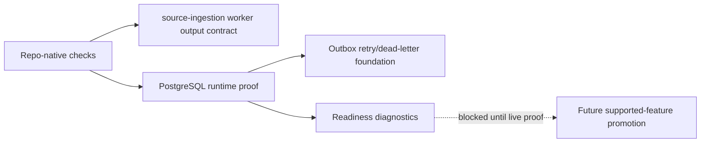

# Operations Runbook

Current posture: scaffold operations plus internal domain, persistence/replay,
lifecycle, review, AI-governance, certified internal high-cash, lifecycle,
AI explanation, advisor queue, review-action, feedback, and candidate evidence
replay API foundations, and conversion governance plus certified internal
conversion intent/outcome and report evidence-pack API foundations. The service
remains internal foundation only:
repository-backed API persistence is process-local by default and
PostgreSQL-backed only when `LOTUS_IDEA_DATABASE_URL` is configured. Accepted
internal mutations also create source-safe outbox records with internal
retry/dead-letter delivery state semantics and a source-safe HTTP
broker-publisher adapter foundation, and source-safe downstream adapter
foundations plus certified internal downstream submission APIs. There is still
no certified live broker runtime, downstream execution proof, production
recovery command, Workbench proof, or supported business API. Bounded
read-only Gateway publication exists for advisor queue and candidate detail
only. A versioned
migration/rollback schema contract exists for the durable repository and is
enforced by `make migration-contract-gate`.
`make migration-execution-gate` dry-runs apply and rollback execution plans, and
`make migrate` / `make migrate-rollback` execute against PostgreSQL when
`LOTUS_IDEA_DATABASE_URL` is configured. `make postgres-integration-gate` proves
the high-cash API persistence/replay path and the first internal review,
feedback, conversion, report evidence-pack, and advisor queue workflow path
against a real PostgreSQL 18 service when
`LOTUS_IDEA_POSTGRES_INTEGRATION_URL` is configured, including schema
rollback/reapply recovery.
Internal high-cash source-ingestion orchestration now exists as an application
foundation over the Core source port and repository port. It generates a
source-ingestion idempotency key when one is not supplied and classifies
accepted, replayed, conflict, blocked, suppressed, and not-eligible outcomes,
and it now includes a bounded run-once batch worker foundation with per-item
idempotency, batch decision counts, and maximum item validation.
`scripts/run_source_ingestion_worker.py` provides the versioned run-once worker
CLI, and `make source-ingestion-worker-check` validates the manifest contract
and source-safe check-only output contract without calling Core or writing
state. Check-only and run-mode summaries are
source-safe: check-only reports manifest shape and item indexes, while run mode
reports decision counts, candidate ids when candidates are created, and
idempotency-key presence. Neither summary prints raw source payloads, portfolio
ids, or raw idempotency keys. The PostgreSQL runtime proof covers replay after
repository reload plus same-key
changed-source conflict recovery. This is not a deployed scheduler daemon, live
Core source-worker certification, production storage certification,
data-product certification, Gateway route, Workbench proof, or supported
business feature.
The internal `GET /api/v1/data-mesh/readiness` diagnostic is available for
operators to inspect the repo-authored `not_certified` data-mesh posture and
blockers; it does not certify or promote a data product.
The internal `GET /api/v1/data-mesh/trust-telemetry/runtime-preview`
diagnostic is available for operators with
`idea.mesh.trust-telemetry.preview.read` to inspect aggregate runtime telemetry
preview counts from the active repository provider. It remains
`not_certified` until platform source-manifest inclusion, mesh certification,
Gateway/Workbench discovery, and supported-feature evidence exist.
`make runtime-trust-telemetry-snapshot-check` generates the corresponding
source-safe runtime snapshot under
`output/trust-telemetry/runtime/idea-candidate.telemetry.v1.json`. The snapshot
is contract-shaped runtime evidence only; it does not promote producer products
or replace platform mesh certification.
The internal `GET /api/v1/data-mesh/trust-telemetry/runtime-snapshot`
diagnostic returns the same contract-shaped snapshot for operators with
`idea.mesh.trust-telemetry.snapshot.read`. It remains source-safe and
`not_certified`; it is not platform source-manifest inclusion, mesh
certification, Gateway/Workbench discovery, client-ready publication, or
supported-feature promotion.
The internal `GET /api/v1/source-ingestion/readiness` diagnostic is available
for operators with `idea.source-ingestion.readiness.read` to inspect high-cash
run-once worker manifest, Core base URL, durable repository configuration, and
remaining certification blockers without calling Core or exposing source
payloads. It remains `not_certified` until live Core source proof, scheduled
worker deploy proof, runtime data-mesh telemetry, and Gateway/Workbench proof
exist.
The internal `GET /api/v1/outbox-delivery/readiness` diagnostic is available
for operators with `idea.outbox-delivery.readiness.read` to inspect aggregate
outbox backlog, retry/dead-letter posture, durable repository posture, broker
configuration posture, publisher-adapter presence, and remaining certification
blockers. It does not expose event identifiers, aggregate identifiers, raw
idempotency keys, broker payloads, or downstream claims. It remains
`not_certified` until live broker runtime proof, downstream consumer contracts,
platform mesh event certification,
Gateway/Workbench proof, and supported-feature evidence exist.
The internal `GET /api/v1/review-queues/advisor/readiness` diagnostic is
available for operators with `idea.review.queue.readiness.read` to inspect
aggregate advisor queue posture, exclusion counts, durable-storage posture, and
remaining certification blockers without exposing candidate identifiers or
access-scope identifiers. It remains `not_certified` until durable queue
posture, platform caller-context entitlement proof, Workbench proof,
data-product certification, and runtime trust telemetry exist.
The internal `GET /api/v1/ai-explanations/readiness` diagnostic is available
for operators with `idea.ai-explanation.readiness.read` to inspect AI
explanation guardrail availability, model-risk supportability posture, and
remaining certification blockers without invoking `lotus-ai`, exposing prompts,
provider payloads, candidate identifiers, source routes, portfolio identifiers,
or client identifiers. It remains `not_certified` until `lotus-ai` runtime
workflow execution, durable AI lineage storage, workflow-pack runtime
certification, model-risk operations dashboards, runtime trust telemetry, and
Workbench proof exist.
The internal `GET /api/v1/implementation-proof/readiness` diagnostic is
available for operators with `idea.implementation-proof.readiness.read` to
inspect aggregate RFC-0002 proof posture across source ingestion, advisor
queue, AI explanation, data mesh, runtime trust telemetry preview/snapshot
evidence, outbox delivery, Workbench realization, downstream realization, and
supported-feature promotion. It remains `not_certified` and `blocked` while
any proof family lacks live evidence, and it must not be used as live implementation proof,
live broker runtime, downstream delivery, Gateway/Workbench proof,
data-product certification, certified runtime trust telemetry, client-ready
publication, or supported-feature promotion.
The internal `GET /api/v1/downstream-realization/readiness` diagnostic is
available for operators with `idea.downstream-realization.readiness.read` to
inspect Advise, Manage, Report, Render, and Archive realization blockers over
current `lotus-idea` workflow counts and planned Advise/Manage/Report handoff
contract posture. It remains `not_certified` and `blocked` until downstream
intake/materialization contracts, Gateway/Workbench product proof, runtime
trust telemetry, and supported-feature evidence exist. Planned contract
records are not downstream route-existence proof; the endpoint does not call
downstream services or create downstream records.

The internal downstream submission routes are available for callers with
`idea.downstream-realization.submit` and `Idempotency-Key`:

| Route | Current use | Boundary |
| --- | --- | --- |
| `POST /api/v1/conversion-intents/{conversionIntentId}/downstream-submissions` | Submit an existing Advise or Manage conversion intent through configured source-safe adapters. | Submission posture only; no outcome recording, suitability, execution, Gateway/Workbench proof, or supported-feature promotion. |
| `POST /api/v1/report-evidence-packs/{reportEvidencePackId}/downstream-submissions` | Submit an existing Report evidence-pack request through the configured Report adapter. | Submission posture only; no package intake proof, render output, archive record, client-ready publication, or supported-feature promotion. |

Missing adapter configuration returns `503 downstream_realization_not_configured`
instead of producing a false support claim.

## Operator Map

| Operating area | Current proof | Must not be inferred |
| --- | --- | --- |
| Source ingestion | Manifest plus source-safe check-only output gate; internal run-once foundation | Deployed scheduler, live Core certification, or supported ingestion product |
| Persistence | PostgreSQL integration proof for internal persistence/replay paths | Production recovery readiness |
| Outbox delivery foundation | Source-safe records, retryable failure status, published status, dead-letter status, HTTP publisher adapter foundation, and aggregate readiness diagnostic for accepted internal mutations | Certified live broker runtime or downstream delivery |
| Data mesh | Proposed contracts and source-safe readiness diagnostics | Promoted data product or platform catalog publication |
| Downstream realization | Readiness diagnostics plus certified internal submission posture over current workflow counts, source-safe adapter-foundation presence, and planned Advise/Manage/Report handoff contract posture | Advise/Manage/Report/Render/Archive materialization or downstream route-existence proof |



Initial commands:

```powershell
make install
make check
make ci
make postgres-integration-gate
make source-ingestion-worker-check
make implementation-proof-readiness-check
make runtime-trust-telemetry-preview-check
make runtime-trust-telemetry-snapshot-check
make clean
uvicorn app.main:app --reload --port 8330
```

Use `make clean` after local test or coverage runs when ignored cache and
coverage residue should be removed before branch hygiene checks. The command
uses the governed cleanup utility and does not remove `.git`, `.venv`, or
dependency cache directories.

RFC-0002 will add support runbooks for:

1. upstream source unavailable,
2. stale evidence,
3. duplicate idea burst,
4. scoring policy disabled,
5. review queue backlog,
6. entitlement denial,
7. idempotency conflict,
8. AI unavailable,
9. unsupported AI output,
10. downstream conversion failure,
11. report/archive handoff failure,
12. replay hash mismatch.

## Current Operation Event Diagnostics

RFC-0002 Slice 15 now emits bounded operation-event logs and the
`lotus_idea_operation_events_total` metric for high-cash signal evaluation,
candidate persistence, candidate evidence replay, lifecycle transitions,
advisor queue reads, review actions, AI explanation fallback/verifier
evaluation, AI explanation readiness diagnostic reads, feedback records,
conversion intent recording, conversion outcome
recording, report evidence-pack request recording, downstream realization
submission, data-mesh-readiness
diagnostic reads, runtime-trust-telemetry-preview and snapshot diagnostic
reads, source-ingestion-readiness diagnostic reads, advisor queue-readiness
diagnostic reads, outbox-delivery-readiness diagnostic reads,
downstream-realization-readiness diagnostic reads, plus aggregate
implementation-proof-readiness diagnostic reads.

Current outcomes:

1. `accepted`: new foundation record created in the active repository provider.
2. `fallback`: deterministic AI explanation was returned without verified AI
   workflow output.
3. `replayed`: duplicate submission with the same idempotency key and payload.
4. `conflict`: idempotency key reused with a different payload.
5. `not_found`: candidate, conversion intent, or related foundation record is absent.
6. `duplicate`, `suppressed`, and `not_eligible`: deterministic signal or
   persistence outcomes that did not create a new candidate.
7. `permission_denied`: caller capability failed closed.
8. `invalid_request`: request shape, timestamp, or idempotency key is invalid.
9. `invalid_state`: lifecycle, review, target authority, report intent, or AI
   explanation precondition failed.
10. `blocked`: verifier rejected unsupported AI output, candidate evidence
    replay found stale source posture, AI explanation readiness is missing
    `lotus-ai` runtime execution, durable lineage, model-risk dashboard,
    runtime trust telemetry, or Workbench proof, expected current
    data-mesh-readiness posture while runtime trust telemetry and platform
    certification remain absent, runtime trust telemetry snapshot generation
    is blocked by platform certification and discovery proof gaps,
    source-ingestion readiness is missing run-once
    worker configuration/certification proof, advisor queue readiness is
    missing durable queue posture, entitlement proof, Workbench proof,
    data-product certification, or runtime trust telemetry, outbox delivery
    readiness is missing live broker runtime proof, downstream consumer contracts,
    platform mesh event certification, Gateway/Workbench proof, and
    supported-feature evidence, or downstream realization readiness is missing
    Advise proposal/suitability intake,
    Manage action realization, Report/Render/Archive materialization,
    Gateway/Workbench proof, runtime trust telemetry, and supported-feature
    evidence, or downstream submission is not configured or rejected by the
    target adapter. Aggregate implementation-proof readiness reports `blocked`
    whenever any RFC-0002 proof family still lacks certification evidence.

The metric labels are intentionally low-cardinality: `operation`, `outcome`,
`supportability_status`, `source_authority`, `durable_storage_backed`, and
`supported_feature_promoted`. They must not include portfolio, client, account,
holding, transaction, request body, response body, raw entitlement failure,
trace id, or correlation id values.

Request validation, HTTP, and unhandled-error diagnostics use the central
request diagnostic helper and log route templates rather than raw URL paths.
`make source-observability-contract-gate` blocks raw `print()`, direct Python
logging, and low-level `log_event` bypasses in application source.

These signals are operator diagnostics only. `durable_storage_backed=true`
confirms only that the active repository provider is durable; it does not
certify production recovery readiness, data-product promotion, broader
downstream Report/Render/Archive realization, Gateway/Workbench proof, or
supported business capability.

## API Certification Reference

The current certified foundation endpoint inventory is summarized in
`docs/operations/api-certification.md` and backed by
`docs/operations/endpoint-certification-ledger.json`.
`make endpoint-certification-gate` now requires each certified business/operator
endpoint to cite bounded operation-event test evidence, so endpoint
certification cannot pass if supportability telemetry proof is missing.

The inventory covers high-cash evaluation, high-cash persistence, candidate
evidence replay, lifecycle transition, AI explanation evaluation, advisor
queue, review action, feedback, conversion intent, conversion outcome, report
evidence-pack request, and AI-explanation-readiness, data-mesh-readiness,
runtime-trust-telemetry-preview/snapshot, source-ingestion-readiness,
downstream-realization-readiness, downstream submission,
advisor-queue-readiness, and outbox-delivery-readiness diagnostic endpoints.
These endpoints are certified as internal foundations or operator diagnostics
only; they are not supported business features.

`GET /api/v1/review-queues/advisor/readiness` is the certified internal
advisor queue readiness diagnostic. It returns aggregate queue counts,
exclusion counts, durable-storage posture, and certification blockers for
operators without exposing candidate identifiers or access-scope identifiers.
It is not a Gateway route, Workbench proof, PM/compliance queue surface,
data-product certification, client-ready publication, or supported-feature
promotion.

`GET /api/v1/ai-explanations/readiness` is the certified internal AI
explanation readiness diagnostic. It returns guardrail availability and
certification blockers for operators without exposing prompts, provider
payloads, candidate identifiers, source routes, portfolio identifiers, or
client identifiers. It is not `lotus-ai` runtime proof, durable AI lineage
certification, model-risk dashboard proof, Gateway/Workbench support,
data-product certification, client-ready publication, or supported-feature
promotion.

`GET /api/v1/implementation-proof/readiness` is the certified internal
aggregate proof-readiness diagnostic. It returns capability-level blockers,
source-of-truth paths, and current supportability posture for operators without
exposing candidate identifiers, source payloads, portfolio identifiers, or
client identifiers. It includes the outbox-delivery proof family but does not
expose event identifiers, aggregate identifiers, raw idempotency keys, or
broker payloads. It is not live implementation proof, certified broker runtime,
downstream delivery, data-product certification, Workbench proof,
client-ready publication, or supported-feature promotion.
`make implementation-proof-readiness-check` generates the same source-safe
readiness snapshot without running the HTTP service. Use it as CI or async
operator evidence only; it is not a supported product claim.

`GET /api/v1/downstream-realization/readiness` is the certified internal
downstream realization readiness diagnostic. It returns workflow counts,
capability-level blockers, planned downstream contract-readiness records,
source-of-truth paths, downstream source-authority refs, and
orchestration/adapter posture without exposing candidate identifiers, source
payloads, portfolio identifiers, or client identifiers. The planned contract
records identify owner repositories and
adapter posture for Advise, Manage, and Report handoffs; they are not
route-existence proof. The records are governed by
`contracts/downstream-realization/lotus-idea-downstream-contracts.v1.json`, and
`make downstream-realization-contract-gate` blocks source-authority drift,
current-route claims, missing blockers, and premature certification. The
endpoint is not Advise proposal proof, Manage action
proof, Report/Render/Archive materialization proof, Gateway/Workbench proof,
client-ready publication, or supported-feature promotion.

`GET /api/v1/outbox-delivery/readiness` is the certified internal outbox
delivery readiness diagnostic. It returns aggregate backlog and status posture,
durable-storage posture, publisher-adapter presence, source-of-truth paths, and
certification blockers for operators without exposing event identifiers,
aggregate identifiers, raw idempotency keys, source payloads, or broker
payloads. It is not certified live broker runtime, downstream delivery proof,
platform mesh event
certification, Gateway/Workbench proof, client-ready publication, or
supported-feature promotion.
