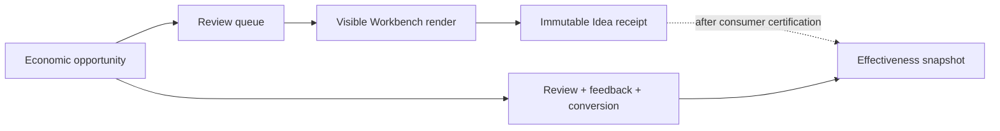

# Opportunity Effectiveness

Lotus Idea measures opportunity usefulness and downstream progression, not
candidate volume alone. The implemented read model combines durable candidate,
review, feedback, conversion, source-owned outcome, recurrence, evidence, and
reconciliation facts into one bounded tenant-scoped snapshot.

## Who Should Use It

| Reader | Primary question |
| --- | --- |
| Product governance | Are opportunities relevant, timely, reviewed, and realized under a stable methodology? |
| Operations | Why is a funnel or visible-render receipt unavailable or conflicting? |
| Engineering and QA | Are math, versions, tenant fences, persistence, and privacy boundaries proven? |
| Advisers | What does the platform measure without changing human decision authority? |

## Evidence Model

Queue retrieval is not visible-render evidence. Prefetch, off-screen items,
failed rendering, filtering, and abandonment must not inflate `shown` counts.

## Current API Posture

- `GET /api/v1/operations/opportunity-effectiveness` returns the versioned,
  privacy-safe methodology snapshot.
- `POST /api/v1/idea-candidates/{candidateId}/presentation-receipts` stores an
  immutable visible-render receipt using `Idempotency-Key` as receipt identity.
- Presentation counts remain `null` with
  `unavailable_consumer_certification_pending` until Gateway issue `#692` and
  Workbench issue `#954` are merged and validated.

The receipt is fenced by tenant, candidate material/evidence versions, UTC
chronology, rank, visible count, and SHA-256 queue snapshot digest. It stores no
client content, candidate rationale, actor identity, or raw queue payload.
The advisor queue supplies the current Idea-owned material/evidence versions
for every candidate. A Workbench receipt must copy them from the exact rendered
item rather than reconstructing source version state; Workbench remains
responsible for digesting the exact ordered identities that were visible.
It is included in the complete data-lifecycle inventory and disaster-recovery
representative fixture. Restore inspection fails on missing candidate/version
lineage, tenant mismatch, or presentation time preceding the referenced
candidate version.

## Decision Boundary

This capability does not approve an opportunity, change ranking policy,
authorize conversion or execution, infer suitability, certify Workbench or
Gateway, or promote a supported feature. Production-like callers use the
existing governed caller-context and durable-write controls; no identity
provider or token implementation is introduced here.

For methodology, request fields, failure handling, privacy rules, and validation
commands, see
[Opportunity Effectiveness And Presentation Evidence](https://github.com/sgajbi/lotus-idea/blob/main/docs/operations/opportunity-effectiveness.md).
