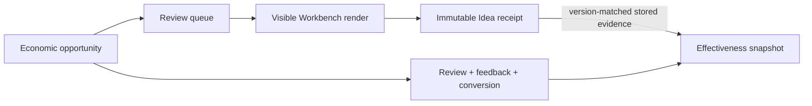

# Opportunity Effectiveness

Lotus Idea measures opportunity usefulness and downstream progression, not
candidate volume alone. The implemented read model combines durable candidate,
review, feedback, conversion, source-owned outcome, recurrence, evidence, and
reconciliation facts into one bounded tenant-scoped snapshot.

## Who Should Use It

| Reader | Primary question |
| --- | --- |
| Product governance | Are opportunities relevant, timely, reviewed, and realized under a stable methodology? |
| Operations | Why is a funnel or visible-render receipt unavailable or conflicting? |
| Engineering and QA | Are math, versions, tenant fences, persistence, and privacy boundaries proven? |
| Advisers | What does the platform measure without changing human decision authority? |

## Evidence Model

Queue retrieval is not visible-render evidence. Prefetch, off-screen items,
failed rendering, filtering, and abandonment must not inflate `shown` counts.

## Current API Posture

- `GET /api/v1/operations/opportunity-effectiveness` returns the versioned,
  privacy-safe methodology snapshot.
- `POST /api/v1/idea-candidates/{candidateId}/presentation-receipts` stores an
  immutable visible-render receipt using `Idempotency-Key` as receipt identity.
- Without qualifying receipt evidence, presentation counts remain `null` under
  `unavailable_consumer_certification_pending`; this means unavailable, not zero.
- With qualifying stored evidence, the read model returns distinct presented
  candidates, the presentation rate, the distinct rank-1 presentation
  denominator, and exact-version rank-1 acceptance rate under
  `stored_consumer_certification_pending`. Gateway/Workbench certification
  remains outstanding and the endpoint remains `not_certified`.
- Methodology v3 also returns a per-family funnel for generated, presented,
  reviewed, approved, rejected, suppressed, duplicate-suppressed, feedback,
  conversion, and current downstream outcome posture. Each rate carries its
  numerator, denominator, and null-on-empty behavior, making weak or noisy
  families visible without exposing client, portfolio, candidate, or actor
  identity and without changing production policy automatically.
- Family presentation counts and rates remain `null` when the cohort has no
  qualifying presentation receipt, preserving the difference between measured
  zero activity and unavailable evidence.

The receipt is fenced by tenant, strict-integer candidate material/evidence versions, UTC
chronology, strict positive global rank, independently bounded integer visible-set count, and
SHA-256 queue snapshot digest. A globally lower-ranked candidate may be the only
item visible after scrolling or filtering, so Workbench must neither renumber
Idea rank nor inflate visible count. It stores no client content, candidate
rationale, actor identity, or raw queue payload.
The advisor queue supplies the current Idea-owned material/evidence versions
for every candidate. A Workbench receipt must copy them from the exact rendered
item rather than reconstructing source version state; Workbench remains
responsible for digesting the exact ordered identities that were visible.
Repeated receipts for one candidate do not inflate presentation counts. A
rank-1 acceptance is attributed only when the receipt precedes an adviser
approval whose evidence hash resolves to the receipt's exact candidate version;
an older recurrence version cannot receive credit for a later approval.
The rank-1 acceptance denominator contains only candidates genuinely presented
at global rank 1. If stored receipts exist but none is rank 1, the rate is
`0 / 0` with a `null` value rather than a fabricated rejection rate.
It is included in the complete data-lifecycle inventory and disaster-recovery
representative fixture. Restore inspection fails on missing candidate/version
lineage, tenant mismatch, or presentation time preceding the referenced
candidate version.

## Decision Boundary

This capability does not approve an opportunity, change ranking policy,
authorize conversion or execution, infer suitability, certify Workbench or
Gateway, or promote a supported feature. Production-like callers use the
existing governed caller-context and durable-write controls; no identity
provider or token implementation is introduced here.

For methodology, request fields, failure handling, privacy rules, and validation
commands, see
[Opportunity Effectiveness And Presentation Evidence](https://github.com/sgajbi/lotus-idea/blob/main/docs/operations/opportunity-effectiveness.md).
