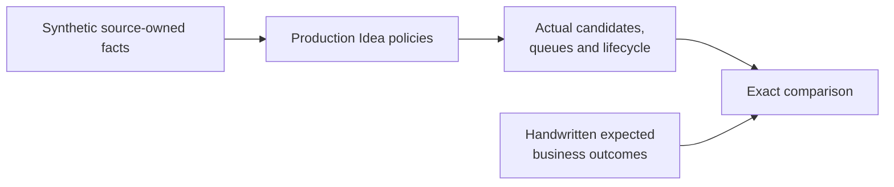

# Opportunity Quality Evaluation

The opportunity-quality golden evaluation checks whether representative,
synthetic private-banking facts produce the independently expected
opportunities, abstentions, review order, and lifecycle outcomes.

It complements family-local tests and API certification. It does not replace
either one.

## What Version 1 Proves

| Product question | Current executable evidence |
| --- | --- |
| Do active opportunities appear? | High cash, concentration, underperformance, and allocation-drift cases execute production family policies. |
| Does a quiet portfolio stay quiet? | Below-materiality cases create no advisor or portfolio-manager queue items. |
| Does unsupported evidence fail closed? | Stale, unavailable, uncertified, missing-benchmark, and unconfirmed-scope cases abstain with explicit reason codes. |
| Is review priority deterministic? | Advisor and portfolio-manager queues assert expected score order, rank, and priority bucket independently. |
| Is candidate identity governed over time? | Evidence correction, material change, suppression clearing, expiry, and recurrence execute the production reconciliation policy. |
| Would a false expected answer be caught? | Tamper tests alter outcome, explanation, rank, and lifecycle version expectations and require failure. |

## How Independence Works



Expected results are not generated from production code. Family adapters stay
explicit so source ownership and methodology differences remain visible.

## Authority Boundary

- Lotus Core owns portfolio and cash facts.
- Lotus Risk owns concentration facts and methodology.
- Lotus Performance owns returns and benchmark facts and methodology.
- Lotus Manage owns mandate workflow supportability.
- Lotus Idea owns deterministic opportunity eligibility, evidence, identity,
  review prioritization, and lifecycle policy over those source facts.

This is synthetic local test evidence. It does not prove live source
connectivity, Gateway or Workbench behavior, deployment, production
certification, suitability, or supported-feature status.

## Engineer Workflow

Run:

```powershell
make opportunity-quality-golden-set
```

The normal unit lane also runs the evaluation. A policy change may update a
handwritten expectation only when the intended product decision changed and
the issue or PR records that decision. Never derive expected results from the
policy under test.

Implementation and extension are tracked in
[lotus-idea issue #1162](https://github.com/sgajbi/lotus-idea/issues/1162).
