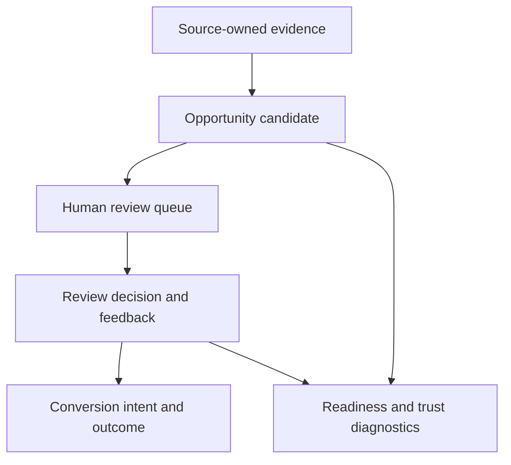

# Overview

`lotus-idea` turns governed Lotus evidence into reviewable private-banking
opportunity ideas.

The target operating model is:

1. consume source-owned facts from Lotus domain services,
2. generate deterministic opportunity candidates,
3. attach source refs, freshness, reason codes, score, and evidence,
4. route candidates through human review,
5. convert approved ideas into advisory, portfolio-management, report, or
   Workbench workflows,
6. use AI only for bounded explanation assistance through `lotus-ai`.

## Current posture

The opportunity intelligence foundation implementation is in progress. Current
support:

1. repository scaffold,
2. service boundary ADRs,
3. full RFC-0002 implementation program,
4. source wiki,
5. planned supported-feature registry,
6. certified internal high-cash signal evaluation API foundation over
   caller-supplied, source-owned Core evidence,
7. certified internal candidate lifecycle, AI explanation evaluator, advisor
   explanation readiness, advisor queue, review-action, and feedback API foundations over persisted
   candidates,
8. bounded read-only Gateway publication for advisor queue and candidate
   detail,
9. certified internal downstream realization readiness diagnostic plus
   source-safe downstream submission APIs for existing Advise/Manage
   conversion intents and Report evidence-pack requests, with planned
   Advise/Manage/Report handoff contract posture,
10. certified internal aggregate implementation-proof readiness diagnostic for
    RFC-0002 blocker visibility,
11. certified internal runtime trust telemetry preview and snapshot diagnostics
    plus generated source-safe runtime snapshot evidence for aggregate
    data-mesh posture.

No external business feature is supported yet. The high-cash, advisor queue,
lifecycle, AI explanation, AI explanation readiness, review-action, and
feedback API foundations are certified for internal contract evolution and
operator supportability diagnostics, and the first Gateway publication is
read-only integration foundation. The implementation-proof readiness diagnostic
reports blockers, including outbox-delivery blockers. The downstream
realization readiness diagnostic reports blockers, workflow counts,
source-safe orchestration/adapter-foundation presence, submission route
posture, and planned contract posture only. The
runtime trust telemetry preview reports aggregate active-repository counts
only, and the runtime snapshot endpoint/generated artifact remain blocked.
None of these
diagnostics is Workbench proof,
data-product certification, AI runtime proof, certified live broker runtime,
downstream route-existence proof, downstream execution proof, live
implementation proof, or a client-demo feature claim.

| Capability area | Current posture | Promotion boundary |
| --- | --- | --- |
| Signal evaluation | Certified internal foundation | Not a supported product workflow |
| Candidate lifecycle and review | Certified internal foundation with bounded Gateway queue/detail caller-scope forwarding and read-only Workbench queue/detail rendering | Requires full live Workbench proof, entitlement-denied proof, and broader product-surface entitlement proof |
| Source ingestion | Run-once and scheduled-worker internal foundation | Requires live Core, mesh, Gateway/Workbench, downstream, and support-promotion proof |
| Data mesh | Proposed contracts, readiness diagnostics, and blocked runtime snapshot evidence | Requires platform certification and runtime telemetry promotion |
| Gateway and Workbench publication | Bounded read-only Gateway publication plus read-only Workbench queue/detail rendering | Requires full live proof, mutation affordances, entitlement-denied proof, and supported-feature evidence |
| Downstream realization | Intent/outcome tracking foundation plus source-safe submission routes, adapter, and planned contract posture | Requires Advise, Manage, Report, Render, and Archive route-existence and execution proof |
