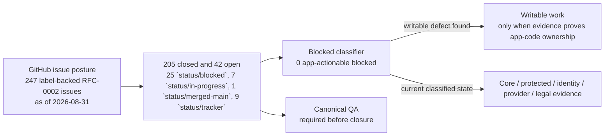
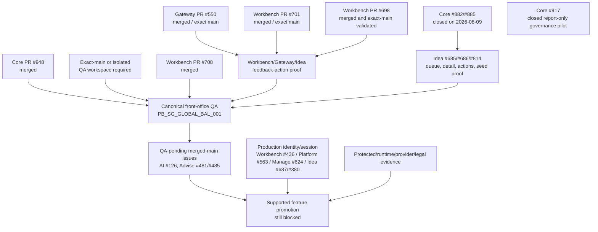

# RFC-0002 Execution Status

Current posture: RFC-0002 foundations are implementation-backed, but no
externally supported Lotus Idea product feature is promoted.

Use this page to find the current issue posture, canonical QA status,
dependency map, and closure rules without relying on chat memory.

## Reader Map

| Audience | Read first | Decision this page supports |
| --- | --- | --- |
| Business and product | [What Is Already Implementation-Backed](#what-is-already-implementation-backed) and [Non-Claims](#non-claims) | What can be described as current foundation versus what remains unsupported. |
| Sales and demo | [Canonical Front-Office QA Status](#canonical-front-office-qa-status) and [Next Execution Order](#next-execution-order) | Whether an end-to-end demo claim has current evidence. |
| Operations and support | [Current Snapshot](#current-snapshot) and [Highest-Leverage Remaining Dependencies](#highest-leverage-remaining-dependencies) | Which blocker class owns the next recovery or escalation path. |
| Engineering and agents | [Open Status Counts](#open-status-counts) and [Closure Decision Matrix](#closure-decision-matrix) | Which issues can be fixed, closed, or must remain blocked. |

## Current Snapshot

| Evidence | Current value |
| --- | --- |
| As-of date | 2026-08-31 |
| Snapshot command | `make rfc0002-cross-repo-issue-posture` |
| Live drift gate | `make rfc0002-issue-posture-live-gate`; scheduled and manually dispatchable through `RFC-0002 Issue Posture Audit` |
| Execution audit | `make rfc0002-github-issue-execution-state-audit` passed; canonical current external blocker references are checked against their owning repositories |
| Repositories checked | 13 |
| Total RFC-0002 issues | 247 |
| Closed RFC-0002 issues | 205 |
| Open RFC-0002 issues | 42 |
| Open blocked issues | 25 |
| App-actionable blocked issues | 0 |
| Active RFC work | `sgajbi/lotus-idea#681` remains the Slice 18 synchronization tracker. `#1155` has its Idea-owned feedback taxonomy and offline evaluation on exact main while consumer proof remains open. `#1156` has its Idea-owned opportunity-effectiveness and visible-render receipt contracts on exact main while consumer proof remains open. `#1162` is closed after the independently authored golden evaluation, exact-main release proof, wiki publication/parity, and branch hygiene completed. None promotes a supported feature or completes final RFC-0002 blockers. |

These figures are a dated baseline, not a demand that normal delivery freezes
all lifecycle labels. The live gate permits issue closure and status
redistribution inside the seven-day freshness window while requiring exact
repository and total-issue cardinality, a no-new-or-reopened open-issue set,
non-increasing blocker counts, complete governed lifecycle coverage, and exact
title-only references.

The zero app-actionable blocked count is important. It means an open issue may
remain `status/blocked` only when the remaining authority is Core-owned,
protected-environment evidence, production identity/session authority,
provider/legal/model-risk approval, or certification evidence. If writable
application work is discovered in a blocked issue, move that issue out of
blocked posture and implement or reclassify it.



## Open Status Counts

| Status label | Count | Interpretation |
| --- | ---: | --- |
| `status/blocked` | 25 | Protected, identity, provider, legal, publication, canonical QA, or certification evidence. |
| `status/in-progress` | 7 | Idea #681/#1155/#1156, Gateway #691/#692, and Workbench #953/#954. The consumer issues are active writable work, not blockers. |
| `status/merged-main` | 1 | Merged-main issue awaiting QA closure evidence, currently `sgajbi/lotus-ai#126`. |
| `status/tracker` | 9 | Parent or umbrella tracking issues, not immediate implementation items. |

Latest synchronization evidence: the dated 2026-08-31 GitHub baseline has 247
label-backed RFC-0002 issues, 205 closed and 42 open, with 25 `status/blocked`,
7 `status/in-progress`, 1 `status/merged-main`, 9
`status/tracker`, and 0 app-actionable blocked issues. As
of 2026-08-31, the Idea source ledger tracks 152 RFC-0002 issues: 125 closed and
27 open. `#681`, `#1155`, and `#1156` remain in progress. PR #1163
placed the #1162 evaluation implementation on exact main
`f3aa9f1ddc76181d8e642cbba3712114be09254c`; Main Releasability run
`33322378418` and CodeQL run `33322371179` passed. PR #1164 synchronized and
published that truth on exact main `738a23daf946772e200ed36d2108fd5bbb4a934d`;
Main Releasability run `33323617114`, CodeQL run `33323616468`, wiki publication
`384c618`, strict parity, and branch hygiene passed, and #1162 is closed. `#1154` is closed after PR #1157 exact-main, release-image,
wiki, and branch-hygiene proof. `#1150` is
closed after PR #1152 exact-main, release-image, wiki, and branch-hygiene proof,
`#1145` remains closed after PR #1149 exact-main, release-image, wiki, and branch-hygiene proof, and `#1139` is closed after PR
#1147 exact-main, live-posture, wiki, and branch-hygiene proof.
`lotus-idea#1119`,
`#1121`, `#1123`, `#1125`, `#1127`, `#1129`, and `#1131` are closed after
Slice 17 release-governance hardening; `lotus-idea#1110` is closed after PR #1114/#1115/#1116 for
downstream intake wire-contract gate hardening;
`lotus-idea#1109` is closed after PR #1111/#1112 for signal API contract-gate
hardening; `lotus-idea#1104` is closed after PR #1105 for supported-feature
gate fixture hardening; `lotus-idea#1101` is closed after PR #1102 for AI
workflow evaluator hardening; `lotus-idea#1098` is closed after PR #1099 for
release-CI hardening; `lotus-idea#1094` is closed
after PR #1095 for test-support maintainability; `lotus-idea#1091` is
closed after PR #1092 reached exact main
`a1273204c47168806e4f1b1b21d8c30660aa8970`; Main Releasability run
`31796812445`, Push-on-main run `31796803970`, wiki publication `37352ca`,
strict wiki parity, and branch cleanup passed. This is source-truth
synchronization only; no closure in this section promotes a Lotus Idea
supported feature.

## Highest-Leverage Remaining Dependencies

| Priority | Issue | Why it matters | Current owner boundary |
| --- | --- | --- | --- |
| 1 | Current exact-main QA workspace readiness | Core PR #948 merged to `43c8933fd40d5e45a1097619623878d3d41bfec4`; Gateway PR #550 merged to `192c74279e48bdeeca6514110a0210999aaac996`; Workbench PR #701 merged to `9aaaa9343baa278a2f6b2cacb0a9c2431ba5c023`; Workbench PR #708 merged to `5b9b431c9d1c73a58dacdbdcfa4ee3eacb00abba`; and Idea PR #1107 merged to `ea0b5951de8245e97e436e7e2e5cd46a1e1c2639`. Closure-grade canonical proof still needs a clean exact-main run or isolated non-conflicting QA workspace because the shared local Core checkout is on `fix/c157-integration-fixture-contract` and the shared local Workbench checkout is on `ux/706-performance-drivers-reflow`. | Local workspace coordination, not an Idea feature claim. Do not disturb active Core/Workbench agent branches; run canonical proof only from exact-main or isolated workspaces. |
| 2 | Workbench/Gateway/Idea feedback-action proof | The latest completed canonical QA stopped before AI/Advise proof because the Workbench browser did not observe the expected Gateway-backed feedback confirmation. Workbench PR #698 and PR #701 are now merged to exact main, but neither PR replaces fresh canonical QA. | Workbench/Gateway/Idea runtime proof after Core, Gateway, Workbench, and Idea are clean exact main. |
| 3 | Idea `#814`, `#685`, and `#686` canonical proof | Core `#882` is closed; these issues still require fresh governed PB_SG_GLOBAL_BAL_001 queue/detail/action evidence, not downstream hash fabrication or stale artifacts. | Canonical full-stack proof across Idea, Gateway, and Workbench. |
| 4 | QA-pending merged-main issues | `sgajbi/lotus-ai#126`, `sgajbi/lotus-advise#481`, and `sgajbi/lotus-advise#485` need fresh issue-specific canonical evidence before closure. | Close only when the fresh run reaches and proves each path. |
| 5 | Production identity/session issues | Blocks supported-feature promotion and production principal proof. | Not implemented in local/dev; tracked through Workbench `#436`, platform `#563`, Manage `#624`, and Idea `#687` / `#380`. |



## Recently Unblocked Dependencies

| Issue | Current state | Why it matters now |
| --- | --- | --- |
| `sgajbi/lotus-core#882` | Closed on 2026-08-09 with `status/merged-main`. | The blocker classifier no longer treats Core DPM source-batch fingerprint publication as open. Idea `#814`, `#685`, and `#686` must now be proved with fresh canonical runtime evidence. |
| `sgajbi/lotus-core#885` | Closed on 2026-08-09 with `status/merged-main`. | Data-product request-scope drift is no longer an open blocked dependency in the RFC-0002 cross-repo posture. |
| `sgajbi/lotus-core#917` | Closed on 2026-08-09 with `status/merged-main`. | Core completed the report-only technology-governance pilot evidence. It removes the Core pilot from active in-progress posture but does not certify production vulnerability posture or supported-feature promotion. |
| `sgajbi/lotus-platform#659` | Closed on 2026-08-09 with `status/merged-main`. | Canonical QA `canonical-front-office-qa-20260809-084903` proved the DPM command-center seed completed with status `ok`; the later Workbench browser failure remains tracked separately. |

## Canonical Front-Office QA Status

Latest known full canonical run:

| Field | Value |
| --- | --- |
| Platform summary | `lotus-platform/output/front-office-qa/canonical-front-office-qa-20260809-084903.md` |
| Platform JSON | `lotus-platform/output/front-office-qa/canonical-front-office-qa-20260809-084903.json` |
| Live validation summary | `lotus-platform/output/front-office-qa/rfc0002-canonical-qa-20260809-0849/live-validation-summary.json` |
| Portfolio | `PB_SG_GLOBAL_BAL_001` |
| DPM command-center seed | Passed and wrote `dpm-command-center-seed-20260809-091311.json` |
| Lotus Idea readiness | Ready on direct and canonical hosts |
| Run result | Failed in canonical Workbench browser validation |

Failure observed:

```text
expect(locator).toBeVisible() failed
Expected text:
Feedback recorded through Gateway. Source-owned detail and queue posture have been refreshed.
```

This failure happened before the run reached the advisory copilot and Advise
proposal proof paths. Therefore it cannot close:

| Issue | Closure requirement still missing |
| --- | --- |
| `sgajbi/lotus-ai#126` | Fresh canonical QA must prove the advisory copilot `PROPOSAL_EXPLANATION` path reaches `REVIEW_REQUIRED` or later reviewed posture. |
| `sgajbi/lotus-advise#481` | Fresh canonical QA must prove Advise startup remains valid in the full front-office runtime. |
| `sgajbi/lotus-advise#485` | Fresh canonical QA must prove the reviewed narrative report-package request path progresses through Workbench/Gateway. |

Current dependency refresh: `lotus-workbench` PR #698 is merged to main
`9ff3161c917bf38c41aef4e8f9c42cb3d9c40b50`, exact-main Main Releasability
run `31784470442` passed, wiki parity is `DiffCount 0`, and issue
`sgajbi/lotus-workbench#697` carries post-merge evidence. That removes the
known Workbench review-workspace implementation dependency, but it does not
replace a fresh canonical QA run. Core PR #948, Gateway PR #550, Workbench PR #701, Workbench PR #708, and the latest Idea source-truth PRs are merged. The
remaining preflight concern is workspace hygiene: the shared local Core and
Workbench checkouts are active non-main agent branches, so closure-grade
canonical proof should run only from exact-main repositories or an isolated
non-conflicting QA workspace.

## Closure Decision Matrix

| Situation | Correct action | Incorrect action to avoid |
| --- | --- | --- |
| Issue is `status/merged-main` or Advise `status/merged-to-main`, but fresh canonical QA has not reached its proof path. | Keep open and wait for issue-specific QA evidence. | Closing because the PR merged or because an earlier run passed another path. |
| Issue is `status/blocked` and the remaining authority is Core, protected runtime, identity, provider, legal, or production certification. | Keep blocked with owner/evidence clearly stated. | Reclassifying as writable app work without evidence. |
| A blocked issue reveals a writable app-code defect. | Move it out of blocked posture, link or create the canonical issue, fix, test, and validate. | Leaving app-actionable work hidden under `status/blocked`. |
| Canonical QA fails before downstream proof paths. | Record the failure and fix the first failing owned path. | Closing later-stage AI/Advise/platform issues from an incomplete run. |
| Supported-feature registry remains `foundation_only`. | Use foundation and roadmap language only. | Calling the product supported, bank-ready, or client-ready. |

## What Is Already Implementation-Backed

RFC-0002 has implementation-backed foundations across:

| Area | Current support level |
| --- | --- |
| Domain vocabulary and lifecycle | Implemented foundation, not product support. |
| Deterministic opportunity policies | Implemented internal candidate foundations across Core, Performance, Risk, Advise, and Manage source evidence. |
| Persistence, replay, idempotency, and audit | Implemented repository foundations with PostgreSQL proof paths. |
| Advisor queues, review, feedback, and conversion intent | Implemented internal foundations with trusted caller and entitlement boundaries. |
| AI explanation governance | Implemented deterministic and review-gated foundations; live-provider and model-risk production certification remain blocked. |
| API/OpenAPI certification | Implemented internal certified endpoint foundations and gates. |
| Downstream realization | Implemented bounded conversion/report intent and source-contract proof consumption; client publication remains blocked. |
| Operations and vulnerability posture | Implemented bounded internal posture and gates; protected execution and production evidence remain blocked. |

Use [Supported Features](Supported-Features) for the externally supported
feature truth. The registry remains `foundation_only` with an empty `features`
list.

## Next Execution Order

| Order | Work | Completion evidence |
| --- | --- | --- |
| 1 | Prepare exact-main or isolated canonical QA workspace after Core PR #948, Gateway PR #550, Workbench PR #701, Workbench PR #708, and the latest Idea source-truth PRs have merged. | Passing `mainline-source-provenance` preflight for all 13 canonical repositories before any stack mutation, without disturbing active Core/Workbench agent branches. |
| 2 | Finish the current Workbench/Gateway/Idea feedback-action canonical QA blocker. | Issue-backed commits, focused tests, and fresh canonical QA progressing past the feedback step. |
| 3 | Re-run canonical front-office QA after Core `#882` closure is consumed by the stack and current Core/Gateway/Workbench/Idea branches are mainline-clean. | Machine-readable `live-validation-summary.json`, screenshot index, platform QA JSON/Markdown, and no failed browser assertions for queue/detail/action proof. |
| 4 | Reconcile Idea `#814`, `#685`, and `#686` from fresh runtime artifacts only. | Queue/detail/action-control proof from the governed runtime, with stale artifacts rejected. |
| 5 | Close QA-pending merged-main issues only when their specific proof appears in the fresh run. | Issue-loop `qa_passed_closed` comments retaining merged-main evidence. |
| 6 | Continue Slice 18/19 hardening and Slice 20 closure only after blockers are resolved or explicitly classified. | Updated docs/wiki/context, exact-main CI evidence, wiki publication, and branch hygiene. |

## Non-Claims

This page does not promote:

1. client-ready opportunity advice,
2. suitability, compliance, mandate, risk, performance, or execution authority,
3. production identity/session-token proof,
4. live AI-provider/model-risk certification,
5. protected deployment, cost, or capacity certification,
6. data-product activation or supported-feature promotion,
7. final RFC-0002 closure.

Those claims stay blocked until their owning issues carry implementation-backed
mainline evidence and the supported-feature registry changes from
`foundation_only`.
