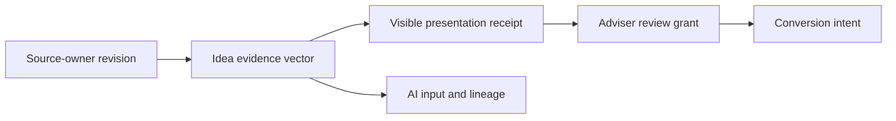

# Source Revision Authority

## Why It Matters

An opportunity must remain tied to the exact upstream facts that justified it.
The same business date can have multiple restatements, calculation runs, or
methodology versions.

Every boundary carries the same revision-vector digest and explicit source-cut
posture. Idea preserves upstream authority; it does not create it.

## Decision Rule

| Source-cut posture | Interpretation | Review or conversion authority |
| --- | --- | --- |
| `coherent` | One authoritative source cut | Allowed |
| `coherent_with_declared_tolerance` | Named policy admits bounded skew | Allowed |
| `mixed` | Incompatible cuts, causal revisions or restatements, or failed reconciliation | Blocked |
| `partial` | Incomplete or uncomparable owner claims | Blocked |
| `unknown` | Authority cannot be established | Blocked |

Idea resolves each causal claim against the corresponding included owner
product before accepting a shared cut ID or time tolerance. Explicit revision
or restatement mismatch is `mixed`; missing or ambiguous comparison is
`partial`. Cut identity and tolerance never override a known contradiction.

Non-authoritative candidates may remain visible for diagnosis. Their
presentation receipt records the posture and never upgrades it.

## Boundaries

- Source services own revision, restatement, calculation, methodology, and
  reconciliation claims.
- Idea normalizes, hashes, persists, and evaluates those claims.
- Transport success, timestamps, hashes, and matching dates do not establish a
  coherent cut.
- Gateway and Workbench pass through the Idea contract without deriving source
  authority.

Migration `026` retains old v1 presentation receipts as `unknown` legacy
evidence. They remain auditable but cannot authorize a current review.

For implementation detail, see the repository source document
`docs/architecture/source-revision-authority.md`.
