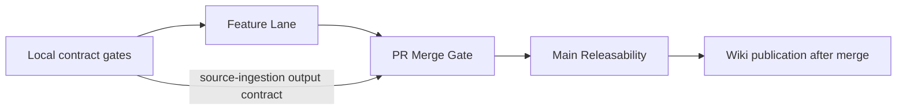

# Validation And CI

This page explains which checks to run, what each lane proves, and where the
gate details live. `lotus-idea` has many implementation-backed contract gates;
the structure below keeps the decision path separate from the detailed
evidence inventory.

Current summary: branch or PR success is necessary but not sufficient for
durable RFC/docs/wiki/support closure. Release truth requires merge to `main`,
green mainline checks, synchronized docs/wiki/context/support posture, and
clean branch hygiene.

## Quick Decision Map

| Situation | Run | Result needed |
| --- | --- | --- |
| Small code or docs edit | `make lint`, focused tests | Fast local proof before commit. |
| API contract change | `make openapi-gate`, `make endpoint-certification-gate`, focused API tests | Runtime/OpenAPI/certification agreement. |
| Supported-feature claim | `make supported-features-gate`, `make implementation-truth-gate`, `make implementation-proof-closure-manifest-gate`, `make blueprint-scope-coverage-gate` | No unproved support or certification language; every proof blocker and blueprint capability has issue, evidence, slice, and non-promotion truth. |
| Dependency or container vulnerability posture change | `make dependency-vulnerability-posture-gate`, `make security-audit`, release lane for image scan/SBOM/signing/provenance | Exact stable dependency pins, lock mirror truth, governed Python vulnerability audit, Trivy/release hook wiring, and issue-backed exceptions. |
| Persistence or migration change | `make migration-contract-gate`, `make migration-execution-gate`, focused repository tests | Apply/rollback and query-shape proof. |
| PostgreSQL recovery change | `make disaster-recovery-contract-gate`, real restore/resume proof, `make disaster-recovery-proof-gate` | RPO/RTO, restored invariants, replay/fencing, and no-mutation evidence. |
| Canonical source-proof run | `make canonical-opportunity-source-proofs` with governed runtime arguments | Source-specific live evidence, traceability, and fail-closed blocker posture. |
| Lotus AI runtime proof | `python scripts/generate_ai_workflow_pack_runtime_execution_proof.py --generated-at-utc <utc> --lotus-ai-base-url <lotus-ai-base-url> --output output/ai/ai-workflow-pack-runtime-execution-proof.json` | Actual review-gated `idea_explanation.pack@v1` execution and a source-safe receipt; live provider remains blocked. |
| AI lineage-store certification | Main Releasability `make postgres-integration-gate`, then `make ai-lineage-store-ci-proof` | Exact-main PostgreSQL behavior, uploaded test-artifact digest, and a closed CI execution receipt; no live-provider or supported-feature claim. |
| Durable repository CI proof | Main Releasability `make postgres-integration-gate`, then `make durable-repository-ci-proof` | Exact-main migration, persistence/replay, concurrency/audit/outbox, and repository-side pagination assertions bound to the uploaded test artifact. |
| Release-grade local proof | `make ci-release` | Full local release evidence. |
| Wiki source change | wiki audit, wiki check-only, publish after merge | Repo source and published wiki agree. |

`lotus-idea` starts with the Lotus backend lane model:

1. Feature Lane for branch feedback.
2. PR Merge Gate for required merge readiness.
3. Main Releasability Gate for post-merge truth.
4. Merged PR Main Releasability Dispatch as the authoritative post-merge
   trigger, with manual reruns through `workflow_dispatch`; the gate does not
   also run on `push` to `main`, avoiding expected cancelled duplicate runs.
5. Non-suppressed auto-merge token enforcement through `LOTUS_AUTOMERGE_TOKEN`;
   without that secret, the helper warns, skips auto-merge, and requires a
   human/release actor to rebase merge.

## Gate Map

| Lane | Main proof | What it protects |
| --- | --- | --- |
| Feature Lane | Fast lint, typecheck, unit, action lint | Branch feedback without write permissions |
| PR Merge Gate | Integration, coverage, Docker, PostgreSQL, security | Merge readiness and runtime parity |
| Main Releasability | Release evidence, SBOM, Docker, PostgreSQL | Post-merge truth on `main` |
| Protected deployment migration | Exact signed digest, release-bound PostgreSQL history, source-safe attested evidence | Controlled schema change eligibility; not rollout certification by itself |
| Scheduled PostgreSQL DR | Real logical backup/restore, resume proof, evidence attestation | Weekly recovery regression detection; not provider PITR certification |
| Local contract gates | Makefile, docs, source safety, mesh, endpoint certification | Future-agent drift and unsupported claims |

### Evidence Classes

Proof consumers distinguish source contracts, test execution, CI execution,
runtime execution, deployment, and production certification. A lower class
cannot clear a blocker owned by a higher class. In particular, source files,
Make targets, and workflow text cannot prove that a test ran successfully.

AI lineage-store certification requires the closed
`lotus-idea.ai-lineage-store-ci-execution-receipt.v1` receipt. It binds the
trusted repository, workflow, PostgreSQL job, run id and attempt, exact main
commit and ref, successful conclusion, uploaded artifact SHA-256, and the exact
lineage persistence assertion. The aggregate proof remains blocked when the
receipt is absent, malformed, or inconsistent.

Durable repository proof follows the same evidence class without sharing AI
policy. Its persistence-specific receipt is derived from governed PostgreSQL
JUnit cases and must match the trusted mainline workflow/job, exact commit and
main ref, run identity, successful conclusion, artifact digest, proof time, and
complete assertion set. Source files, Make targets, PR runs, stale receipts,
or a named CI lane cannot clear the two persistence blockers. Production
database deployment and supported-feature promotion remain separate.

Deployment-migration repository controls merged through PR `#373`. Exact-main
Main Releasability run `29261043056` and CodeQL run `29261035371` passed on
`6ba9618a`; release evidence binds the signed and attested image digest to its
SHA tag, OCI labels, `/version`, SBOM, scan, and digest-only deployment posture.
Protected migration execution and rollout-health evidence remain separate
certification requirements. [Issue #375](https://github.com/sgajbi/lotus-idea/issues/375)
tracks the remaining execution gap. Protected staging and production
environments now exist with protected-branch rules, and production requires
reviewer approval. The environment-scoped database secret, governed target,
approved connectivity path, and live rollout evidence remain absent. The
workflow uses GitHub's ephemeral `ubuntu-latest` runner, consistent with the
other Lotus applications; runtime-only secret injection remains mandatory.



## Wiki Publication Control

Repo-local `wiki/` is the authored source. The live GitHub wiki is a publication
target and must not carry durable truth that is absent from `main`.

| Step | Command | Expected result |
| --- | --- | --- |
| Pre-merge wiki check | `C:\Users\Sandeep\projects\lotus-platform\automation\Sync-RepoWikis.ps1 -CheckOnly -Repository lotus-idea` | Local source and publish target are compared without mutation. |
| Post-merge publish | `C:\Users\Sandeep\projects\lotus-platform\automation\Sync-RepoWikis.ps1 -Publish -Repository lotus-idea` | Published wiki matches the repo-local source from merged `main`. |
| Documentation gate | `make documentation-contract-gate` | Same-wiki links omit `.md`, required wiki surfaces exist, and governed anti-claim language remains present. |

## Command Groups

| Group | Primary commands | Use |
| --- | --- | --- |
| Aggregate lanes | `make check`, `make ci`, `make ci-release` | Routine local proof, broad CI-equivalent proof, and release evidence. |
| Contract and documentation | `make ci-contract-gate`, `make foundation-structure-gate`, `make documentation-contract-gate`, `make implementation-truth-gate`, `make supported-features-gate`, `make blueprint-scope-coverage-gate`, `make rfc0002-github-issue-execution-ledger-gate`, `make rfc0002-github-issue-learning-pattern-gate` | Prevent workflow, docs, support, blueprint, issue-lifecycle, issue-learning, and certification drift. |
| Dependency and vulnerability posture | `make dependency-vulnerability-posture-gate`, `make security-audit`, `make container-image-scan`, `make release-sbom` | Govern mature supported dependencies, Python vulnerability scan evidence, container scan wiring, SBOM/signing/provenance hooks, and issue-backed vulnerability exceptions. |
| API and OpenAPI | `make openapi-gate`, `make endpoint-certification-gate`, `make api-route-metadata-gate`, `make caller-context-contract-gate` | Keep runtime API and published contract truth aligned. |
| Persistence and runtime | `make migration-contract-gate`, `make migration-execution-gate`, `make deployment-migration-contract-gate`, `make postgres-integration-gate`, `make disaster-recovery-contract-gate`, `make disaster-recovery-proof-gate`, `make container-runtime-smoke` | Prove durable storage, local migration plans, protected exact-image migration controls, restore/resume, and runtime behavior. |
| Mesh and proof artifacts | `make data-mesh-contract-gate`, `make mesh-policy-source-contract-proof-gate`, `make implementation-proof-readiness-check`, `make implementation-proof-closure-manifest-gate`, `make blueprint-scope-coverage-gate`, `make canonical-opportunity-source-proofs`, `make runtime-trust-telemetry-snapshot-check` | Validate data-mesh, source-contract, proof-readiness, blocker ownership, and blueprint scope posture without conflating policy declarations with certification. |
| Quality and maintainability | `make maintainability-gate`, `make duplicate-implementation-gate`, `make quality-scorecard-gate`, `make architecture-boundary-gate` | Prevent modularity and maintainability regression. |

Use the [Makefile](https://github.com/sgajbi/lotus-idea/blob/main/Makefile) as
the authoritative complete command inventory. This page groups the commands by
decision path so it stays readable.

`make architecture-boundary-gate` is the durable blocking architecture proof.
It also validates the tracked `quality/architecture_boundary_report.json`
freshness contract, including schema, source import digest, source file count,
rule digest, status, violations, and rule body. `make architecture-boundary-report`
regenerates that deterministic report. This is design-boundary evidence only;
it does not certify runtime behavior, Gateway/Workbench support, data-mesh
certification, or supported-feature promotion.

`make ci` is the broad local aggregate for lint, typecheck, contract gates,
OpenAPI, migrations, integration/e2e/coverage, and dependency audit. It must
not be cited as PostgreSQL runtime, Docker build, container smoke, image scan,
SBOM, or release evidence unless those targets were run separately.
`make ci-release` is the governed full-lane local command: it runs `make ci`
plus `implementation-proof-readiness-check`,
`runtime-trust-telemetry-snapshot-check`, `postgres-integration-gate`,
`docker-build`, `container-runtime-smoke`, `container-image-scan`, and
`release-sbom`. Run and cite `make ci-release` only when local Docker and
disposable PostgreSQL prerequisites are available.
`make ci-contract-gate` blocks drift if the full-lane target drops any of those
heavy proof families.

Baseline required checks include lint, format check, typecheck, architecture boundary enforcement,
repository hygiene, maintainability thresholds, protected private import boundary enforcement, documentation contract enforcement,
quality-scorecard truth, monetary precision guarding, no-sensitive-content evidence guarding,
OpenAPI quality, source-observability contract enforcement, API route metadata governance, API DTO base-model governance, shared signal DTO governance, API ProblemDetails boundary governance, API idempotency boundary and OpenAPI required-header governance, OpenAPI ProblemDetails example governance, signal API contract enforcement, operation metric contract enforcement, implementation-truth gate, supported-feature gate, endpoint-certification gate,
AI model-risk operations contract enforcement, AI model-risk operations proof contract enforcement,
unit tests, integration tests, e2e tests, data-mesh contract validation,
mesh policy source-contract validation, migration contract validation, coverage gate,
safe migration execution dry-run validation, protected exact-image deployment
migration contract validation, PostgreSQL runtime proof in PR/main GitHub lanes,
durable repository proof contract validation,
runtime trust telemetry test-execution contract validation,
Risk high-volatility and drawdown live-proof contract validation,
closed v2 Advise mandate/restriction runtime-evidence contract validation,
Advise mandate/restriction source-product proof contract validation,
report-intake route proof contract validation,
Workbench read-path source-contract proof validation,
Gateway/Workbench contract proof contract validation,
Gateway/Workbench discovery contract proof contract validation,
AI lineage store proof contract validation,
AI workflow-pack registration proof contract validation,
AI workflow-pack runtime execution proof contract validation,
source-ingestion worker manifest and source-safe output-contract validation,
scheduled source-ingestion worker source/deployment contract validation and
source-safe artifact-ref recording in aggregate implementation-proof readiness,
receipt-bound source-ingestion v2 `runtime_execution` validation with
aggregate-current provenance consumption, implementation-proof readiness release-lane artifact
generation, runtime trust telemetry preview validation and runtime trust
telemetry snapshot release-lane artifact generation,
security audit, Docker build validation, runtime-only Docker dependency posture,
non-root container execution, governed Docker base/scanner image identity,
commit-tagged image publication, registry digest capture in release evidence,
keyless image signing, provenance attestation, runtime Python dependency SBOM
evidence tied to the published service image reference/id/digest, packaged container startup
smoke proof over health/live/readiness, bounded GitHub job timeouts, no soft-failed
critical jobs, immutable GitHub Action SHA pins with version provenance, and workflow lint. The
scheduled-worker image contract additionally checks that every Compose-declared worker asset is
present in the build context and copied into the image, including the canonical manifest and
entrypoint helper modules. A local worker check is not enough: validate the built image with
`docker run --rm lotus-idea-lotus-idea-source-ingestion-worker python scripts/run_scheduled_source_ingestion_worker.py --check-only --manifest /app/docs/examples/source-ingestion/canonical-high-cash-worker.manifest.json`.

The typed Advise source-product gates use one capability-owned generator and
validator with separate profiles. They bind the current Advise product and
trust-telemetry files by digest, preserve blocked telemetry, and reject unknown
or authority-bearing claims. The documentation contract also reconciles every
aggregate proof CLI input with its application argument, evidence class,
tracking issue, and inventory row. Scheduled-worker deployment evidence remains
absent until a deployment controller emits a matching observed receipt. Issue
`#508` implements the fail-closed source-contract and deployment-evidence
contracts; static Compose declarations are not treated as a deployment receipt.

### Executable Proof Effects

The registry's blocker effect is enforced at runtime. Standard aggregate,
opportunity-archetype, source-ingestion, downstream, and scheduler consumers
must resolve one classified registry entry and match their intended
`blocker_clearing` or `supporting_evidence` behavior before accepting an
artifact. Unknown, duplicate, pending, or wrong-effect wiring fails closed.

Aggregate downstream contracts now pass through one provenance-aware
consumption boundary. A source contract outside the 24-hour aggregate freshness
window cannot appear in aggregate evidence merely because a nested readiness
model recognizes its static contract shape. This is an internal modularity and
correctness control; it does not prove route serving, deployment, production
certification, or supported-feature readiness.

`make ci-contract-gate` target explicitly fails if current blocking lint gates are removed from
`make lint`, if artifact-producing implementation-proof readiness or runtime
trust telemetry snapshot generation is added back to `make lint`, or if
`make ci-release` drops those release/review evidence generators, so enforcement
cannot silently degrade into optional local commands.
It also fails if Main Releasability regains a `push` trigger while the merged-PR
dispatch workflow remains active, because normal merges should produce one
authoritative release-proof run rather than a paired cancelled run and
successful dispatch run.

The GitHub Security tab posture is governed in both repository settings and
source-controlled files. Dependabot alerts/security updates are enabled, secret
scanning with push protection is enabled, private vulnerability reporting is
enabled, and CodeQL default setup is configured for GitHub-owned static
analysis over Python and GitHub Actions. `SECURITY.md` defines supported
security review scope, private reporting expectations, and source-safe report
content, while `.github/dependabot.yml` defines a single grouped Python
dependency-closure root update stream plus grouped GitHub Actions dependency
monitoring. Routine Dependabot version-update PRs are paused with
`open-pull-requests-limit: 0` while RFC delivery is active; manually regenerate
or cherry-pick dependency suggestions into the active implementation branch and
validate them through repo-native gates. It must not define a separate
`/requirements` lock-only Python update stream; use `make dependency-refresh`
to regenerate runtime lock truth from root pins before merge validation. GitHub currently reports non-provider
secret patterns and secret validity checks as disabled for this repository even
after an admin API enable attempt, so they are advisory future controls and are
not release-evidence claims. `make github-security-posture-check` verifies the
live mutable GitHub posture, including required enabled settings, CodeQL
`default` query suite with `remote` threat model, private vulnerability
reporting, and zero open code-scanning, secret-scanning, and Dependabot alerts.
`make ci-contract-gate` fails if the source-controlled controls are removed or
weakened.

CI timing and signal-quality evidence is retained as report-only release
support evidence. Feature Lane, PR Merge Gate, and Main Releasability run an
`if: always()` CI Signal Evidence job that reads GitHub job timing metadata with
`actions: read`, writes source-safe `ci-signal-evidence.json`, and uploads a
lane-specific artifact. The job must quote the composed
`repos/${GITHUB_REPOSITORY}/actions/runs/${GITHUB_RUN_ID}/jobs` argument passed
to `gh api` so workflow lint stays free of ShellCheck word-splitting
annotations. Main Releasability release evidence references
`main-releasability-ci-signal-evidence` and `ci-signal-evidence.json`.
The artifact distinguishes workflow feedback time from longest individual job
duration: `workflowWallClockSeconds` and `criticalPathSeconds` measure first
job start through last job completion, while `longestJobName` and
`longestJobSeconds` identify the largest single job. `make ci-signal-evidence-contract-gate`
validates the artifact schema and keeps `thresholdEnforced` false; `make ci-contract-gate` blocks
removal of the workflow wiring. No CI duration threshold is enforced yet.

Main Releasability SBOM evidence is runtime-dependency scoped. `make release-sbom`
generates `sbom.cdx.json` from `requirements/runtime-resolved.lock.txt` with the pinned
CycloneDX tool, and `release-evidence.json` records the SBOM scope, generator,
dependency source, project metadata, target service image reference, local image
id, registry digest, digest deployment reference, signature subject, and
provenance/SBOM attestation URLs.
`make runtime-dependency-closure-gate` blocks direct-only runtime locks by
checking the resolved lock against the installed transitive dependency closure
for the `pyproject.toml` runtime roots and against the
`requirements/requirements.txt` GitHub Dependency Graph mirror.
`make dependency-refresh` is the governed Python dependency PR reconciliation
command: it installs from root pins without a stale runtime-lock constraint,
then regenerates `requirements/runtime-resolved.lock.txt` and
`requirements/requirements.txt` from the active runtime closure.
Container OS/package posture remains the Trivy image scan's responsibility;
the generated SBOM remains runtime-dependency scoped rather than a full
container filesystem SBOM.

Images are pushed by CI only. Main Releasability lower-cases the GHCR
repository, tags the service image with `${GITHUB_SHA}`, scans and smoke-tests
the same tag, pushes it only after the release gates pass, resolves
`RELEASE_IMAGE_DIGEST_REF`, signs that digest with keyless Cosign, and creates
GitHub provenance and SBOM attestations. Environments must promote the same
`repository@sha256:<digest>` reference; deployment by mutable tag or
environment rebuild is not a supported release path.

### Image Identity Contract

`lotus.image-identity.v1` separates immutable build identity from the final
registry manifest digest. The image carries commit, branch, build timestamp,
repository, CI run, and build ID labels plus an explicit
`runtime-release-manifest` digest-binding label. It does not carry a value that
pretends to be its own final digest.

After publication, Main Releasability pulls and runs the exact
`repository@sha256:<digest>` image, captures OCI labels and `/version`, and runs
`make release-image-identity-contract-gate`. The gate compares build identity,
registry digest, Kubernetes deployment reference, signature subject,
provenance/SBOM attestation subjects, and runtime metadata. Placeholder values,
mutable-tag deployment, subject drift, or digest mismatch fail the release.
Published environments inject the resolved digest pair from governed release
or deployment metadata; missing or invalid bindings make readiness degraded.

Local Compose passes the same seven non-secret build-identity fields through
the governed `LOTUS_IDEA_BUILD_*` namespace. Canonical Workbench automation
must set exact Idea commit, branch, build time, repository, run, build, and
version values before rebuilding. The default `unknown`/`local` posture is
acceptable for ad hoc diagnostics only; it is not canonical provenance,
release evidence, or permission to pass secrets through Docker build inputs.

The same Compose contract requires the separate Advise, Manage, and Report
realization base/path pairs. Generic source-read URLs cannot stand in for
downstream handoff configuration; `make ci-contract-gate` blocks missing
realization wiring before canonical runtime validation.

PR Merge Gate and Main Releasability also run `make container-runtime-smoke`
after the Docker image build. The target starts the built image, probes
`/health` and `/health/live` for `200`, requires `/health/ready` to be reachable
with either `200` or the default-profile fail-closed `503`, prints container
logs on failure, and removes the container. This is packaged runtime startup
proof, not production deployment, live upstream connectivity, Workbench,
data-mesh certification, client publication, or supported-feature proof.

The runtime Dockerfile preserves cacheable dependency layers. It installs
`requirements/runtime-resolved.lock.txt` before copying `src`, then installs the
local package with `--no-deps` so source-only changes do not force the full
runtime dependency closure to reinstall. `make ci-contract-gate` blocks
source-before-dependency-install ordering and dependency reinstall drift while
leaving Docker build, runtime smoke, image scan, and SBOM evidence intact.

Docker build context hygiene stays aligned with generated-artifact cleanup.
`.dockerignore` excludes coverage data, `coverage.xml`, `sbom.cdx.json`,
`output`, and generated quality reports so local validation byproducts do not
become Docker builder inputs. `make ci-contract-gate` blocks Docker-context
generated-artifact parity drift without changing the runtime Dockerfile input
set.

Duplicate implementation enforcement is split by command. `make duplicate-implementation-inventory`
scans exact function-body duplicates across `src/app` and `scripts`, writes no artifacts, and
reports `thresholdEnforced: false` for review evidence. `make duplicate-implementation-gate` runs
the same scanner with `--fail-on-duplicates`, reports `thresholdEnforced: true`, and is wired into
`make lint` as the zero-cluster regression blocker. The initial six-line baseline scanned 1,750
functions and reported 31 exact duplicate clusters, including the known proof source-safety helper
families. The
first proof-helper consolidations moved source-safety traversal into
`scripts/proof_source_safety.py` and live-proof generator timeout/output plumbing plus
generated-at UTC parsing into `scripts/proof_generator_io.py`, and shared proof timestamp
validation, make-target evidence checks, and cross-repository file-evidence checks into
`src/app/application/source_safe_cross_repo_proof.py`, and AST call-name parsing into
`scripts/ast_gate_helpers.py`, and Core live-proof base URL resolution into
`scripts/proof_generator_io.py`, and Advise/Manage proof evidence request construction into
`scripts/proof_request_builders.py`, and mutating API reason-code validation into
`app.api.request_validation`, and bounded API telemetry count buckets into
`app.api.telemetry_buckets`, and caller-supplied signal response DTO projection into
`app.api.signal_models.SignalEvaluationResponse`, and application-layer portfolio-only signal
review scopes into `app.application.access_scope`, and source-reference/access-scope write-side
payload projection into `app.ports.evidence_payloads`, and API persistence-summary response
projection into `app.api.persistence_summary`, and API review access-scope DTOs into
`app.api.access_scope_models`, and blocked signal-result construction into
`app.domain.signal_evaluation.blocked_signal_result`, and optional proof-artifact JSON object
loading into `app.runtime.proof_artifact_files`, and source-product proof payload text-sequence
normalization into `app.application.source_product_proof_values`, and outbox contract
forbidden-text traversal into `scripts.contract_text_guards`, and operations-contract payload,
operation, and label validation into `scripts.operations_contract_validators`; the report-only
quality baseline now uses the same pass/ellipsis-only protocol-stub classifier as the blocking
maintainability and duplicate scanners, and emits POSIX-normalized report paths so Windows and
Linux runs produce deterministic quality evidence. The current local generated quality baseline
reports 9,252 executable source/test/script function rows, and the current duplicate
implementation gate reports 0 exact duplicate clusters across 2,953 source/script functions. The
CI contract gate protects the report-only and blocking target split, strict
`--fail-on-duplicates` enforcement, and `make lint` lane placement.
The exact duplicate-code threshold is promoted for first-party implementation bodies; broader
near-duplicate or generated-pattern similarity checks remain unpromoted until they have their own
measured baseline and exception policy.

Protected `main` uses strict branch protection. Required PR Merge Gate status checks are:

1. `PR Merge Gate / Workflow Lint`
2. `PR Merge Gate / Lint Typecheck Security`
3. `PR Merge Gate / Tests (unit)`
4. `PR Merge Gate / Tests (integration)`
5. `PR Merge Gate / Tests (e2e)`
6. `PR Merge Gate / Coverage Gate (Combined)`
7. `PR Merge Gate / PostgreSQL Runtime Proof`
8. `PR Merge Gate / Validate Docker Build`

The PostgreSQL runtime proof is required explicitly, not only as a Docker-build dependency, because
it proves durable repository behavior, migration rollback/reapply, idempotency replay,
source-ingestion recovery, concurrent review/feedback resource-identity
serialization, and source-safe AI explanation lineage persistence against real
`postgres:18-alpine` state.

Persistence adapter validation:

1. `tests/unit/test_postgres_repository.py` exercises the PostgreSQL repository
   adapter with a fake Postgres cursor across candidate persistence,
   idempotency replay, lifecycle history, audit events, review decisions,
   feedback, conversion intent/outcome, report evidence-pack requests, snapshot
   hydration, commit behavior, rollback on flush failure, optimistic stale
    same-candidate update rejection, idempotency primary-key collision retry,
    review/feedback resource-identity collision retry to governed replay or
    identity conflict, and atomic rollback of failed mutation attempts.
2. `tests/unit/test_postgres_idempotency_precheck.py` proves durable review,
   feedback, and conversion-intent replay/conflict prechecks read
   `idea_idempotency_record` by key plus candidate-detail projection without
   hydrating unrelated outbox or downstream state. Review and feedback also use
   bounded primary-key identity reads and reserve a new transport key only for
   equivalent resource content.
3. `tests/unit/test_repository_state.py` proves repository provider selection,
   runtime profile semantics, local/test process-local write allowance,
   production-like durable-write blockers, `PostgresIdeaRepository` when
   `LOTUS_IDEA_DATABASE_URL` is configured, psycopg mapping-row configuration,
   provider caching, durable-storage status, and connection close/reset
   behavior.
3. `tests/unit/test_security_caller_context.py` and
   `tests/integration/test_caller_context_boundary_api.py` prove that
   production-like profiles reject self-asserted `X-Caller-*` authorization
   headers without trusted-ingress provenance, while valid
   `X-Lotus-Trusted-Caller-Context` propagation still authorizes through the
   existing role plus capability policies. Representative signal, lifecycle,
   review, AI, report, downstream, and readiness routes preserve exact
   400/403 ProblemDetails, `application/problem+json`, sanitized correlation,
   and source-safe diagnostic categories without raw header or scope values.
   `make caller-context-contract-gate` blocks exception, handler, protected
   route, OpenAPI, media-type, and route-local parser drift.
4. `tests/integration/test_high_cash_signal_api.py` pins route-level
   `durableStorageBacked` derivation with an injected durable repository so
   future changes cannot hardcode repository-backed API posture to `false`.
5. `tests/integration/test_postgres_runtime_integration.py` is the first real
   PostgreSQL runtime proof. GitHub PR Merge Gate and Main Releasability run it
   against `postgres:18-alpine` with
   `LOTUS_IDEA_POSTGRES_INTEGRATION_REQUIRED=1`; local runs skip unless
   `LOTUS_IDEA_POSTGRES_INTEGRATION_URL` is configured. The proof covers
   high-cash persistence/replay plus the first advisor queue, lifecycle,
   review, feedback, conversion intent/outcome, report evidence-pack request,
   internal source-ingestion replay/conflict recovery, and AI explanation
   lineage accepted/replayed/conflict workflow paths against real PostgreSQL
   state, plus schema rollback/reapply recovery.
5. `tests/unit/test_source_ingestion.py` now also proves the bounded run-once
   source-ingestion batch worker foundation: duplicate work-item replay,
   changed-source conflict, batch decision counts, timezone validation, maximum
   item enforcement, and correlation propagation.
6. `tests/unit/test_source_ingestion_worker.py` and
   `make source-ingestion-worker-check` prove the versioned run-once worker
   manifest contract plus source-safe check-only output contract and aggregate
   blocked-reason diagnostics without calling Core or writing repository state.
7. `tests/unit/test_source_ingestion_scheduled_worker.py`,
   `tests/unit/source_ingestion_scheduler/`, and
   `make source-ingestion-scheduled-worker-check` prove scheduler configuration,
   opt-in Docker Compose wiring, source-contract digest binding, deployment
   identity reconciliation, source-safe output, and non-clearing static
   evidence.
8. `tests/unit/source_ingestion_runtime_evidence/test_runtime_execution.py`,
   `tests/unit/source_ingestion_runtime_evidence/test_contract_gate.py`, and
   `make source-ingestion-runtime-execution-contract-gate` prove the closed v2
   `runtime_execution` contract. Positive fixtures traverse the application
   use case and repository; mutation tests reject unknown claims, non-current
   or wrong-authority Core refs, evidence-hash/scope/count drift, missing
   persistence receipts, mixed outcomes, in-memory posture, and claim
   inflation. Valid current evidence changes only the family live-Core posture
   and high-cash archetype live-Core blocker.
9. `tests/unit/test_generate_implementation_proof_readiness.py` and
   `make implementation-proof-readiness-check` prove the aggregate RFC-0002
   implementation-proof readiness artifact, including source-ingestion proof
   artifact refs, durable repository proof, runtime trust telemetry
   test-execution supporting evidence, non-AI operator workflow operations proof consumption,
   Workbench read-path source-contract proof consumption, Gateway/Workbench
   source-contract proof consumption, Gateway/Workbench discovery contract
   proof consumption, bounded outbox broker source-contract proof consumption,
   default digest-bound Advise and Manage route source-contract generation and
   supporting-evidence consumption without live-blocker clearance,
   optional closed v2 Manage mandate runtime-evidence consumption,
   optional receipt-bound Core benchmark-assignment runtime evidence consumption,
   optional receipt-bound Core portfolio-state runtime evidence consumption,
   optional closed v2 Core missing-benchmark runtime-evidence consumption,
   optional closed v2 Performance benchmark-readiness runtime-evidence
   consumption,
   default Report intake route source-contract generation and consumption, default
   Report materialization source-contract generation and consumption, default
   platform catalog source contract generation and
   consumption, AI lineage store proof generation and consumption, and AI
   workflow-pack registration/runtime execution proof generation and consumption,
   plus opportunity archetype scenario readiness from the governed contract, can be
   generated without starting the service and
   without exposing candidate, portfolio, client, prompt, outbox event, raw
   idempotency, broker, or source payload identifiers.
10. `tests/unit/runtime_trust_telemetry/test_test_execution_contract.py` and
    `make runtime-trust-telemetry-test-execution-contract-gate` validate the
    source-safe v2 `test_execution` contract. Aggregate readiness records valid
    current evidence as provenance but clears no blocker, preserving
    `runtime_candidate_snapshot_missing`, `durable_repository_not_configured`,
    `runtime_trust_telemetry_product_coverage_incomplete`,
    `certified_runtime_trust_telemetry_missing`, and
    `data_mesh_runtime_telemetry_not_certified` until declared product coverage
    is complete.
11. `tests/unit/workbench/test_read_path_source_contract.py` and
    `make workbench-read-path-source-contract-proof-gate` prove the source-safe
    Workbench queue/detail read-path v2 `source_contract`. Aggregate readiness
    records its evidence reference but preserves
    `workbench_gateway_bff_consumption_proof_missing` until runtime serving,
    consumption, entitlement, and browser evidence exists.
12. `tests/unit/workbench/test_contract_proof.py` and
    `make gateway-workbench-contract-proof-contract-gate` prove the
    source-safe bounded Gateway/Workbench contract proof. Aggregate readiness
    records the `source_contract` evidence reference but preserves
    `gateway_workbench_proof_missing` for source-ingestion and outbox-delivery
    until machine-verifiable runtime execution evidence exists.
13. `tests/unit/workbench/test_discovery_contract_proof.py` and
    `make gateway-workbench-discovery-contract-proof-contract-gate` prove the
    source-safe bounded Gateway/Workbench discovery contract proof. Aggregate
    readiness adds its reference to data-mesh and runtime-trust evidence but
    preserves `gateway_workbench_discovery_proof_missing` until
    machine-verifiable runtime evidence exists.

    `tests/unit/workbench/test_owner_mainline_evidence.py` and
    `make gateway-workbench-owner-mainline-evidence-gate` validate the
    RFC-0002 Slice 11 owner-mainline evidence index. The contract binds exact
    merged-main Gateway and Workbench PR/CI evidence while preserving
    production identity, browser/accessibility, canonical runtime,
    data-product certification, and supported-feature promotion blockers.
14. `tests/unit/outbox/broker/test_source_contract_proof.py`,
    `tests/unit/outbox/broker/test_readiness_consumption.py`,
    `tests/unit/outbox/test_outbox_consumer_contract_proof.py`,
    `tests/unit/outbox/platform_mesh/test_source_contract_proof.py`,
    `tests/unit/outbox/platform_mesh/test_readiness_consumption.py`,
    `make outbox-consumer-contract-gate`,
    `make outbox-broker-source-contract-proof-gate`,
    `make outbox-consumer-contract-proof-contract-gate`, and
    `make outbox-platform-mesh-event-source-contract-proof-gate` prove the
    declared downstream consumer contract, source-safe bounded outbox broker
    source contract that clears no readiness blocker, bounded downstream
    consumer source-contract proof, and bounded platform-mesh event
    source-contract proof. Aggregate readiness records all three source
    evidence references without clearing runtime blockers. In particular,
    `platform_mesh_event_publication_proof_missing` remains until runtime
    publication evidence exists.
15. `tests/unit/report/test_intake_route_source_contract.py`,
    `tests/unit/test_downstream_realization_readiness.py`,
    `tests/integration/test_downstream_realization_readiness_api.py`, and
    `make report-intake-route-source-contract-proof-gate` prove the source-safe
    `lotus-report` intake route source contract that downstream and aggregate
    readiness consume as provenance without clearing a blocker. The tests prove
    `lotus_report_live_intake_route_proof_missing` remains and reject inflated
    runtime, authorization, tenant-isolation, materialization, render, archive,
    publication, certification, and promotion claims.
16. `tests/unit/report/test_materialization_source_contract.py` and
    `make report-materialization-source-contract-proof-gate` validate the
    source-safe `lotus-report` materialization source contract. The v3 artifact
    records `reportOwnerMaterializationContractConsumed=true` and links
    `sgajbi/lotus-report#152` as the closed owner proof. Downstream and
    aggregate readiness may cite the artifact but clear no blocker. Tests keep
    `report_evidence_pack_live_materialization_proof_missing`,
    `rendered_output_creation_missing`, `archive_record_creation_missing`,
    client-publication, certification, and promotion blockers, and reject
    inflated runtime or authority claims.
17. `tests/unit/report/test_materialization_runtime_execution.py` and
    `make report-materialization-runtime-execution-proof-gate` validate the
    receipt-bound `lotus-report` materialization runtime-execution proof. A
    valid current artifact must bind source-safe Report materialization
    receipts to exact Render #65/PR #67 and Archive #72/PR #73 owner-mainline
    evidence. It clears `report_evidence_pack_live_materialization_proof_missing`,
    `rendered_output_creation_missing`, and `archive_record_creation_missing`
    while preserving client-publication, production-identity, legal/retention,
    support, final certification, and supported-feature blockers.
18. `tests/unit/test_ai_lineage_store_proof.py` and
    `make ai-lineage-store-proof-contract-gate` prove the source-safe AI
    lineage store proof contract that aggregate readiness consumes to clear
    only `certified_ai_lineage_store_missing`, without leaking prompt,
    provider response, candidate, portfolio, client, request-body,
    response-body, or database URL material.
18. `tests/unit/ai_workflow_pack_registration/test_source_contract_proof.py` and
    `make ai-workflow-pack-registration-proof-contract-gate` prove the bounded
    sibling `lotus-ai` workflow-pack registration source contract. A valid v2
    artifact adds an evidence reference but clears no aggregate blocker. It
    preserves `workflow_pack_runtime_contract_not_certified`, `lotus-ai`
    runtime/provider, Workbench, client-ready, and supported-feature blockers.
19. `tests/unit/test_ai_workflow_pack_runtime_execution_proof.py`,
    `tests/unit/test_lotus_ai_workflow_runtime.py`, and
    `make ai-workflow-pack-runtime-execution-proof-contract-gate` prove the
    actual deterministic `lotus-ai` runtime execution receipt contract.
    A valid artifact clears only `lotus_ai_runtime_execution_missing` in
    aggregate readiness, adds `lotus_ai_live_provider_execution_missing`, and
    preserves workflow-pack registration, Workbench, client-ready, and
    supported-feature blockers.
20. `tests/unit/runtime_trust_telemetry/test_telemetry.py`,
    `tests/unit/runtime_trust_telemetry/test_snapshot_cli.py`,
    `tests/integration/test_runtime_trust_telemetry_api.py`,
    `make runtime-trust-telemetry-preview-check`, and
    `make runtime-trust-telemetry-snapshot-check` prove the source-safe runtime
    trust telemetry preview, API-certified contract-shaped snapshot diagnostic,
    and contract-shaped generated snapshot can be produced without exposing
    candidate identifiers, source routes, evidence hashes, portfolio
    identifiers, or client identifiers, and without promoting mesh
    certification.
21. `tests/unit/test_opportunity_archetype_contract_gate.py` and
    `make opportunity-archetype-contract-gate` prove the governed opportunity
    archetype/scenario contract preserves source-authority ownership, keeps
    high cash / idle liquidity as the first partially implemented journey, and
    blocks external demo promotion, client-publication,
    data-mesh-certification, and supported-feature claims.
    The same test pack now proves every implemented caller-supplied signal API
    recorded in the archetype contract is also required by the contract gate:
    API module, route, and integration-test evidence cannot drift apart.
    Representative Core, Risk, Performance, and Advise signal API tests also
    prove wrong `sourceSystem` or `productId` source refs are rejected before
    candidate creation or high-cash persistence, with product-safe
    `400 invalid_request` responses and source-safe invalid-request telemetry.
    `tests/unit/risk_concentration_runtime_evidence/` and
    `make risk-concentration-live-proof-contract-gate` prove the optional Lotus
    Risk concentration live-proof artifact remains source-safe and can clear
    only the namespaced live Risk source blocker when valid evidence is supplied.
    `tests/unit/high_volatility_runtime_evidence/` and
    `make high-volatility-live-proof-contract-gate` prove the optional Lotus
    Risk volatility evidence is a closed v2 `runtime_execution` receipt. It
    binds current `RiskMetricsReport:v1` evidence to the authoritative Idea
    evaluation-and-persistence result, rejects tampering and in-memory claims,
    and can clear only the namespaced volatility source blocker. The required
    PostgreSQL lane proves accepted persistence, repository reload, and replay.
    `tests/unit/test_opportunity_archetype_contract_gate.py` and
    `make opportunity-archetype-contract-gate` also require the
    high-volatility API module, route, and integration test as archetype
    evidence.
    `tests/unit/risk_drawdown_runtime_evidence/`,
    `tests/integration/source_runtime_evidence/test_postgres_replay.py`, and
    `make risk-drawdown-live-proof-contract-gate` prove the optional Lotus Risk
    drawdown artifact is a closed v2 `runtime_execution` receipt. It binds
    current `DrawdownAnalyticsReport:v1` evidence to the authoritative Idea
    evaluation-and-persistence result, rejects tampering and in-memory claims,
    and can clear only the namespaced drawdown source blocker. The required
    PostgreSQL lane proves accepted persistence, repository reload, and replay.
    `tests/unit/test_opportunity_archetype_contract_gate.py` and
    `make opportunity-archetype-contract-gate` also require the drawdown API
    module, route, and integration test as archetype evidence.
    `tests/unit/performance_underperformance_runtime_evidence/` and
    `make performance-underperformance-live-proof-contract-gate` prove the
    optional Lotus Performance underperformance artifact is closed v2
    `runtime_execution` evidence. It must bind current Performance evidence to
    accepted or replayed durable Idea persistence and can clear only the
    namespaced live Performance source blocker.
    `tests/unit/core_benchmark_assignment_runtime_evidence/` and
    `make core-benchmark-assignment-live-proof-contract-gate` prove the
    optional Lotus Core benchmark-assignment artifact is closed v2
    `runtime_execution` evidence. It binds pseudonymous request scope to one
    exact current Core source receipt and can clear only the namespaced
    benchmark-assignment source-ref blocker. The read-only use case has no
    fabricated Idea persistence receipt.
    `tests/unit/core_portfolio_state_runtime_evidence/` and
    `make core-portfolio-state-live-proof-contract-gate` prove the optional
    Lotus Core portfolio-state artifact is closed v2 `runtime_execution`
    evidence. It binds a named read-only use case, pseudonymous request scope,
    and complete current `PortfolioStateSnapshot:v1` receipt, and can clear only
    the namespaced Core portfolio-state source-ref blocker. Missing snapshot
    identity, reconciliation, policy, section, scope, time, or hash trust fails
    closed; lotus-core issue `#790` tracks the current producer gap.
    `tests/unit/bond_maturity_runtime_evidence/` and
    `make bond-maturity-live-proof-contract-gate` prove the optional Lotus Core
    maturity-summary artifact is closed v2 `runtime_execution` evidence. It
    binds pseudonymous request scope to one exact current
    `PortfolioMaturitySummary:v1` receipt and upstream `HoldingsAsOf:v1`
    content identity. Partial/stale evidence, scope or digest mismatch,
    projected holdings, unsupported lifecycle features, unknown reconciliation,
    inconsistent dates/counts, and tampering fail closed. A supported empty
    window completes without creating an opportunity. The artifact can satisfy
    only the namespaced bond-maturity live Core source blocker; lotus-core issue
    `#792` tracks missing producer reconciliation, tenant, and correlation
    metadata.
    `tests/unit/low_income_cashflow_runtime_evidence/` and
    `make low-income-core-cashflow-live-proof-contract-gate` prove the optional
    Lotus Core cashflow artifact is closed v2 `runtime_execution` evidence. It
    binds pseudonymous request scope, exact movement-summary and projection
    receipts, projection arithmetic, movement counts, and deterministic
    candidate or no-opportunity outcome. Unknown, stale, degraded,
    scope-inconsistent, arithmetically invalid, or tampered evidence fails
    closed; zero cashflow remains valid no-opportunity evidence. It can satisfy
    only the namespaced low-income Core cashflow source blocker. Core issue
    `#796` tracks producer trust metadata required for live qualification.
    `tests/unit/advise_missing_suitability_runtime_evidence/test_runtime_execution.py`,
    `tests/unit/advise_missing_suitability_runtime_evidence/test_generator.py`,
    `tests/unit/advise_missing_risk_profile_runtime_evidence/test_runtime_execution.py`,
    `tests/unit/advise_missing_risk_profile_runtime_evidence/test_generator.py`,
    `make missing-suitability-live-proof-contract-gate`, and
    `make missing-risk-profile-live-proof-contract-gate` prove the optional
    Lotus Advise policy-evaluation and risk-profile evidence remains
    source-safe and can clear only its namespaced Advise source blocker when
    valid evidence is supplied. Both use closed v2 runtime-execution contracts
    over exact request, workflow, and evaluation receipts, invoke one named use
    case with one fetch, and accept deterministic candidate or truthful
    no-opportunity outcomes. Unknown fields, scope/time/hash/posture drift,
    stale evidence, tampering, and raw identifiers fail closed.
    `tests/unit/test_implementation_proof_readiness.py`,
    `tests/unit/test_generate_implementation_proof_readiness.py`, and
    `tests/integration/test_implementation_proof_readiness_api.py` also prove
    that aggregate readiness exposes those scenario blockers as namespaced
    `opportunity_archetype_*` operator evidence without clearing product
    support.
    Historical canonical evidence generated on 2026-07-05 for
    `PB_SG_GLOBAL_BAL_001` exercised Risk concentration and the former flat
    Performance proof families. The retired Performance artifacts no longer
    qualify after the closed v2 underperformance and benchmark-readiness
    contracts. A fresh run must bind exact runtime receipts and matching
    aggregate provenance before either Performance blocker can clear. Core,
    Manage, Workbench, data-mesh, client-publication, and supported-feature
    blockers remain independent.
16. `tests/unit/test_downstream_realization_contract_gate.py` and
   `make downstream-realization-contract-gate` prove the governed downstream
   realization contract plan remains planned, source-authority preserving,
   blocker-backed, and free of route-existence, downstream-execution, or
   supported-feature claims.
17. `tests/unit/test_downstream_realization_readiness.py` and
   `tests/integration/test_downstream_realization_readiness_api.py` prove the
   downstream realization readiness diagnostic for blocked supportability,
   role plus capability enforcement, product-safe payloads, source-authority
   boundaries, planned downstream contract-readiness records, and bounded
   `not_certified` operation events without calling Advise, Manage, Report,
   Render, or Archive.
18. `tests/unit/test_source_ingestion_readiness.py` and
   `tests/integration/test_source_ingestion_readiness_api.py` prove the
   operator readiness diagnostic for blocked/configured posture,
   permission-denied behavior, relative manifest resolution, and bounded
   `not_certified` operation events without calling Core. The integration
   suite also proves the source-ingestion run-once operator action blocks
   without durable storage or runtime configuration, executes the configured
   domain batch path source-safely, enforces operator capability, and emits a
   bounded `source_ingestion_run_once` event.
19. `tests/unit/test_review_queue_application.py`,
   `tests/unit/test_postgres_review_queue.py`,
   `tests/integration/test_review_queue_api.py`, and
   `tests/integration/test_api_operation_events.py` prove the advisor queue
   readiness diagnostic for aggregate queue posture, permission-denied
   behavior, timestamp validation, product-safe payloads, and bounded
   `not_certified` operation events without exposing candidate identifiers or
   access-scope identifiers. The PostgreSQL test proves the durable readiness
   aggregate reads only candidate records and avoids unrelated state-family
   hydration.
20. `tests/unit/test_ai_explanation_readiness.py`,
   `tests/integration/test_ai_governance_api.py`, and
   `tests/integration/test_api_operation_events.py` prove the AI explanation
   readiness diagnostic for blocked model-risk posture, operator/capability
   enforcement, product-safe payloads, and bounded `not_certified` operation
   events without invoking `lotus-ai` or exposing prompts, provider payloads,
   candidate identifiers, source routes, portfolio identifiers, or client
   identifiers. `tests/integration/test_postgres_runtime_integration.py` proves
   the configured PostgreSQL runtime records, same-key replays, distinct-key
   request-id conflict-checks, and API idempotency-gates source-safe AI
   explanation lineage through the API without promoting `lotus-ai` runtime
   execution or AI explanation support.
21. `tests/unit/outbox/test_outbox_delivery_readiness.py` and
   `tests/unit/outbox/test_postgres_readiness.py`, plus
   `tests/integration/outbox/test_delivery_readiness_api.py`, prove the
   outbox delivery readiness diagnostic and run-once operator action for
   aggregate backlog/status posture, durable repository posture, broker
   configuration posture, publisher-adapter presence, blocked-without-broker
   behavior, configured-publisher delivery path, operator plus capability
   enforcement, PostgreSQL repository-side readiness projection without
   whole-snapshot hydration, route-owned broker publisher cleanup after
   run-once execution, source-safe publisher-cleanup failure isolation,
   product-safe payloads, UTC request validation, and bounded `not_certified`
   operation events without exposing event identifiers, raw
   idempotency keys, source payloads, broker payloads, or downstream contract
   details.
22. Runtime API database wiring is opt-in and still requires deploy migration
   evidence, certified long-running scheduled source-worker proof, live Core
   source-worker proof, and mesh/support promotion evidence before any
   supported durable product claim. Scheduler source/deployment evidence is
   validated separately by `make source-ingestion-scheduled-worker-check`.

The CI contract gate is blocking from day one. It prevents accidental removal of bank-buyable
controls from the Makefile or GitHub lanes, including least-privilege workflow permissions,
verified immutable action SHA pins with version provenance, 99% combined coverage in merge/releasability lanes, Docker build
validation, pinned CycloneDX SBOM generation, pinned Trivy container image scanning,
SBOM/release evidence with resolved base/scanner image digests, endpoint certification, supported-feature promotion control,
data-mesh contract validation, downstream realization contract validation,
migration contract validation, migration execution dry-run
validation, source-ingestion worker manifest and output-contract validation,
source-ingestion runtime-execution receipt contract validation, PostgreSQL runtime
proof, durable repository proof contract validation, workflow-dispatch access, non-suppressed auto-merge token
usage, merged-PR main-releasability dispatch, bounded job timeouts, no `continue-on-error: true`
in critical lanes, maintainability enforcement, quality-scorecard truth,
repository-hygiene enforcement, no-sensitive-content evidence guarding,
implementation-truth enforcement, and source-safe local quality gates.
It also has unit coverage for current-repository pass behavior and failure cases for floating
action tags, wrong verified SHAs, missing version provenance comments, weakened focused test target
wiring, missing critical e2e workflow proof, and raw workflow `pytest` shortcuts.
The e2e lane is not only a health probe: it must retain a deterministic internal
idea workflow proof covering candidate persistence, advisor queue projection,
review approval, conversion intent, report evidence-pack request, and authority
boundaries. `make test-unit`, `make test-integration`, and
`make test-e2e` default to their full suite paths while allowing scoped fix-forward runs through
`UNIT_TESTS`, `INTEGRATION_TESTS`, and `E2E_TESTS` overrides:

```powershell
make test-unit UNIT_TESTS=tests/unit/runtime_trust_telemetry/test_telemetry.py
make test-integration INTEGRATION_TESTS=tests/integration/test_runtime_trust_telemetry_api.py
make test-e2e E2E_TESTS=tests/e2e/test_critical_idea_workflow.py
```

Use these overrides for fast local diagnosis. PR evidence should still state whether the full
repo-native target or a focused target was run.

Integration and E2E API tests must construct clients through
`tests.support.http.managed_test_client`. The integration and E2E fixtures enter
the application lifespan and close all clients after each test, including
failure paths. `make test-client-lifecycle-gate` is blocking through
`make lint` and rejects direct FastAPI or Starlette `TestClient` imports and
construction in both suites. This keeps shutdown behavior explicit and prevents
cumulative event-loop socket exhaustion during repeated Windows suites and the
critical idea workflow E2E lane.

GitHub test and coverage lanes must stay repo-native:

```powershell
make test-unit
make test-unit-coverage
make test-integration-coverage
make test-e2e-coverage
make test-coverage
```

The PR Merge and Main Releasability matrices call the suite-level coverage targets and publish the
same `.coverage.<suite>` artifacts. `make ci-contract-gate` rejects raw workflow `pytest` shortcuts
so GitHub cannot drift away from the local Makefile contract.

The repository-hygiene gate blocks tracked generated artifacts and local runtime byproducts:
Python cache files, coverage outputs, build/dist outputs, dependency directories, local
environment files, logs, and local databases. It is intentionally based on `git ls-files` so
developers can keep ignored local working files while CI protects the durable source tree.
Use `make clean` to remove ignored local residue from tests, coverage, build output, and Python
bytecode caches. The cleanup utility prunes `.git`, `.venv`, and dependency cache directories, and
the CI contract gate fails if the Makefile cleanup path is weakened or removed.

The maintainability gate blocks oversized Python files/functions in source, test, and script
trees. It is calibrated above the current baseline so new agentic work must split or refactor
large additions instead of normalizing hard-to-review modules.

The private import boundary gate blocks direct imports from private helpers in
protected module surfaces: `app.domain.*` and
`app.application.implementation_proof_capability_updates`, and
`app.infrastructure.postgres_codecs`. Domain modules may use private local
helpers internally, shared proof-readiness composition uses public
`apply_blocker_proof` and `build_capability_readiness` functions, and
PostgreSQL repository code uses public row, JSON, datetime, and domain
serialization codec APIs. The gate is intentionally scoped to measured
boundaries and does not claim complete application-helper or adapter-internal
codec cleanup.

`make foundation-structure-gate` is the foundation-posture guard introduced by RFC-0002 Slice 2. It keeps
the current surface in foundation-only posture by checking the support registry,
README, repository context, RFC index, supported-features wiki, and this
validation page against the same planned-versus-supported truth. It also
reuses the architecture-boundary gate, including the domain ban on Pydantic DTO
framework imports, so design modularity stays internal and no runtime service
split is implied.

The monetary-float guard blocks money-like `float` annotations, literals, and
conversions in application source. It is AST-backed and intentionally allows
non-monetary operational floats, such as timeout seconds, so the guard protects
private-banking precision without creating noisy exceptions.

The no-sensitive-content guard scans local evidence, log, and output artifacts
for forbidden sensitive marker names such as portfolio, client, account,
holding, transaction, request-body, response-body, and raw entitlement failure
markers. It is blocking through `make lint` and has focused pass/fail unit
coverage so future evidence artifacts cannot quietly leak sensitive material.

The documentation contract gate blocks deletion, thinning, missing anchors,
placeholder text, and unstructured operator text dumps across the required
README, repository context, standards, runbooks, quality, evidence, and wiki
surfaces. Proof and readiness guides must keep a polished operator structure:
current-truth table, proof boundary, non-proof boundary, blockers,
response-shape table, implementation evidence, and executable example. The
gate keeps enterprise operating context intact for future implementation
agents without promoting any business capability.

The RFC-0002 GitHub issue execution ledger gate protects issue-lifecycle truth.
Open, partial, blocked, or merged-main-QA-pending execution issues must carry
`allowPullRequestAutoClose=false` and explicit `Keep #<issue> open` wording in
`contracts/implementation-proof/rfc0002-github-issue-execution-ledger.v1.json`.
Use this gate before opening or updating partial RFC PRs so source-contract or
evidence-consumption work cannot accidentally close live runtime, downstream,
publication, support, or supported-feature proof issues.

`make rfc0002-github-issue-execution-state-audit` is the GitHub-backed
companion audit. It calls the GitHub CLI and compares current GitHub issue
state, lifecycle labels, and `rfc/RFC-0002` label coverage with the repository
ledger. Run it before quoting RFC-0002 fixed/open counts, after issue
reopen/close/label corrections, and before final Slice 18 or Slice 20 closure
evidence. It fails if a GitHub issue is labeled `rfc/RFC-0002` but is missing
from the ledger, if a ledger issue loses the RFC label in GitHub, or if an
`open_tracker` parent issue lacks `status/tracker`. It is not part of offline CI
because it depends on GitHub state, but its parsing and failure modes are
unit-tested.

`make rfc0002-github-issue-execution-summary` renders the source-controlled
RFC-0002 issue execution summary after the ledger and learning-pattern gates
pass. Use it for implementation handoff and issue-count reporting after the live
state audit, so active issue counts and learning-pattern lenses come from
durable source rather than chat memory or assignee-only filters.

The RFC-0002 issue-learning pattern gate keeps repeated defect lessons
source-controlled. `contracts/implementation-proof/rfc0002-issue-learning-patterns.v1.json`
maps every non-complete RFC-0002 execution issue to at least one learning
cluster, durable control, future-agent rule, and non-claim boundary.
`make rfc0002-github-issue-learning-pattern-gate` is part of `make lint`; it
does not call GitHub, but it prevents new RFC execution work from escaping the
same-pattern review lens.

The quality-scorecard gate keeps the bank-buyable control matrix executable. It
requires the standard control rows, approved readiness statuses, non-empty
evidence/gap/next-slice cells, implementation-backed evidence anchors, and
stale scaffold-era underclaim detection after internal API, persistence,
observability, and test foundations have landed.

The source-observability contract gate blocks ad hoc application logging in
`src/app`. Feature code must use bounded operation events or the central
request diagnostic helper rather than raw `print()`, direct Python logging, or
low-level `log_event` calls. Request diagnostics log route templates rather
than raw URL paths. It also blocks source adapters from inferring current
freshness from readiness, supportability, coverage, health-state,
data-quality, or `ready` predicates; current freshness must be explicitly
source-authored as freshness metadata.

The API route metadata gate blocks local `RouteMetadata` and
`SignalRouteMetadata` clones in route modules so route registration metadata
uses the shared `app.api.route_metadata.RouteMetadata` contract. The
API CamelModel boundary gate blocks route-local `CamelModel` and
`ConfigDict(populate_by_name=True)` clones so camel-case DTO alias handling uses
`app.api.base_model.CamelModel`. The API signal model boundary gate blocks shared
source-ref, review access scope, source-ref response, and candidate summary DTOs
from being imported through concrete signal route modules; those DTOs live in
`app.api.signal_models`. This is design modularity inside one deployable
service, not a runtime signal microservice or supported-feature promotion. The
ProblemDetails boundary gate blocks API route modules and the app entrypoint
from importing low-level `app.errors` directly, keeping runtime ProblemDetails
helpers behind `app.api.problem_details`. The OpenAPI ProblemDetails example
gate blocks public `ProblemDetails` responses that lack product-safe examples.
Workflow and operator routes plus app-entrypoint exception handlers use
`app.api.problem_details` for concrete 400/403/404/409/503 examples;
caller-supplied signal routes keep their stricter route-family metadata in
`app.api.signal_api_support`.

When one HTTP status can return multiple stable `ProblemDetails` codes, route
metadata must merge named examples instead of spreading duplicate response keys.
`tests/unit/test_api_problem_details.py::test_downstream_submission_openapi_problem_codes_match_runtime_contract`
guards the downstream submission routes so generated OpenAPI preserves
runtime codes such as `downstream_realization_not_configured`,
`durable_repository_unavailable`, `unsupported_downstream_realization_target`,
and `idempotency_conflict`.

The signal API contract gate blocks duplicated caller-supplied signal API
authorization, source-authority, operation-event, and error-model mechanics.
Signal routes must use shared signal API support, including the ordered
`evaluate_caller_supplied_signal` boundary, and that support must require both
advisor role and `idea.signal.evaluate` capability before source-owned evidence
evaluation. This keeps DTO mapping, application evaluation, domain policy, and
source-contract checks in a predictable path so future slices do not reintroduce
copy-pasted policy, role-only authorization, or inconsistent problem-detail
behavior.

The caller-context contract gate also covers adjacent protected API modules,
including nested route packages under `src/app/api/**`. When a route policy
declares both `allowed_roles` and an `idea.*` capability, the route must use
`require_role_and_capability`. This preserves the same least-privilege posture
for advisor queue, candidate detail, outbox, and operator route families
instead of letting broad role membership substitute for a published operation
capability. It also requires typed caller-boundary exceptions, exact stable
codes and bounded error categories, preservation by the global handler,
RFC 7807 runtime media, and generated 400/403 examples under both supported
media types for every protected operation. Mutation tests fail when any one of
those layers is weakened.

The API idempotency boundary gate blocks route-local `Idempotency-Key`
validator clones and verifies generated OpenAPI for certified idempotent
mutations. A route listed in `app.api.idempotency` must publish
`Idempotency-Key` as a required header with no default value, even when the
runtime keeps product-specific validation inside the route handler.

The review identity contract gate protects the distinct business-resource
boundary. It requires application prechecks before domain mutation, repeated
adapter enforcement, identity claims before PostgreSQL candidate mutation,
typed collision retry, named OpenAPI conflict examples, and the architecture
standard. Its mutation test fails if atomic review identity claiming is removed.

The conversion outcome contract gate protects source-event identity and
lifecycle independently of transport retries. It requires bounded application
prechecks, repeated provider enforcement, atomic PostgreSQL ID/version claims,
legacy-history quarantine, current-posture validation, named OpenAPI conflict
examples, and the architecture standard. Its mutation test fails if atomic
outcome claiming is removed.

`make postgres-integration-gate` adds the behavioral proof: two connections
race equivalent outcome identity and competing versions, and a migration test
proves contradictory legacy rows remain intact while quarantine and readiness
fail closed. These checks do not certify downstream route execution,
Gateway/Workbench behavior, data-mesh promotion, or supported features.

The operation-metric contract gate validates
`contracts/observability/lotus-idea-operation-metrics.v1.json` against the
code-owned operation, outcome, supportability, and metric-label vocabulary. It
blocks sensitive labels and prevents the metric catalog from being rewritten as
dashboard certification, alert certification, data-mesh certification,
Gateway/Workbench proof, or supported-feature promotion.

The AI model-risk operations contract gate validates
`contracts/observability/lotus-idea-ai-model-risk-operations.v1.json`
against implemented AI explanation and readiness telemetry. It blocks missing
dashboard controls, missing alert candidates, sensitive labels, unsupported
operation names, missing source-of-truth paths, and premature model-risk
dashboard, alert, `lotus-ai`, Workbench, or supported-feature certification
claims. The companion source-contract proof gate validates file content and
adds a readiness evidence reference, but clears no blocker and cannot prove
dashboard provisioning, rule evaluation, alert delivery, or deployment.

The operator workflows operations contract gates validate
`contracts/observability/lotus-idea-operator-workflows-operations.v1.json`
and the repo-owned Grafana dashboard, Prometheus alert rules, and runbook for
source ingestion, outbox delivery, downstream realization, runtime trust, and
implementation-proof readiness telemetry. They block unsupported operation
names, sensitive labels, missing runbook refs, unimplemented metrics, and
premature live-source, external-broker, downstream-execution,
Gateway/Workbench, data-mesh, or supported-feature claims. The proof artifact
is classified as `source_contract`, adds provenance without clearing aggregate
blockers, and rejects claims of dashboard provisioning/query execution,
alert-rule loading/evaluation/delivery, deployment, or production
certification.

The AI workflow-pack registration proof contract gate validates the bounded
cross-repo `lotus-ai` workflow-pack registration source contract consumed by
aggregate implementation-proof readiness. It checks source-safe evidence refs,
sibling registry/binding/queue-policy/supportability/test coverage,
`source_contract` classification, empty blocker clearance, and explicit
non-execution/non-deployment posture. Runtime registry observation, provider
invocation, model-risk operations certification, Workbench proof, and
supported-feature promotion remain blocked.

The implementation-truth gate scans README, repository context, operations/demo docs, quality docs,
and wiki source for unqualified current-state claims that imply demo readiness, production support,
certification, live source ingestion, Gateway/Workbench support, or client-ready publication while
no supported feature is implemented. RFC target-state planning text is excluded; current-state
surfaces must describe unsupported, planned, blocked, or evidence-required posture explicitly. The
gate also blocks stale scaffold-era underclaims in demo documentation when current implementation
and CI evidence prove a stronger foundation, so future agent work cannot leave outdated scaffold
truth behind while adding real APIs or gates.

The endpoint-certification gate blocks weak certified API posture. It keeps the OpenAPI surface and
endpoint certification ledger synchronized, validates JSON-shaped examples, proves test evidence
references resolve to real pytest functions, keeps health/metadata routes at `baseline_certified`,
and requires certified business/operator endpoints to name an `idea.*` capability, document
product-safe 403 behavior, cite the OpenAPI quality gate, and preserve Gateway, Workbench, and
supported-feature-promotion boundaries. It also requires bounded operation-event test evidence for
every certified business/operator endpoint, so API certification and operator telemetry proof stay
coupled. Certified business/operator endpoints must also cite at least one non-operation-event
integration API behavior test and at least one negative or degraded-path test. That keeps endpoint
promotion aligned to the test pyramid instead of allowing schema examples, unit-only assertions, or
telemetry-only evidence to stand in for executable API behavior. When an endpoint has implemented
bounded read-only Gateway publication, the gate requires the ledger to cite the exact
`lotus-gateway` route and still preserve Workbench, data-product, client-ready publication, and
supported-feature boundaries. For every certified endpoint that names an `idea.*` capability, the
gate also validates generated OpenAPI caller-context publication: `LotusCallerContext` security,
`x-lotus-caller-context` required capabilities, trusted caller-context provenance wording, and
descriptions for the key caller-context headers.

The signal API contract gate blocks weak caller-supplied opportunity signal API posture. It requires
shared advisor-role plus `idea.signal.evaluate` authorization, source-authority, operation-event,
outcome-mapping, and product-safe 400/403 `ProblemDetails` OpenAPI response metadata, so new signal
families cannot introduce copy-pasted role-only authorization or weaker error-model documentation.
Runtime route code now separately validates caller-supplied source refs against each route's
governed source contract before domain evaluation, so copied route families cannot accept a valid
shape from the wrong source authority or data product.

Core-backed source routes additionally require exactly one trusted caller
tenant before runtime construction. The tenant is carried through the
application command and Core source port, into tenant-aware Core snapshot
payloads, and into candidate access scope, deterministic identity, and
generated ingestion identity. The source adapter rejects blank values, does
not supply a production default, and does not invent parameters for Core routes
that are not tenant-aware. The blocking `signal-api-contract-gate` checks route
opt-in; `trusted-tenant-context-gate` checks the full API-to-adapter and
persistence contract. Integration tests prove tenant A/B isolation plus
missing, ambiguous, untrusted-header, and request-body override rejection
without calling Core under the wrong scope. Operation events expose only a
bounded scope-provenance enum; raw tenant IDs are forbidden attributes and
metric labels.
The same gate requires every Core live-proof CLI to accept explicit
`--tenant-id` and pass it into the typed source request. Worker manifests and
proof fixtures carry `tenantId`, preventing local tests or certification
automation from reintroducing an implicit production tenant.

Data-mesh foundation checks:

1. repo-owned proposed producer and consumer declarations must exist,
2. mesh placeholder files must not exist in contract or operations paths,
3. planned trust telemetry must remain blocked and `not_certified`,
4. SLO, access, and evidence policies must be present before promotion work,
5. optional sibling platform catalog/source-manifest evidence is used to catch
   source-product drift and validate governed `lotus-idea` onboarding without
   treating catalog visibility as certification,
6. `make platform-catalog-source-contract-proof-gate` validates the bounded
   cross-repo v2 `source_contract` when a sibling `lotus-platform` checkout is
   available. It checks closed fields, exact blocker scope, explicit false
   runtime/certification claims, and repository/ref/SHA-256 authority for the
   source manifest, catalog, dependency graph, and maturity matrix. The
   aggregate readiness command generates an invalid non-proof artifact and
   keeps blockers when sibling platform evidence is absent,
7. the sibling [Lotus Data Mesh Standard](https://github.com/sgajbi/lotus-platform/blob/main/docs/standards/Lotus%20Data%20Mesh%20Standard.md)
   remains the controlling platform rule,
8. platform mesh certification is required before any supported mesh claim.

The internal data-mesh-readiness endpoint is covered by OpenAPI, endpoint
certification, unit tests, and integration tests. Its passing checks certify the
diagnostic route only; they do not certify the data products it reports as
blocked. The endpoint's blocker contract is part of the anti-promotion control
and must continue to name SLO certification, access-policy certification,
evidence-policy certification, Gateway/Workbench runtime discovery evidence,
and supported-feature promotion until those are implementation-backed and
platform-certified. Source-manifest and catalog-inclusion blockers may be
cleared only by a valid, current platform catalog source contract. That
contract is not runtime publication, policy certification, platform mesh
certification, product activation, Gateway/Workbench discovery, deployment,
production certification, or supported-feature evidence.

The internal runtime trust telemetry preview endpoint is covered by OpenAPI,
endpoint certification, unit tests, integration tests, and a repo-native
generator check. Its passing checks certify source-safe pre-certification
telemetry preview only; they do not certify data products, platform
source-manifest inclusion, Gateway/Workbench discovery, or supported-feature
promotion.

The internal runtime trust telemetry snapshot endpoint is covered by OpenAPI,
endpoint certification, unit tests, integration tests, and a repo-native
generator check. Its passing checks certify only that source-safe,
contract-shaped snapshot evidence can be emitted from the active repository
provider while remaining blocked and not certified.

The internal source-ingestion-readiness endpoint is covered by OpenAPI,
endpoint certification, unit tests, and integration tests. Its passing checks
certify the diagnostic route only. A valid proof artifact can clear only the
live-Core-source blocker; the route still does not certify scheduled execution,
long-running scheduled runtime, data-product
promotion, Gateway/Workbench support, or supported-feature promotion.
Scheduler source and deployment contracts are covered separately by
`make source-ingestion-scheduled-worker-check`. Source declarations are
non-clearing `source_contract` evidence. Only deployment evidence that binds
the exact source contract, immutable image, Git revision, environment,
controller run, and completed workload rollout may clear the scheduler
deployment blocker. Aggregate readiness records both validated references and
keeps scheduled execution, production certification, and product support
blocked.
The internal source-ingestion-run-once endpoint is covered by OpenAPI,
endpoint certification, unit tests, and integration tests. Its passing checks
certify the bounded operator action only; they do not certify live Core
ingestion, scheduler deployment or execution, long-running
scheduled runtime, data-product promotion, Gateway/Workbench support, or
supported-feature promotion.

The internal advisor-queue-readiness endpoint is covered by OpenAPI, endpoint
certification, unit tests, and integration tests. Its passing checks certify
the diagnostic route, durable PostgreSQL repository-side page projection, and
durable PostgreSQL readiness aggregate projection only; they do not certify
Gateway/Workbench support, data-product promotion, PM/compliance queue support,
client-ready publication, or supported-feature promotion.

The internal outbox-delivery-readiness endpoint is covered by OpenAPI,
endpoint certification, unit tests, and integration tests. Its passing checks
certify the diagnostic route and durable PostgreSQL repository-side outbox
status/due-ready-count projection only; they do not certify external broker
publication, downstream delivery, platform mesh event publication,
Gateway/Workbench support, client-ready publication, or supported-feature
promotion.

The internal AI-explanation-readiness endpoint is covered by OpenAPI, endpoint
certification, unit tests, and integration tests. Its passing checks certify
the diagnostic route only; they do not certify `lotus-ai` runtime execution,
provider invocation, Gateway/Workbench support, data-product promotion,
client-ready publication, or supported-feature promotion. The AI lineage store
proof is consumed only by aggregate implementation-proof readiness. The AI
model-risk operations source-contract proof validates repo-owned dashboard, alert-rule, and
runbook artifacts against implemented operation telemetry while still leaving
`lotus-ai` runtime, live provider, Workbench, client-ready, and supported-feature
gaps unpromoted.

The internal outbox-delivery-readiness and outbox-delivery-run-once endpoints
are covered by OpenAPI, endpoint certification, unit tests, and integration
tests. Passing checks certify the diagnostic route and bounded operator action
only; they do not certify live broker runtime, downstream consumer delivery,
platform-mesh event runtime publication evidence, Gateway/Workbench support, data-product
promotion, client-ready publication, or supported-feature promotion.

`make outbox-recovery-contract-gate` protects operator authorization,
idempotent one-attempt recovery, source-safe responses, immutable failure
history, and exact PostgreSQL opaque-reference selection. It rejects the prior
fixed-window scan pattern. The required PostgreSQL runtime lane additionally
proves migration execution, qualified delivery claim SQL, dead-lettering,
connection reload, exact recovery claim, durable audit replay, and
rollback/reapply. These checks certify local recovery control only, not broker
publication or downstream receipt.

The internal downstream-realization-readiness endpoint is covered by OpenAPI,
endpoint certification, unit tests, and integration tests. Its passing checks
certify the diagnostic route only; planned contract records are not downstream
route-existence proof. Report intake and materialization source-contract
artifacts clear no blocker. These checks do not certify report-job execution,
rendered output, archive creation, Advise suitability,
Manage rebalance/action authority, Gateway/Workbench support, data-product
promotion, authorize client publication, or promote a supported feature.

The downstream-realization contract gate validates
`contracts/downstream-realization/lotus-idea-downstream-contracts.v1.json`.
It blocks missing contract rows, owner/source-authority drift, current-route
claims, premature certification, missing blockers, and missing evidence refs.
Its passing checks certify contract-plan hygiene only; they do not prove
downstream route existence or execution.

## Candidate-State Contract Gate

`make candidate-state-contract-gate` protects the
`idea-candidate-state-v1` lifecycle/review-posture matrix across domain
construction, transition normalization, review actions, PostgreSQL queue
quarantine, migration/rollback, stable API diagnostics, and the architecture
standard. Matrix, terminal-action, legacy JSON, raw-row queue, API telemetry,
and migration tests provide behavioral evidence; the gate prevents future
agents from deleting one enforcement layer while leaving documentation claims
behind.

This gate proves the internal invariant only. It does not promote review
features, certify Gateway/Workbench behavior, validate the migration constraint
against production data, or publish supported-feature truth.

## Review Queue Snapshot Contract Gate

`make review-queue-snapshot-contract-gate` protects the advisor queue temporal
contract across application command, repository port, PostgreSQL adapter, SQL,
API query, response metadata, and stable error codes. It requires candidate
created-at filtering, opaque snapshot identity, continuation-token enforcement,
and an adapter-side before/after fingerprint comparison.

Behavioral proof is broader than the static gate:

1. domain/application tests cover exact timestamp equality, future exclusion,
   source-date non-reinterpretation, and stale continuation conflict,
2. API tests cover missing, malformed, stale, and future-insert cases,
3. fake PostgreSQL tests prove query parameter and fingerprint behavior,
4. `make postgres-integration-gate` proves the same traversal semantics against
   a real migrated PostgreSQL database.

Passing this gate certifies the internal paging contract only. It does not
certify Workbench behavior, data-product support, client publication, or a
supported feature.

CI warning policy:

1. use current approved action versions,
2. pin actions to verified immutable upstream tag SHAs with readable version comments,
3. fix owned warning sources,
4. suppress only known upstream runner noise with an explicit rationale,
5. do not downgrade action versions to make logs quieter.

Branch hygiene policy:

1. after a PR is merged to `main`, delete the remote feature branch,
2. delete the corresponding local feature branch,
3. re-run branch audits before final closure,
4. keep no durable RFC/docs/wiki/context truth outside `main`.
