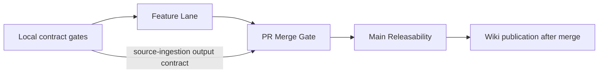

# Validation And CI

`lotus-idea` starts with the Lotus backend lane model:

1. Feature Lane for branch feedback.
2. PR Merge Gate for required merge readiness.
3. Main Releasability Gate for post-merge truth.
4. Merged PR Main Releasability Dispatch so rebase auto-merged PRs still
   generate post-merge release evidence on `main`.
5. Non-suppressed auto-merge token enforcement through `LOTUS_AUTOMERGE_TOKEN`;
   without that secret, the helper warns, skips auto-merge, and requires a
   human/release actor to rebase merge.

## Gate Map

| Lane | Main proof | What it protects |
| --- | --- | --- |
| Feature Lane | Fast lint, typecheck, unit, action lint | Branch feedback without write permissions |
| PR Merge Gate | Integration, coverage, Docker, PostgreSQL, security | Merge readiness and runtime parity |
| Main Releasability | Release evidence, SBOM, Docker, PostgreSQL | Post-merge truth on `main` |
| Local contract gates | Makefile, docs, source safety, mesh, endpoint certification | Future-agent drift and unsupported claims |



## Wiki Publication Control

Repo-local `wiki/` is the authored source. The live GitHub wiki is a publication
target and must not carry durable truth that is absent from `main`.

| Step | Command | Expected result |
| --- | --- | --- |
| Pre-merge wiki check | `C:\Users\Sandeep\projects\lotus-platform\automation\Sync-RepoWikis.ps1 -CheckOnly -Repository lotus-idea` | Local source and publish target are compared without mutation. |
| Post-merge publish | `C:\Users\Sandeep\projects\lotus-platform\automation\Sync-RepoWikis.ps1 -Publish -Repository lotus-idea` | Published wiki matches the repo-local source from merged `main`. |
| Documentation gate | `make documentation-contract-gate` | Same-wiki links omit `.md`, required wiki surfaces exist, and governed anti-claim language remains present. |

Repo-native validation commands:

```powershell
make check
make ci
make ci-contract-gate
make repository-hygiene-gate
make maintainability-gate
make documentation-contract-gate
make quality-scorecard-gate
make monetary-float-guard
make no-sensitive-content-guard
make source-observability-contract-gate
make signal-api-contract-gate
make operation-metric-contract-gate
make ai-model-risk-ops-contract-gate
make ai-model-risk-operations-proof-contract-gate
make implementation-truth-gate
make data-mesh-contract-gate
make mesh-policy-proof-contract-gate
make opportunity-archetype-contract-gate
make downstream-realization-contract-gate
make migration-contract-gate
make migration-execution-gate
make durable-repository-proof-contract-gate
make runtime-trust-telemetry-proof-contract-gate
make report-intake-route-proof-contract-gate
make workbench-read-path-proof-contract-gate
make gateway-workbench-operational-proof-contract-gate
make gateway-workbench-discovery-proof-contract-gate
make ai-lineage-store-proof-contract-gate
make ai-workflow-pack-registration-proof-contract-gate
make ai-workflow-pack-runtime-execution-proof-contract-gate
make source-ingestion-worker-check
make source-ingestion-scheduled-worker-check
make source-ingestion-live-proof-contract-gate
make risk-concentration-live-proof-contract-gate
make high-volatility-live-proof-contract-gate
make risk-drawdown-live-proof-contract-gate
make core-benchmark-assignment-live-proof-contract-gate
make core-portfolio-state-live-proof-contract-gate
make bond-maturity-live-proof-contract-gate
make low-income-core-cashflow-live-proof-contract-gate
make manage-mandate-live-proof-contract-gate
make mandate-restriction-live-proof-contract-gate
make mandate-restriction-source-product-proof-contract-gate
make missing-suitability-live-proof-contract-gate
make missing-risk-profile-source-product-proof-contract-gate
make missing-risk-profile-live-proof-contract-gate
make performance-underperformance-live-proof-contract-gate
make implementation-proof-readiness-check
make runtime-trust-telemetry-preview-check
make runtime-trust-telemetry-snapshot-check
make supported-features-gate
make endpoint-certification-gate
make postgres-integration-gate
make openapi-gate
make architecture-boundary-gate
make architecture-boundary-report
make quality-baseline
make clean
```

Baseline required checks include lint, format check, typecheck, architecture boundary enforcement,
repository hygiene, maintainability thresholds, documentation contract enforcement,
quality-scorecard truth, monetary precision guarding, no-sensitive-content evidence guarding,
OpenAPI quality, source-observability contract enforcement, signal API contract enforcement, operation metric contract enforcement, implementation-truth gate, supported-feature gate, endpoint-certification gate,
AI model-risk operations contract enforcement, AI model-risk operations proof contract enforcement,
unit tests, integration tests, e2e tests, data-mesh contract validation,
mesh policy proof contract validation, migration contract validation, coverage gate,
safe migration execution dry-run validation, PostgreSQL runtime proof in PR/main GitHub lanes,
durable repository proof contract validation,
runtime trust telemetry proof contract validation,
Risk high-volatility and drawdown live-proof contract validation,
Advise mandate/restriction live-proof contract validation,
Advise mandate/restriction source-product proof contract validation,
report-intake route proof contract validation,
Workbench read-path proof contract validation,
Gateway/Workbench operational proof contract validation,
Gateway/Workbench discovery proof contract validation,
AI lineage store proof contract validation,
AI workflow-pack registration proof contract validation,
AI workflow-pack runtime execution proof contract validation,
source-ingestion worker manifest and source-safe output-contract validation,
scheduled source-ingestion worker deploy-contract validation and generated
deploy-proof artifact consumption plus source-safe artifact-ref recording in
aggregate implementation-proof readiness, source-ingestion live-proof artifact
contract validation,
implementation-proof readiness artifact generation,
runtime trust telemetry preview and snapshot artifact generation,
security audit, Docker build validation, bounded GitHub job timeouts, no soft-failed critical
jobs, immutable GitHub Action SHA pins with version provenance, and workflow lint. The
`make ci-contract-gate` target explicitly fails if current blocking lint gates are removed from
`make lint`, including implementation-proof readiness and runtime trust telemetry preview
generation, so enforcement cannot silently degrade into optional local commands.

Protected `main` uses strict branch protection. Required PR Merge Gate status checks are:

1. `PR Merge Gate / Workflow Lint`
2. `PR Merge Gate / Lint Typecheck Security`
3. `PR Merge Gate / Tests (unit)`
4. `PR Merge Gate / Tests (integration)`
5. `PR Merge Gate / Tests (e2e)`
6. `PR Merge Gate / Coverage Gate (Combined)`
7. `PR Merge Gate / PostgreSQL Runtime Proof`
8. `PR Merge Gate / Validate Docker Build`

The PostgreSQL runtime proof is required explicitly, not only as a Docker-build dependency, because
it proves durable repository behavior, migration rollback/reapply, idempotency replay,
source-ingestion recovery, and source-safe AI explanation lineage persistence against real
`postgres:18-alpine` state.

Persistence adapter validation:

1. `tests/unit/test_postgres_repository.py` exercises the PostgreSQL repository
   adapter with a fake Postgres cursor across candidate persistence,
   idempotency replay, lifecycle history, audit events, review decisions,
   feedback, conversion intent/outcome, report evidence-pack requests, snapshot
   hydration, commit behavior, and rollback on flush failure.
2. `tests/unit/test_repository_state.py` proves repository provider selection:
   process-local by default, `PostgresIdeaRepository` when
   `LOTUS_IDEA_DATABASE_URL` is configured, psycopg mapping-row configuration,
   provider caching, durable-storage status, and connection close/reset
   behavior.
3. `tests/integration/test_high_cash_signal_api.py` pins route-level
   `durableStorageBacked` derivation with an injected durable repository so
   future changes cannot hardcode repository-backed API posture to `false`.
4. `tests/integration/test_postgres_runtime_integration.py` is the first real
   PostgreSQL runtime proof. GitHub PR Merge Gate and Main Releasability run it
   against `postgres:18-alpine` with
   `LOTUS_IDEA_POSTGRES_INTEGRATION_REQUIRED=1`; local runs skip unless
   `LOTUS_IDEA_POSTGRES_INTEGRATION_URL` is configured. The proof covers
   high-cash persistence/replay plus the first advisor queue, lifecycle,
   review, feedback, conversion intent/outcome, report evidence-pack request,
   internal source-ingestion replay/conflict recovery, and AI explanation
   lineage accepted/replayed/conflict workflow paths against real PostgreSQL
   state, plus schema rollback/reapply recovery.
5. `tests/unit/test_source_ingestion.py` now also proves the bounded run-once
   source-ingestion batch worker foundation: duplicate work-item replay,
   changed-source conflict, batch decision counts, timezone validation, maximum
   item enforcement, and correlation propagation.
6. `tests/unit/test_source_ingestion_worker.py` and
   `make source-ingestion-worker-check` prove the versioned run-once worker
   manifest contract plus source-safe check-only output contract and aggregate
   blocked-reason diagnostics without calling Core or writing repository state.
7. `tests/unit/test_source_ingestion_scheduled_worker.py`,
   `tests/unit/test_source_ingestion_scheduled_worker_contract_gate.py`, and
   `make source-ingestion-scheduled-worker-check` prove the scheduled worker
   deploy-contract shape, opt-in Docker Compose worker service, source-safe
   scheduler check-only output, and scheduled-worker proof artifact validation.
8. `tests/unit/test_source_ingestion_live_proof.py`,
   `tests/unit/test_source_ingestion_live_proof_contract_gate.py`, and
   `make source-ingestion-live-proof-contract-gate` prove the live Core
   source-ingestion proof artifact contract, source-sensitive-field blocking,
   aggregate blocked-reason diagnostics, and readiness blocker behavior without
   calling Core in CI. A valid artifact can clear only the source-ingestion
   live-Core blocker and the high-cash archetype live-Core blocker.
9. `tests/unit/test_generate_implementation_proof_readiness.py` and
   `make implementation-proof-readiness-check` prove the aggregate RFC-0002
   implementation-proof readiness artifact, including source-ingestion proof
   artifact refs, durable repository proof, runtime trust telemetry proof
   consumption, Workbench read-path proof consumption, Gateway/Workbench
   operational proof consumption, Gateway/Workbench discovery proof consumption, bounded outbox broker
   proof consumption, default Advise proposal route proof generation and
   consumption, default Manage action route proof generation and consumption,
   optional Manage mandate live proof consumption,
   optional Core benchmark assignment live proof consumption,
   optional Core portfolio-state live proof consumption,
   optional missing-benchmark live Core proof consumption,
   optional missing-benchmark Performance readiness proof consumption,
   default Report intake route proof generation and consumption, default
   Report materialization proof generation and consumption, default
   platform mesh onboarding proof generation and
   consumption, AI lineage store proof generation and consumption, and AI
   workflow-pack registration/runtime execution proof generation and consumption,
   plus opportunity archetype scenario readiness from the governed contract, can be
   generated without starting the service and
   without exposing candidate, portfolio, client, prompt, outbox event, raw
   idempotency, broker, or source payload identifiers.
10. `tests/unit/test_runtime_trust_telemetry_proof.py` and
    `make runtime-trust-telemetry-proof-contract-gate` prove the source-safe
    runtime trust telemetry proof contract that aggregate readiness consumes to
    clear only repo-owned runtime telemetry blockers:
    `runtime_candidate_snapshot_missing`,
    `certified_runtime_trust_telemetry_missing`, and
    `data_mesh_runtime_telemetry_not_certified`.
11. `tests/unit/test_workbench_read_path_proof.py` and
    `make workbench-read-path-proof-contract-gate` prove the source-safe
    bounded Workbench queue/detail read-path proof contract that aggregate
    readiness consumes to clear only
    `workbench_gateway_bff_consumption_proof_missing`.
12. `tests/unit/test_gateway_workbench_operational_proof.py` and
    `make gateway-workbench-operational-proof-contract-gate` prove the
    source-safe bounded Gateway/Workbench operational proof contract that
    aggregate readiness consumes to clear only `gateway_workbench_proof_missing`
    for source-ingestion and outbox-delivery proof families.
13. `tests/unit/test_gateway_workbench_discovery_proof.py` and
    `make gateway-workbench-discovery-proof-contract-gate` prove the
    source-safe bounded Gateway/Workbench discovery proof contract that
    aggregate readiness consumes to clear only
    `gateway_workbench_discovery_proof_missing` for data-mesh and runtime
    trust telemetry proof families.
14. `tests/unit/test_outbox_broker_proof.py`,
    `tests/unit/test_outbox_consumer_runtime_proof.py`,
    `tests/unit/test_outbox_platform_mesh_event_publication_proof.py`,
    `make outbox-consumer-contract-gate`,
    `make outbox-broker-proof-contract-gate`, and
    `make outbox-consumer-runtime-proof-contract-gate`, and
    `make outbox-platform-mesh-event-publication-proof-contract-gate` prove the
    declared downstream consumer contract, source-safe bounded outbox broker
    proof contract, source-safe bounded downstream consumer runtime proof
    contract, and bounded outbox platform mesh event publication proof contract
    that aggregate readiness consumes to clear only
    `outbox_broker_not_configured`, `external_broker_runtime_proof_missing`,
    `downstream_consumer_runtime_proof_missing`, and
    `platform_mesh_event_publication_proof_missing`.
13. `tests/unit/test_report_intake_route_proof.py`,
    `tests/unit/test_downstream_realization_readiness.py`,
    `tests/integration/test_downstream_realization_readiness_api.py`, and
    `make report-intake-route-proof-contract-gate` prove the source-safe
    `lotus-report` intake route proof contract that downstream and aggregate
    readiness consume to clear only
    `lotus_report_live_intake_route_proof_missing`.
14. `tests/unit/test_report_materialization_proof.py` and
    `make report-materialization-proof-contract-gate` prove the source-safe
    `lotus-report` materialization proof contract that downstream and aggregate
    readiness consume to clear only
    `report_evidence_pack_live_materialization_proof_missing`,
    `rendered_output_creation_missing`, and `archive_record_creation_missing`.
15. `tests/unit/test_ai_lineage_store_proof.py` and
    `make ai-lineage-store-proof-contract-gate` prove the source-safe AI
    lineage store proof contract that aggregate readiness consumes to clear
    only `certified_ai_lineage_store_missing`, without leaking prompt,
    provider response, candidate, portfolio, client, request-body,
    response-body, or database URL material.
15. `tests/unit/test_ai_workflow_pack_registration_proof.py` and
    `make ai-workflow-pack-registration-proof-contract-gate` prove the bounded
    sibling `lotus-ai` workflow-pack registration proof contract. A valid
    artifact clears only `workflow_pack_runtime_contract_not_certified` in
    aggregate readiness while preserving `lotus-ai` runtime execution,
    provider-call, Workbench, client-ready, and supported-feature blockers.
16. `tests/unit/test_ai_workflow_pack_runtime_execution_proof.py` and
    `make ai-workflow-pack-runtime-execution-proof-contract-gate` prove the
    bounded sibling `lotus-ai` deterministic runtime execution proof contract.
    A valid artifact clears only `lotus_ai_runtime_execution_missing` in
    aggregate readiness while preserving workflow-pack registration, live
    provider, Workbench, client-ready, and supported-feature blockers.
16. `tests/unit/test_runtime_trust_telemetry.py`,
    `tests/unit/test_generate_runtime_trust_telemetry_snapshot.py`,
    `tests/integration/test_runtime_trust_telemetry_api.py`,
    `make runtime-trust-telemetry-preview-check`, and
    `make runtime-trust-telemetry-snapshot-check` prove the source-safe runtime
    trust telemetry preview, API-certified contract-shaped snapshot diagnostic,
    and contract-shaped generated snapshot can be produced without exposing
    candidate identifiers, source routes, evidence hashes, portfolio
    identifiers, or client identifiers, and without promoting mesh
    certification.
16. `tests/unit/test_opportunity_archetype_contract_gate.py` and
    `make opportunity-archetype-contract-gate` prove the governed opportunity
    archetype/scenario contract preserves source-authority ownership, keeps
    high cash / idle liquidity as the first partially implemented journey, and
    blocks external demo promotion, client-publication,
    data-mesh-certification, and supported-feature claims.
    The same test pack now proves every implemented caller-supplied signal API
    recorded in the archetype contract is also required by the contract gate:
    API module, route, and integration-test evidence cannot drift apart.
    `tests/unit/test_risk_concentration_live_proof.py` and
    `make risk-concentration-live-proof-contract-gate` prove the optional Lotus
    Risk concentration live-proof artifact remains source-safe and can clear
    only the namespaced live Risk source blocker when valid evidence is supplied.
    `tests/unit/test_high_volatility_live_proof.py` and
    `make high-volatility-live-proof-contract-gate` prove the optional Lotus
    Risk volatility live-proof artifact remains source-safe and can clear only
    the namespaced volatility source blocker when valid evidence is supplied.
    `tests/unit/test_opportunity_archetype_contract_gate.py` and
    `make opportunity-archetype-contract-gate` also require the
    high-volatility API module, route, and integration test as archetype
    evidence.
    `tests/unit/test_risk_drawdown_live_proof.py` and
    `make risk-drawdown-live-proof-contract-gate` prove the optional Lotus Risk
    drawdown live-proof artifact remains source-safe and can clear only the
    namespaced drawdown source blocker when valid evidence is supplied.
    `tests/unit/test_opportunity_archetype_contract_gate.py` and
    `make opportunity-archetype-contract-gate` also require the drawdown API
    module, route, and integration test as archetype evidence.
    `tests/unit/test_performance_underperformance_live_proof.py` and
    `make performance-underperformance-live-proof-contract-gate` prove the
    optional Lotus Performance underperformance live-proof artifact remains
    source-safe and can clear only the namespaced live Performance source
    blocker when valid evidence is supplied.
    `tests/unit/test_core_benchmark_assignment_live_proof.py` and
    `make core-benchmark-assignment-live-proof-contract-gate` prove the
    optional Lotus Core benchmark assignment live-proof artifact remains
    source-safe and can clear only the namespaced benchmark-assignment
    source-ref blocker when valid evidence is supplied.
    `tests/unit/test_core_portfolio_state_live_proof.py` and
    `make core-portfolio-state-live-proof-contract-gate` prove the optional
    Lotus Core portfolio-state live-proof artifact remains source-safe and can
    clear only the namespaced Core portfolio-state source-ref blocker when
    valid evidence is supplied.
    `tests/unit/test_bond_maturity_live_proof.py` and
    `make bond-maturity-live-proof-contract-gate` prove the optional Lotus Core
    HoldingsAsOf maturity live-proof artifact remains source-safe and can clear
    only the namespaced bond-maturity live Core source blocker when valid
    evidence is supplied.
    `tests/unit/test_low_income_core_cashflow_live_proof.py` and
    `make low-income-core-cashflow-live-proof-contract-gate` prove the optional
    Lotus Core cashflow live-proof artifact remains source-safe and can clear
    only the namespaced low-income Core cashflow source blocker when valid
    evidence is supplied.
    `tests/unit/test_missing_suitability_live_proof.py`,
    `tests/unit/test_missing_risk_profile_live_proof.py`,
    `make missing-suitability-live-proof-contract-gate`, and
    `make missing-risk-profile-live-proof-contract-gate` prove the optional
    Lotus Advise policy-evaluation and risk-profile live-proof artifacts remain
    source-safe and can clear only their namespaced Advise source blockers
    when valid evidence is supplied.
    `tests/unit/test_implementation_proof_readiness.py`,
    `tests/unit/test_generate_implementation_proof_readiness.py`, and
    `tests/integration/test_implementation_proof_readiness_api.py` also prove
    that aggregate readiness exposes those scenario blockers as namespaced
    `opportunity_archetype_*` operator evidence without clearing product
    support.
16. `tests/unit/test_downstream_realization_contract_gate.py` and
   `make downstream-realization-contract-gate` prove the governed downstream
   realization contract plan remains planned, source-authority preserving,
   blocker-backed, and free of route-existence, downstream-execution, or
   supported-feature claims.
17. `tests/unit/test_downstream_realization_readiness.py` and
   `tests/integration/test_downstream_realization_readiness_api.py` prove the
   downstream realization readiness diagnostic for blocked supportability,
   role plus capability enforcement, product-safe payloads, source-authority
   boundaries, planned downstream contract-readiness records, and bounded
   `not_certified` operation events without calling Advise, Manage, Report,
   Render, or Archive.
18. `tests/unit/test_source_ingestion_readiness.py` and
   `tests/integration/test_source_ingestion_readiness_api.py` prove the
   operator readiness diagnostic for blocked/configured posture,
   permission-denied behavior, relative manifest resolution, and bounded
   `not_certified` operation events without calling Core. The integration
   suite also proves the source-ingestion run-once operator action blocks
   without durable storage or runtime configuration, executes the configured
   domain batch path source-safely, enforces operator capability, and emits a
   bounded `source_ingestion_run_once` event.
19. `tests/unit/test_review_queue_application.py`,
   `tests/integration/test_review_queue_api.py`, and
   `tests/integration/test_api_operation_events.py` prove the advisor queue
   readiness diagnostic for aggregate queue posture, permission-denied
   behavior, timestamp validation, product-safe payloads, and bounded
   `not_certified` operation events without exposing candidate identifiers or
   access-scope identifiers.
20. `tests/unit/test_ai_explanation_readiness.py`,
   `tests/integration/test_ai_governance_api.py`, and
   `tests/integration/test_api_operation_events.py` prove the AI explanation
   readiness diagnostic for blocked model-risk posture, operator/capability
   enforcement, product-safe payloads, and bounded `not_certified` operation
   events without invoking `lotus-ai` or exposing prompts, provider payloads,
   candidate identifiers, source routes, portfolio identifiers, or client
   identifiers. `tests/integration/test_postgres_runtime_integration.py` proves
   the configured PostgreSQL runtime records, replays, and conflict-checks
   source-safe AI explanation lineage through the API without promoting
   `lotus-ai` runtime execution or AI explanation support.
21. `tests/unit/test_outbox_delivery_readiness.py` and
   `tests/integration/test_outbox_delivery_readiness_api.py` prove the
   outbox delivery readiness diagnostic and run-once operator action for
   aggregate backlog/status posture, durable repository posture, broker
   configuration posture, publisher-adapter presence, blocked-without-broker
   behavior, configured-publisher delivery path, operator plus capability
   enforcement, product-safe payloads, UTC request validation, and bounded
   `not_certified` operation events without exposing event identifiers, raw
   idempotency keys, source payloads, broker payloads, or downstream contract
   details.
22. Runtime API database wiring is opt-in and still requires deploy migration
   evidence, certified long-running scheduled source-worker proof, live Core
   source-worker proof, and mesh/support promotion evidence before any
   supported durable product claim. The scheduled worker deploy-contract proof
   is validated separately by `make source-ingestion-scheduled-worker-check`.

The CI contract gate is blocking from day one. It prevents accidental removal of bank-buyable
controls from the Makefile or GitHub lanes, including least-privilege workflow permissions,
verified immutable action SHA pins with version provenance, 99% combined coverage in merge/releasability lanes, Docker build
validation, SBOM/release evidence, endpoint certification, supported-feature promotion control,
data-mesh contract validation, downstream realization contract validation,
migration contract validation, migration execution dry-run
validation, source-ingestion worker manifest and output-contract validation,
source-ingestion live-proof contract validation, PostgreSQL runtime
proof, durable repository proof contract validation, workflow-dispatch access, non-suppressed auto-merge token
usage, merged-PR main-releasability dispatch, bounded job timeouts, no `continue-on-error: true`
in critical lanes, maintainability enforcement, quality-scorecard truth,
repository-hygiene enforcement, no-sensitive-content evidence guarding,
implementation-truth enforcement, and source-safe local quality gates.
It also has unit coverage for current-repository pass behavior and failure cases for floating
action tags, wrong verified SHAs, missing version provenance comments, weakened focused test target
wiring, and raw workflow `pytest` shortcuts. `make test-unit`, `make test-integration`, and
`make test-e2e` default to their full suite paths while allowing scoped fix-forward runs through
`UNIT_TESTS`, `INTEGRATION_TESTS`, and `E2E_TESTS` overrides:

```powershell
make test-unit UNIT_TESTS=tests/unit/test_runtime_trust_telemetry.py
make test-integration INTEGRATION_TESTS=tests/integration/test_runtime_trust_telemetry_api.py
make test-e2e E2E_TESTS=tests/e2e/test_service_contract.py
```

Use these overrides for fast local diagnosis. PR evidence should still state whether the full
repo-native target or a focused target was run.

GitHub test and coverage lanes must stay repo-native:

```powershell
make test-unit
make test-unit-coverage
make test-integration-coverage
make test-e2e-coverage
make test-coverage
```

The PR Merge and Main Releasability matrices call the suite-level coverage targets and publish the
same `.coverage.<suite>` artifacts. `make ci-contract-gate` rejects raw workflow `pytest` shortcuts
so GitHub cannot drift away from the local Makefile contract.

The repository-hygiene gate blocks tracked generated artifacts and local runtime byproducts:
Python cache files, coverage outputs, build/dist outputs, dependency directories, local
environment files, logs, and local databases. It is intentionally based on `git ls-files` so
developers can keep ignored local working files while CI protects the durable source tree.
Use `make clean` to remove ignored local residue from tests, coverage, build output, and Python
bytecode caches. The cleanup utility prunes `.git`, `.venv`, and dependency cache directories, and
the CI contract gate fails if the Makefile cleanup path is weakened or removed.

The maintainability gate blocks oversized Python files/functions in source, test, and script
trees. It is calibrated above the current baseline so new agentic work must split or refactor
large additions instead of normalizing hard-to-review modules.

The monetary-float guard blocks money-like `float` annotations, literals, and
conversions in application source. It is AST-backed and intentionally allows
non-monetary operational floats, such as timeout seconds, so the guard protects
private-banking precision without creating noisy exceptions.

The no-sensitive-content guard scans local evidence, log, and output artifacts
for forbidden sensitive marker names such as portfolio, client, account,
holding, transaction, request-body, response-body, and raw entitlement failure
markers. It is blocking through `make lint` and has focused pass/fail unit
coverage so future evidence artifacts cannot quietly leak sensitive material.

The documentation contract gate blocks deletion, thinning, missing anchors,
placeholder text, and unstructured operator text dumps across the required
README, repository context, standards, runbooks, quality, evidence, and wiki
surfaces. Proof and readiness guides must keep a polished operator structure:
current-truth table, proof boundary, non-proof boundary, blockers,
response-shape table, implementation evidence, and executable example. The
gate keeps enterprise operating context intact for future implementation
agents without promoting any business capability.

The quality-scorecard gate keeps the bank-buyable control matrix executable. It
requires the standard control rows, approved readiness statuses, non-empty
evidence/gap/next-slice cells, implementation-backed evidence anchors, and
stale scaffold-era underclaim detection after internal API, persistence,
observability, and test foundations have landed.

The source-observability contract gate blocks ad hoc application logging in
`src/app`. Feature code must use bounded operation events or the central
request diagnostic helper rather than raw `print()`, direct Python logging, or
low-level `log_event` calls. Request diagnostics log route templates rather
than raw URL paths.

The signal API contract gate blocks duplicated caller-supplied signal API
authorization, source-authority, operation-event, and error-model mechanics.
Signal routes must use shared signal API support so future slices do not
reintroduce copy-pasted policy or inconsistent problem-detail behavior.

The operation-metric contract gate validates
`contracts/observability/lotus-idea-operation-metrics.v1.json` against the
code-owned operation, outcome, supportability, and metric-label vocabulary. It
blocks sensitive labels and prevents the metric catalog from being rewritten as
dashboard certification, alert certification, data-mesh certification,
Gateway/Workbench proof, or supported-feature promotion.

The AI model-risk operations contract gate validates
`contracts/observability/lotus-idea-ai-model-risk-operations.v1.json`
against implemented AI explanation and readiness telemetry. It blocks missing
dashboard controls, missing alert candidates, sensitive labels, unsupported
operation names, missing source-of-truth paths, and premature model-risk
dashboard, alert, `lotus-ai`, Workbench, or supported-feature certification
claims.

The AI workflow-pack registration proof contract gate validates the bounded
cross-repo `lotus-ai` workflow-pack registration proof consumed by aggregate
implementation-proof readiness. It checks source-safe evidence refs, sibling
registry/binding/queue-policy/supportability/test coverage, and one-blocker
clearance so registration cannot be mistaken for `lotus-ai` runtime execution,
provider invocation, model-risk operations certification, Workbench proof, or
supported-feature promotion.

The implementation-truth gate scans README, repository context, operations/demo docs, quality docs,
and wiki source for unqualified current-state claims that imply demo readiness, production support,
certification, live source ingestion, Gateway/Workbench support, or client-ready publication while
no supported feature is implemented. RFC target-state planning text is excluded; current-state
surfaces must describe unsupported, planned, blocked, or evidence-required posture explicitly. The
gate also blocks stale scaffold-era underclaims in demo documentation when current implementation
and CI evidence prove a stronger foundation, so future agent work cannot leave outdated scaffold
truth behind while adding real APIs or gates.

The endpoint-certification gate blocks weak certified API posture. It keeps the OpenAPI surface and
endpoint certification ledger synchronized, validates JSON-shaped examples, proves test evidence
references resolve to real pytest functions, keeps health/metadata routes at `baseline_certified`,
and requires certified business/operator endpoints to name an `idea.*` capability, document
product-safe 403 behavior, cite the OpenAPI quality gate, and preserve Gateway, Workbench, and
supported-feature-promotion boundaries. It also requires bounded operation-event test evidence for
every certified business/operator endpoint, so API certification and operator telemetry proof stay
coupled. Certified business/operator endpoints must also cite at least one non-operation-event
integration API behavior test and at least one negative or degraded-path test. That keeps endpoint
promotion aligned to the test pyramid instead of allowing schema examples, unit-only assertions, or
telemetry-only evidence to stand in for executable API behavior. When an endpoint has implemented
bounded read-only Gateway publication, the gate requires the ledger to cite the exact
`lotus-gateway` route and still preserve Workbench, data-product, client-ready publication, and
supported-feature boundaries.

Data-mesh foundation checks:

1. repo-owned proposed producer and consumer declarations must exist,
2. mesh placeholder files must not exist in contract or operations paths,
3. planned trust telemetry must remain blocked and `not_certified`,
4. SLO, access, and evidence policies must be present before promotion work,
5. optional sibling platform catalog/source-manifest evidence is used to catch
   source-product drift and validate governed `lotus-idea` onboarding without
   treating catalog visibility as certification,
6. `make platform-mesh-onboarding-proof-contract-gate` validates the bounded
   cross-repo proof when a sibling `lotus-platform` checkout is available,
   while `make implementation-proof-readiness-check` generates an invalid
   non-proof artifact and keeps blockers when sibling platform evidence is
   absent,
7. the sibling [Lotus Data Mesh Standard](../../lotus-platform/docs/standards/Lotus%20Data%20Mesh%20Standard.md)
   remains the controlling platform rule,
8. platform mesh certification is required before any supported mesh claim.

The internal data-mesh-readiness endpoint is covered by OpenAPI, endpoint
certification, unit tests, and integration tests. Its passing checks certify the
diagnostic route only; they do not certify the data products it reports as
blocked. The endpoint's blocker contract is part of the anti-promotion control
and must continue to name SLO certification, access-policy certification,
evidence-policy certification, Gateway/Workbench discovery proof, and
supported-feature promotion until those are implementation-backed and
platform-certified. Source-manifest and catalog-inclusion blockers may be
cleared only by the bounded platform mesh onboarding proof; that proof is not
mesh certification.

The internal runtime trust telemetry preview endpoint is covered by OpenAPI,
endpoint certification, unit tests, integration tests, and a repo-native
generator check. Its passing checks certify source-safe pre-certification
telemetry preview only; they do not certify data products, platform
source-manifest inclusion, Gateway/Workbench discovery, or supported-feature
promotion.

The internal runtime trust telemetry snapshot endpoint is covered by OpenAPI,
endpoint certification, unit tests, integration tests, and a repo-native
generator check. Its passing checks certify only that source-safe,
contract-shaped snapshot evidence can be emitted from the active repository
provider while remaining blocked and not certified.

The internal source-ingestion-readiness endpoint is covered by OpenAPI,
endpoint certification, unit tests, and integration tests. Its passing checks
certify the diagnostic route only. A valid proof artifact can clear only the
live-Core-source blocker; the route still does not certify the scheduled worker
deploy-contract artifact, long-running scheduled runtime, data-product
promotion, Gateway/Workbench support, or supported-feature promotion.
The scheduled worker deploy-contract artifact is covered separately by
`make source-ingestion-scheduled-worker-check`; a valid artifact clears only
the scheduled-worker deploy-proof blocker.
Aggregate implementation-proof readiness records validated live and scheduled
source-ingestion proof artifact refs in source-safe capability evidence when
those blockers clear, so CI evidence remains auditable without exposing source
payloads.
The internal source-ingestion-run-once endpoint is covered by OpenAPI,
endpoint certification, unit tests, and integration tests. Its passing checks
certify the bounded operator action only; they do not certify live Core
ingestion, the scheduled worker deploy-contract artifact, long-running
scheduled runtime, data-product promotion, Gateway/Workbench support, or
supported-feature promotion.

The internal advisor-queue-readiness endpoint is covered by OpenAPI, endpoint
certification, unit tests, and integration tests. Its passing checks certify
the diagnostic route only; they do not certify a durable queue store,
Gateway/Workbench support, data-product promotion, PM/compliance queue support,
client-ready publication, or supported-feature promotion.

The internal AI-explanation-readiness endpoint is covered by OpenAPI, endpoint
certification, unit tests, and integration tests. Its passing checks certify
the diagnostic route only; they do not certify `lotus-ai` runtime execution,
provider invocation, Gateway/Workbench support, data-product promotion,
client-ready publication, or supported-feature promotion. The AI lineage store
proof is consumed only by aggregate implementation-proof readiness. The AI
model-risk operations proof certifies repo-owned dashboard, alert-rule, and
runbook artifacts against implemented operation telemetry while still leaving
`lotus-ai` runtime, live provider, Workbench, client-ready, and supported-feature
gaps unpromoted.

The internal outbox-delivery-readiness and outbox-delivery-run-once endpoints
are covered by OpenAPI, endpoint certification, unit tests, and integration
tests. Passing checks certify the diagnostic route and bounded operator action
only; they do not certify live broker runtime, downstream consumer delivery,
platform mesh event publication proof, Gateway/Workbench support, data-product
promotion, client-ready publication, or supported-feature promotion.

The internal downstream-realization-readiness endpoint is covered by OpenAPI,
endpoint certification, unit tests, and integration tests. Its passing checks
certify the diagnostic route only; planned contract records are not downstream
route-existence proof. Bounded route/materialization proof artifacts clear only
their named blockers. These checks do not certify Advise suitability,
Manage rebalance/action authority, Gateway/Workbench support, data-product
promotion, client-ready publication, or supported-feature promotion.

The downstream-realization contract gate validates
`contracts/downstream-realization/lotus-idea-downstream-contracts.v1.json`.
It blocks missing contract rows, owner/source-authority drift, current-route
claims, premature certification, missing blockers, and missing evidence refs.
Its passing checks certify contract-plan hygiene only; they do not prove
downstream route existence or execution.

CI warning policy:

1. use current approved action versions,
2. pin actions to verified immutable upstream tag SHAs with readable version comments,
3. fix owned warning sources,
4. suppress only known upstream runner noise with an explicit rationale,
5. do not downgrade action versions to make logs quieter.

Branch hygiene policy:

1. after a PR is merged to `main`, delete the remote feature branch,
2. delete the corresponding local feature branch,
3. re-run branch audits before final closure,
4. keep no durable RFC/docs/wiki/context truth outside `main`.
